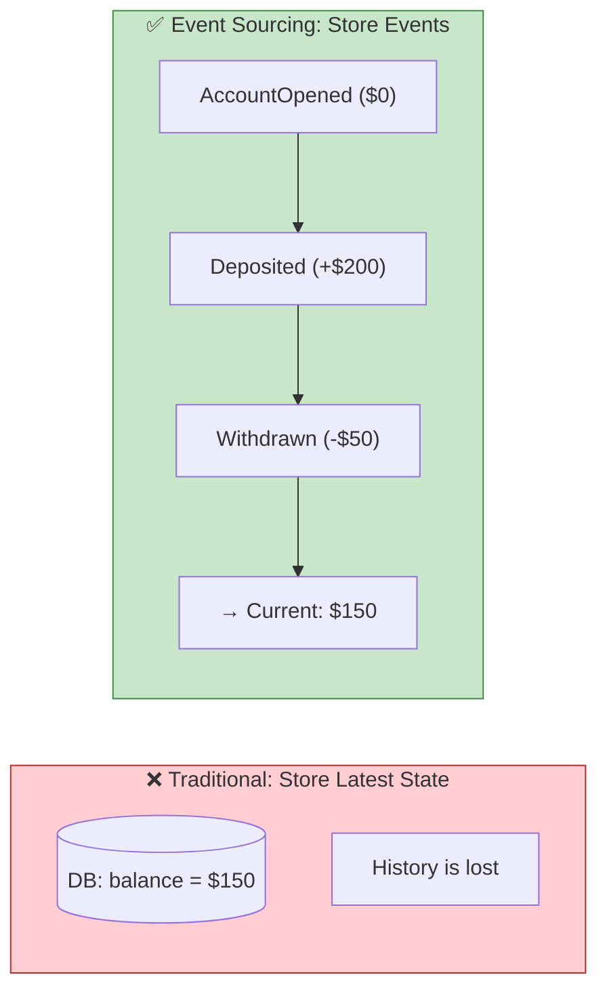
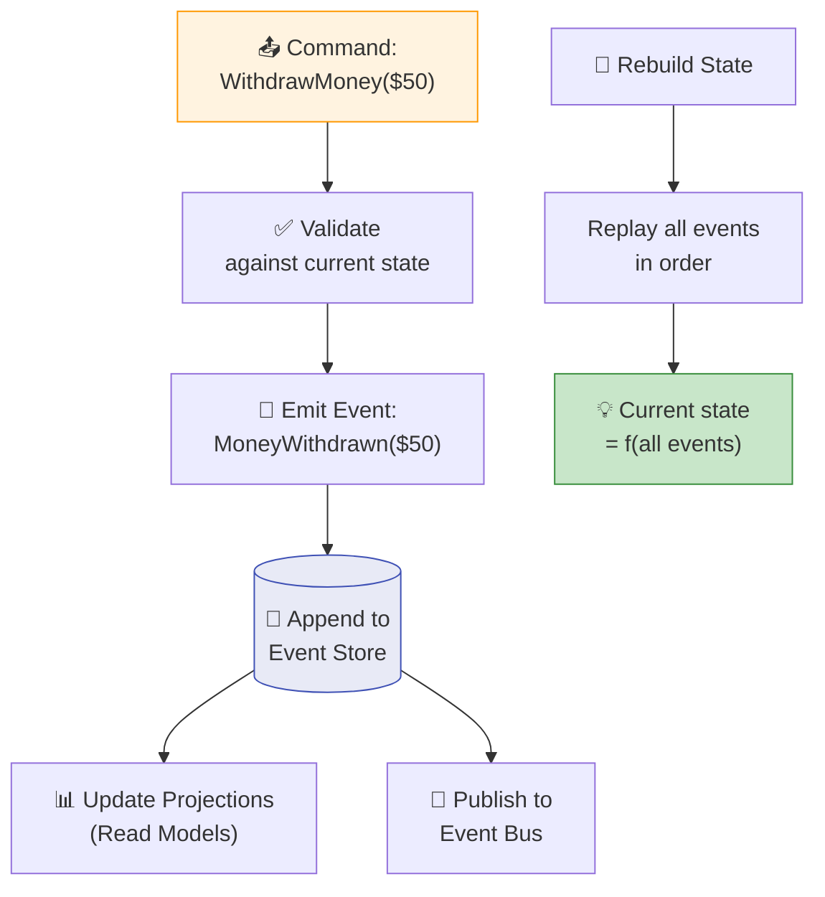
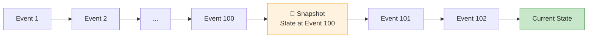

# Chapter 5: Event Sourcing

> *Storing state as a sequence of events — the complete history approach*

---

## 🎯 Core Concepts

### Traditional vs. Event Sourcing

### How Event Sourcing Works

### Benefits & Challenges

| ✅ Benefits | ❌ Challenges |
| :--- | :--- |
| Complete audit trail — every change recorded | Event store grows indefinitely |
| Temporal queries — "what was state at time X?" | Schema evolution is complex |
| Replay — rebuild state from scratch | Eventual consistency by design |
| Debug — reproduce bugs by replaying events | Steeper learning curve |
| New projections — build new views retroactively | Query complexity (need CQRS) |

### Snapshotting

> **💡 Tip:** Take snapshots every N events (e.g. 100). To rebuild state: load latest snapshot, then replay only events after that snapshot.

---

## 📝 My Notes

<!-- Add your own notes as you read -->

---

## ❓ Questions to Reflect On

1. What domains benefit most from event sourcing? (Finance? Healthcare? Audit-heavy?)
2. When is event sourcing overkill?
3. How do you handle event schema evolution over years of data?

---

## 🛠️ Practice Ideas

- [ ] Build a simple bank account using event sourcing (deposit, withdraw, check balance)
- [ ] Implement snapshotting after every 10 events
- [ ] Build two different projections from the same event stream

---

[⬅️ Previous](./chapter-04-pub-sub-patterns.md) | [🏠 Home](./README.md) | [Next ➡️](./chapter-06-cqrs.md)

