# Chapter 6: CQRS — Command Query Responsibility Segregation

> *Optimizing reads and writes independently for maximum performance*

---

## 🎯 Core Concepts

### The Problem CQRS Solves

```mermaid
flowchart LR
    subgraph SINGLE["❌ Single Model"]
        direction TB
        SM["One model for<br/>reads AND writes"]
        SM --> P1["Writes need<br/>normalization"]
        SM --> P2["Reads need<br/>denormalization"]
        SM --> P3["Can't optimize both"]
    end

    subgraph CQRS_SOL["✅ CQRS"]
        direction TB
        WM["Write Model<br/>(optimized for writes)"]
        RM["Read Model<br/>(optimized for queries)"]
        WM -->|"Events sync"| RM
    end

    style SINGLE fill:#ffcdd2,stroke:#c62828
    style CQRS_SOL fill:#c8e6c9,stroke:#388e3c
```

### CQRS Architecture

```mermaid
flowchart TD
    User(["👤 User"])

    User -->|"Write"| CmdAPI["✏️ Command API"]
    User -->|"Read"| QueryAPI["📖 Query API"]

    CmdAPI --> Handler["Command Handler"]
    Handler --> Domain["Domain Logic +<br/>Validation"]
    Domain --> WriteDB[("💾 Write DB<br/>(Normalized)")]
    WriteDB -->|"Emit Events"| Bus["📨 Event Bus"]
    Bus -->|"Project"| ReadDB[("📊 Read DB<br/>(Denormalized Views)")]

    QueryAPI --> ReadDB

    style CmdAPI fill:#fff3e0,stroke:#ff9800
    style QueryAPI fill:#e3f2fd,stroke:#1976d2
    style Bus fill:#e8eaf6,stroke:#3f51b5
```

### CQRS + Event Sourcing

```mermaid
flowchart TD
    Cmd["Command"] --> Handler["Command Handler"]
    Handler --> EventStore[("📝 Event Store<br/>(Write Side)")]
    EventStore -->|"Events"| Projector["📊 Projector"]
    Projector --> View1[("View: Order List")]
    Projector --> View2[("View: Customer Dashboard")]
    Projector --> View3[("View: Search Index")]

    Query["Query"] --> ReadAPI["Query Handler"]
    ReadAPI --> View1
    ReadAPI --> View2
    ReadAPI --> View3

    style EventStore fill:#fff3e0,stroke:#ff9800
    style Projector fill:#e8eaf6,stroke:#3f51b5
```

### When to Use CQRS

| ✅ Use When | ❌ Avoid When |
| :--- | :--- |
| Read/write patterns differ significantly | Simple CRUD application |
| High read-to-write ratio (100:1) | Reads and writes are balanced |
| Need different scaling for read/write | Small team, simple domain |
| Complex queries across aggregates | Eventual consistency is unacceptable |
| Paired with event sourcing | Adding unnecessary complexity |

### Read Model Examples

| Read Model | Optimized For | Storage |
| :--- | :--- | :--- |
| **Order List View** | Paginated listing with filters | PostgreSQL with indexes |
| **Search Index** | Full-text search | Elasticsearch |
| **Analytics Dashboard** | Aggregations, time-series | ClickHouse, TimescaleDB |
| **Cache** | Ultra-fast reads | Redis |
| **Materialized View** | Pre-computed joins | PostgreSQL materialized view |

---

## 📝 My Notes

<!-- Add your own notes as you read -->

---

## ❓ Questions to Reflect On

1. What's the eventual consistency window in your system and is it acceptable?
2. How many read models do you need for your use case?
3. How do you handle rebuilding read models when the projection logic changes?

---

## 🛠️ Practice Ideas

- [ ] Implement CQRS for an order system with separate write and read databases
- [ ] Build a projector that maintains a materialized view from events
- [ ] Test rebuilding a read model from scratch using event replay

---

[⬅️ Previous](./chapter-05-event-sourcing.md) | [🏠 Home](./README.md) | [Next ➡️](./chapter-07-saga-pattern.md)

