# Chapter 7: Saga Pattern & Distributed Transactions

> *Managing data consistency across multiple services without 2PC*

---

## 🎯 Core Concepts

### The Problem: Distributed Transactions

> You can't use a traditional database transaction across multiple services. The **Saga pattern** provides eventual consistency through a sequence of local transactions with compensating actions.

### Choreography Saga

```mermaid
sequenceDiagram
    participant O as Order Service
    participant P as Payment Service
    participant I as Inventory Service
    participant S as Shipping Service

    Note over O,S: Happy Path ✅
    O->>O: Create Order (PENDING)
    O-->>P: OrderCreated event
    P->>P: Process Payment
    P-->>I: PaymentCompleted event
    I->>I: Reserve Inventory
    I-->>S: InventoryReserved event
    S->>S: Create Shipment
    S-->>O: ShipmentCreated event
    O->>O: Update Order (COMPLETED)
```

```mermaid
sequenceDiagram
    participant O as Order Service
    participant P as Payment Service
    participant I as Inventory Service

    Note over O,I: Failure & Compensation ❌
    O->>O: Create Order (PENDING)
    O-->>P: OrderCreated event
    P->>P: Process Payment ✅
    P-->>I: PaymentCompleted event
    I->>I: Reserve Inventory ❌ FAILS

    Note over I: Emit compensation event
    I-->>P: InventoryFailed event
    P->>P: Refund Payment 🔄
    P-->>O: PaymentRefunded event
    O->>O: Cancel Order 🔄
```

### Orchestration Saga

```mermaid
flowchart TD
    Orch["🎯 Saga Orchestrator"] --> Step1["1. Create Order"]
    Step1 -->|"✅ Success"| Step2["2. Process Payment"]
    Step2 -->|"✅ Success"| Step3["3. Reserve Inventory"]
    Step3 -->|"✅ Success"| Step4["4. Create Shipment"]
    Step4 -->|"✅ Success"| Done(["✅ Saga Complete"])

    Step3 -->|"❌ Fails"| Comp2["🔄 Refund Payment"]
    Comp2 --> Comp1["🔄 Cancel Order"]
    Comp1 --> Failed(["❌ Saga Failed"])

    style Orch fill:#e8eaf6,stroke:#3f51b5
    style Done fill:#c8e6c9,stroke:#388e3c
    style Failed fill:#ffcdd2,stroke:#c62828
```

### Choreography vs. Orchestration

| Aspect | Choreography | Orchestration |
| :--- | :--- | :--- |
| **Coordination** | Decentralized (event-based) | Central orchestrator |
| **Coupling** | Very loose | Orchestrator knows all steps |
| **Visibility** | Hard to trace overall flow | Clear, centralized view |
| **Debugging** | Scattered across services | Single point of inspection |
| **Complexity** | Grows with # of services | Contained in orchestrator |
| **Best For** | 2-4 services, simple flows | 5+ services, complex flows |

### Compensation Best Practices

| Rule | Description |
| :--- | :--- |
| **Every step needs a compensator** | If step 3 fails, steps 1 & 2 must have undo actions |
| **Compensations must be idempotent** | They may run more than once |
| **Semantic rollback, not DB rollback** | "Refund" not "DELETE payment row" |
| **Log everything** | Full audit trail of saga execution |
| **Timeouts** | Set deadlines for each step |

---

## 📝 My Notes

<!-- Add your own notes as you read -->

---

## ❓ Questions to Reflect On

1. When would you choose choreography over orchestration?
2. How do you handle partial failures in compensating transactions?
3. What happens if the compensating action itself fails?

---

## 🛠️ Practice Ideas

- [ ] Implement an order saga with 3 services using choreography
- [ ] Rebuild it using orchestration (e.g., Spring State Machine or Temporal)
- [ ] Simulate a failure at step 3 and verify compensation executes correctly

---

[⬅️ Previous](./chapter-06-cqrs.md) | [🏠 Home](./README.md) | [Next ➡️](./chapter-08-reliability-patterns.md)

