# Chapter 8: Reliability, Idempotency & Delivery Guarantees

> *Making event-driven systems you can trust*

---

## 🎯 Core Concepts

### Delivery Guarantees

### The Dual-Write Problem

```mermaid
flowchart TD
    Service["Service"] --> DB["1️⃣ Write to DB"]
    Service --> Broker["2️⃣ Publish to Broker"]

    DB --> Q1{"What if DB succeeds<br/>but broker fails?"}
    Q1 --> Inc["❌ Inconsistency:<br/>Data saved but event lost"]

    style Inc fill:#ffcdd2,stroke:#c62828
```

### Solution: Transactional Outbox Pattern

```mermaid
flowchart LR
    Service["Service"] --> TX["Single DB Transaction"]

    subgraph TX["💾 Atomic Transaction"]
        Write["Write business data"]
        Outbox["Write event to<br/>OUTBOX table"]
    end

    TX --> Relay["📨 Relay Process<br/>(CDC or polling)"]
    Relay --> Broker["Broker"]

    style TX fill:#c8e6c9,stroke:#388e3c
    style Relay fill:#e8eaf6,stroke:#3f51b5
```

### Idempotency Strategies

```mermaid
flowchart TD
    Msg["📨 Incoming Message"] --> Check{"Seen this<br/>eventId before?"}
    Check -- Yes --> Skip["⏭️ Skip (already processed)"]
    Check -- No --> Process["✅ Process the message"]
    Process --> Store["💾 Store eventId<br/>in processed set"]

    style Skip fill:#fff3e0,stroke:#ff9800
    style Process fill:#c8e6c9,stroke:#388e3c
```

| Strategy | How It Works | Best For |
| :--- | :--- | :--- |
| **Idempotency Key** | Track processed event IDs in DB | Payment processing, order creation |
| **Upsert (INSERT ON CONFLICT)** | Same result whether insert or update | State synchronization |
| **Version/Sequence Check** | Only process if version matches expected | Optimistic locking |
| **Deduplication Window** | Track IDs for N minutes | High-throughput streams |
| **Natural Idempotency** | Operation is inherently safe to repeat | SET status = 'SHIPPED' |

### Dead Letter Queues (DLQ)

```mermaid
flowchart TD
    Msg["📨 Message"] --> Consumer["Consumer"]
    Consumer --> Try{"Process<br/>successful?"}
    Try -- Yes --> Done["✅ Acknowledge"]
    Try -- No --> Retry{"Retries<br/>exhausted?"}
    Retry -- No --> Consumer
    Retry -- Yes --> DLQ["☠️ Dead Letter Queue"]
    DLQ --> Alert["🚨 Alert team"]
    DLQ --> Inspect["🔍 Manual inspection"]
    DLQ --> Replay["🔄 Fix & replay"]

    style DLQ fill:#ffcdd2,stroke:#c62828
    style Done fill:#c8e6c9,stroke:#388e3c
```

### Ordering Guarantees

| Broker | Ordering Guarantee | How |
| :--- | :--- | :--- |
| **Kafka** | Per partition | Use consistent partition key (e.g., orderId) |
| **RabbitMQ** | Per queue | Single consumer per queue |
| **SQS Standard** | Best effort | No guaranteed ordering |
| **SQS FIFO** | Strict per message group | MessageGroupId |

---

## 📝 My Notes

<!-- Add your own notes as you read -->

---

## ❓ Questions to Reflect On

1. How do you implement idempotency in your current services?
2. What's your strategy for handling poison messages?
3. How do you guarantee ordering when you need it?

---

## 🛠️ Practice Ideas

- [ ] Implement the transactional outbox pattern with PostgreSQL
- [ ] Build an idempotent consumer with duplicate detection
- [ ] Set up a DLQ and write a tool to inspect and replay failed messages

---

[⬅️ Previous](./chapter-07-saga-pattern.md) | [🏠 Home](./README.md) | [Next ➡️](./chapter-09-schema-evolution.md)

