# Chapter 9: Schema Design & Evolution

> *Treating event schemas as contracts — versioning without breaking consumers*

---

## 🎯 Core Concepts

### Why Schema Matters

```mermaid
flowchart LR
    Producer["Producer v2<br/>(new schema)"] -->|"New event format"| Broker["📨 Broker"]
    Broker --> ConsumerOld["Consumer v1<br/>❌ Breaks!"]
    Broker --> ConsumerNew["Consumer v2<br/>✅ Works"]

    style ConsumerOld fill:#ffcdd2,stroke:#c62828
    style ConsumerNew fill:#c8e6c9,stroke:#388e3c
```

### Schema Evolution Types

```mermaid
flowchart TD
    Evo["Schema Evolution"] --> Back["⬅️ Backward Compatible<br/>New reader, old data"]
    Evo --> Fwd["➡️ Forward Compatible<br/>Old reader, new data"]
    Evo --> Full["↔️ Full Compatible<br/>Both directions"]
    Evo --> None["❌ Breaking<br/>No guarantees"]

    Back -->|"Example"| BackEx["Add optional field"]
    Fwd -->|"Example"| FwdEx["Remove optional field"]
    Full -->|"Example"| FullEx["Only add/remove optional"]
    None -->|"Example"| NoneEx["Rename required field"]

    style Back fill:#c8e6c9,stroke:#388e3c
    style Full fill:#e3f2fd,stroke:#1976d2
    style None fill:#ffcdd2,stroke:#c62828
```

### Safe vs. Breaking Changes

| ✅ Safe Changes | ❌ Breaking Changes |
| :--- | :--- |
| Add optional field | Remove required field |
| Add new event type | Rename existing field |
| Deprecate (but keep) field | Change field type |
| Add default value | Change event type name |
| Widen a type (int → long) | Narrow a type (long → int) |

### Schema Registry

### Versioning Strategies

| Strategy | How | Pros | Cons |
| :--- | :--- | :--- | :--- |
| **Schema in event** | Version field in payload | Self-describing | Larger messages |
| **Topic per version** | `orders.v1`, `orders.v2` | Clean separation | Topic proliferation |
| **Schema Registry** | Confluent / AWS Glue | Automated validation | Extra infrastructure |
| **Content-type header** | `application/vnd.order.v2+json` | Standard HTTP approach | Manual enforcement |

---

## 📝 My Notes

<!-- Add your own notes as you read -->

---

## ❓ Questions to Reflect On

1. What's your strategy for evolving schemas without downtime?
2. How do you handle old events when replaying from an event store?
3. Should you use Avro, Protobuf, or JSON Schema?

---

## 🛠️ Practice Ideas

- [ ] Set up Confluent Schema Registry and test backward compatibility
- [ ] Write an upcaster that transforms v1 events to v2 format
- [ ] Simulate a breaking change and see what happens to consumers

---

[⬅️ Previous](./chapter-08-reliability-patterns.md) | [🏠 Home](./README.md) | [Next ➡️](./chapter-10-cloud-native-serverless.md)

