# Chapter 10: Cloud-Native & Serverless EDA

> *Building event-driven systems with managed cloud services*

---

## 🎯 Core Concepts

### Cloud-Native EDA Stack

```mermaid
flowchart TD
    Events(["📨 Events"]) --> EB["🔀 Event Router<br/>(EventBridge / Pub/Sub)"]

    EB --> Lambda["⚡ Serverless Functions<br/>(Lambda / Cloud Functions)"]
    EB --> Containers["🐳 Containers<br/>(ECS / GKE)"]
    EB --> StepFn["🔄 Orchestration<br/>(Step Functions / Workflows)"]

    Lambda --> Store[("💾 Event Store<br/>(DynamoDB / Firestore)")]
    Containers --> Store
    StepFn --> Store

    Store --> Stream["📊 Streaming Analytics<br/>(Kinesis / BigQuery)"]

    style EB fill:#e8eaf6,stroke:#3f51b5
    style Lambda fill:#fff3e0,stroke:#ff9800
```

### AWS Serverless EDA

### AWS Services for EDA

| Service | Role | Pairs With | Use Case |
| :--- | :--- | :--- | :--- |
| **EventBridge** | Event bus + routing rules | Lambda, SQS, Step Functions | Event-driven routing |
| **SQS** | Message queuing | Lambda, ECS | Decoupling, buffering |
| **SNS** | Fan-out notifications | SQS, Lambda, HTTP | Broadcasting events |
| **Kinesis** | Real-time streaming | Lambda, S3, Redshift | Analytics pipelines |
| **Step Functions** | Workflow orchestration | Lambda, any AWS service | Saga orchestration |
| **DynamoDB Streams** | Change data capture | Lambda | Reacting to DB changes |
| **MSK (Kafka)** | Managed Kafka | Lambda, ECS | High-throughput streaming |

### Saga Orchestration with Step Functions

```mermaid
flowchart TD
    Start(["Start"]) --> CreateOrder["Create Order"]
    CreateOrder -->|"✅"| ProcessPayment["Process Payment"]
    ProcessPayment -->|"✅"| ReserveInventory["Reserve Inventory"]
    ReserveInventory -->|"✅"| ShipOrder["Ship Order"]
    ShipOrder --> Success(["✅ Success"])

    ReserveInventory -->|"❌"| RefundPayment["🔄 Refund"]
    RefundPayment --> CancelOrder["🔄 Cancel Order"]
    CancelOrder --> Failed(["❌ Failed"])

    style Success fill:#c8e6c9,stroke:#388e3c
    style Failed fill:#ffcdd2,stroke:#c62828
```

### Serverless vs. Container-Based EDA

| Aspect | Serverless (Lambda) | Containers (ECS/K8s) |
| :--- | :--- | :--- |
| **Cold start** | Yes (100ms-2s) | No |
| **Max duration** | 15 min (Lambda) | Unlimited |
| **Scaling** | Automatic, instant | Manual or autoscaler |
| **Cost model** | Pay per invocation | Pay per running time |
| **Best for** | Event handlers, glue code | Long-running consumers |

---

## 📝 My Notes

<!-- Add your own notes as you read -->

---

## ❓ Questions to Reflect On

1. When is serverless EDA more cost-effective than container-based?
2. How do you handle long-running event processing in serverless?
3. What's the trade-off of using managed services vs. self-hosted brokers?

---

## 🛠️ Practice Ideas

- [ ] Build an EventBridge → Lambda → DynamoDB pipeline
- [ ] Implement a saga using AWS Step Functions
- [ ] Compare cost: Lambda vs. ECS for processing 1M events/day

---

[⬅️ Previous](./chapter-09-schema-evolution.md) | [🏠 Home](./README.md) | [Next ➡️](./chapter-11-security-governance.md)

