# Chapter 11: Security, Compliance & Governance

> *Securing event-driven systems end-to-end*

---

## 🎯 Core Concepts

### EDA Security Layers

```mermaid
flowchart TD
    subgraph TRANSPORT["🔒 Transport Security"]
        TLS["TLS/mTLS for all broker connections"]
    end

    subgraph AUTH["🔐 Authentication"]
        SASL["SASL / API Keys for producers"]
        MTLS["mTLS for service identity"]
    end

    subgraph AUTHZ["🛡️ Authorization"]
        ACL["Topic-level ACLs"]
        RBAC["Role-based access control"]
    end

    subgraph DATA["📦 Data Protection"]
        Encrypt["Encryption at rest"]
        PII["PII tokenization / masking"]
        Claim["Claim-Check for large payloads"]
    end

    subgraph AUDIT["📋 Audit & Compliance"]
        Log["Immutable audit log"]
        Retention["Data retention policies"]
        GDPR["GDPR: right to deletion"]
    end

    TRANSPORT --> AUTH --> AUTHZ --> DATA --> AUDIT
```

### Handling PII in Events

```mermaid
flowchart LR
    subgraph PROBLEM["❌ PII in Event Payload"]
        E1["{name: 'John', ssn: '123-45-6789'}"]
    end

    subgraph SOL1["✅ Tokenization"]
        E2["{name: 'John', ssn: 'tok_abc123'}"]
        Vault1["Vault stores real SSN"]
    end

    subgraph SOL2["✅ Claim-Check Pattern"]
        E3["{name: 'John', sensitiveRef: 's3://bucket/ref'}"]
        Store1["Sensitive data in encrypted storage"]
    end

    subgraph SOL3["✅ Field-Level Encryption"]
        E4["{name: 'John', ssn: 'enc:aGVsbG8='}"]
        Key1["Decryption key in KMS"]
    end

    style PROBLEM fill:#ffcdd2,stroke:#c62828
    style SOL1 fill:#c8e6c9,stroke:#388e3c
    style SOL2 fill:#c8e6c9,stroke:#388e3c
    style SOL3 fill:#c8e6c9,stroke:#388e3c
```

### Security Checklist

| Concern | Solution | Tools |
| :--- | :--- | :--- |
| **In-transit encryption** | TLS everywhere | Broker TLS config, mTLS |
| **At-rest encryption** | Encrypted topics/disks | KMS, broker encryption |
| **Authentication** | Service identity verification | SASL, mTLS, API keys |
| **Authorization** | Topic/group-level permissions | Kafka ACLs, IAM policies |
| **PII protection** | Tokenize or encrypt fields | Vault, KMS, claim-check |
| **Audit trail** | Log all access and changes | Event store = natural audit log |
| **Data retention** | Compliance-driven TTLs | Topic retention config |
| **GDPR deletion** | Crypto-shredding or tombstones | Delete encryption key → data unrecoverable |

### Crypto-Shredding for GDPR

```mermaid
flowchart LR
    Store["Events encrypted with<br/>per-user key"] --> Delete["User requests deletion"]
    Delete --> Shred["🗑️ Delete the encryption key"]
    Shred --> Result["Events still exist<br/>but are UNREADABLE"]

    style Shred fill:#fff3e0,stroke:#ff9800
    style Result fill:#c8e6c9,stroke:#388e3c
```

---

## 📝 My Notes

<!-- Add your own notes as you read -->

---

## ❓ Questions to Reflect On

1. How do you handle GDPR's "right to be forgotten" with immutable event logs?
2. What's your strategy for managing secrets and encryption keys?
3. How do you audit who accessed which events?

---

## 🛠️ Practice Ideas

- [ ] Configure Kafka with SASL + TLS authentication
- [ ] Implement field-level encryption for PII in event payloads
- [ ] Design a GDPR deletion strategy using crypto-shredding

---

[⬅️ Previous](./chapter-10-cloud-native-serverless.md) | [🏠 Home](./README.md) | [Next ➡️](./chapter-12-observability-operations.md)

