# Chapter 12: Observability & Operational Excellence

> *Monitoring, tracing, and debugging event-driven systems in production*

---

## 🎯 Core Concepts

### The Observability Stack for EDA

### Distributed Tracing in EDA

**Key:** Always propagate the `correlationId` through every event in a flow. This lets you reconstruct the full journey of a business transaction.

### Key Metrics to Track

| Metric | What it Means | Target | Alert When |
| :--- | :--- | :---: | :--- |
| **Consumer Lag** | How far behind consumers are | Near 0 | Growing continuously |
| **Throughput** | Events processed per second | Matches production rate | Sudden drop or spike |
| **Processing Latency** | Time to process one event | < SLA | P99 exceeds threshold |
| **Error Rate** | % of events that fail processing | < 0.1% | > 1% |
| **DLQ Size** | Failed messages in dead letter queue | 0 | Any messages appear |
| **Partition Distribution** | Evenness of partition load | Balanced | Hot partitions |

### Operational Runbook

```mermaid
flowchart TD
    Alert["🚨 Alert Fires"] --> Identify{"What's the issue?"}

    Identify -->|"Consumer lag growing"| Lag["Check consumer health,<br/>scale up, check processing time"]
    Identify -->|"DLQ messages"| DLQFix["Inspect failed messages,<br/>fix bug, replay from DLQ"]
    Identify -->|"Throughput drop"| TPut["Check broker health,<br/>check producer, network issues"]
    Identify -->|"High latency"| Latency["Profile consumer code,<br/>check external dependencies,<br/>optimize DB queries"]

    Lag --> Resolve["🔧 Fix & Monitor"]
    DLQFix --> Resolve
    TPut --> Resolve
    Latency --> Resolve
    Resolve --> Postmortem["📋 Post-mortem & prevention"]

    style Alert fill:#ffcdd2,stroke:#c62828
    style Resolve fill:#c8e6c9,stroke:#388e3c
```

### CI/CD for Event-Driven Systems

| Practice | Description |
| :--- | :--- |
| **Schema validation in CI** | Fail build if schema breaks compatibility |
| **Contract testing** | Verify producer-consumer contracts |
| **Canary deployments** | Roll out consumer changes to % of partitions |
| **Blue-green for brokers** | Zero-downtime broker upgrades |
| **Automated rollback** | Revert if error rate spikes after deploy |

---

## 📝 My Notes

<!-- Add your own notes as you read -->

---

## ❓ Questions to Reflect On

1. How do you trace a user request through 5+ asynchronous services?
2. What's your alerting strategy for consumer lag?
3. How do you replay events safely in production?

---

## 🛠️ Practice Ideas

- [ ] Set up Prometheus + Grafana to monitor Kafka consumer lag
- [ ] Implement correlation ID propagation across 3 services
- [ ] Build a DLQ inspection and replay tool
- [ ] Create a runbook for common EDA operational issues

---

[⬅️ Previous](./chapter-11-security-governance.md) | [🏠 Home](./README.md)

