# 🧠 Event-Driven Architecture — Quick Reference & Visual Guide

> A comprehensive, diagram-rich cheat sheet for building production event-driven systems.

[🏠 Back to Study Guide](./README.md)

---

## Table of Contents

1. [EDA at a Glance](#1-eda-at-a-glance)
2. [Event Types & Anatomy](#2-event-types--anatomy)
3. [Core Patterns Matrix](#3-core-patterns-matrix)
4. [Pub/Sub Deep Dive](#4-pubsub-deep-dive)
5. [Event Sourcing](#5-event-sourcing)
6. [CQRS](#6-cqrs)
7. [Saga Pattern](#7-saga-pattern)
8. [Message Brokers Compared](#8-message-brokers-compared)
9. [Delivery Guarantees](#9-delivery-guarantees)
10. [Schema Evolution](#10-schema-evolution)
11. [Cloud-Native EDA](#11-cloud-native-eda)
12. [Observability](#12-observability)
13. [Security](#13-security)
14. [Decision Flowcharts](#14-decision-flowcharts)
15. [Golden Rules](#15-golden-rules-of-eda)

---

## 1. EDA at a Glance


### EDA vs. Request-Response

```mermaid
flowchart LR
    subgraph REQ["Request-Response (Synchronous)"]
        direction LR
        A1["Service A"] -->|"HTTP Call (blocks)"| B1["Service B"]
        B1 -->|"Response"| A1
    end

    subgraph EDA_STYLE["Event-Driven (Asynchronous)"]
        direction LR
        A2["Service A"] -->|"Publish Event"| Broker["📨 Broker"]
        Broker -->|"Consume"| B2["Service B"]
        Broker -->|"Consume"| C2["Service C"]
        Broker -->|"Consume"| D2["Service D"]
    end

    style REQ fill:#ffcdd2,stroke:#c62828
    style EDA_STYLE fill:#c8e6c9,stroke:#388e3c
```



| Aspect | Request-Response | Event-Driven |
| :--- | :--- | :--- |
| **Coupling** | Tight — caller knows callee | Loose — producer doesn't know consumers |
| **Timing** | Synchronous, blocking | Asynchronous, non-blocking |
| **Scaling** | Scale both together | Scale independently |
| **Failure** | Cascading failures | Isolated failures, retry-friendly |
| **Discovery** | Direct service calls | Event bus / broker mediates |

---

## 2. Event Types & Anatomy

### Types of Events

```mermaid
flowchart TD
    Events["📨 Event Types"] --> Notification["🔔 Event Notification<br/>'Something happened'<br/>Minimal data"]
    Events --> ECST["📦 Event-Carried State Transfer<br/>'Here's the full data'<br/>Consumers don't call back"]
    Events --> Domain["🏗️ Domain Event<br/>'Business-meaningful event'<br/>Bounded context language"]
    Events --> Change["🔄 Change Data Capture<br/>'Database row changed'<br/>From DB transaction log"]

    style Notification fill:#e3f2fd,stroke:#1976d2
    style ECST fill:#fff3e0,stroke:#ff9800
    style Domain fill:#e8f5e9,stroke:#4caf50
    style Change fill:#fce4ec,stroke:#e91e63
```



### Event Anatomy

```
{
  "eventId":        "uuid-v4",              // Unique identifier
  "eventType":      "OrderPlaced",          // What happened
  "aggregateId":    "order-12345",          // Entity it belongs to
  "timestamp":      "2025-02-28T15:30:00Z", // When it happened
  "version":        1,                       // Schema version
  "source":         "order-service",         // Who produced it
  "correlationId":  "req-abc-123",          // Tracing ID
  "data": {                                  // Event payload
    "customerId": "cust-789",
    "items": [...],
    "totalAmount": 99.99
  }
}
```

---

## 3. Core Patterns Matrix

| Pattern | Purpose | Complexity | Best For |
| :--- | :--- | :---: | :--- |
| **Pub/Sub** | Decouple producers from consumers | ⭐⭐ | Notifications, fan-out, real-time updates |
| **Event Sourcing** | Store state as event sequence | ⭐⭐⭐⭐ | Audit trails, temporal queries, undo/redo |
| **CQRS** | Separate read/write models | ⭐⭐⭐ | Read-heavy systems, complex queries |
| **Saga** | Distributed transactions | ⭐⭐⭐⭐ | Multi-service business processes |
| **Outbox Pattern** | Reliable event publishing | ⭐⭐ | Avoiding dual-write problems |
| **Event Streaming** | Continuous event flow | ⭐⭐⭐ | Real-time analytics, data pipelines |
| **Dead Letter Queue** | Handle failed messages | ⭐⭐ | Error recovery, debugging |

---

## 4. Pub/Sub Deep Dive


### Fan-Out Patterns

| Pattern | Description | Use Case |
| :--- | :--- | :--- |
| **Simple Fan-Out** | One event → multiple consumers | Order placed → email, analytics, shipping |
| **Filtered Fan-Out** | Consumers filter by event attributes | Only process high-value orders (>$100) |
| **Competing Consumers** | Multiple instances share load | Scale processing horizontally |
| **Consumer Groups** | Group-based load balancing | Kafka consumer groups |

---

## 5. Event Sourcing

```mermaid
flowchart LR
    subgraph TRADITIONAL["❌ Traditional: Store Current State"]
        DB1[("DB: Account balance = $150")]
    end

    subgraph ES["✅ Event Sourcing: Store Events"]
        E1["AccountCreated ($0)"]
        E2["MoneyDeposited (+$200)"]
        E3["MoneyWithdrawn (-$50)"]
        E4["Current State: $150"]
        E1 --> E2 --> E3 --> E4
    end

    style TRADITIONAL fill:#ffcdd2,stroke:#c62828
    style ES fill:#c8e6c9,stroke:#388e3c
```



### Event Sourcing Benefits

| Benefit | Description |
| :--- | :--- |
| **Full Audit Trail** | Every state change is recorded |
| **Temporal Queries** | "What was the state at 3pm yesterday?" |
| **Replay** | Rebuild state from scratch |
| **Debugging** | Replay exact sequence of events |
| **New Projections** | Build new read models retroactively |

### Event Sourcing Challenges

| Challenge | Solution |
| :--- | :--- |
| Event store grows forever | **Snapshotting** — periodically save state |
| Schema evolution | **Upcasters** — transform old events to new format |
| Complex queries | Pair with **CQRS** for optimized read models |
| Eventually consistent | Accept it, design UX accordingly |

---

## 6. CQRS

```mermaid
flowchart TD
    User(["👤 User"]) --> Write["✏️ Command Side<br/>(Write Model)"]
    User --> Read["📖 Query Side<br/>(Read Model)"]

    Write --> CmdHandler["Command Handler"]
    CmdHandler --> Domain["Domain Logic"]
    Domain --> EventStore[("📝 Event Store /<br/>Write DB")]
    EventStore -->|"Publish Events"| Broker["📨 Event Bus"]
    Broker -->|"Project"| ReadDB[("📊 Read DB<br/>(Optimized Views)")]

    Read --> QueryHandler["Query Handler"]
    QueryHandler --> ReadDB

    style Write fill:#fff3e0,stroke:#ff9800
    style Read fill:#e3f2fd,stroke:#1976d2
    style Broker fill:#e8eaf6,stroke:#3f51b5
```



### When to Use CQRS

| ✅ Use When | ❌ Avoid When |
| :--- | :--- |
| Read and write patterns differ greatly | Simple CRUD applications |
| High read-to-write ratio | Reads and writes are balanced |
| Complex queries across aggregates | Small team, simple domain |
| Need different scaling for read/write | Eventual consistency is unacceptable |

---

## 7. Saga Pattern

### Choreography vs. Orchestration


| Aspect | Choreography | Orchestration |
| :--- | :--- | :--- |
| **Coordination** | Decentralized | Central orchestrator |
| **Coupling** | Very loose | Orchestrator knows all steps |
| **Visibility** | Hard to track overall flow | Clear, centralized view |
| **Complexity** | Grows with services | Contained in orchestrator |
| **Best For** | Simple, few services | Complex, many services |

### Saga Compensation (Rollback)

```mermaid
sequenceDiagram
    participant O as Orchestrator
    participant Order as Order Service
    participant Pay as Payment Service
    participant Inv as Inventory Service

    O->>Order: Create Order ✅
    O->>Pay: Process Payment ✅
    O->>Inv: Reserve Inventory ❌ FAILS

    Note over O: Saga Failed — Compensate!

    O->>Pay: Refund Payment 🔄
    O->>Order: Cancel Order 🔄

    Note over O: All compensations complete
```



---

## 8. Message Brokers Compared

| Broker | Type | Ordering | Replay | Best For |
| :--- | :--- | :---: | :---: | :--- |
| **Apache Kafka** | Event Streaming | Per partition | ✅ Yes | High-throughput event streaming |
| **RabbitMQ** | Message Queue | Per queue | ❌ No | Traditional messaging, routing |
| **AWS SQS** | Managed Queue | FIFO optional | ❌ No | Serverless, AWS-native |
| **AWS EventBridge** | Event Bus | ❌ No | ❌ No | Serverless event routing |
| **Apache Pulsar** | Streaming + Queue | Per partition | ✅ Yes | Multi-tenant, hybrid |
| **Redis Streams** | Lightweight Streaming | Per stream | ✅ Yes | Low-latency, caching layer |
| **NATS** | Lightweight Messaging | Per subject | JetStream | Cloud-native, low latency |

### Choosing a Broker

```mermaid
flowchart TD
    Start(["Choose a Broker"]) --> Q1{"Need event<br/>replay/history?"}
    Q1 -- Yes --> Q2{"High throughput<br/>(100K+ events/s)?"}
    Q2 -- Yes --> Kafka["✅ Apache Kafka"]
    Q2 -- No --> Pulsar["✅ Apache Pulsar<br/>or Redis Streams"]
    Q1 -- No --> Q3{"Complex routing<br/>rules?"}
    Q3 -- Yes --> Rabbit["✅ RabbitMQ"]
    Q3 -- No --> Q4{"Serverless /<br/>AWS-native?"}
    Q4 -- Yes --> SQS["✅ SQS + EventBridge"]
    Q4 -- No --> NATS["✅ NATS"]

    style Kafka fill:#c8e6c9,stroke:#388e3c
    style Rabbit fill:#fff3e0,stroke:#ff9800
    style SQS fill:#e3f2fd,stroke:#1976d2
```



---

## 9. Delivery Guarantees


### Idempotency Strategies

| Strategy | How It Works | Use Case |
| :--- | :--- | :--- |
| **Idempotency Key** | Store processed event IDs, skip duplicates | Payment processing |
| **Upsert** | INSERT or UPDATE (same result either way) | State updates |
| **Version Check** | Only process if version matches | Optimistic concurrency |
| **Deduplication Window** | Track IDs for N minutes, ignore repeats | High-throughput streams |

---

## 10. Schema Evolution


### Compatibility Types

| Type | Rule | Example |
| :--- | :--- | :--- |
| **Backward** | New schema can read old data | Add optional field |
| **Forward** | Old schema can read new data | Remove optional field |
| **Full** | Both backward and forward | Only add/remove optional fields |
| **None** | No guarantees | Breaking changes allowed |

> **💡 Golden Rule:** Always use **backward-compatible** changes in production. Add optional fields, never remove required ones.

---

## 11. Cloud-Native EDA

```mermaid
flowchart TD
    subgraph CLOUD["☁️ Cloud-Native EDA Stack"]
        Events["📨 Events"] --> EB["Event Bridge /<br/>Pub/Sub"]
        EB --> Lambda["⚡ Serverless Functions"]
        EB --> Containers["🐳 Containers / K8s"]
        Lambda --> Store[("💾 Event Store /<br/>DynamoDB")]
        Containers --> Store
        Store --> Stream["📊 Analytics Stream"]
    end

    style CLOUD fill:#e3f2fd,stroke:#1976d2
```



### Serverless EDA on AWS

| Service | Role | Pairs With |
| :--- | :--- | :--- |
| **EventBridge** | Event bus, routing | Lambda, SQS, Step Functions |
| **SQS** | Message queuing | Lambda, ECS |
| **SNS** | Fan-out notifications | SQS, Lambda, HTTP |
| **Kinesis** | Event streaming | Lambda, S3, Redshift |
| **Step Functions** | Saga orchestration | Lambda, any AWS service |
| **DynamoDB Streams** | Change data capture | Lambda |

---

## 12. Observability

```mermaid
flowchart TD
    subgraph OBS["📊 EDA Observability Stack"]
        Logs["📝 Structured Logging<br/>Every event, every consumer"]
        Traces["🔗 Distributed Tracing<br/>Correlation IDs across services"]
        Metrics["📈 Metrics & Alerts<br/>Lag, throughput, errors"]
        DLQ["☠️ Dead Letter Queues<br/>Failed message inspection"]
    end

    style Logs fill:#e3f2fd,stroke:#1976d2
    style Traces fill:#fff3e0,stroke:#ff9800
    style Metrics fill:#e8f5e9,stroke:#4caf50
    style DLQ fill:#ffcdd2,stroke:#c62828
```



### Key Metrics to Track

| Metric | Target | Alert When |
| :--- | :--- | :--- |
| **Consumer Lag** | Near zero | Growing continuously |
| **Message Throughput** | Matches load | Sudden drop or spike |
| **Processing Latency** | < SLA | P99 exceeds threshold |
| **DLQ Size** | Zero | Any messages appear |
| **Error Rate** | < 0.1% | > 1% |

---

## 13. Security

| Concern | Solution |
| :--- | :--- |
| **Authentication** | mTLS between services, API keys for producers |
| **Authorization** | Topic-level ACLs, consumer group permissions |
| **Encryption in transit** | TLS for all broker connections |
| **Encryption at rest** | Encrypted topics, encrypted event stores |
| **PII in events** | Tokenize or encrypt sensitive fields, use claim-check pattern |
| **Audit** | Log all access, immutable event store serves as audit trail |

---

## 14. Decision Flowcharts

### When to Use EDA


### Which Pattern to Use

```mermaid
flowchart TD
    What(["What's your need?"]) --> Decouple{"Decouple services?"}
    Decouple -- Yes --> PubSub["✅ Pub/Sub"]
    Decouple -- No --> Audit{"Need full<br/>audit trail?"}
    Audit -- Yes --> ESrc["✅ Event Sourcing"]
    Audit -- No --> ReadWrite{"Different read<br/>and write needs?"}
    ReadWrite -- Yes --> CQRS_P["✅ CQRS"]
    ReadWrite -- No --> DistTx{"Distributed<br/>transaction?"}
    DistTx -- Yes --> Saga_P["✅ Saga Pattern"]
    DistTx -- No --> Reliab{"Reliable event<br/>publishing?"}
    Reliab -- Yes --> Outbox["✅ Outbox Pattern"]

    style PubSub fill:#c8e6c9,stroke:#388e3c
    style ESrc fill:#e3f2fd,stroke:#1976d2
    style CQRS_P fill:#fff3e0,stroke:#ff9800
    style Saga_P fill:#fce4ec,stroke:#e91e63
    style Outbox fill:#e8eaf6,stroke:#3f51b5
```



---

## 15. Golden Rules of EDA

### 1. Design Events, Not APIs
> Think in terms of "what happened" (events) not "what to do" (commands). Events are facts about the past.

### 2. Make Consumers Idempotent
> Assume every message will be delivered at least twice. If your consumer can't handle duplicates, it will break.

### 3. Schema is a Contract
> Treat event schemas like public APIs. Version them, document them, and never make breaking changes.

### 4. Eventual Consistency is the Default
> Don't fight it; design for it. Show optimistic UIs, use compensating actions, and communicate delays to users.

### 5. Monitor the Lag
> Consumer lag is your #1 health metric. If lag grows, your system is falling behind reality.

### 6. Dead Letter Queues are Non-Negotiable
> Every consumer needs a DLQ. Without one, failed messages disappear silently.

### 7. Start Simple, Evolve Gradually
> Pub/Sub → Event Sourcing → CQRS → Sagas. Don't adopt everything on day one.

---

<div align="center">

[🏠 Back to Study Guide](./README.md)

</div>
