# 🎨 Head First Design Patterns — Key Learnings

> *Eric Freeman, Elisabeth Robson, Bert Bates, Kathy Sierra*
> Design patterns made approachable — reusable solutions to common problems.

[🏠 Back to Books](./README.md)

---

## Why Design Patterns?

> **"Design patterns are proven solutions to recurring problems."** They give you a shared vocabulary and battle-tested approaches.

```mermaid
flowchart TD
    Patterns["Design Patterns"] --> Creational["🏗️ Creational<br/>How objects are created"]
    Patterns --> Structural["🧱 Structural<br/>How objects are composed"]
    Patterns --> Behavioral["🔄 Behavioral<br/>How objects interact"]

    Creational --> Singleton["Singleton"]
    Creational --> Factory["Factory / Abstract Factory"]
    Creational --> Builder["Builder"]

    Structural --> Adapter["Adapter"]
    Structural --> Decorator["Decorator"]
    Structural --> Facade["Facade"]
    Structural --> Proxy["Proxy"]

    Behavioral --> Observer["Observer"]
    Behavioral --> Strategy["Strategy"]
    Behavioral --> Command["Command"]
    Behavioral --> Template["Template Method"]
    Behavioral --> Iterator["Iterator"]
```

---

## 1. Strategy Pattern

> **Defines a family of algorithms, encapsulates each one, and makes them interchangeable.**

**Use when:** You have multiple algorithms for a task and want to switch at runtime.

---

## 2. Observer Pattern

> **Defines a one-to-many dependency — when one object changes, all dependents are notified.**

**Use when:** Multiple objects need to react to state changes. The foundation of event-driven systems.

---

## 3. Decorator Pattern

> **Attaches additional responsibilities dynamically — alternative to subclassing.**

```mermaid
flowchart LR
    Base["☕ Espresso ($2)"] --> D1["🥛 + Milk ($0.50)"]
    D1 --> D2["🍫 + Mocha ($0.75)"]
    D2 --> D3["🍫 + Mocha ($0.75)"]
    D3 --> Total["Total: $4.00"]

    style Base fill:#fff3e0,stroke:#ff9800
    style Total fill:#c8e6c9,stroke:#388e3c
```

**Use when:** Need to add behavior to objects without modifying existing classes. Think: Java I/O streams.

---

## 4. Factory Pattern

> **Defines an interface for creating objects, but lets subclasses decide which class to instantiate.**

**Use when:** Object creation logic is complex or you want to decouple client from concrete classes.

---

## 5. Singleton Pattern

> **Ensures a class has only one instance and provides global access.**

| ✅ Use When | ❌ Avoid When |
| :--- | :--- |
| Config managers, thread pools | Everything else (overused!) |
| Logger instances | Makes testing hard |
| Connection pools | Creates hidden dependencies |

> **⚠️ Warning:** Singleton is often a code smell. Prefer dependency injection.

---

## 6. Adapter & Facade

| Pattern | Purpose | Analogy |
| :--- | :--- | :--- |
| **Adapter** | Convert interface A to interface B | Power plug adapter for travel |
| **Facade** | Simplify a complex subsystem | Home theater remote controls everything |

```mermaid
flowchart LR
    Client["Your Code"] --> Adapter["🔌 Adapter"]
    Adapter --> Legacy["Legacy API"]

    Client2["Your Code"] --> Facade["🏠 Facade"]
    Facade --> S1["Subsystem A"]
    Facade --> S2["Subsystem B"]
    Facade --> S3["Subsystem C"]

    style Adapter fill:#fff3e0,stroke:#ff9800
    style Facade fill:#e3f2fd,stroke:#1976d2
```

---

## 7. Design Principles (OO Fundamentals)

| Principle | Meaning |
| :--- | :--- |
| **Encapsulate what varies** | Separate changing parts from stable parts |
| **Favor composition over inheritance** | HAS-A is more flexible than IS-A |
| **Program to interfaces** | Depend on abstractions, not concrete classes |
| **Strive for loosely coupled designs** | Minimize dependencies between objects |
| **Open-Closed Principle** | Open for extension, closed for modification |
| **Dependency Inversion** | High-level modules shouldn't depend on low-level |

---

## 8. Pattern Quick Reference

| Pattern | Category | One-Liner |
| :--- | :---: | :--- |
| **Strategy** | Behavioral | Swap algorithms at runtime |
| **Observer** | Behavioral | Notify dependents of changes |
| **Decorator** | Structural | Add behavior without subclassing |
| **Factory** | Creational | Delegate object creation |
| **Singleton** | Creational | One instance, global access |
| **Command** | Behavioral | Encapsulate requests as objects |
| **Adapter** | Structural | Convert interfaces |
| **Facade** | Structural | Simplify complex subsystems |
| **Template Method** | Behavioral | Define algorithm skeleton, defer steps |
| **Iterator** | Behavioral | Traverse collections uniformly |
| **Proxy** | Structural | Control access to objects |
| **Builder** | Creational | Step-by-step complex object construction |

---

[⬅️ Previous: Architecture Hard Parts](./software-architecture-hard-parts.md) | [🏠 Back to Books](./README.md) | [Next: Building Microservices ➡️](./building-microservices.md)

