# 🧠 The Pragmatic Programmer — Key Learnings

> *Andrew Hunt & David Thomas (20th Anniversary Edition)*
> The engineering mindset book — how experienced engineers think and work.

[🏠 Back to Books](./README.md)

---

## Core Philosophy

---

## 1. It's Your Life — Take Ownership

> **"You can change your organization or change your organization."**

- **Don't blame others** — take responsibility for outcomes
- **Be proactive** — suggest solutions, not just problems
- Want something? **Ask for it.** Or better yet, just start building it.

---

## 2. DRY — Don't Repeat Yourself

```mermaid
flowchart LR
    subgraph BAD["❌ Violation"]
        B1["Validation logic in API"]
        B2["Same validation in DB layer"]
        B3["Same validation in frontend"]
    end

    subgraph GOOD["✅ DRY"]
        G1["Single validation module"]
        G1 --> G2["API uses it"]
        G1 --> G3["DB layer uses it"]
        G1 --> G4["Frontend uses it"]
    end

    style BAD fill:#ffcdd2,stroke:#c62828
    style GOOD fill:#c8e6c9,stroke:#388e3c
```

| Type of Duplication | Example | Fix |
| :--- | :--- | :--- |
| **Code duplication** | Same logic in 3 files | Extract to shared module |
| **Knowledge duplication** | Business rule in code AND docs | Single source of truth |
| **Data duplication** | Same data in 2 databases | Derive from one source |
| **Developer duplication** | 2 devs build same feature | Better communication |

---

## 3. Orthogonality — Keep Things Independent

```mermaid
flowchart LR
    subgraph COUPLED["❌ Coupled"]
        A1["UI"] --- A2["Business Logic"]
        A2 --- A3["Database"]
        A1 --- A3
    end

    subgraph ORTHO["✅ Orthogonal"]
        B1["UI Layer"] --> B2["Service Layer"]
        B2 --> B3["Data Layer"]
    end

    style COUPLED fill:#ffcdd2,stroke:#c62828
    style ORTHO fill:#c8e6c9,stroke:#388e3c
```

> **Test for orthogonality:** If you change one module, how many others need to change? The answer should be **zero**.

---

## 4. Tracer Bullets vs. Prototypes

```mermaid
flowchart TD
    subgraph TB["🔫 Tracer Bullets"]
        TB1["Build thin, end-to-end slice"]
        TB2["UI → API → DB (minimal but REAL)"]
        TB3["Iterate and flesh out"]
        TB4["Production-quality from start"]
    end

    subgraph PROTO["🧪 Prototypes"]
        P1["Build to learn & throwaway"]
        P2["Explore risk areas"]
        P3["Disposable — NOT production code"]
        P4["Answer specific questions"]
    end

    style TB fill:#c8e6c9,stroke:#388e3c
    style PROTO fill:#fff3e0,stroke:#ff9800
```

| Approach | Purpose | Keep It? | Quality |
| :--- | :--- | :---: | :--- |
| **Tracer Bullet** | Build skeleton of real system | ✅ Yes | Production-ready |
| **Prototype** | Explore and learn, answer questions | ❌ No | Throwaway |

---

## 5. Estimating — Get Better at Guessing

| Accuracy Needed | Duration | Say |
| :--- | :--- | :--- |
| Rough order of magnitude | Months | "About 6 months" |
| Reasonable estimate | Weeks | "Around 15 weeks" |
| Detailed plan | Days | "About 20 working days" |
| Precise | Hours | "Approximately 35 hours" |

> **Tip:** When asked to estimate, say **"I'll get back to you."** Do the homework first.

---

## 6. The Knowledge Portfolio

```mermaid
flowchart TD
    Portfolio["📚 Knowledge Portfolio"] --> Invest["💰 Invest Regularly"]
    Portfolio --> Diversify["🔀 Diversify"]
    Portfolio --> Risk["⚖️ Balance Risk"]
    Portfolio --> Review["🔄 Review & Rebalance"]

    Invest --> Weekly["Learn something new every week"]
    Diversify --> NewLang["New language yearly"]
    Diversify --> NewDomain["Read outside your domain"]
    Risk --> Cutting["Some cutting-edge tech"]
    Risk --> Stable["Some proven, stable tech"]
```

**Actionable Habits:**
- Learn a **new language** every year
- Read a **technical book** every month
- Take **classes** and attend meetups
- Stay **current** — read HN, papers, blogs
- **Think critically** — ask "why?" 5 times

---

## 7. Good Enough Software

> **"Don't spoil a perfectly good program by over-embellishment and over-refinement."**

- Know when to **stop polishing**
- Involve users in **trade-off decisions**
- Ship and iterate — **great software today > perfect software never**
- But: never deliver **knowingly broken** code

---

## 8. The Power of Plain Text

| ✅ Use Plain Text For | ❌ Avoid |
| :--- | :--- |
| Config files (YAML, TOML) | Binary config formats |
| Data interchange (JSON, CSV) | Proprietary formats |
| Documentation (Markdown) | Word docs for technical docs |
| Scripts and automation | Manual processes |

---

## 9. Design by Contract & Assertive Programming

```mermaid
flowchart LR
    Pre["📋 Preconditions<br/>'What must be true<br/>BEFORE I run?'"] --> Func["⚡ Function<br/>Core logic"]
    Func --> Post["📋 Postconditions<br/>'What must be true<br/>AFTER I run?'"]
    Post --> Inv["🔒 Invariants<br/>'What must ALWAYS<br/>be true?'"]

    style Pre fill:#fff3e0,stroke:#ff9800
    style Post fill:#c8e6c9,stroke:#388e3c
    style Inv fill:#e3f2fd,stroke:#1976d2
```

> **Crash early, crash loud.** A dead program causes far less damage than a crippled one silently corrupting data.

---

## 10. Pragmatic Tips — Quick Reference

| # | Tip | Summary |
| :---: | :--- | :--- |
| 1 | Care about your craft | Why spend your life building software if you don't care? |
| 2 | Think about your work | Turn off autopilot, think critically |
| 3 | Provide options, not excuses | Offer solutions, not blame |
| 4 | Don't live with broken windows | Fix bad code, bad process, bad design NOW |
| 5 | Be a catalyst for change | Show people the future, they'll rally |
| 6 | Remember the big picture | Don't get so focused you forget WHY |
| 7 | Make quality a requirements issue | Users should decide the trade-offs |
| 8 | Invest in your portfolio | Learn constantly |
| 9 | It's both what you say and how you say it | Communication matters |
| 10 | DRY | Every piece of knowledge must have one representation |

---

[🏠 Back to Books](./README.md) | [Next: Clean Code ➡️](./clean-code.md)

