# 🔄 Refactoring — Key Learnings

> *Martin Fowler (2nd Edition)*
> Practical strategies to improve existing code without changing behavior.

[🏠 Back to Books](./README.md)

---

## Core Philosophy

> **"Refactoring is a disciplined technique for restructuring code, altering its internal structure without changing its external behavior."**

---

## 1. When to Refactor

### The Rule of Three
1. **First time** — just do it
2. **Second time** — wince at the duplication, but do it
3. **Third time** — refactor!

---

## 2. Key Refactoring Catalog

### Extract & Inline

| Refactoring | When | Before | After |
| :--- | :--- | :--- | :--- |
| **Extract Method** | Long method, comment explains chunk | 50-line function | Several small, named functions |
| **Inline Method** | Method body is obvious | `isOldEnough() { return age > 18; }` | Inline `age > 18` at call site |
| **Extract Variable** | Complex expression | `if (a > b && c < d && e != f)` | `boolean isValid = ...` |
| **Extract Class** | Class does too many things | 500-line class | Two focused classes |

### Move & Rename

| Refactoring | Signal | Action |
| :--- | :--- | :--- |
| **Move Method** | Method uses data from another class more | Move method to where data lives |
| **Move Field** | Field used more by another class | Move field to that class |
| **Rename** | Name doesn't reveal intent | `calc()` → `calculateMonthlyPayment()` |

### Simplify Conditionals

```mermaid
flowchart LR
    subgraph BEFORE["❌ Before"]
        B1["if (date.before(SUMMER_START))<br/>  charge = qty * winterRate;<br/>else if (date.after(SUMMER_END))<br/>  charge = qty * winterRate;<br/>else<br/>  charge = qty * summerRate;"]
    end

    subgraph AFTER["✅ After"]
        A1["if (isSummer(date))<br/>  return summerCharge(qty);<br/>return winterCharge(qty);"]
    end

    BEFORE --> Refactor["🔄"] --> AFTER

    style BEFORE fill:#ffcdd2,stroke:#c62828
    style AFTER fill:#c8e6c9,stroke:#388e3c
```

---

## 3. Code Smells → Refactoring Map

```mermaid
flowchart TD
    LM["🔴 Long Method"] --> EM["Extract Method"]
    LC["🔴 Large Class"] --> EC["Extract Class"]
    LPL["🔴 Long Param List"] --> PO["Introduce Parameter Object"]
    DC["🔴 Duplicate Code"] --> ET["Extract & Template Method"]
    FE["🔴 Feature Envy"] --> MM["Move Method"]
    PO2["🔴 Primitive Obsession"] --> VO["Replace with Value Object"]
    SC["🔴 Switch Statements"] --> Poly["Replace with Polymorphism"]
    Lazy["🔴 Lazy Class"] --> Inline["Inline Class"]

    style LM fill:#ffcdd2,stroke:#c62828
    style LC fill:#ffcdd2,stroke:#c62828
    style LPL fill:#ffcdd2,stroke:#c62828
    style DC fill:#ffcdd2,stroke:#c62828
    style FE fill:#ffcdd2,stroke:#c62828
    style PO2 fill:#ffcdd2,stroke:#c62828
    style SC fill:#ffcdd2,stroke:#c62828
    style Lazy fill:#ffcdd2,stroke:#c62828
```

---

## 4. Safe Refactoring Workflow

```mermaid
flowchart LR
    A["1. Ensure tests pass ✅"] --> B["2. Make ONE small change"]
    B --> C["3. Run tests ✅"]
    C --> D["4. Commit 💾"]
    D --> E{"More to do?"}
    E -- Yes --> B
    E -- No --> Done["🎉 Done"]

    style A fill:#c8e6c9,stroke:#388e3c
    style D fill:#e3f2fd,stroke:#1976d2
```

> **Golden Rule:** Refactoring and adding features are two hats. Never wear both at once. Switch between them deliberately.

---

## 5. Key Takeaways

| # | Principle |
| :---: | :--- |
| 1 | **Tests are your safety net** — never refactor without them |
| 2 | **Small steps** — one change, one commit |
| 3 | **Refactor continuously** — not as a special "refactoring sprint" |
| 4 | **Code smells are symptoms** — learn to recognize them |
| 5 | **Two hats** — refactoring hat vs. feature hat, never both at once |
| 6 | **Improve the design after it works** — make it right, then make it better |

---

[⬅️ Previous: DDIA](./designing-data-intensive-apps.md) | [🏠 Back to Books](./README.md) | [Next: DDD ➡️](./domain-driven-design.md)

