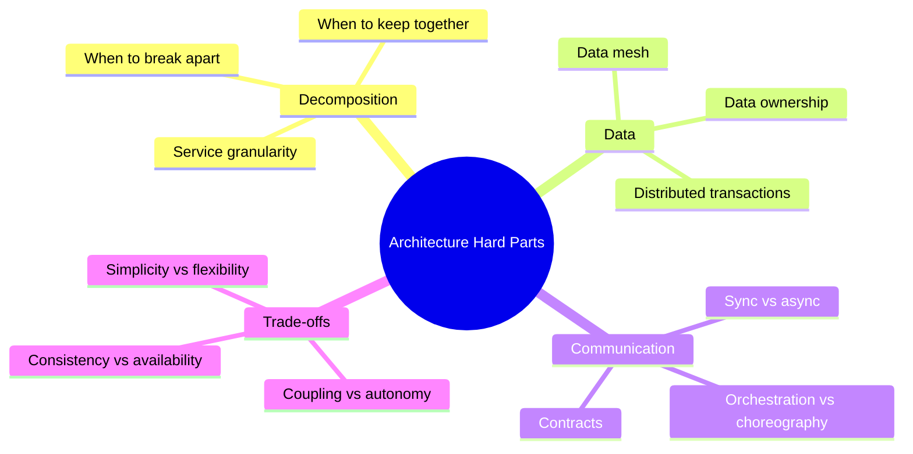
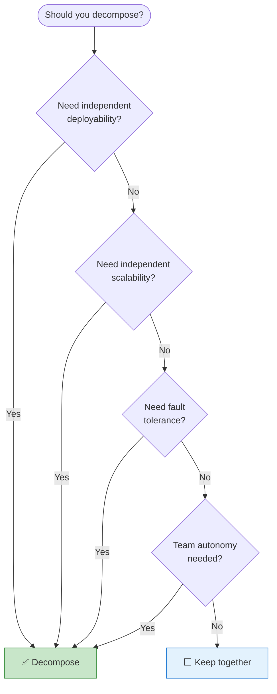
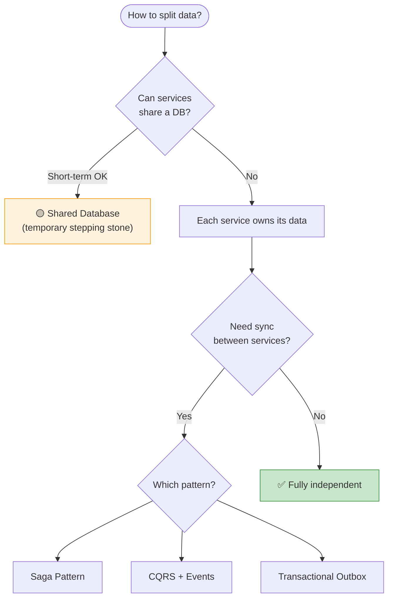

# ⚖️ Software Architecture: The Hard Parts — Key Learnings

> *Neal Ford, Mark Richards, Pramod Sadalage, Zhamak Dehghani*
> Making trade-offs in distributed architectures — there are no easy answers.

[🏠 Back to Books](./README.md)

---

## Core Philosophy

> **"There are no right or wrong answers in architecture — only trade-offs."**

---

## 1. Modularity Drivers

---

## 2. Granularity — Too Big vs. Too Small

| Too Coarse (Big Services) | Too Fine (Micro Services) |
| :--- | :--- |
| Hard to deploy independently | Too many network calls |
| Conflicting release schedules | Data consistency nightmares |
| Large blast radius | Operational overhead |
| Team coordination bottleneck | Debugging is painful |

> **Sweet spot:** Services aligned with bounded contexts that can be owned by one team (2-pizza rule).

---

## 3. Data Decomposition Patterns

---

## 4. Architecture Decision Records (ADRs)

| Section | Content |
| :--- | :--- |
| **Title** | Short descriptive name |
| **Status** | Proposed / Accepted / Deprecated |
| **Context** | What situation forced this decision? |
| **Decision** | What did we decide? |
| **Consequences** | What are the trade-offs? |

> **Every architecture decision should be documented.** Future engineers need to know WHY, not just WHAT.

---

## 5. Key Takeaways

| # | Lesson |
| :---: | :--- |
| 1 | **Everything is a trade-off** — document your decisions |
| 2 | **Data is the hardest part** — splitting data is harder than splitting code |
| 3 | **Start monolith, decompose when needed** — don't prematurely distribute |
| 4 | **Coupling is unavoidable** — manage it, don't eliminate it |
| 5 | **Architecture fitness functions** — automate architecture governance |

---

[⬅️ Previous: DDD](./domain-driven-design.md) | [🏠 Back to Books](./README.md) | [Next: Design Patterns ➡️](./head-first-design-patterns.md)

