# 🧠 AI/ML Engineering Leadership Roadmap

> A comprehensive preparation guide for transitioning to AI/ML Leadership roles (Director/Head of AI Engineering)

---

## 📋 Table of Contents

1. [Role Overview](#-role-overview)
2. [12-Week Preparation Plan](#-12-week-preparation-plan)
3. [Core Technical Skills](#-core-technical-skills)
4. [Leadership & Strategy Skills](#-leadership--strategy-skills)
5. [Hands-On Projects](#-hands-on-projects)
6. [Interview Preparation](#-interview-preparation)
7. [Resources from This Repository](#-resources-from-this-repository)

---

## 🎯 Role Overview

### Key Responsibilities Matrix

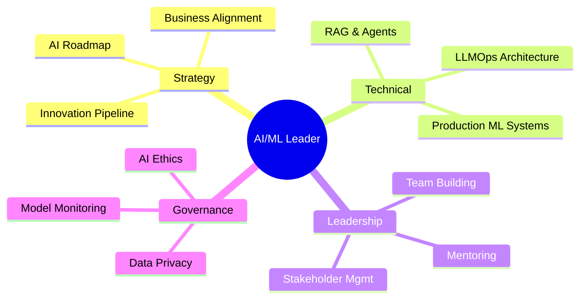

### Required Competencies

| Domain | Skills Required | Priority |
|--------|----------------|----------|
| **Generative AI** | LLMs, RAG, Fine-tuning, Prompt Engineering | 🔴 Critical |
| **ML Engineering** | PyTorch/TensorFlow, Hugging Face, LangChain | 🔴 Critical |
| **LLMOps** | Model deployment, monitoring, retraining | 🔴 Critical |
| **Cloud/MLOps** | AWS/Azure/GCP, Docker, Kubernetes, CI/CD | 🟡 High |
| **Microsoft Teams AI** | Bot Framework, Teams AI Library, Copilot Studio | 🟡 High |
| **Programming** | Python, SQL, FastAPI | 🟡 High |
| **Leadership** | Team management, stakeholder communication | 🔴 Critical |
| **AI Ethics** | Responsible AI, bias detection, governance | 🟡 High |

---

## 📅 12-Week Preparation Plan

### Phase 1: Foundations (Weeks 1-4)

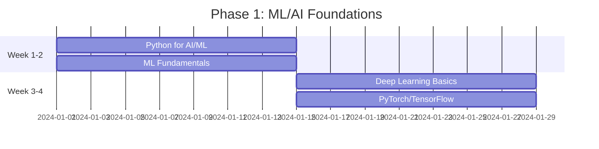

#### Week 1-2: Python & ML Fundamentals

| Day | Topic | Resources | Practice |
|-----|-------|-----------|----------|
| 1-2 | Python for AI (OOP, Decorators, Generators) | [Python AI/ML Guide](../python/README.md) | Build a reusable `Agent` class |
| 3-4 | NumPy, Pandas, Data Manipulation | [Python AI/ML Guide](../python/README.md) § Data Processing | EDA on a dataset |
| 5-7 | ML Fundamentals (Regression, Classification) | [ML Fundamentals](../interview-prep/system-design-components/genai/ml-fundamentals.md) | Implement from scratch |
| 8-10 | Sklearn (Models, Pipelines, Feature Eng) | [ML Fundamentals](../interview-prep/system-design-components/genai/ml-fundamentals.md) | Kaggle competition |
| 11-14 | Evaluation Metrics, Cross-Validation | [ML Fundamentals](../interview-prep/system-design-components/genai/ml-fundamentals.md) | Model comparison project |

#### Week 3-4: Deep Learning & Frameworks

| Day | Topic | Resources | Practice |
|-----|-------|-----------|----------|
| 1-3 | Neural Networks Fundamentals | [DL Fundamentals](../interview-prep/system-design-components/genai/deep-learning-fundamentals.md) | Build MLP from scratch |
| 4-6 | PyTorch Basics (Tensors, Autograd, Training Loop) | [DL Fundamentals](../interview-prep/system-design-components/genai/deep-learning-fundamentals.md) | Custom dataset + model |
| 7-9 | CNNs, Transfer Learning | [DL Fundamentals](../interview-prep/system-design-components/genai/deep-learning-fundamentals.md) | Image classifier |
| 10-12 | Transformers Architecture | [GenAI Fundamentals](../interview-prep/system-design-components/genai/genai-fundamentals.md) | Attention from scratch |
| 13-14 | Hugging Face Ecosystem | [Fine-tuning Guide](../interview-prep/system-design-components/genai/fine-tuning-guide.md) | Fine-tune BERT |

---

### Phase 2: Generative AI & LLMs (Weeks 5-8)

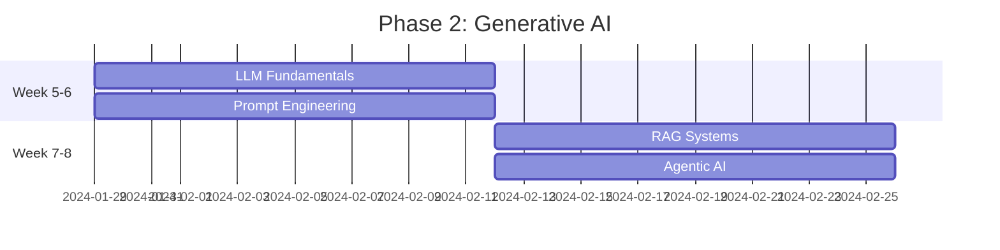

#### Week 5-6: LLMs & Prompt Engineering

| Day | Topic | Resources | Practice |
|-----|-------|-----------|----------|
| 1-3 | LLM Architecture (GPT, Claude, Llama) | [GenAI Fundamentals](../interview-prep/system-design-components/genai/genai-fundamentals.md) | Compare model outputs |
| 4-6 | Prompt Engineering Techniques | [GenAI Fundamentals](../interview-prep/system-design-components/genai/genai-fundamentals.md) | Build prompt library |
| 7-9 | Fine-tuning LLMs (LoRA, QLoRA) | [Fine-tuning Guide](../interview-prep/system-design-components/genai/fine-tuning-guide.md) | Fine-tune Llama 2 |
| 10-12 | LangChain Basics | External: LangChain docs | Build a chain |
| 13-14 | OpenAI/Claude API Integration | [Agentic AI Guide](../interview-prep/system-design-components/genai/agentic-ai-guide.md) | Build chatbot |

#### Week 7-8: RAG & Agentic AI

| Day | Topic | Resources | Practice |
|-----|-------|-----------|----------|
| 1-4 | RAG Architecture & Implementation | [RAG Deep Dive](../interview-prep/system-design-components/genai/rag-deep-dive.md) | Build RAG system |
| 5-7 | Vector Databases (Chroma, Pinecone) | [RAG Deep Dive](../interview-prep/system-design-components/genai/rag-deep-dive.md) | Compare vector DBs |
| 8-10 | Advanced RAG (Hybrid, Reranking) | [RAG Deep Dive](../interview-prep/system-design-components/genai/rag-deep-dive.md) | Production RAG API |
| 11-12 | Agentic AI Patterns | [Agentic AI Guide](../interview-prep/system-design-components/genai/agentic-ai-guide.md) | Build ReAct agent |
| 13-14 | MCP (Model Context Protocol) | [Agentic AI Guide](../interview-prep/system-design-components/genai/agentic-ai-guide.md) + [MCP Project](../projects/mcp-server-project/README.md) | Build MCP server |

---

### Phase 3: Production & MLOps (Weeks 9-10)

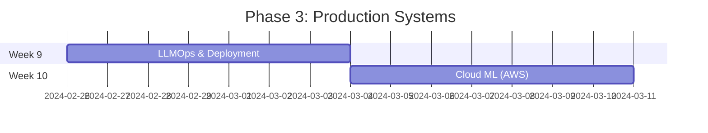

#### Week 9: LLMOps & Deployment

| Day | Topic | Resources | Practice |
|-----|-------|-----------|----------|
| 1-2 | FastAPI for ML APIs | [FastAPI Guide](../interview-prep/system-design-components/genai/fastapi-guide.md) | Build inference API |
| 3-4 | Docker & Containerization | [Docker Guide](../devops/docker-guide.md) | Containerize ML app |
| 5-6 | Kubernetes for ML | [Kubernetes Guide](../devops/kubernetes-guide.md) | Deploy to K8s |
| 7 | Model Monitoring & Observability | [AWS GenAI/MLOps](../interview-prep/system-design-components/genai/aws-genai-mlops.md) | Set up monitoring |

#### Week 10: Cloud ML Platforms

| Day | Topic | Resources | Practice |
|-----|-------|-----------|----------|
| 1-2 | AWS SageMaker | [AWS GenAI/MLOps](../interview-prep/system-design-components/genai/aws-genai-mlops.md) | Train model on SageMaker |
| 3-4 | AWS Bedrock & Lambda | [AWS GenAI/MLOps](../interview-prep/system-design-components/genai/aws-genai-mlops.md) | Deploy LLM endpoint |
| 5-6 | CI/CD for ML (MLflow, DVC) | [CI/CD GitOps DevOps MLOps](../devops/cicd-gitops-devops-mlops.md) | Build ML pipeline |
| 7 | Model Registry & Governance | [AWS GenAI/MLOps](../interview-prep/system-design-components/genai/aws-genai-mlops.md) | Set up registry |

---

### Phase 4: Leadership & Integration (Weeks 11-12)

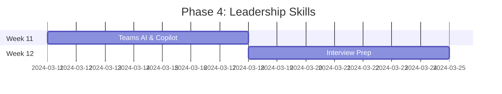

#### Week 11: Microsoft Teams AI & Enterprise Integration

| Day | Topic | Resources | Practice |
|-----|-------|-----------|----------|
| 1-2 | Bot Framework Basics | External: MS Docs | Build Teams bot |
| 3-4 | Teams AI Library | External: MS Docs | Add AI to bot |
| 5-6 | Copilot Studio | External: MS Learn | Build custom copilot |
| 7 | Enterprise AI Integration Patterns | [System Design Examples](../interview-prep/system-design-examples/) | Architecture doc |

#### Week 12: Interview & Leadership Prep

| Day | Topic | Resources | Practice |
|-----|-------|-----------|----------|
| 1-2 | System Design for AI | [System Design Examples](../interview-prep/system-design-examples/) | Design AI system |
| 3-4 | Technical Leadership Scenarios | [Technical Architect Roadmap](./technical-architect-roadmap.md) | Mock interviews |
| 5-6 | AI Ethics & Governance | External research | Ethics framework |
| 7 | Final Mock Interview | All resources | Complete mock |

---

## 🔧 Core Technical Skills

### 1. Python for AI/ML

```python
# Key concepts to master
class AIEngineerSkills:
    """Skills every AI Engineer must have"""
    
    must_know = [
        "OOP & Design Patterns",
        "Decorators & Metaclasses",
        "Generators & Async/Await",
        "Type Hints & Pydantic",
        "Memory Management & GIL",
    ]
    
    frameworks = [
        "NumPy, Pandas, Scikit-learn",
        "PyTorch or TensorFlow",
        "Hugging Face Transformers",
        "LangChain / LlamaIndex",
        "FastAPI / Pydantic",
    ]
```

📚 **Resource**: [Python for AI/ML Architect's Guide](../python/README.md)

---

### 2. Machine Learning & Deep Learning

#### Core ML Concepts

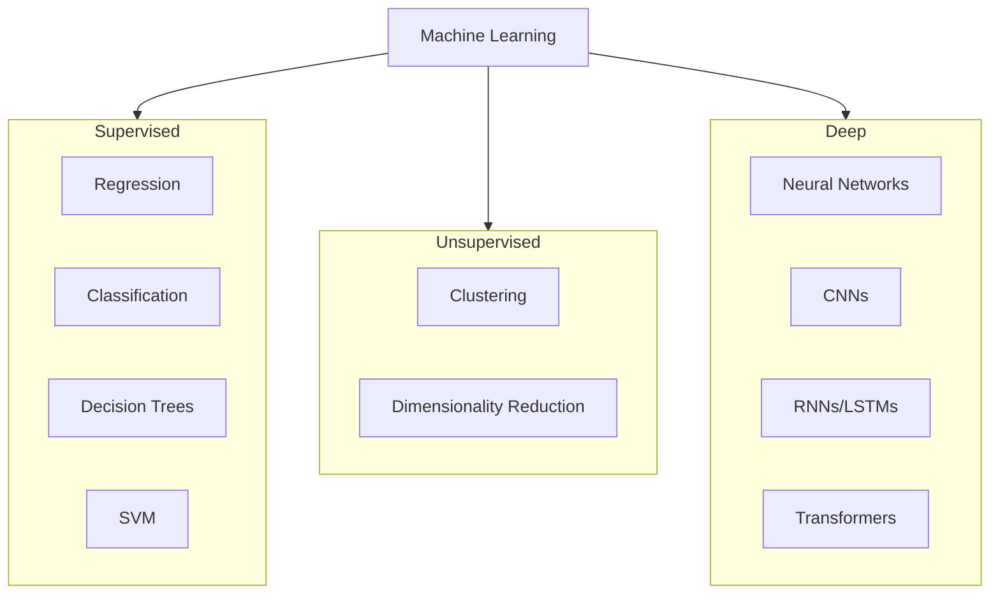

#### Key Topics Checklist

- [ ] Linear/Logistic Regression (math + implementation)
- [ ] Decision Trees, Random Forests, XGBoost
- [ ] K-Means, PCA, Dimensionality Reduction
- [ ] Neural Networks (forward/backprop)
- [ ] CNN architectures (ResNet, VGG)
- [ ] Transformers & Attention Mechanism
- [ ] Training: Optimizers, Regularization, Batch Norm

📚 **Resources**: 
- [ML Fundamentals](../interview-prep/system-design-components/genai/ml-fundamentals.md)
- [Deep Learning Fundamentals](../interview-prep/system-design-components/genai/deep-learning-fundamentals.md)

---

### 3. Generative AI & LLMs

#### LLM Architecture Understanding

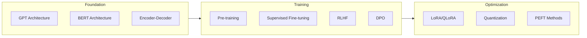

#### Key Topics Checklist

- [ ] Transformer architecture (attention, positional encoding)
- [ ] Tokenization (BPE, WordPiece)
- [ ] Pre-training vs Fine-tuning vs RLHF
- [ ] Parameter-efficient fine-tuning (LoRA, QLoRA)
- [ ] Quantization (INT8, INT4)
- [ ] Prompt engineering (CoT, few-shot, ReAct)
- [ ] Evaluation metrics (perplexity, BLEU, ROUGE)

📚 **Resources**:
- [GenAI Fundamentals](../interview-prep/system-design-components/genai/genai-fundamentals.md)
- [Fine-tuning Guide](../interview-prep/system-design-components/genai/fine-tuning-guide.md)

---

### 4. RAG & Vector Databases

#### RAG Architecture

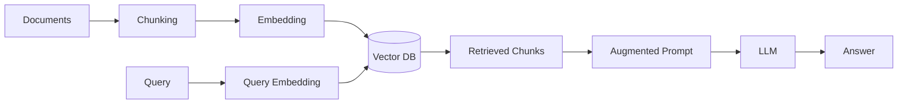

#### Key Topics Checklist

- [ ] Embedding models (OpenAI, Cohere, BGE)
- [ ] Chunking strategies (fixed, semantic, agentic)
- [ ] Vector databases (Chroma, Pinecone, Weaviate)
- [ ] Similarity search (cosine, dot product)
- [ ] Hybrid search (BM25 + vector)
- [ ] Reranking (cross-encoders)
- [ ] Evaluation (context relevance, faithfulness)

📚 **Resources**:
- [RAG Deep Dive](../interview-prep/system-design-components/genai/rag-deep-dive.md)
- [RAG API Project](../projects/rag-api-project/README.md)

---

### 5. Agentic AI & Tool Use

#### Agent Architecture

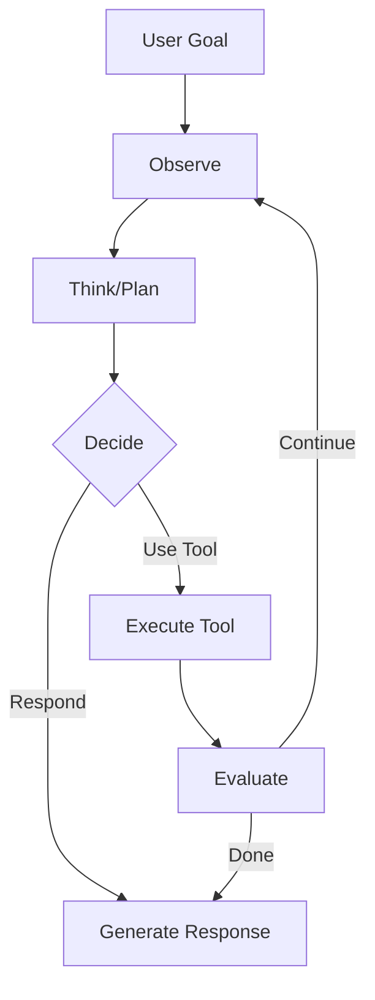

#### Key Topics Checklist

- [ ] Agent patterns (ReAct, Plan-and-Execute)
- [ ] Function calling (OpenAI, Claude)
- [ ] Tool design best practices
- [ ] Memory systems (short-term, long-term)
- [ ] Multi-agent systems
- [ ] Model Context Protocol (MCP)
- [ ] Safety & guardrails

📚 **Resources**:
- [Agentic AI Guide](../interview-prep/system-design-components/genai/agentic-ai-guide.md)
- [MCP Server Project](../projects/mcp-server-project/README.md)

---

### 6. LLMOps & Production ML

#### Production ML Architecture

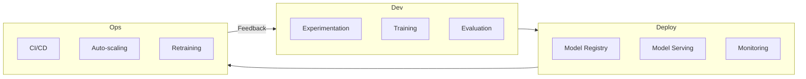

#### Key Topics Checklist

- [ ] Model serving (FastAPI, TorchServe, vLLM)
- [ ] Containerization (Docker, K8s)
- [ ] Model versioning (MLflow, DVC)
- [ ] A/B testing for models
- [ ] Observability (Prometheus, Grafana)
- [ ] Cost optimization (batching, caching)
- [ ] Data & model drift detection

📚 **Resources**:
- [AWS GenAI/MLOps](../interview-prep/system-design-components/genai/aws-genai-mlops.md)
- [FastAPI Guide](../interview-prep/system-design-components/genai/fastapi-guide.md)
- [Docker Guide](../devops/docker-guide.md)
- [Kubernetes Guide](../devops/kubernetes-guide.md)

---

### 7. Microsoft Teams AI Ecosystem

#### Teams AI Components

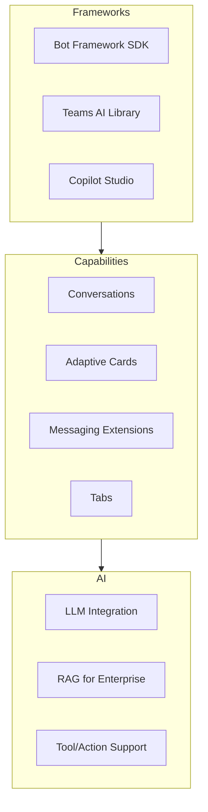

#### Key Topics Checklist

- [ ] Bot Framework SDK (C#/Node.js/Python)
- [ ] Teams AI Library (action planner, RAG)
- [ ] Copilot Studio (low-code agents)
- [ ] Microsoft Graph integration
- [ ] Azure OpenAI Service
- [ ] Enterprise security (SSO, conditional access)

📚 **External Resources**:
- [Bot Framework Documentation](https://docs.microsoft.com/en-us/azure/bot-service/)
- [Teams AI Library](https://github.com/microsoft/teams-ai)
- [Copilot Studio](https://learn.microsoft.com/en-us/microsoft-copilot-studio/)

---

## 👔 Leadership & Strategy Skills

### AI Strategy Framework

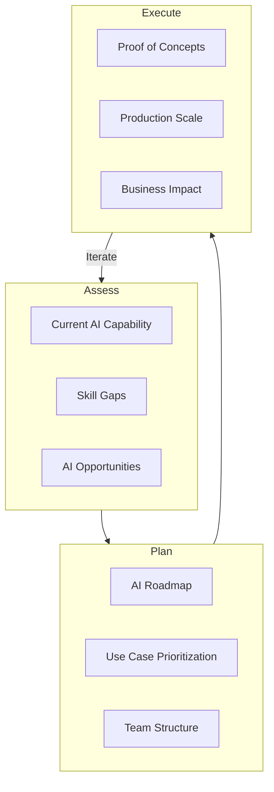

### Leadership Competencies

| Competency | Key Behaviors |
|------------|---------------|
| **Vision Setting** | Define AI strategy aligned with business goals |
| **Team Building** | Hire, mentor, and grow AI talent |
| **Stakeholder Management** | Translate AI capabilities to business value |
| **Technical Leadership** | Set technical direction, make architecture decisions |
| **Risk Management** | Navigate AI ethics, bias, and governance |
| **Change Management** | Drive AI adoption across organization |

### AI Ethics & Governance

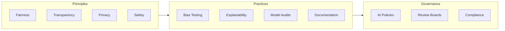

📚 **Resource**: [Technical Architect Roadmap](./technical-architect-roadmap.md)

---

## 🛠️ Hands-On Projects

### Project 1: Production RAG System

Build an enterprise-grade RAG system with:
- Document ingestion pipeline
- Semantic chunking
- Hybrid search (BM25 + vector)
- Reranking
- FastAPI endpoints
- Docker deployment

📚 **Template**: [RAG API Project](../projects/rag-api-project/README.md)

---

### Project 2: LLM Fine-tuning Pipeline

Fine-tune a model for a specific domain:
- Dataset preparation
- LoRA/QLoRA training
- Evaluation framework
- Model registry integration

📚 **Template**: [LLM Fine-tuning Project](../projects/llm-finetuning-project/README.md)

---

### Project 3: Agentic AI System

Build a multi-tool agent:
- ReAct pattern implementation
- Custom tools (web search, database, APIs)
- Memory management
- MCP server integration

📚 **Template**: [MCP Server Project](../projects/mcp-server-project/README.md)

---

### Project 4: Teams AI Bot

Build an enterprise Teams bot:
- Bot Framework SDK setup
- Teams AI Library integration
- RAG for company knowledge base
- Azure OpenAI backend

📚 **External**: Microsoft Teams AI Library samples

---

## 🎤 Interview Preparation

### Common Technical Questions

#### LLMs & Generative AI

1. **"Explain the Transformer architecture"**
   - Self-attention, positional encoding, encoder-decoder
   
2. **"How does RAG work and when would you use it vs fine-tuning?"**
   - Architecture, trade-offs, use cases
   
3. **"Explain LoRA and why it's efficient"**
   - Low-rank adaptation, parameter efficiency

4. **"How do you handle hallucinations in LLMs?"**
   - RAG, grounding, verification, guardrails

5. **"Design an LLMOps pipeline for a production system"**
   - Model versioning, deployment, monitoring, retraining

#### System Design for AI

1. **"Design a conversational AI platform for customer support"**
   - Agent architecture, RAG, escalation, multi-tenant

2. **"Design a recommendation system using LLMs"**
   - Embeddings, retrieval, personalization, scale

3. **"Design an AI-powered code review system"**
   - Code understanding, LLM integration, CI/CD

📚 **Resources**:
- [System Design Examples](../interview-prep/system-design-examples/)
- [Technical Architect Roadmap](./technical-architect-roadmap.md)

### Leadership Questions

1. **"How would you build an AI team from scratch?"**
   - Hiring, skills matrix, structure, culture

2. **"How do you prioritize AI initiatives?"**
   - Business impact, feasibility, strategic alignment

3. **"How do you measure ROI of AI projects?"**
   - Metrics, attribution, qualitative/quantitative

4. **"How do you ensure responsible AI practices?"**
   - Ethics framework, governance, testing, audits

---

## 📚 Resources from This Repository

### Core AI/ML Resources

| Resource | Description | Link |
|----------|-------------|------|
| **ML Fundamentals** | Math, algorithms, sklearn | [View](../interview-prep/system-design-components/genai/ml-fundamentals.md) |
| **Deep Learning Fundamentals** | Neural networks, PyTorch | [View](../interview-prep/system-design-components/genai/deep-learning-fundamentals.md) |
| **GenAI Fundamentals** | LLMs, Transformers, prompting | [View](../interview-prep/system-design-components/genai/genai-fundamentals.md) |
| **RAG Deep Dive** | Embeddings, vector DBs, retrieval | [View](../interview-prep/system-design-components/genai/rag-deep-dive.md) |
| **Agentic AI Guide** | Agents, tools, MCP | [View](../interview-prep/system-design-components/genai/agentic-ai-guide.md) |
| **Fine-tuning Guide** | LoRA, PEFT, training | [View](../interview-prep/system-design-components/genai/fine-tuning-guide.md) |
| **AWS GenAI/MLOps** | SageMaker, Bedrock, deployment | [View](../interview-prep/system-design-components/genai/aws-genai-mlops.md) |
| **FastAPI Guide** | API development for AI | [View](../interview-prep/system-design-components/genai/fastapi-guide.md) |

### Python & Programming

| Resource | Description | Link |
|----------|-------------|------|
| **Python AI/ML Guide** | Python internals, async, decorators | [View](../python/README.md) |

### DevOps & Infrastructure

| Resource | Description | Link |
|----------|-------------|------|
| **Docker Guide** | Containerization for ML | [View](../devops/docker-guide.md) |
| **Kubernetes Guide** | K8s for ML workloads | [View](../devops/kubernetes-guide.md) |
| **CI/CD, GitOps, MLOps** | End-to-end pipelines | [View](../devops/cicd-gitops-devops-mlops.md) |

### Hands-On Projects

| Project | Description | Link |
|---------|-------------|------|
| **RAG API Project** | Production RAG system | [View](../projects/rag-api-project/README.md) |
| **LLM Fine-tuning Project** | Model fine-tuning pipeline | [View](../projects/llm-finetuning-project/README.md) |
| **MCP Server Project** | Agentic AI with MCP | [View](../projects/mcp-server-project/README.md) |
| **Kafka Learning Project** | Event-driven architecture | [View](../projects/kafka-learning-project/README.md) |

### Career & System Design

| Resource | Description | Link |
|----------|-------------|------|
| **Technical Architect Roadmap** | Career growth to architect | [View](./technical-architect-roadmap.md) |
| **System Design Examples** | Real-world architectures | [View](../interview-prep/system-design-examples/) |

---

## 📊 Progress Tracker

Use this checklist to track your preparation:

### Phase 1: Foundations (Weeks 1-4)
- [ ] Python OOP, decorators, generators mastered
- [ ] NumPy, Pandas, data manipulation fluent
- [ ] ML fundamentals (regression, classification, trees)
- [ ] sklearn pipelines and evaluation
- [ ] Neural networks from scratch
- [ ] PyTorch or TensorFlow proficient
- [ ] CNN implementation completed
- [ ] Transformers architecture understood

### Phase 2: Generative AI (Weeks 5-8)
- [ ] LLM architectures (GPT, BERT, Llama) understood
- [ ] Prompt engineering techniques mastered
- [ ] Fine-tuning (LoRA/QLoRA) completed
- [ ] LangChain/LlamaIndex projects
- [ ] RAG system built end-to-end
- [ ] Vector database experience (Chroma/Pinecone)
- [ ] Agentic AI pattern implemented
- [ ] MCP server built

### Phase 3: Production (Weeks 9-10)
- [ ] FastAPI ML APIs built
- [ ] Docker containerization done
- [ ] Kubernetes deployment completed
- [ ] AWS SageMaker/Bedrock used
- [ ] ML CI/CD pipeline set up
- [ ] Model monitoring implemented

### Phase 4: Leadership (Weeks 11-12)
- [ ] Teams AI bot built
- [ ] Copilot Studio explored
- [ ] AI strategy framework developed
- [ ] Mock interviews completed
- [ ] AI ethics framework understood

---

<div align="center">

## 🚀 Good Luck with Your AI/ML Leadership Journey!

*"The best way to predict the future is to build it."*

</div>
