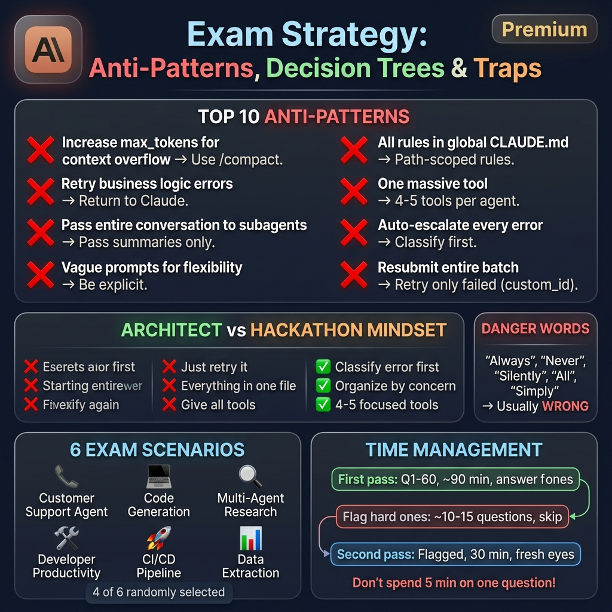

# 🔥 Claude Certified Architect – Advanced Practice Questions (Set 2)

> These questions are **harder** than the first set, testing deeper tradeoffs, edge cases, and the two scenarios missing from Set 1 (CI/CD and Developer Productivity). Questions are labeled by domain weight to help you prioritize.

---

## Scenario: Claude Code for CI/CD (NEW)

You're integrating Claude Code into a CI/CD pipeline for an enterprise team with 50+ developers. The pipeline handles automated PR reviews, issue triage, and security audits.

### Q26. CI/CD Headless Mode *(Domain 3 — 20%)*
Your GitHub Actions workflow needs Claude to review PRs and output structured JSON results. Which invocation is correct?

- A) `claude "Review this PR" --interactive --output json`
- B) `claude -p --output-format json "Review this PR for security issues"`
- C) `claude --resume --output-format json "Review this PR"`
- D) `claude -p "Review this PR" | jq .`

### Q27. CI Workflow Enforcement *(Domain 1 — 27%)*
Your CI pipeline uses Claude to auto-fix linting issues on PRs. A developer pushes code that violates security policies. What's the best enforcement pattern?

- A) Let Claude auto-fix the security issues silently and push the fix
- B) Use a `PreToolUse` hook to block Claude from modifying security-critical files, and flag for human review
- C) Add "never modify security code" to the global `~/.claude/CLAUDE.md`
- D) Run Claude in plan mode and auto-approve all plans in CI

### Q28. CI Output Validation *(Domain 4 — 20%)*
Claude's CI review output sometimes returns malformed JSON, breaking your pipeline. What's the most robust solution?

- A) Add `try/catch` around JSON parsing and skip malformed reviews
- B) Use `--json-schema` flag to validate output structure, combined with validation-retry on failure
- C) Switch to plain text output and parse manually
- D) Increase `max_tokens` to prevent truncated JSON

### Q29. Multi-Stage CI Pipeline *(Domain 3 — 20%)*
You're designing a 3-stage Claude CI pipeline: (1) security audit, (2) code review, (3) test generation. How should the stages share context?

- A) Use a single long-running Claude session across all three stages
- B) Each stage runs independently with `-p`, passing structured JSON output as input to the next stage
- C) Use `--resume` to continue the same session across pipeline stages
- D) Store all stage outputs in CLAUDE.md for the next stage to read

### Q30. CI Token Economics *(Domain 5 — 15%)*
Your CI pipeline reviews 200 PRs/day. Each review consumes ~50K tokens. How do you optimize costs?

- A) Use the Message Batches API for all reviews (50% cheaper)
- B) Batch non-urgent reviews (e.g., documentation PRs) via Batches API, keep security reviews real-time
- C) Reduce context by passing only changed files instead of the entire repo
- D) Both B and C

---

## Scenario: Developer Productivity with Claude (NEW)

You're building an internal developer productivity platform that uses Claude to help engineers with code navigation, documentation, debugging, and knowledge sharing.

### Q31. Knowledge Agent Architecture *(Domain 1 — 27%)*
You're building an agent that answers questions about a 3M LOC codebase. Engineers ask questions like "How does the payment flow work?" What architecture is best?

- A) Load the entire codebase into Claude's context window
- B) Use a coordinator that spawns subagents — one for code search (`Grep`/`Glob`), one for file reading, one for synthesis — with each returning structured summaries
- C) Pre-generate documentation for the entire codebase and only query that
- D) Use a single agent with all tools and let Claude figure out the search strategy

### Q32. Tool Selection for Code Navigation *(Domain 2 — 18%)*
Your dev productivity agent has these tools: `search_codebase`, `read_file`, `search_docs`, `search_slack`. An engineer asks "Why did we switch from REST to gRPC?" Which tool selection strategy is best?

- A) Force `search_codebase` since it's a code question
- B) Set `tool_choice: "auto"` and provide clear descriptions differentiating each tool's scope so Claude can determine the best search strategy
- C) Call all four tools in parallel and let Claude combine results
- D) Force `search_slack` since architectural decisions are discussed there

### Q33. Session Strategy for Debugging *(Domain 3 — 20%)*
A developer is debugging a complex issue over multiple sessions. They've been working on it for 3 days. What session strategy is optimal?

- A) Use a fresh session each day with full context re-explanation
- B) Use `--resume` to continue the main debugging session, and `fork_session` to explore alternative hypotheses without polluting the main thread
- C) Use `/memory` to save all debugging state and always start fresh
- D) Keep one continuous session running for the entire 3-day period

### Q34. Context-Aware Rules *(Domain 3 — 20%)*
Your monorepo has strict rules for the `payments/` directory (PCI compliance) but relaxed rules for `internal-tools/`. What configuration is most appropriate?

- A) Put all rules in a single `./CLAUDE.md` with conditional comments
- B) Create `.claude/rules/payments.md` with `globs: ["payments/**"]` for strict rules and `.claude/rules/internal.md` with `globs: ["internal-tools/**"]` for relaxed rules
- C) Create separate CLAUDE.md files in each directory
- D) Use environment variables to toggle rule strictness

### Q35. Developer Agent Error Handling *(Domain 2 — 18%)*
Your code search tool returns 500+ results for a common function name. How should the tool handle this?

- A) Return all 500+ results and let Claude filter
- B) Return an error: "Too many results — please narrow your search with additional filters"
- C) Silently truncate to the first 10 results
- D) Return a structured response with result count, top 10 ranked results, and suggested refinement queries

---

## Scenario: Customer Support (Advanced)

### Q36. Multi-Agent Support System *(Domain 1 — 27%)*
You're scaling your support agent to handle 10K+ concurrent sessions. Each session involves account lookups, order tracking, and refund processing. What architectural pattern handles this best?

- A) One monolithic agent per session with all tools available
- B) A lightweight coordinator per session that delegates to shared specialized subagents (account agent, order agent, refund agent) with explicit context passing
- C) A single global agent that round-robins between sessions
- D) Pre-built conversation scripts with no agent flexibility

### Q37. Workflow State Machine *(Domain 1 — 27%)*
Your support agent must follow a strict workflow: verify identity → check account → process request → confirm action. How do you enforce this sequence?

- A) Include the sequence in the system prompt and trust Claude to follow it
- B) Implement a programmatic state machine that restricts available tools based on current workflow state
- C) Use few-shot examples showing the correct order
- D) Create separate agents for each step and chain them

### Q38. Ambiguous Customer Intent *(Domain 4 — 20%)*
A customer says "I want to change my plan." This could mean upgrade, downgrade, or cancel. How should the agent handle this?

- A) Default to the most common interpretation (upgrade) and proceed
- B) Ask a targeted clarifying question before taking any action
- C) Present all three options and let the customer choose
- D) Check the customer's recent billing history to infer intent, then confirm

### Q39. Support Agent Guardrails *(Domain 5 — 15%)*
Your agent can process refunds up to $500 autonomously. A customer requests a $480 refund but their account has 5 previous refund requests this month. What should happen?

- A) Process the refund — it's under the $500 limit
- B) Escalate to human review — the pattern is suspicious even though individual amounts are within limits
- C) Deny the refund automatically
- D) Process the refund but flag the account for future monitoring

---

## Scenario: Multi-Agent Research (Advanced)

### Q40. Cross-Source Synthesis *(Domain 5 — 15%)*
Three subagents return research findings. Subagent A says "Revenue grew 15%," Subagent B says "Revenue grew 12%," and Subagent C doesn't mention revenue. How should the coordinator handle this?

- A) Average the two values (13.5%)
- B) Use the most recent source's value
- C) Report both claims with source citations, flag the discrepancy, note Subagent C's coverage gap
- D) Ask Claude to determine which subagent is more reliable

### Q41. Long-Document Analysis *(Domain 5 — 15%)*
You need to analyze a 200-page regulatory document. Your context window can handle ~60 pages. What's the best approach?

- A) Truncate to the first 60 pages and analyze
- B) Split into ~4 chunks, assign each to a subagent for focused analysis, then have the coordinator synthesize summaries
- C) Summarize the document externally first, then pass the summary to Claude
- D) Use a single agent with progressive summarization for each chunk

### Q42. Research Agent Tool Overload *(Domain 2 — 18%)*
Your research agent has 15 different search tools (PubMed, arXiv, Google Scholar, Semantic Scholar, web crawlers, etc). Claude often picks the wrong tool. What's the best fix?

- A) Add more examples to the system prompt showing which tool to use when
- B) Reduce to 4-5 well-described tools with clear differentiating descriptions, and use subagents for specialized searches
- C) Set `tool_choice: "any"` so Claude must always use a tool
- D) Create one unified `search` tool that abstracts over all backends

---

## Scenario: Structured Data Extraction (Advanced)

### Q43. Schema for Variable Structures *(Domain 4 — 20%)*
You're extracting data from invoices. Some invoices have line items, some have only a total. The line items table format varies across vendors. What schema design is most robust?

- A) Define a strict schema with all possible fields required
- B) Use a flexible schema with nullable arrays for line items (`"type": ["array", "null"]`), nullable fields within items, and a `confidence` score per field
- C) Create a separate schema per vendor
- D) Use `"type": "string"` for everything and parse later

### Q44. Batch Pipeline with Validation *(Domain 4 — 20%)*
You're processing 50K invoices via Batches API. After the batch completes, 8% of results fail Pydantic validation. What's the optimal recovery strategy?

- A) Resubmit the entire batch with modified prompts
- B) Identify failed items by `custom_id`, analyze common error patterns, fix the schema/prompt for those patterns, then resubmit only the failed items
- C) Manually review all 4,000 failed items
- D) Accept the 92% accuracy and discard failures

### Q45. Extraction Chain Design *(Domain 4 — 20%)*
You're extracting data from complex multi-page contracts. What prompt chaining strategy is most effective?

- A) Single prompt: "Extract all data from this contract"
- B) Two passes: Extract → Validate
- C) Four passes: (1) Identify document type/sections → (2) Extract per-section data → (3) Cross-reference and validate → (4) Generate final structured output with confidence scores
- D) Three passes: Extract → Format → Output

### Q46. Confidence Calibration *(Domain 5 — 15%)*
Your extraction system reports 95% confidence on invoice totals, but actual accuracy is only 78%. For vendor names, reported confidence is 88% and actual accuracy is 91%. What's the diagnosis and fix?

- A) The model is well-calibrated overall — average it out
- B) Invoice totals are overconfident (poorly calibrated) — create a stratified validation set per field type and adjust confidence thresholds independently using calibration curves
- C) Increase the number of few-shot examples for totals
- D) Lower the global confidence threshold to 0.70 for all fields

---

## Scenario: MCP Integration (Advanced)

### Q47. MCP Multi-Server Architecture *(Domain 2 — 18%)*
Your platform connects to 4 MCP servers: GitHub, Jira, Confluence, and PagerDuty. An on-call engineer asks: "Is there a PR related to the current PagerDuty incident?" What's the best tool design?

- A) Create one mega-tool `find_related_items` that searches all four systems
- B) Keep separate tools per system with detailed descriptions, and let Claude's coordinator query PagerDuty for incident details first, then search GitHub for related PRs
- C) Create a pre-built "incident investigation" prompt template that chains all four queries
- D) Build a custom MCP server that pre-joins data across all four systems

### Q48. MCP Resource Discovery *(Domain 2 — 18%)*
You're building a Confluence MCP server. Which items should be Resources vs Tools?

- A) Everything as Tools since they all require API calls
- B) `list_spaces`, `get_page_content`, `search_pages` → Resources; `create_page`, `update_page`, `delete_page` → Tools
- C) `search_pages` → Tool; everything else → Resources
- D) All read operations → Prompts; all write operations → Tools

---

## General Tradeoff Questions

### Q49. Model Selection Tradeoff *(Domain 1 — 27%)*
You're designing a two-agent system: Agent A triages customer emails, Agent B drafts detailed responses. Budget is constrained. What model allocation strategy is best?

- A) Use Opus for both agents — quality is paramount
- B) Use Sonnet for Agent A (fast triage) and Opus for Agent B (detailed drafting)
- C) Use Haiku for both agents — maximize throughput
- D) Use Opus for Agent A (accurate triage is critical) and Sonnet for Agent B

### Q50. Token Economics in Multi-Agent Systems *(Domain 1 — 27%)*
Your multi-agent research system is consuming 5x more tokens than expected. Investigation reveals subagents are returning full document contents to the coordinator. What's the fix?

- A) Increase the token budget — research tasks naturally consume more
- B) Enforce that subagents return structured summaries with key findings instead of raw content, and implement a max token limit on subagent responses
- C) Switch to a cheaper model
- D) Reduce the number of subagents

---

## ✅ Answer Key (Set 2)

| Q | Answer | Explanation |
|---|---|---|
| 26 | **B** | `-p` enables non-interactive mode (required for CI), `--output-format json` gives structured output. `--interactive` doesn't exist for CI use. |
| 27 | **B** | `PreToolUse` hooks provide deterministic enforcement — block modifications to security files and escalate. Silent auto-fixes are dangerous; global CLAUDE.md is too broad; auto-approving plans defeats the purpose. |
| 28 | **B** | `--json-schema` validates the structure server-side, and a validation-retry loop handles failures gracefully. Skipping reviews loses coverage; increasing `max_tokens` doesn't guarantee valid JSON. |
| 29 | **B** | Each CI stage should be independent with `-p`, passing structured JSON between stages. Long-running sessions in CI are fragile. `--resume` isn't designed for CI pipelines. |
| 30 | **D** | Both optimizations stack: Batches API saves 50% on non-urgent reviews, and passing only diffs reduces per-review token cost. Security reviews stay real-time for speed. |
| 31 | **B** | Hub-and-spoke with specialized subagents handles large codebases — search agents find relevant code, synthesis agent summarizes. Loading 3M LOC is impossible; single agent lacks focus. |
| 32 | **B** | `tool_choice: "auto"` with clear descriptions lets Claude reason about the best search strategy. The question spans code AND discussion, so forcing one tool misses context. |
| 33 | **B** | `--resume` maintains debugging context; `fork_session` enables safe hypothesis testing. Fresh sessions lose context; continuous sessions overflow. |
| 34 | **B** | Path-scoped rules in `.claude/rules/` with glob patterns is the designed mechanism for directory-specific configuration. Auto-loads only when editing matching files. |
| 35 | **D** | Structured response with count, top results, and refinement suggestions is the most helpful. Returning all 500+ wastes context; silent truncation hides information; a bare error provides no guidance. |
| 36 | **B** | Lightweight coordinator + specialized subagents provides scalability, separation of concerns, and efficient context usage. Monolithic agents waste context on unused tools. |
| 37 | **B** | Programmatic state machines provide **deterministic** workflow enforcement. Prompt-only approaches are unreliable for compliance-critical flows. Tool restrictions based on state guarantee sequence compliance. |
| 38 | **D** | Check billing history to infer intent AND confirm with the user. This combines proactive intelligence with explicit confirmation — better UX than naked clarification, safer than assuming. |
| 39 | **B** | Pattern detection (5 refunds in a month) is suspicious even if individual amounts are within policy. Escalate for human judgment on the pattern, not just the amount. |
| 40 | **C** | Information provenance: map claims to sources, flag discrepancies, report coverage gaps. Never average or silently pick one — give the human reviewer full transparency. |
| 41 | **B** | Subagent per chunk with coordinator synthesis is THE pattern for long-document analysis. Preserves detail per chunk while managing total context. |
| 42 | **B** | Reduce tools to 4-5 with focused descriptions. 15 tools causes selection ambiguity. Use subagents for specialized searches to keep each agent's tool surface small and clear. |
| 43 | **B** | Nullable arrays/fields + confidence scores handle structural variation without hallucination. Per-vendor schemas don't scale. Strict schemas break on variation. |
| 44 | **B** | Error pattern analysis → targeted prompt/schema fix → selective retry is the cost-effective pipeline. Resubmitting all 50K wastes money; discarding 8% loses data. |
| 45 | **C** | Four focused passes produce the highest quality for complex documents. Each pass has a narrow scope, reducing Claude's cognitive load per step. |
| 46 | **B** | Overconfidence on totals (95% claimed vs 78% actual) means the model is poorly calibrated for numerics. Stratified calibration per field type with independent thresholds is the right fix. |
| 47 | **B** | Separate tools with clear descriptions let Claude reason about the multi-step investigation: get incident details first, then search for related code. Mega-tools are opaque. |
| 48 | **B** | Read-only operations (list, get, search) = Resources. Mutations (create, update, delete) = Tools. This follows the MCP primitive definitions exactly. |
| 49 | **B** | Triage is fast/frequent → Sonnet (cost-efficient, fast). Drafting needs quality → Opus. This optimizes cost-to-quality ratio. Using Opus for triage wastes budget. |
| 50 | **B** | Context leakage (subagents returning full content) is the #1 token economics anti-pattern. Fix: enforce structured summaries + token limits on responses. The problem isn't budget or model — it's architecture. |
