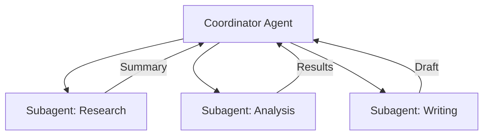
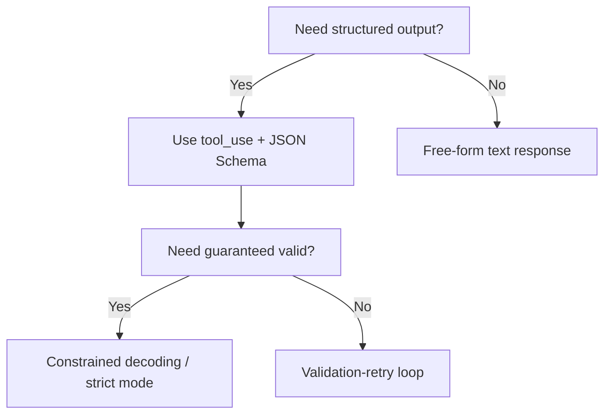
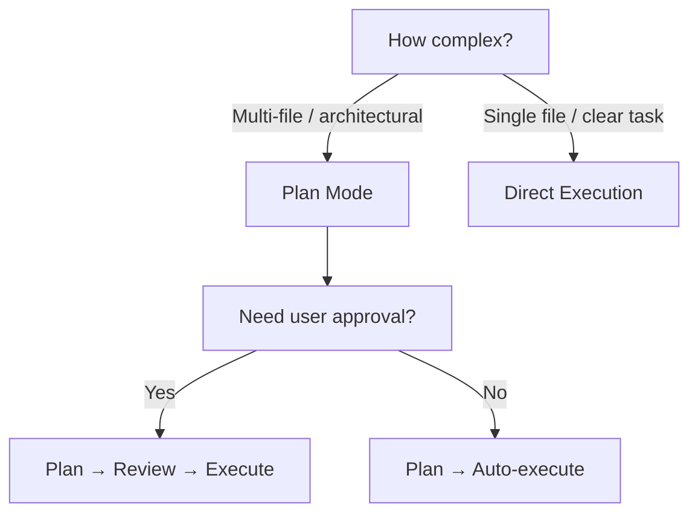

# 🏗️ Claude Certified Architect – Foundations Study Guide

## Exam Overview

| Detail | Value |
|---|---|
| **Questions** | 60 multiple-choice |
| **Time** | 120 minutes |
| **Passing Score** | 720 / 1000 (scaled) |
| **Format** | Scenario-based (4 of 6 scenarios randomly selected) |
| **Prerequisites** | ~6 months hands-on experience with Claude APIs, Agent SDK, Claude Code, MCP |
| **Cost** | $99 (free for first 5,000 partner employees) |
| **Validity** | 6 months |
| **Proctored** | Yes — no external resources, no breaks |

### Domain Weights

| Domain | Weight | ~Questions |
|---|---|---|
| 1. Agentic Architecture & Orchestration | **27%** | ~16 |
| 2. Tool Design & MCP Integration | **18%** | ~11 |
| 3. Claude Code Configuration & Workflows | **20%** | ~12 |
| 4. Prompt Engineering & Structured Output | **20%** | ~12 |
| 5. Context Management & Reliability | **15%** | ~9 |

### 6 Possible Exam Scenarios
1. Building a customer support resolution agent
2. Code generation with Claude Code
3. Multi-agent research systems
4. Developer productivity with Claude
5. Claude Code for CI/CD
6. Structured data extraction pipeline

> [!IMPORTANT]
> Every question is anchored to a real-world scenario. The exam tests **architectural judgment and tradeoffs**, not memorized facts. Understand the "why" behind every decision.

---

## Domain 1: Agentic Architecture & Orchestration

### 1.1 The Agentic Loop

The core pattern for Claude agents is a **loop** that:
1. Sends a message to Claude
2. Checks `stop_reason` in the response
3. If `stop_reason === "tool_use"` → execute the tool, send result back, loop
4. If `stop_reason === "end_turn"` → task complete, exit loop
5. If `stop_reason === "max_tokens"` → context limit hit, handle gracefully

```
┌─────────────────────────────────────┐
│          User Request               │
└──────────────┬──────────────────────┘
               ▼
┌─────────────────────────────────────┐
│     Send to Claude API              │
└──────────────┬──────────────────────┘
               ▼
┌─────────────────────────────────────┐
│   Check stop_reason                 │
│                                     │
│  "tool_use" ──► Execute tool        │
│                  └─► Send result    │
│                       └─► LOOP ↑    │
│                                     │
│  "end_turn" ──► Return response     │
│  "max_tokens" ► Handle overflow     │
│  "refusal"   ──► Safety guardrail   │
└─────────────────────────────────────┘
```

**Key `stop_reason` values:**

| Value | Meaning | Action |
|---|---|---|
| `end_turn` | Claude finished naturally | Return response to user |
| `tool_use` | Claude wants to call a tool | Execute tool, return result, continue loop |
| `max_tokens` | Hit token limit | Handle context overflow |
| `refusal` | Safety guidelines triggered | Report to user |

### 1.2 Claude Agent SDK Core Concepts

- **`query()` function**: Starts a new session per interaction
- **`ClaudeSDKClient`**: Maintains continuous conversation sessions with context preservation
- **`allowedTools` / `disallowedTools`**: Control which tools an agent can access
- **Built-in tools**: `Read`, `Write`, `Edit`, `Bash`, `Grep`, `Glob`, `WebSearch`
- **Hooks**: `PostToolUse` for intercepting/modifying tool outputs; tool call interception for validation

### 1.3 Multi-Agent Orchestration

**Coordinator-Subagent Pattern (Hub-and-Spoke):**



**Key principles:**
- **Task decomposition**: Break complex tasks into focused subtasks
- **Parallel execution**: Independent subtasks can run simultaneously
- **Context isolation**: Each subagent has its own context window — prevents pollution
- **Explicit context passing**: Pass only relevant data between agents (not entire histories)
- **Iterative refinement loops**: Evaluator-optimizer pattern — one agent generates, another evaluates

**Subagent definition methods:**
1. Programmatically via `agents` parameter in `query()` options
2. Markdown files in `.claude/agents/` directories
3. Built-in `Agent` tool (must be in `allowedTools`)

**Crash recovery**: Use **manifest files** for structured state persistence — if a subagent crashes, the coordinator can resume from the last known good state.

### 1.4 Spawning Subagents via Task Tool

- Subagents get their own prompts, tools, and context
- Clear tool/agent **descriptions** are critical for Claude to correctly delegate
- Subagents operate within a single session
- Can restrict what types of subagents they can spawn (prevent infinite recursion)

---

## Domain 2: Tool Design & MCP Integration

### 2.1 Tool Interface Design

**Writing effective tool descriptions:**
- Be specific about what the tool does, when to use it, and what it returns
- Differentiate similar tools clearly (e.g., "search_files" vs "search_web")
- Include edge cases and limitations in descriptions

**Splitting vs consolidating tools:**

| When to Split | When to Consolidate |
|---|---|
| Tools serve different purposes | Operations are always done together |
| Different permission levels needed | Splitting would require complex coordination |
| Tool selection ambiguity is high | Single atomic operation |

**Tool naming**: Use clear, action-oriented names to reduce selection ambiguity.

### 2.2 `tool_use` with JSON Schemas

```json
{
  "name": "get_weather",
  "description": "Get current weather for a location",
  "input_schema": {
    "type": "object",
    "properties": {
      "location": { "type": "string", "description": "City name" },
      "units": { "type": "string", "enum": ["celsius", "fahrenheit"] }
    },
    "required": ["location"]
  }
}
```

**`tool_choice` options:**

| Option | Behavior |
|---|---|
| `"auto"` | Claude decides whether to call tools (default) |
| `"any"` | Claude must use one of the provided tools |
| `"tool"` (+ name) | Forces a specific tool |
| `"none"` | Prevents tool use entirely |

### 2.3 Structured Error Responses

**Error categories to handle in tools:**

| Category | Example | Strategy |
|---|---|---|
| **Transient** | Network timeout, rate limit | Retry with backoff |
| **Business logic** | "User not found", "Insufficient balance" | Report to agent for decision |
| **Permission** | "Access denied", "API key invalid" | Escalate, don't retry |

**Best practices:**
- Use `isError: true` flag in tool results to signal failure
- Include error category + retryable flag in structured responses
- **Local recovery first**: Try to resolve errors within the tool before escalating
- Return structured error objects, not just error strings

### 2.4 Model Context Protocol (MCP)

**Three MCP primitives:**

| Primitive | Purpose | Example |
|---|---|---|
| **Tools** | Executable actions | API calls, file writes, DB queries |
| **Resources** | Data/content catalogs | File listings, knowledge bases, search indexes |
| **Prompts** | Reusable templates | Structured interaction patterns |

> [!TIP]
> **Rule of thumb**: Use **Resources** for things you read/browse, **Tools** for things that cause side effects or actions.

**MCP Server Configuration:**

```json
// .mcp.json
{
  "mcpServers": {
    "github": {
      "command": "mcp-server-github",
      "args": [],
      "env": {
        "GITHUB_TOKEN": "${GITHUB_TOKEN}"
      }
    }
  }
}
```

- **Project scope** (`.mcp.json` in project root): Shared with team
- **User scope** (`~/.claude/.mcp.json`): Personal, applies globally
- **Environment variable expansion**: Use `${VAR_NAME}` syntax
- **Multi-server**: Can connect to multiple MCP servers simultaneously
- **Description quality**: Better descriptions → better tool adoption by agents

### 2.5 MCP Tools vs Resources

| Aspect | Tools | Resources |
|---|---|---|
| Purpose | Perform actions | Provide data |
| Side effects | Yes (mutations) | No (read-only) |
| Invocation | Agent calls explicitly | Agent reads/browses |
| Example | `create_issue` | `list_repositories` |

---

## Domain 3: Claude Code Configuration & Workflows

### 3.1 CLAUDE.md Configuration Hierarchy

```
~/.claude/CLAUDE.md          ← Global (all projects)
./CLAUDE.md                   ← Project root (this project)
./src/CLAUDE.md              ← Directory-specific (on-demand)
.claude/rules/*.md           ← Path-scoped rules with YAML frontmatter
```

**Merge behavior**: More specific instructions override broader ones.

**Best practices:**
- Keep under 200 lines (longer = more context consumed, lower adherence)
- Focus on **decision rules**, not just folder names
- Use `@import` for modularity in large projects
- Don't include code snippets — reference existing files instead
- `/init` command generates a starter CLAUDE.md

### 3.2 `.claude/rules/` with Path Scoping

```yaml
# .claude/rules/frontend.md
---
globs: ["src/components/**/*.tsx", "src/pages/**/*.tsx"]
---
- Use React functional components
- Always use TypeScript strict mode
- Prefer composition over inheritance
```

Rules are automatically loaded when Claude works on matching file paths.

### 3.3 Custom Skills

Skills extend Claude Code with prompt-based capabilities. They live in `.claude/skills/` directories containing `SKILL.md` files.

**SKILL.md frontmatter options:**

| Option | Purpose |
|---|---|
| `context: fork` | Run skill in isolated context (subagent) |
| `allowed-tools` | Restrict which tools the skill can use |
| `argument-hint` | Describe expected arguments |

### 3.4 Plan Mode vs Direct Execution

| Use Plan Mode When... | Use Direct Execution When... |
|---|---|
| Complex multi-file changes | Single-file edits |
| Architectural decisions needed | Straightforward bug fixes |
| Multiple possible approaches | Clear, unambiguous task |
| Need user approval first | Low-risk changes |

**Plan mode**: Claude researches and proposes a plan before executing. Toggle with `/plan`.

### 3.5 Key Claude Code Commands

| Command | Purpose |
|---|---|
| `/plan` | Enter plan mode for complex tasks |
| `/compact` | Summarize conversation to free context |
| `/memory` | Manage auto-memory (persistent facts) |
| `/clear` | Clear conversation history |
| `/diff` | Review pending changes |
| `/model` | Switch Claude model |
| `/cost` | Track token consumption |
| `/rewind` | Undo recent changes |
| `/btw` | Side question without derailing main task |

### 3.6 CLI Flags for Automation

| Flag | Purpose |
|---|---|
| `-p` / `--print` | Non-interactive mode (for scripts/CI) |
| `--output-format json` | Machine-readable output |
| `--json-schema` | Structured CI output validation |
| `--resume` | Resume a previous session |

### 3.7 Session Management

- **Session resumption**: `--resume` flag to continue previous work
- **`fork_session`**: Branch off from current session
- **Named sessions**: Organize work by feature/task
- **Context isolation**: Each session maintains its own context

---

## Domain 4: Prompt Engineering & Structured Output

### 4.1 Structured Output via `tool_use`

**The key technique**: Define a "tool" that captures the output schema, then force Claude to use it:

```json
{
  "name": "extract_invoice",
  "description": "Extract structured invoice data",
  "input_schema": {
    "type": "object",
    "properties": {
      "vendor_name": { "type": "string" },
      "total": { "type": "number" },
      "confidence": { "type": "number" },
      "line_items": {
        "type": "array",
        "items": {
          "type": "object",
          "properties": {
            "description": { "type": "string" },
            "amount": { "type": ["number", "null"] }
          }
        }
      }
    },
    "required": ["vendor_name", "total"]
  }
}
```

**Schema design tips:**
- Use `nullable` fields (e.g., `"type": ["string", "null"]`) to **prevent hallucination** — Claude can return `null` instead of guessing
- Use `enum` types for constrained values
- Use `"other"` + detail string pattern for open-ended categories:
  ```json
  "category": { "enum": ["invoice", "receipt", "contract", "other"] },
  "category_detail": { "type": ["string", "null"] }
  ```
- Use `tool_choice: {"type": "tool", "name": "extract_invoice"}` to force structured output

### 4.2 Validation-Retry Loops (Pydantic Pattern)

```
┌──────────────┐    ┌──────────────┐    ┌──────────────┐
│  Claude       │───►│  Validate    │───►│  Valid?      │
│  generates    │    │  (Pydantic/  │    │              │
│  output       │    │   JSON Schema│    │  Yes → Done  │
└──────────────┘    └──────────────┘    │  No → Retry  │
       ▲                                 │  with errors │
       └─────────────────────────────────┘
```

1. Send request to Claude with schema
2. Validate response against schema
3. If invalid → send validation errors back to Claude
4. Claude fixes and re-generates
5. Repeat until valid or max retries hit

### 4.3 Few-Shot Prompting

**When to use few-shot examples:**
- Ambiguous interpretation scenarios
- Format consistency is critical
- Reducing false positives in classification
- Demonstrating generalization to novel patterns

**Best practices:**
- 2-5 targeted examples, not exhaustive coverage
- Include edge cases and tricky scenarios
- Show both positive and negative examples
- Keep examples consistent in format

### 4.4 Prompt Chaining

**Sequential decomposition** of complex tasks into focused passes:

```
Pass 1: Extract raw data
Pass 2: Classify and categorize
Pass 3: Validate and cross-reference
Pass 4: Generate final structured output
```

Each pass has a focused prompt, reducing the complexity Claude handles at once.

### 4.5 Multi-Pass Review Architecture

For large code reviews:
1. **Pass 1**: Security vulnerabilities
2. **Pass 2**: Logic errors and bugs
3. **Pass 3**: Style and best practices
4. **Pass 4**: Aggregate and deduplicate findings

Define **explicit review criteria** to reduce false positives.

---

## Domain 5: Context Management & Reliability

### 5.1 Context Window Optimization

**The Lost-in-the-Middle Effect:**
- LLMs pay more attention to info at the **beginning** and **end** of context
- Information in the **middle** gets diminished attention (U-shaped curve)
- **Mitigation**: Place critical info at the start or end; use structured extraction

**Token budget strategies:**

| Strategy | How It Works |
|---|---|
| **Trim verbose tool outputs** | Extract only relevant fields from large API responses |
| **Structured fact extraction** | Convert prose into key-value pairs or bullet points |
| **Position-aware ordering** | Put critical context first and last, not middle |
| **Progressive summarization** | Incrementally compress older context |
| **Scratchpad files** | Save notes to disk, retrieve only when needed |
| **Subagent delegation** | Offload deep exploration to subagents with their own context |

### 5.2 Progressive Summarization

As conversation grows:
1. Summarize older exchanges into concise bullet points
2. Integrate new info with previous summaries
3. Keep recent exchanges in full detail
4. Use `/compact` command in Claude Code to trigger summarization

> [!WARNING]
> Cascaded summaries can accumulate errors or lose nuance. Design critical systems to reference source material, not just summaries.

### 5.3 Human Review & Escalation Patterns

**When to escalate (vs resolve autonomously):**

| Escalate | Resolve Autonomously |
|---|---|
| Policy gaps — no clear rule exists | Well-defined procedure available |
| Customer explicitly requests human | Standard, repeatable task |
| Cannot make progress after N attempts | Error is clearly transient/retryable |
| High-impact / irreversible actions | Low-risk, reversible operations |
| Conflicting information from sources | Unambiguous data |

### 5.4 Confidence Scoring

**Field-level confidence**: Assign confidence scores to individual extracted fields, not just the overall result.

```json
{
  "vendor_name": { "value": "Acme Corp", "confidence": 0.95 },
  "total": { "value": 1250.00, "confidence": 0.88 },
  "date": { "value": "2025-03-15", "confidence": 0.72 }
}
```

**Calibration process:**
1. Create a labeled validation set
2. Compare predicted confidence vs actual accuracy
3. Use stratified sampling to measure error rates by document type
4. Segment accuracy by field type (e.g., numeric vs text fields)
5. Set confidence thresholds for auto-approval vs human review

### 5.5 Information Provenance

For research/extraction tasks, track:
- **Claim-source mappings**: Which source supports each claim
- **Temporal data handling**: When was the info last updated
- **Conflict annotation**: Flag contradictions between sources
- **Coverage gap reporting**: What info is missing or uncertain

### 5.6 Batch Processing with Message Batches API

| Feature | Detail |
|---|---|
| **Cost** | 50% cheaper than real-time API |
| **Max batch size** | 100,000 requests or 256 MB |
| **SLA** | Up to 24 hours (most finish within 1 hour) |
| **Correlation** | Use `custom_id` per request to match results |
| **Limitation** | No multi-turn tool calling within batches |

**When to use batches:**
- ✅ Large-scale evaluation, content moderation, data analysis
- ✅ Bulk content generation, document processing
- ❌ Real-time user-facing requests
- ❌ Tasks requiring multi-turn tool interaction

**Failure handling**: Track failures by `custom_id`, retry only failed requests.

---

## Quick-Reference: Key Decision Framework

### When to use what tool approach



### When to use plan mode vs direct execution



---

## Out-of-Scope Topics (DON'T study these)

- Fine-tuning or training models
- API authentication, billing, account management
- Specific programming language details (beyond tool/schema config)
- Deploying/hosting MCP servers (infra, networking, containers)
- Claude's internal architecture, training, model weights
- Constitutional AI, RLHF, safety training methodologies
- Embeddings or vector databases
- Computer use (browser/desktop automation)
- Vision/image analysis
- Streaming API / server-sent events
- Rate limiting, quotas, pricing
- OAuth, API key rotation
- Cloud provider configs (AWS/GCP/Azure)
- Benchmark comparisons
- Prompt caching details (beyond knowing it exists)
- Tokenization specifics

---

## Exam Day Preparation Tips

1. **Practice with the official practice exam** (60 questions, same format)
2. **Build something real** — implement a complete agentic loop with tools, error handling, and session management
3. **Focus on tradeoffs** — "What would you choose and why?" not "What is X?"
4. **Watch for distractors** — wrong answers that sound right to someone with incomplete knowledge
5. **Study all 6 scenarios** — you'll get 4 randomly; don't gamble on which ones

> [!TIP]
> **The exam rewards engineering judgment over memorization.** For each concept, ask yourself: "In what production scenario would I choose this approach over the alternatives, and what are the tradeoffs?"

---

## Recommended Study Resources

| Resource | Link |
|---|---|
| Anthropic Academy Courses | [academy.anthropic.com](https://academy.anthropic.com) |
| Claude API Documentation | [docs.anthropic.com/en/docs](https://docs.anthropic.com) |
| MCP Specification | [modelcontextprotocol.io](https://modelcontextprotocol.io) |
| Claude Code Documentation | [docs.anthropic.com/en/docs/claude-code](https://docs.anthropic.com/en/docs/claude-code) |
| Claude Agent SDK | [GitHub: anthropics/claude-agent-sdk](https://github.com/anthropics/claude-code-sdk-python) |
| Claude Certifications (Community) | [claudecertifications.com](https://claudecertifications.com) |
