# 🏗️ Domain 1: Agentic Architecture & Orchestration (27%)

> **This is the HEAVIEST domain — ~16 questions.** Master this first.

### 📊 Exam Weight Distribution

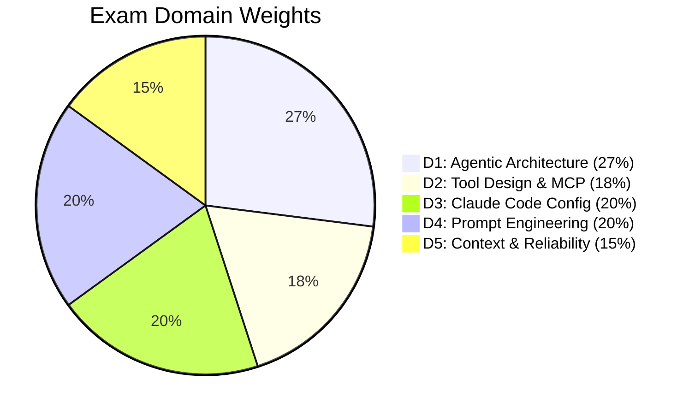

---

## 📘 Topic 1.1: The Agentic Loop — The Foundation of Everything

### What Is It?

The agentic loop is the fundamental pattern that makes Claude "do things" rather than just "say things." Without it, Claude is just a chatbot. With it, Claude becomes an autonomous agent that can reason, act, and iterate.

### The Mental Model

Think of the agentic loop like a **chef in a kitchen**:
1. 📋 **Receive the order** (user request)
2. 🧠 **Decide what to do** (Claude thinks)
3. 🔪 **Take an action** (call a tool — chop vegetables, check the oven)
4. 👀 **Check the result** (did the food burn? is it ready?)
5. 🔄 **Decide next step** — either take another action or serve the dish

The loop continues until the meal is complete (`end_turn`) or something goes wrong.

### The Flow in Detail

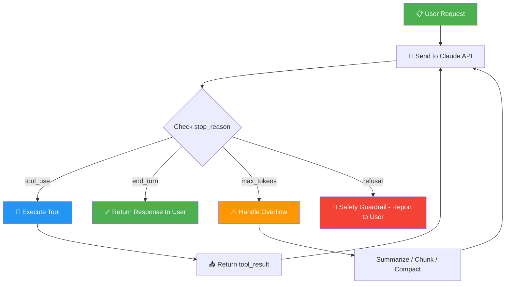

### The Four `stop_reason` Values — Know Them Cold

| `stop_reason` | What Happened | What You Do |
|---|---|---|
| `end_turn` | Claude finished its response naturally | Deliver the response to the user. The loop exits. |
| `tool_use` | Claude wants to call one or more tools | Execute the tool(s), send results back, **continue the loop** |
| `max_tokens` | The response hit the maximum output token limit | **Handle gracefully** — do NOT just "increase max_tokens." Use progressive summarization, chunk the work, or `/compact` |
| `refusal` | Claude's safety guidelines prevented a response | Report to the user; do not retry the same request |

### 🧱 Stop Reason Actions — Quick Reference Box

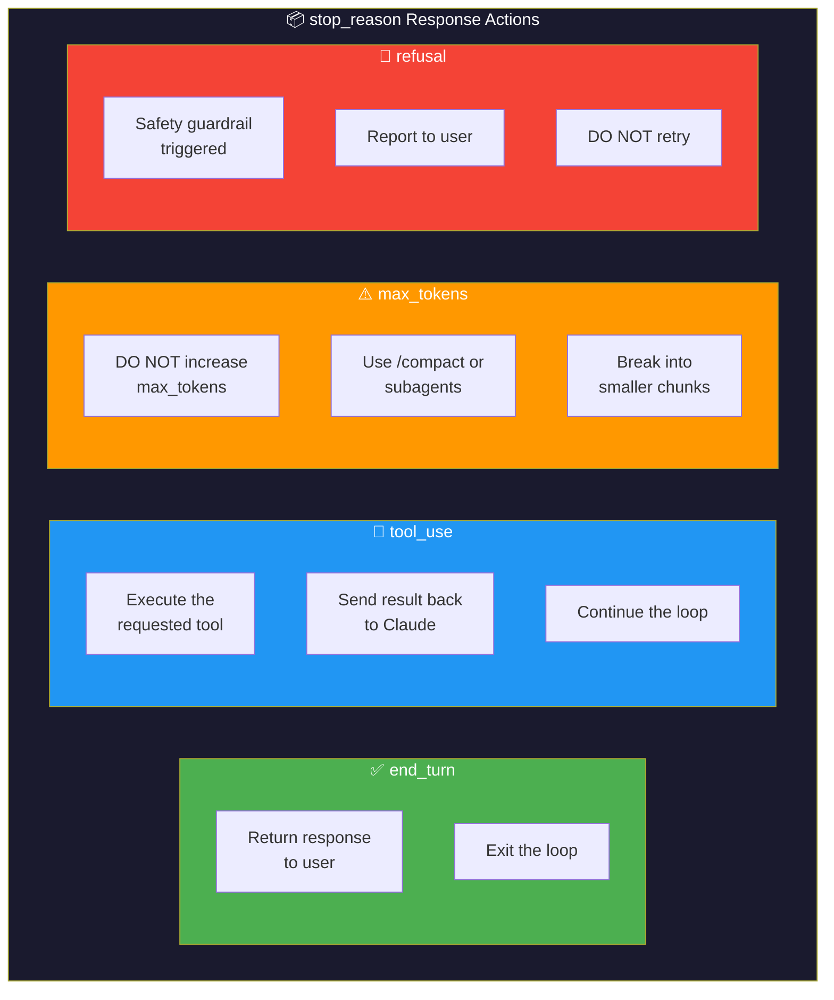

### ⚠️ Critical Exam Trap: `max_tokens`

**Wrong answer that sounds right:** "Increase the max_tokens parameter."

**Why it's wrong:** `max_tokens` controls the **output length**, not the context window size. If Claude hits this, the solution is architectural:
- Use `/compact` to summarize conversation history
- Break the task into smaller chunks
- Delegate to subagents
- Use progressive summarization

This is one of the most commonly tested traps.

### Real-World Example: An Order Processing Agent

```python
# Pseudocode — The Agentic Loop
def run_agent(user_request):
    messages = [{"role": "user", "content": user_request}]
    
    while True:
        response = claude.messages.create(
            model="claude-sonnet-4-20250514",
            messages=messages,
            tools=available_tools
        )
        
        if response.stop_reason == "end_turn":
            # Claude is done — return the final response
            return response.content
        
        elif response.stop_reason == "tool_use":
            # Claude wants to call a tool
            for tool_call in response.tool_use_blocks:
                result = execute_tool(tool_call.name, tool_call.input)
                messages.append({
                    "role": "tool",
                    "tool_use_id": tool_call.id,
                    "content": result
                })
            # Continue the loop — Claude will decide what to do next
        
        elif response.stop_reason == "max_tokens":
            # Handle gracefully — summarize, don't just increase limit
            messages.append(create_summary_request())
        
        elif response.stop_reason == "refusal":
            # Safety guardrail — report to user
            return "Unable to process this request due to safety guidelines."
```

### 🎯 Key Takeaway

The agentic loop is an **infinite loop with exit conditions**. Claude is in the driver's seat — it decides when to use tools, when to stop, and what to do with errors. Your job as the architect is to:
1. Provide the right tools
2. Handle each `stop_reason` correctly
3. Never silently ignore `max_tokens` or `refusal`

### 🔄 Agentic Loop — State Diagram

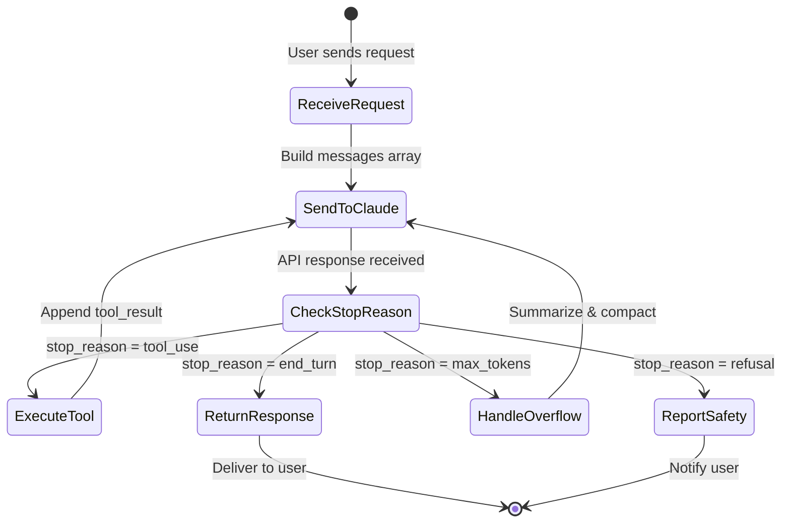

---

## 📘 Topic 1.2: Claude Agent SDK Core Concepts

### `query()` vs `ClaudeSDKClient`

| Feature | `query()` | `ClaudeSDKClient` |
|---|---|---|
| Session model | **One-shot** — new session per call | **Persistent** — maintains conversation |
| Context | Fresh context each time | Continuous context preservation |
| Use case | Simple, stateless tasks | Complex, multi-turn workflows |
| Tools | Passed per call | Configured once, used across session |

### Built-in Tools

Claude Code comes with powerful built-in tools. Know what each does:

| Tool | Purpose | When to Use |
|---|---|---|
| `Read` | Read file contents | Viewing code, configs, logs |
| `Write` | Create/overwrite entire files | New files, complete rewrites |
| `Edit` | Modify specific parts of a file | Targeted changes (safer than Write) |
| `Bash` | Execute shell commands | Running tests, builds, scripts |
| `Grep` | Search file **contents** by pattern | "Find all files containing X" |
| `Glob` | Search file **names** by pattern | "Find all .tsx files in src/" |
| `WebSearch` | Search the web | External docs, package info |

### Exam Trap: `Grep` vs `Glob`

- **Grep** = search inside files (by content)
- **Glob** = search file names/paths (by pattern)

When the question asks "find files containing a specific API endpoint," the answer is **Grep**, not Glob.

### Tool Control: `allowedTools` / `disallowedTools`

You can restrict which tools an agent can access:
- **`allowedTools`**: Whitelist — only these tools are available
- **`disallowedTools`**: Blacklist — everything EXCEPT these

**Principle of least privilege**: Give agents only the tools they need. A research agent doesn't need `Write`. A code review agent doesn't need `Bash`.

---

## 📘 Topic 1.3: Multi-Agent Orchestration Patterns

### Why Multi-Agent?

A single agent with 20 tools and a massive context window becomes:
- **Confused** — too many tools to choose from
- **Forgetful** — important context gets lost in the middle
- **Risky** — one mistake affects everything

Multi-agent architectures solve this by dividing responsibility.

### The Four Patterns You Must Know

#### 1. Hub-and-Spoke (Coordinator-Subagent)

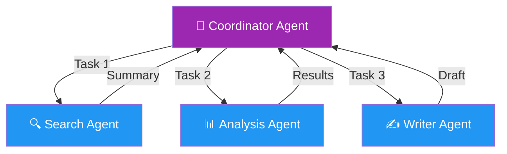

**When?** Multiple independent subtasks that need combining.

**Real-world analogy:** A project manager assigns tasks to team members. Each member works independently and reports back with a summary, not their entire day's notes.

#### 2. Evaluator-Optimizer

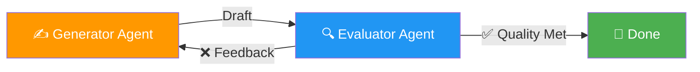

**When?** Quality matters more than speed. Code review, writing, design.

**Real-world analogy:** An author writes a draft, gives it to an editor. The editor sends back feedback, the author revises. They loop until the editor approves.

#### 3. Pipeline (Sequential)

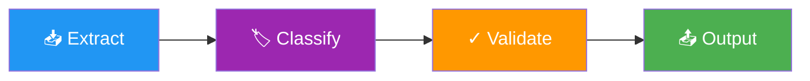

**When?** Each step depends on the previous step's output.

**Real-world analogy:** An assembly line — each station adds something specific, and the product flows forward.

#### 4. Parallel Fan-Out

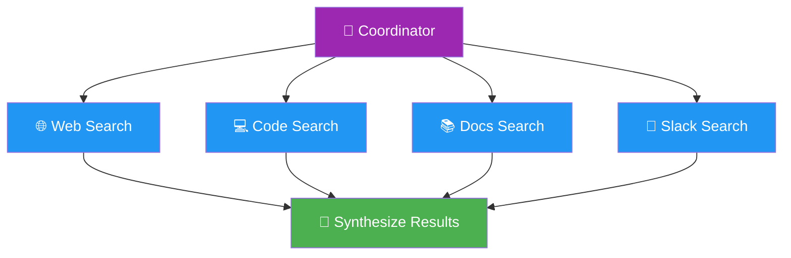

**When?** Independent research tasks that can run simultaneously.

**Real-world analogy:** A detective sending officers to interview different witnesses at the same time.

### 📊 Pattern Selection — Quadrant Chart

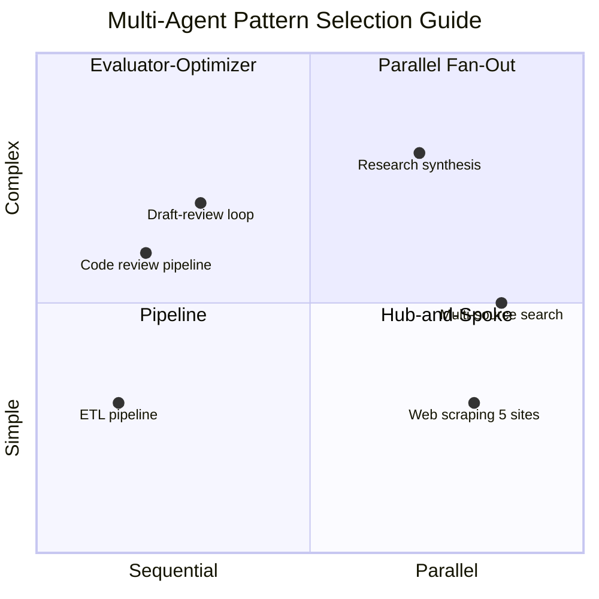

### 🗺️ Visual Guide: Choosing the Right Pattern

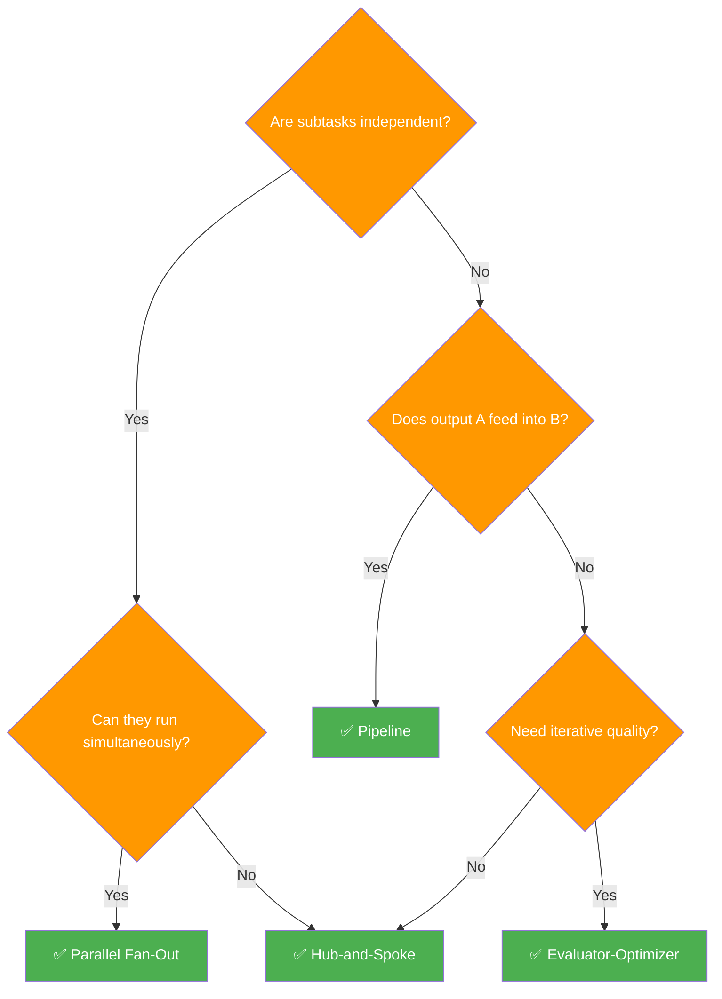

### The 5 Golden Rules of Multi-Agent Architecture

These rules are **heavily tested**. Know them by heart.

| # | Rule | Why |
|---|---|---|
| 1 | **Context isolation** — each subagent has its OWN context window | Prevents one agent's noise from confusing another |
| 2 | **Pass summaries, not histories** | Full histories waste context and introduce confusion |
| 3 | **Manifest files for crash recovery** | If a subagent crashes, the coordinator can resume from the last good state |
| 4 | **Subagents cannot share memory** | They communicate ONLY through the coordinator |
| 5 | **Limit tool count: 4-5 per agent** | More tools = more selection ambiguity = more errors |

### 🧱 5 Golden Rules — Layered Architecture View

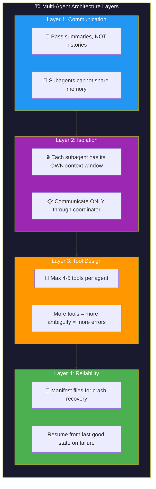

### ⚠️ Critical Exam Trap: Context Isolation

**Wrong answer that sounds right:** "Pass the entire conversation history to subagents for full context."

**Why it's wrong:** This defeats the entire purpose of subagents! It pollutes their context, wastes tokens, and reduces accuracy. Always pass **only what the subagent needs** — a focused summary or specific data points.

---

## 📘 Topic 1.4: Session Management

### Key Commands and Concepts

| Concept | What It Does | When to Use |
|---|---|---|
| `--resume` | Continue a previous session | Multi-day work, picking up where you left off |
| `fork_session` | Create a branch from current session | **Exploration** — try something without polluting the main session |
| Named sessions | Label sessions by feature/task | Organizing work (e.g., "auth-refactor", "bug-123") |
| `/compact` | Summarize context to free space | Session is getting long, Claude starts forgetting |

### The Session Strategy Decision Tree

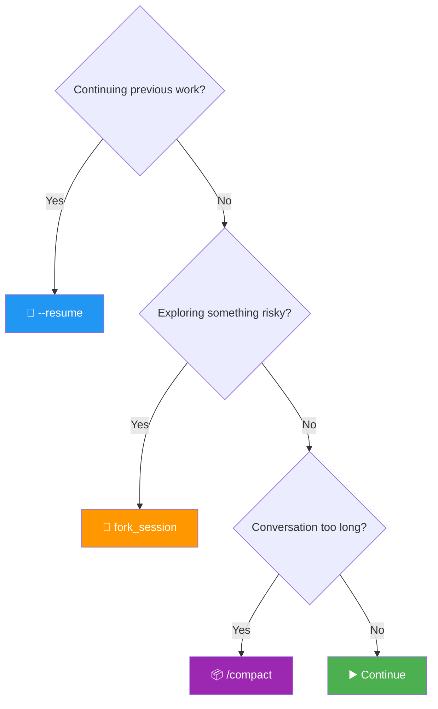

### 🗺️ Session Lifecycle Visual

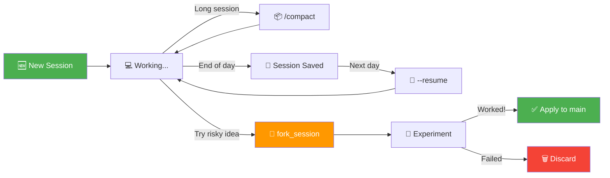

### Exam Trap: Session Strategy

**Wrong answer:** "Use a single continuous session for a multi-day project."

**Why:** Context windows overflow. Use `--resume` for continuity and `fork_session` for safe exploration.

---

## 📘 Topic 1.5: Spawning Subagents

### Defining Subagents

There are **three ways** to define subagents:

1. **Programmatically** — via `agents` parameter in `query()` options
2. **Markdown files** — `.claude/agents/` directory containing agent definitions
3. **Built-in `Agent` tool** — must be explicitly added to `allowedTools`

### Key Design Principles

- **Clear descriptions**: Subagents can't be selected correctly without clear descriptions
- **Focused scope**: Each subagent should have a specific purpose
- **Prevent infinite recursion**: Restrict what types of subagents they can spawn
- **Single session**: Subagents operate within a single session lifecycle

---

## 🧠 Think Like an Architect: Domain 1 Practice Scenarios

### Scenario: You're building a code review system for 500+ daily PRs.

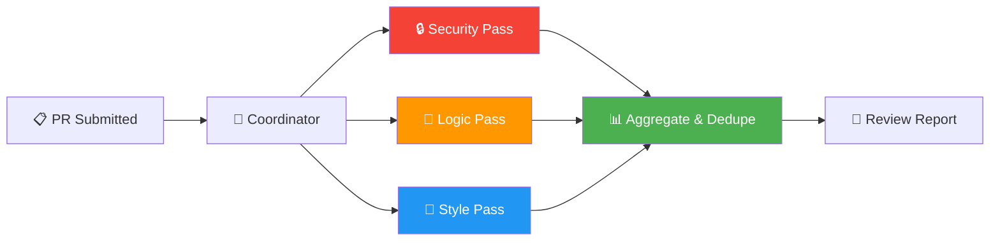

**Think through:**
1. Should you use a single agent or multi-agent? → Multi-agent (scale, focus)
2. What pattern? → Pipeline (Security → Logic → Style → Aggregate)
3. How many tools per agent? → 4-5 focused tools each
4. Context strategy? → Each reviewer gets only the relevant diff, not the full repo
5. Error handling? → If a review subagent crashes, manifest file lets coordinator continue with remaining reviews

### Scenario: An agent keeps "forgetting" instructions during a long session.

**Think through:**
1. Root cause? → Context window filling up, lost-in-the-middle effect
2. Solution? → Use `/compact` for progressive summarization
3. NOT the solution? → "Increase max_tokens" (that's output limit, not context)
4. Prevention? → Delegate deep tasks to subagents, keep coordinator context clean

---

## 📊 Visual Summary: Domain 1 at a Glance

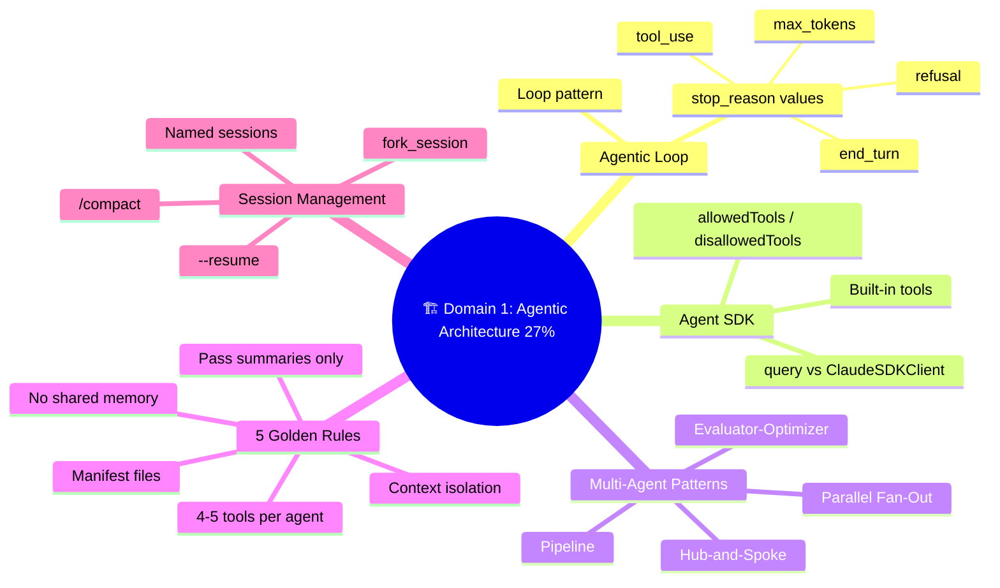

---

## 📝 Domain 1 Key Terms Glossary

| Term | Definition |
|---|---|
| **Agentic loop** | The core pattern: send to Claude → check stop_reason → act → loop |
| **stop_reason** | API field indicating why Claude stopped generating |
| **Hub-and-spoke** | Coordinator delegates to independent subagents |
| **Evaluator-optimizer** | One agent generates, another evaluates, loop until quality |
| **Pipeline** | Sequential chain where output A = input B |
| **Fan-out** | Parallel independent subagents |
| **Context isolation** | Each subagent has its own context window |
| **Manifest file** | State persistence for crash recovery |
| **Progressive summarization** | Compressing older context to free space |
| **fork_session** | Safe branching for exploration |
