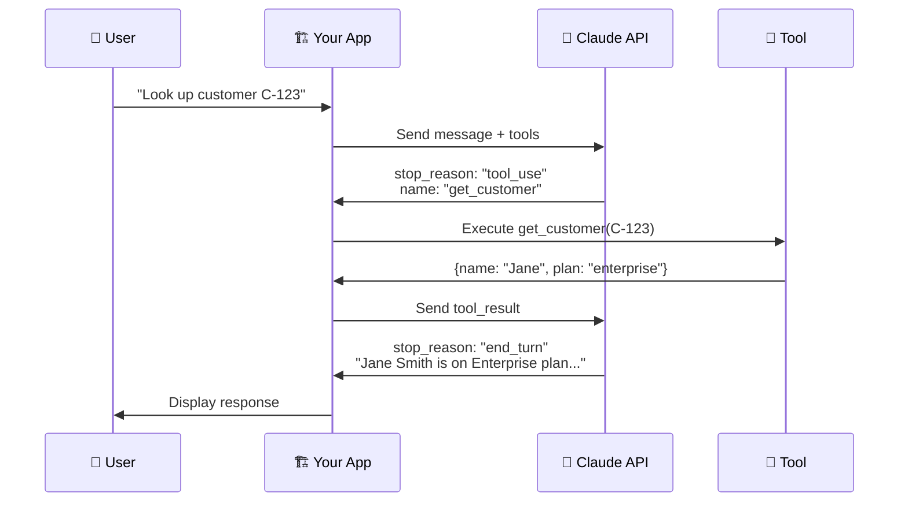
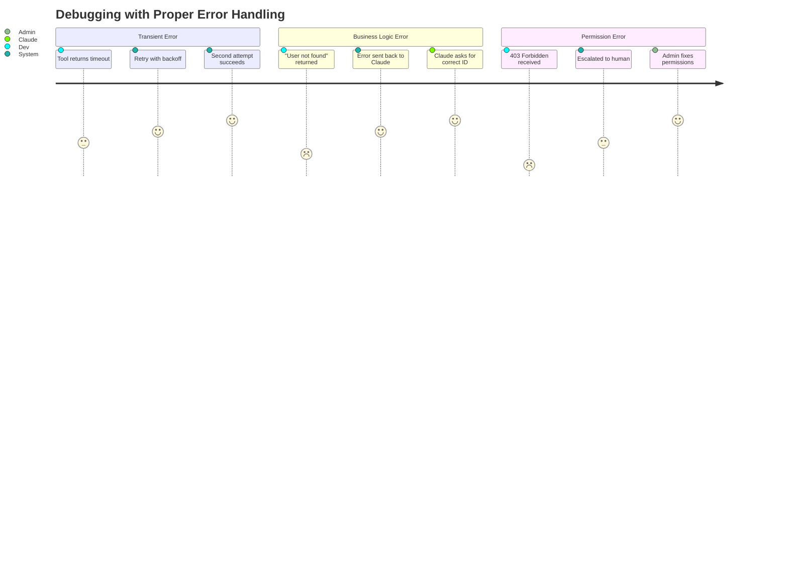
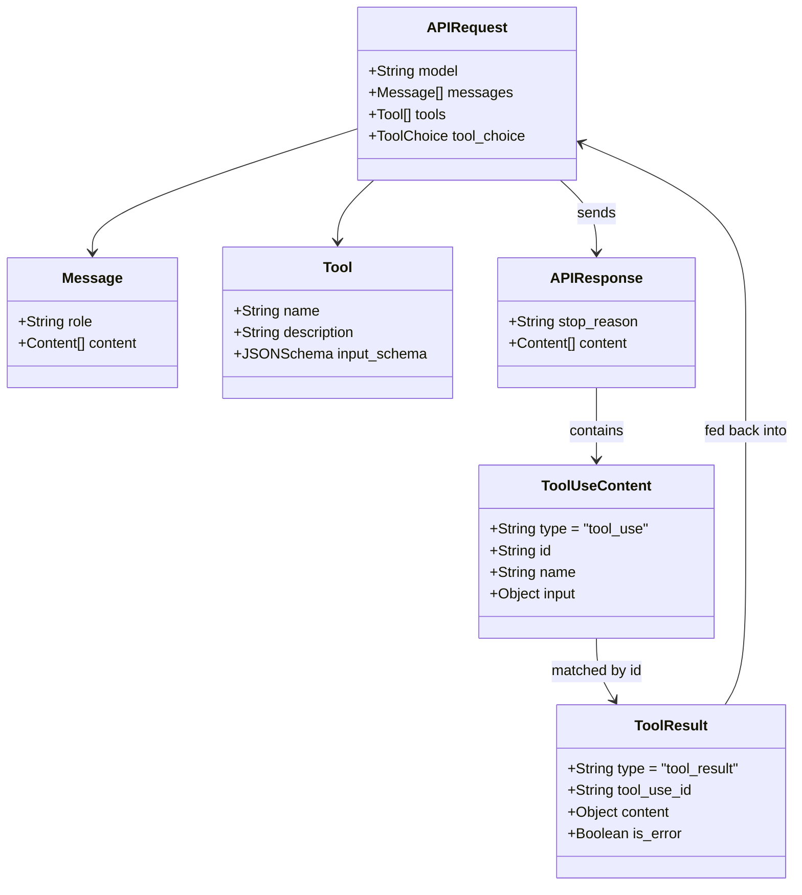
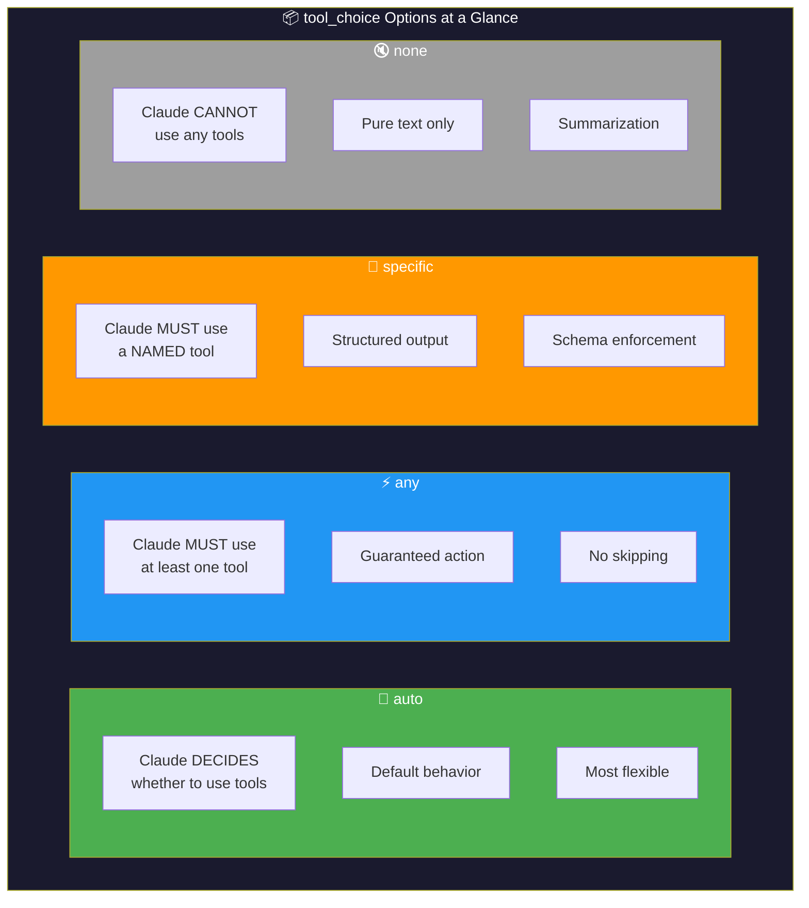
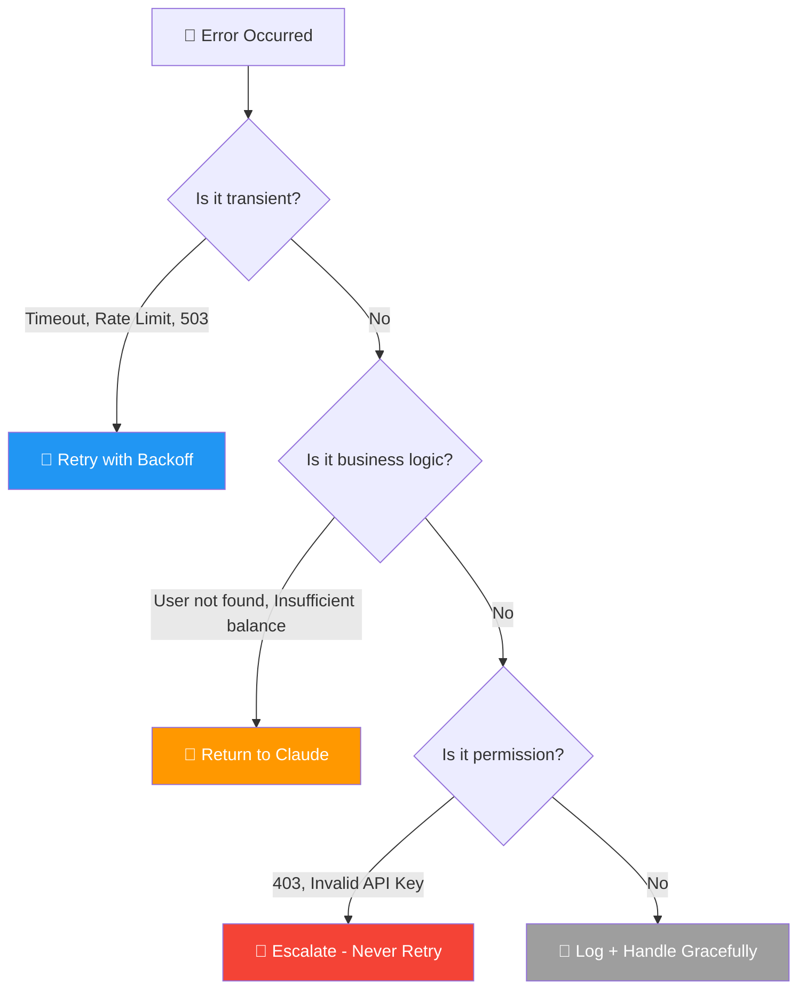
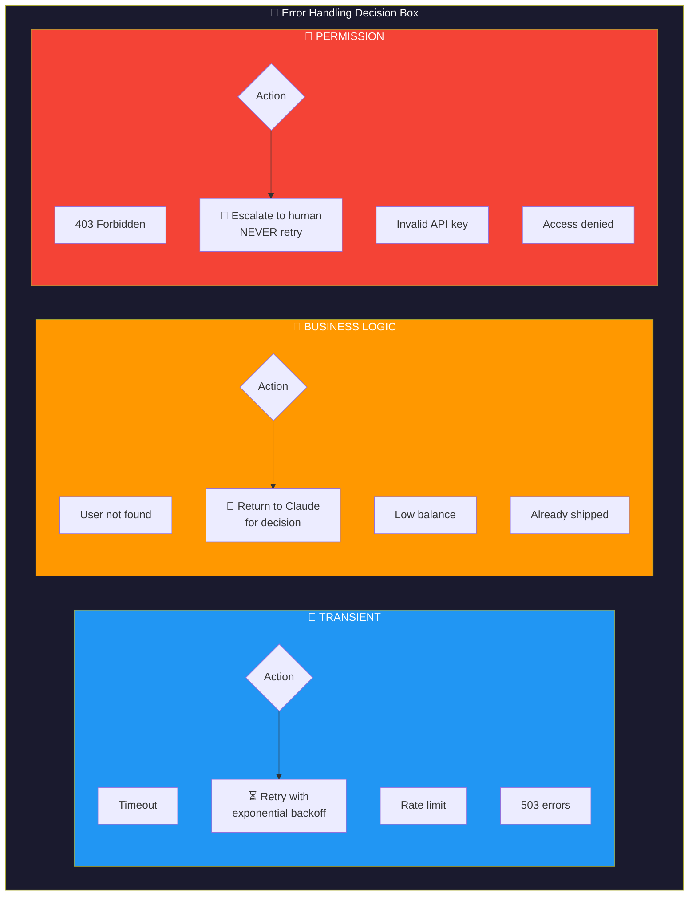
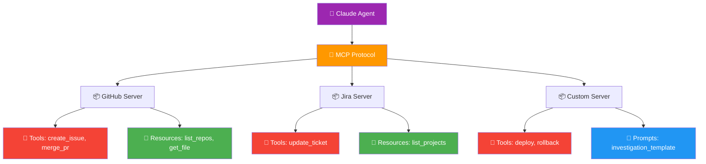
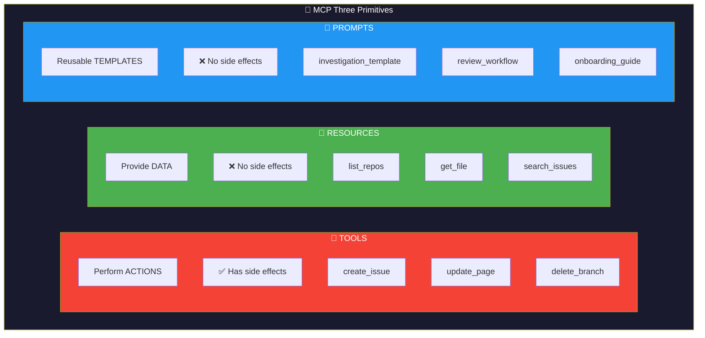
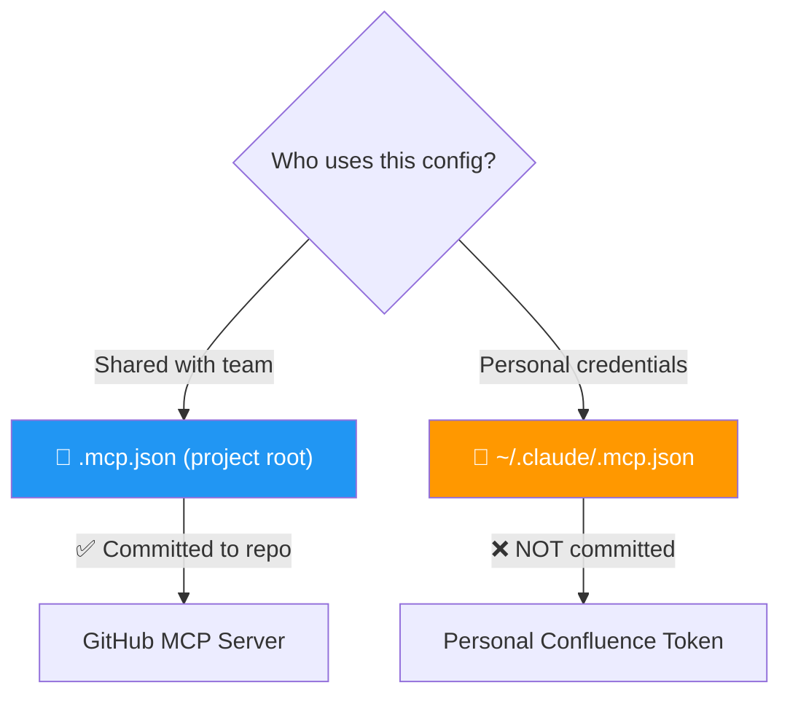
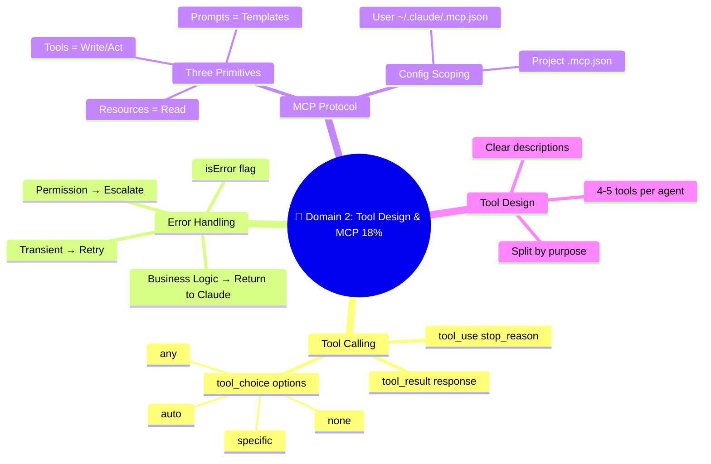

# 🔧 Domain 2: Tool Design & MCP Integration (18%)

> **~11 questions.** Focus on the tool_use flow, error handling categories, and the MCP three primitives.


---

## 📘 Topic 2.1: How Tool Calling Works

### The Flow — Step by Step



When Claude decides it needs to perform an action, it doesn't execute anything itself. Instead, it says "I want to use this tool with these inputs." Your code then executes the tool and returns the result.

**Think of it like a doctor ordering a blood test:**
1. 🩺 Doctor (Claude) decides: "I need blood test results"
2. 📋 Doctor writes an order (tool_use request with parameters)
3. 🔬 Lab technician (your code) runs the test
4. 📊 Lab returns results to the doctor
5. 🩺 Doctor interprets results and decides next step

### The API Response When Claude Wants a Tool

```json
{
  "stop_reason": "tool_use",
  "content": [
    {
      "type": "text",
      "text": "Let me look up that customer's information."
    },
    {
      "type": "tool_use",
      "id": "toolu_abc123",
      "name": "get_customer",
      "input": {
        "customer_id": "C-42789"
      }
    }
  ]
}
```

**Key fields:**
- `stop_reason: "tool_use"` — tells your loop to execute the tool
- `id: "toolu_abc123"` — unique ID to match results back
- `name` — which tool to call
- `input` — the parameters Claude chose

### Returning Tool Results

After executing the tool, send the result back:

```json
{
  "role": "user",
  "content": [
    {
      "type": "tool_result",
      "tool_use_id": "toolu_abc123",
      "content": {
        "customer_name": "Jane Smith",
        "account_status": "active",
        "plan": "enterprise"
      }
    }
  ]
}
```

Claude then processes this result and either calls another tool or provides a final response.

### 👤 Error Handling — Developer Journey



---

## 📘 Topic 2.2: `tool_choice` — Controlling Tool Selection

### 🏗️ Tool Call API Structure



The `tool_choice` parameter lets you control HOW Claude uses tools.

| Option | Claude's Behavior | When to Use | Example |
|---|---|---|---|
| `"auto"` | Claude **decides** whether to use tools | **Default** — most flexible. Let Claude reason about whether tools are needed | General-purpose agents |
| `"any"` | Claude **must** use at least one tool | When you need **guaranteed action** — don't let Claude skip tool use | "Always search before answering" |
| `{"type":"tool","name":"X"}` | Claude **must** use a **specific** tool | **Structured output extraction** — force a schema | Data extraction pipelines |
| `"none"` | Claude **cannot** use any tools | When you need **pure text** response | Summarization, explanation |

### 🧱 tool_choice — Side-by-Side Comparison



### When to Use Each — Decision Tree

```
Do I want structured JSON output?
├── Yes → Force specific tool: {"type":"tool","name":"extract_X"}
└── No → Should Claude always take an action?
    ├── Yes → "any" (must use some tool)
    └── No → Should tools be available?
        ├── Yes → "auto" (Claude decides)
        └── No → "none" (text only)
```

### ⚠️ Key Exam Insight

Forcing a specific tool with `{"type":"tool","name":"X"}` is the **primary technique for getting structured output** from Claude. You define a "tool" that describes your output schema, then force Claude to "call" it, which returns data matching your schema.

---

## 📘 Topic 2.3: Error Handling — The Decision Rule

Error handling is heavily tested. You must know the **three categories** and the **correct action** for each.

### The Three Error Categories



| Category | What It Means | Examples | Correct Action |
|---|---|---|---|
| 🔄 **Transient** | Temporary failure, will likely succeed if retried | Network timeout, API rate limit, 503 errors, connection reset | **Retry with exponential backoff** |
| 🧠 **Business Logic** | The operation worked, but the data doesn't exist or the rules prevent it | "User not found", "Insufficient balance", "Order already shipped" | **Return to Claude** for intelligent decision-making |
| 🚫 **Permission** | Access is denied at a fundamental level | "403 Forbidden", "API key invalid", "Insufficient permissions" | **Escalate** — never retry, never ignore |

### 🧱 Error Categories — Component View



### Why This Matters

**The exam loves to test business logic errors.** The trap is:

❌ **Wrong:** "Retry 3 times with backoff" for "User not found"
✅ **Right:** "Return the error to Claude so it can ask the user for correct info"

**Why retrying is wrong:** A "User not found" error will return the same result every time. Retrying wastes resources and time. Claude needs to know about this error to change its approach.

### Signaling Errors to Claude

Use `isError: true` in tool results to tell Claude something went wrong:

```json
{
  "type": "tool_result",
  "tool_use_id": "toolu_abc123",
  "is_error": true,
  "content": {
    "error_type": "business_logic",
    "error_code": "USER_NOT_FOUND",
    "message": "No customer found with ID C-99999",
    "retryable": false,
    "suggestion": "Verify the customer ID or search by email instead"
  }
}
```

**Best practices:**
- ✅ Use structured error objects (type, code, message, retryable)
- ✅ Include `isError: true` flag
- ✅ Suggest alternative approaches
- ❌ Don't return just a string like `"Error: something went wrong"`

---

## 📘 Topic 2.4: Writing Effective Tool Descriptions

Tool descriptions are the **single most important factor** in whether Claude uses tools correctly.

### Good vs Bad Tool Descriptions

❌ **Bad:**
```json
{
  "name": "search",
  "description": "Search for stuff"
}
```

✅ **Good:**
```json
{
  "name": "search_codebase",
  "description": "Search the project codebase for files containing a specific text pattern. Returns matching file paths and line numbers. Use this when looking for implementations, function definitions, or specific strings in source code. Do NOT use this for searching documentation (use search_docs instead) or web content (use web_search instead)."
}
```

### The Four Rules of Tool Descriptions

1. **What it does** — specific action, not vague
2. **When to use it** — positive guidance
3. **When NOT to use it** — prevents confusion with similar tools
4. **What it returns** — so Claude knows what to expect

### Splitting vs Consolidating Tools

| Split When... | Consolidate When... |
|---|---|
| Tools serve different purposes | Operations are always done together |
| Different permission levels | Splitting would add complexity with no benefit |
| High ambiguity between tools | It's a single atomic operation |
| Actions have different risk levels | |

### ⚠️ Key Rule: 4-5 Tools Per Agent Maximum

More tools = more confusion. If you need 15 tools, use subagents with 4-5 tools each.

---

## 📘 Topic 2.5: Model Context Protocol (MCP)

### What is MCP?



MCP (Model Context Protocol) is a standard for connecting AI agents to external tools and data sources. Think of it as a **universal adapter** — instead of building custom integrations for every service, you build MCP servers that follow a standard protocol.

### The Three MCP Primitives

This is a critical distinction tested on the exam:

| Primitive | Does What | Side Effects? | Real-World Analogy |
|---|---|---|---|
| **Tools** | Perform actions | ✅ Yes (mutations) | A **power drill** — it changes things |
| **Resources** | Provide data | ❌ No (read-only) | A **bookshelf** — you browse and read |
| **Prompts** | Reusable templates | ❌ No | A **recipe card** — structured pattern |

### 🧱 MCP Three Primitives — Component View



### 🎯 The Golden Rule

> **Resources = Read. Tools = Write/Act.**

This is the decision rule for exam questions:

```
Does it modify, create, or delete anything?
├── Yes → It's a TOOL
└── No → Does it provide data for browsing?
    ├── Yes → It's a RESOURCE
    └── No → It's a PROMPT (reusable template)
```

### Concrete Examples

| Action | MCP Primitive | Why |
|---|---|---|
| `list_repositories` | **Resource** | Read-only browsing |
| `get_page_content` | **Resource** | Reading data |
| `search_issues` | **Resource** | Querying/browsing (no mutation) |
| `create_issue` | **Tool** | Creates something new (mutation) |
| `update_page` | **Tool** | Modifies existing data |
| `delete_branch` | **Tool** | Destructive action |
| "Investigation workflow" | **Prompt** | Reusable interaction pattern |

### MCP Configuration Scoping



| Scope | File Location | What Goes Here | Committed to Repo? |
|---|---|---|---|
| **Project** | `.mcp.json` (repo root) | Shared team tools (e.g., GitHub MCP) | ✅ Yes |
| **User** | `~/.claude/.mcp.json` | Personal credentials/tools | ❌ No |

### ⚠️ Exam Trap: Configuration Scope

**Question pattern:** "Where should X be configured?"

**Decision rule:**
- **Shared with the team?** → Project `.mcp.json`
- **Personal credentials?** → User `~/.claude/.mcp.json`
- **Never mix them** — don't put personal API keys in project config

**Example:**
- GitHub MCP server (shared) → `.mcp.json` (project)
- Personal Confluence token → `~/.claude/.mcp.json` (user)

### MCP Server Configuration Example

```json
{
  "mcpServers": {
    "github": {
      "command": "mcp-server-github",
      "args": [],
      "env": {
        "GITHUB_TOKEN": "${GITHUB_TOKEN}"
      }
    },
    "jira": {
      "command": "mcp-server-jira",
      "args": ["--project", "TEAM"],
      "env": {
        "JIRA_API_KEY": "${JIRA_API_KEY}"
      }
    }
  }
}
```

**Key features:**
- `${VAR_NAME}` syntax for environment variable expansion
- Can connect to **multiple MCP servers** simultaneously
- Better descriptions → better tool adoption

---

## 📊 Visual Summary: Domain 2 at a Glance



---

## 📘 Topic 2.6: Tool Design for Large Result Sets

When a tool returns too many results (e.g., 500+ search matches), don't just dump everything:

| Approach | Quality |
|---|---|
| ❌ Return all 500+ results | Wastes context, overwhelms Claude |
| ❌ Silent truncation to first 10 | Hides information, potentially misleading |
| ❌ Return a bare error "too many results" | Unhelpful |
| ✅ Return: result count + top 10 ranked + suggested refinement queries | Informative and actionable |

---

## 🧠 Think Like an Architect: Domain 2 Scenarios

### Scenario: You have `search_issues` for both Jira and GitHub. Claude keeps using the wrong one.

**Think through:**
1. Are the descriptions clear enough? → Probably not. Add detailed descriptions differentiating scope, capabilities, and return formats.
2. Should you rename them? → No — `search_items_1` is worse. Use descriptive names + detailed descriptions.
3. Should you merge them? → No — they search different platforms with different capabilities.

### Scenario: Your tool returns "Access denied" for a database query.

**Think through:**
1. Error category? → Permission error
2. Action? → **Escalate**. Never retry permission errors.
3. Why not retry? → The permission won't magically change. This needs human intervention.

---

## 📝 Domain 2 Key Terms Glossary

| Term | Definition |
|---|---|
| **tool_use** | stop_reason indicating Claude wants to call a tool |
| **tool_result** | Your response after executing a tool |
| **tool_choice** | Parameter controlling how Claude selects tools (auto/any/specific/none) |
| **isError** | Flag in tool results signaling failure |
| **MCP** | Model Context Protocol — standard for agent-tool integration |
| **Resources** | MCP primitive for read-only data |
| **Tools** | MCP primitive for actions with side effects |
| **Prompts** | MCP primitive for reusable templates |
| **Project scope** | `.mcp.json` — shared, committed to repo |
| **User scope** | `~/.claude/.mcp.json` — personal, not committed |
