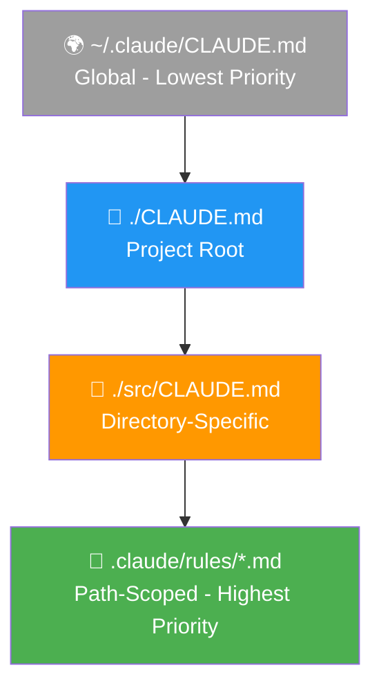
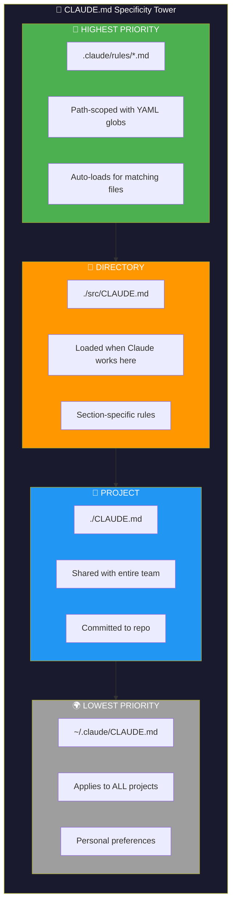
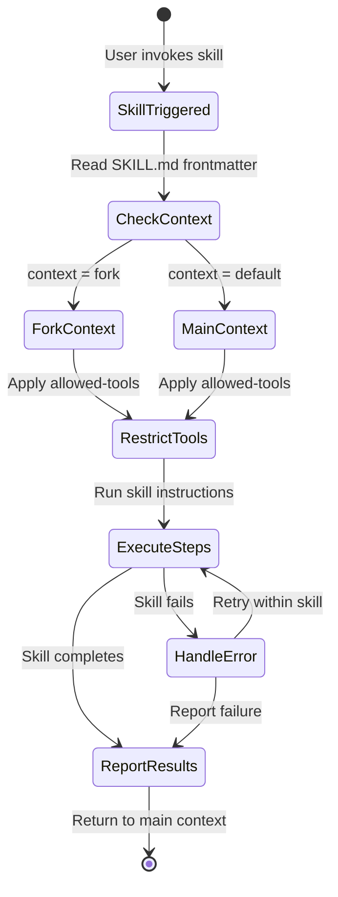
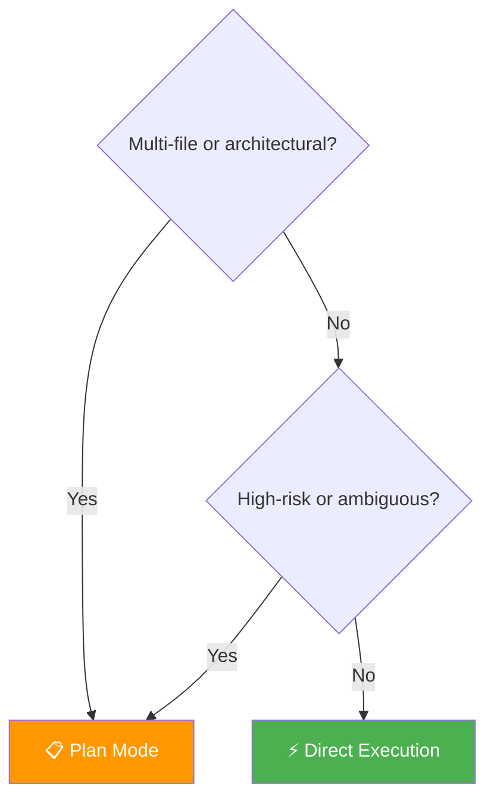
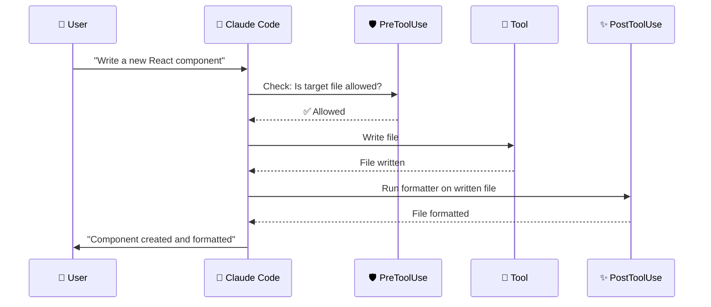
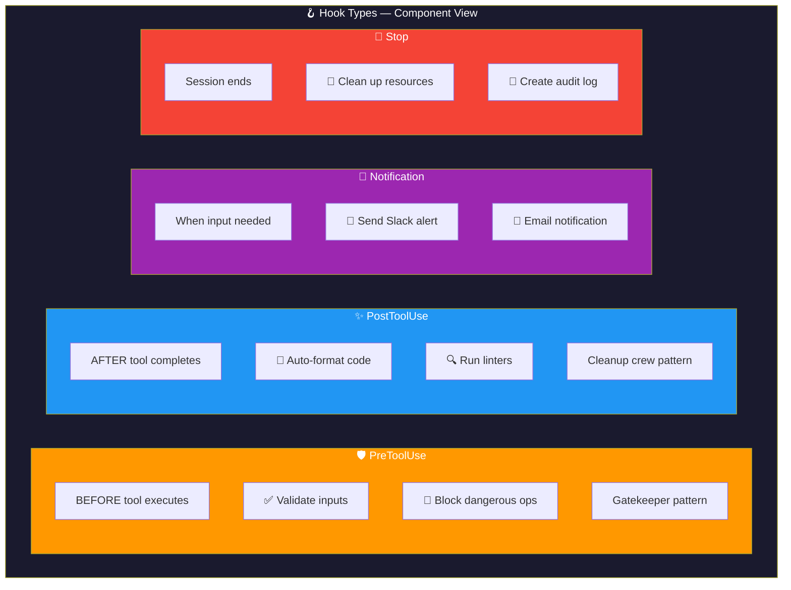
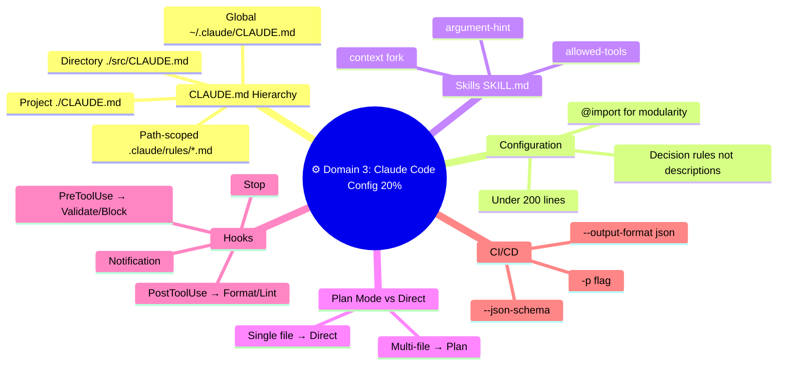

# ⚙️ Domain 3: Claude Code Configuration & Workflows (20%)

> **~12 questions.** Focus on the CLAUDE.md hierarchy, path-scoped rules, hooks, and CI/CD integration patterns.

---

## 📘 Topic 3.1: CLAUDE.md Configuration Hierarchy

### The Hierarchy — Specificity Wins

CLAUDE.md files form a hierarchy where **more specific rules override broader ones**:



> ⬆️ **Specificity increases downward.** More specific rules override broader ones.

```
~/.claude/CLAUDE.md              ← Layer 1: GLOBAL (lowest priority)
                                    Applies to ALL projects on your machine
                                    
./CLAUDE.md                       ← Layer 2: PROJECT ROOT
                                    Applies to this entire project
                                    
./src/CLAUDE.md                  ← Layer 3: DIRECTORY-SPECIFIC
                                    Loaded on-demand when Claude works in this dir
                                    
.claude/rules/*.md               ← Layer 4: PATH-SCOPED RULES (highest priority)
                                    Uses YAML frontmatter with glob patterns
                                    Auto-loads when editing matching files
```

### Mental Model: CSS Specificity

Think of it like CSS — more specific selectors win:

| CSS Equivalent | CLAUDE.md Equivalent | Applies To |
|---|---|---|
| `* { }` | `~/.claude/CLAUDE.md` | Everything |
| `.app { }` | `./CLAUDE.md` | This project |
| `.app .sidebar { }` | `./src/CLAUDE.md` | This directory |
| `#specific-element { }` | `.claude/rules/*.md` with globs | Specific file patterns |

### Best Practices for CLAUDE.md

| ✅ Do | ❌ Don't |
|---|---|
| Keep under **200 lines** | Write a 500-line instructions manual |
| Focus on **decision rules** | List every folder and what it contains |
| Reference existing files | Embed long code snippets |
| Use `@import` for modularity | Dump everything in one file |
| Use path-scoped rules for targeted config | Put everything in global CLAUDE.md |

### 🧱 Configuration Specificity Tower



### The `/init` Command

Running `/init` in Claude Code generates a starter `CLAUDE.md` for your project, analyzing the repo structure and conventions.

---

## 📘 Topic 3.2: Path-Scoped Rules (`.claude/rules/`)

### What Are They?

Path-scoped rules are markdown files in `.claude/rules/` with YAML frontmatter that specifies which files they apply to. They **auto-load** when Claude works on matching paths.

### Format

```yaml
# .claude/rules/frontend.md
---
globs: ["src/components/**/*.tsx", "src/pages/**/*.tsx"]
---
- Use React functional components only
- TypeScript strict mode required
- All components must have unit tests
- Use CSS modules, not inline styles
```

```yaml
# .claude/rules/payments.md
---
globs: ["payments/**"]
---
- PCI compliance is mandatory
- Never log credit card numbers
- All payment mutations require audit trail
- Use parameterized queries only (no string interpolation)
```

### Why Path-Scoped Rules > Global CLAUDE.md

| Feature | Global CLAUDE.md | Path-Scoped Rules |
|---|---|---|
| **Context efficiency** | Always loaded, wastes tokens | Loaded only when relevant |
| **Maintainability** | One massive file for everything | Organized by concern |
| **Specificity** | No targeting capability | Glob patterns for precise targeting |
| **Scalability** | Grows unmanageable in large projects | Add rules per component/area |

### ⚠️ Exam Trap

**Wrong:** "Put all rules in global CLAUDE.md"
**Right:** Use `.claude/rules/` with glob patterns for targeted, maintainable config

---

## 📘 Topic 3.3: Custom Skills (SKILL.md)

### What Are Skills?

Skills extend Claude Code with prompt-based capabilities. They live in `.claude/skills/` directories.

### SKILL.md Frontmatter Options

| Option | Purpose | Example |
|---|---|---|
| `context: fork` | Run skill in an **isolated subagent context** | Database migrations (safety) |
| `allowed-tools` | **Restrict tools** the skill can use | `[Bash, Read]` — no Write access |
| `argument-hint` | Describe what input the skill expects | "Provide the migration file path" |

### When to Use `context: fork`

Use it when the skill:
- Has risky operations (DB migrations, deployments)
- Needs isolation from the main conversation
- Could produce side effects you want contained

### Example: Database Migration Skill

```yaml
# .claude/skills/db-migrate/SKILL.md
---
context: fork
allowed-tools: [Bash, Read]
argument-hint: "Provide the migration name or 'latest'"
---

## Instructions
1. Read the current migration status with `migration:status`
2. Validate the migration file exists
3. Run the migration in a transaction
4. Verify the migration succeeded
5. Report results back to the user
```

The `context: fork` isolates this work. `allowed-tools: [Bash, Read]` ensures the skill can only run commands and read files — it cannot Write or Edit directly.

### 🔄 Skill Execution — State Diagram



---

## 📘 Topic 3.4: Plan Mode vs Direct Execution

### The Decision Framework



### Detailed Comparison

| Criteria | Plan Mode | Direct Execution |
|---|---|---|
| **Scope** | Multi-file changes | Single-file edits |
| **Risk** | Architectural decisions, breaking changes | Bug fixes, small improvements |
| **Clarity** | Multiple possible approaches | Clear, unambiguous task |
| **Approval** | Needs user review first | Low-risk, auto-executable |
| **Toggle** | `/plan` command | Default mode |

### Example Scenarios

| Task | Mode | Why |
|---|---|---|
| "Rename a utility function across 47 files" | **Plan** | Large blast radius, needs dependency mapping |
| "Fix the typo on line 42" | **Direct** | Single, clear, low-risk change |
| "Refactor the auth module to use JWT" | **Plan** | Architectural, multiple approaches possible |
| "Add a console.log for debugging" | **Direct** | Trivial, reversible |
| "Add PCI compliance to payment processing" | **Plan** | High-risk, compliance-critical |

---

## 📘 Topic 3.5: Key CLI Flags for Automation

### The Big Four

| Flag | Purpose | Critical For |
|---|---|---|
| `-p` / `--print` | **Non-interactive mode** | CI/CD pipelines, scripts |
| `--output-format json` | **Machine-readable output** | Parsing Claude's results programmatically |
| `--json-schema` | **Validate output structure** | Ensuring CI output matches expected format |
| `--resume` | **Continue previous session** | Multi-day work, session continuity |

### CI/CD Integration Pattern

```yaml
# GitHub Actions Example
name: Claude PR Review
on: [pull_request]

jobs:
  review:
    runs-on: ubuntu-latest
    steps:
      - uses: actions/checkout@v4
      - name: Review PR
        run: claude -p --output-format json "Review this PR for security issues"
```

**Key principles:**
1. `-p` for non-interactive (CI environments have no human at the keyboard)
2. `--output-format json` for parsing results
3. `--json-schema` for validating the output structure

### ⚠️ Exam Trap

**Wrong:** `claude "Review this PR" --interactive --output json`
**Right:** `claude -p --output-format json "Review this PR for security issues"`

The exam tests whether you know the correct flags for headless/CI use.

---

## 📘 Topic 3.6: Hooks — Workflow Enforcement

### What Are Hooks?

Hooks are automated actions that trigger at specific points in Claude's workflow. They enforce rules and automate repetitive tasks.

### The Four Hook Types



| Hook Type | When It Fires | Use Cases |
|---|---|---|
| **PreToolUse** | **Before** a tool executes | Block dangerous commands, validate inputs |
| **PostToolUse** | **After** a tool completes | Auto-format code, run linters |
| **Notification** | When Claude needs user input | Send Slack/email notification |
| **Stop** | When a session ends | Clean up resources, create audit log |

### 🧱 Hook Types — When They Fire



### ⚠️ Critical Exam Trap: Pre vs Post

**"Auto-format code after Claude writes to a file"**
→ **PostToolUse** on `Write` (after the file is written, run the formatter)

**"Block Claude from modifying security-critical files"**
→ **PreToolUse** on `Write` (before the write happens, check if the target is security-critical)

**"Validate parameters before executing a database query"**
→ **PreToolUse** on the database tool

**Mnemonic:**
- **Pre** = Gatekeeper (validate/block BEFORE)
- **Post** = Cleanup crew (format/log AFTER)

---

## 📘 Topic 3.7: Key Claude Code Commands

| Command | What It Does | When to Use |
|---|---|---|
| `/plan` | Enter plan mode | Complex, multi-file tasks |
| `/compact` | Summarize context | Session getting long, Claude forgetting things |
| `/memory` | Manage persistent facts | Save important info across sessions |
| `/clear` | Clear conversation history | Fresh start needed |
| `/diff` | Review pending changes | Before committing, verify what changed |
| `/model` | Switch Claude model | Different task = different model (speed vs quality) |
| `/cost` | Track token consumption | Budget monitoring |
| `/rewind` | Undo recent changes | Something went wrong |
| `/btw` | Side question | Quick question without derailing main task |

---

## 📘 Topic 3.8: CI/CD Pipeline Design with Claude

### Multi-Stage CI Pipeline

For a CI pipeline with multiple review stages:


**Key design principle:** Each stage runs **independently** with `-p`, passing structured JSON output as input to the next stage.

### 📅 CI/CD Pipeline — Gantt Chart View

```mermaid
gantt
    title Claude CI/CD Pipeline Execution
    dateFormat HH:mm
    axisFormat %H:%M

    section PR Submitted
        Checkout code          :a1, 00:00, 1min

    section Stage 1 - Security
        Security audit (claude -p)   :a2, after a1, 3min
        Parse JSON results           :a3, after a2, 1min

    section Stage 2 - Code Review
        Code review (claude -p)      :a4, after a3, 4min
        Parse JSON results           :a5, after a4, 1min

    section Stage 3 - Tests
        Test generation (claude -p)  :a6, after a5, 3min
        Run generated tests          :a7, after a6, 2min

    section Report
        Aggregate results            :a8, after a7, 1min
        Post PR comment              :a9, after a8, 1min
```



**NOT:** Using `--resume` between CI stages (fragile, not designed for CI pipelines).

### CI Cost Optimization

For high-volume CI (200+ PRs/day):
1. **Batch non-urgent reviews** (docs PRs) via Message Batches API (50% cheaper)
2. **Keep security reviews real-time** (urgency matters)
3. **Pass only changed files**, not the entire repo (reduces tokens)
4. Combined: **D — Both B and C** save the most

---

## 🧠 Think Like an Architect: Domain 3 Scenarios

### Scenario: Your monorepo has strict PCI rules for payments/ but relaxed rules for internal-tools/.

**Answer:** Create path-scoped rules:
- `.claude/rules/payments.md` with `globs: ["payments/**"]`
- `.claude/rules/internal.md` with `globs: ["internal-tools/**"]`

**Not:** A single CLAUDE.md with conditional comments (messy, not how it works).

### Scenario: Claude Code in CI/CD auto-fixes linting issues, but a developer pushes security-violating code.

**Answer:** Use a `PreToolUse` hook to block modifications to security-critical files and flag for human review.

**Not:** Let Claude auto-fix silently (dangerous for security), or add to global CLAUDE.md (too broad).

---

## 📊 Visual Summary: Domain 3 at a Glance



---

## 📝 Domain 3 Key Terms Glossary

| Term | Definition |
|---|---|
| **CLAUDE.md** | Configuration file with instructions for Claude Code |
| **Path-scoped rules** | Rules in `.claude/rules/` with YAML glob patterns |
| **Skills** | Prompt-based extensions in `.claude/skills/` |
| **context: fork** | Run a skill in an isolated subagent context |
| **Plan mode** | Claude proposes changes before executing |
| **`-p` / `--print`** | Non-interactive mode for CI/CD |
| **PreToolUse** | Hook that fires before tool execution |
| **PostToolUse** | Hook that fires after tool execution |
| **`/compact`** | Summarize conversation to free context |
| **`@import`** | Modular inclusion in CLAUDE.md |
