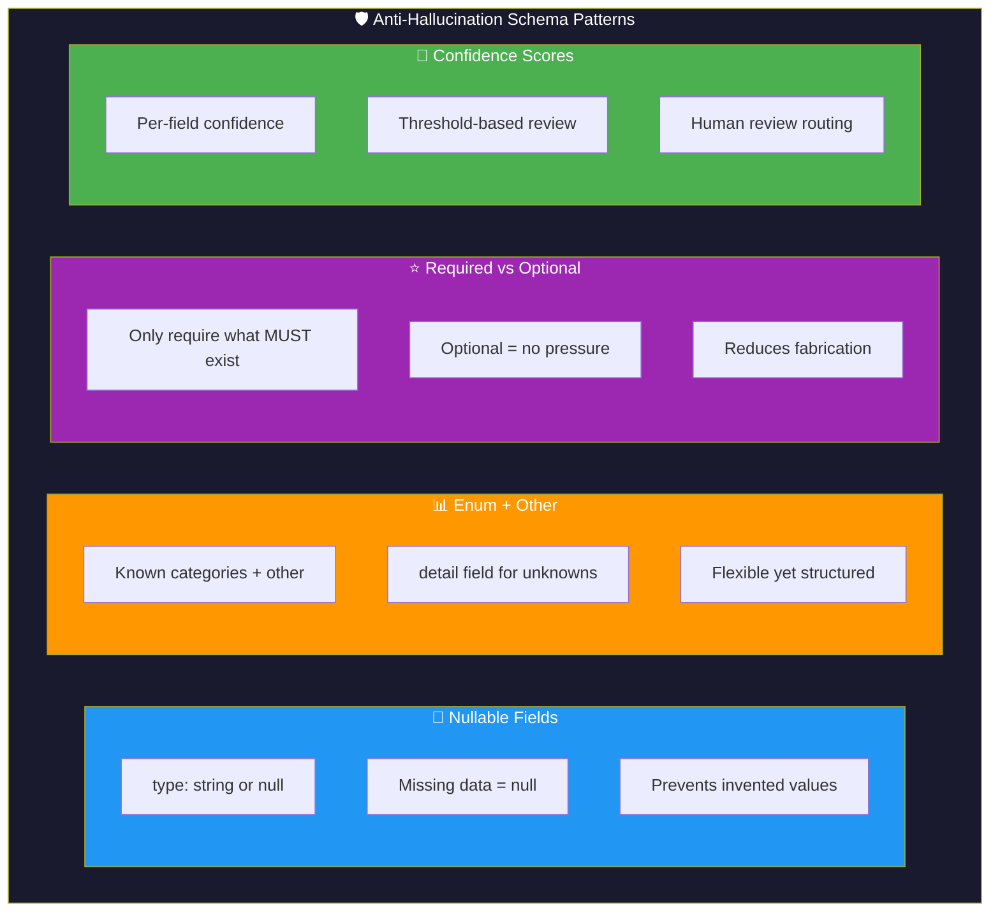
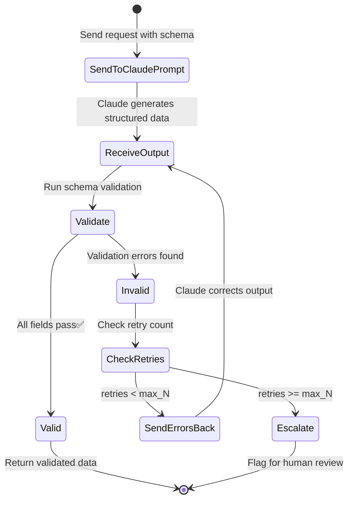
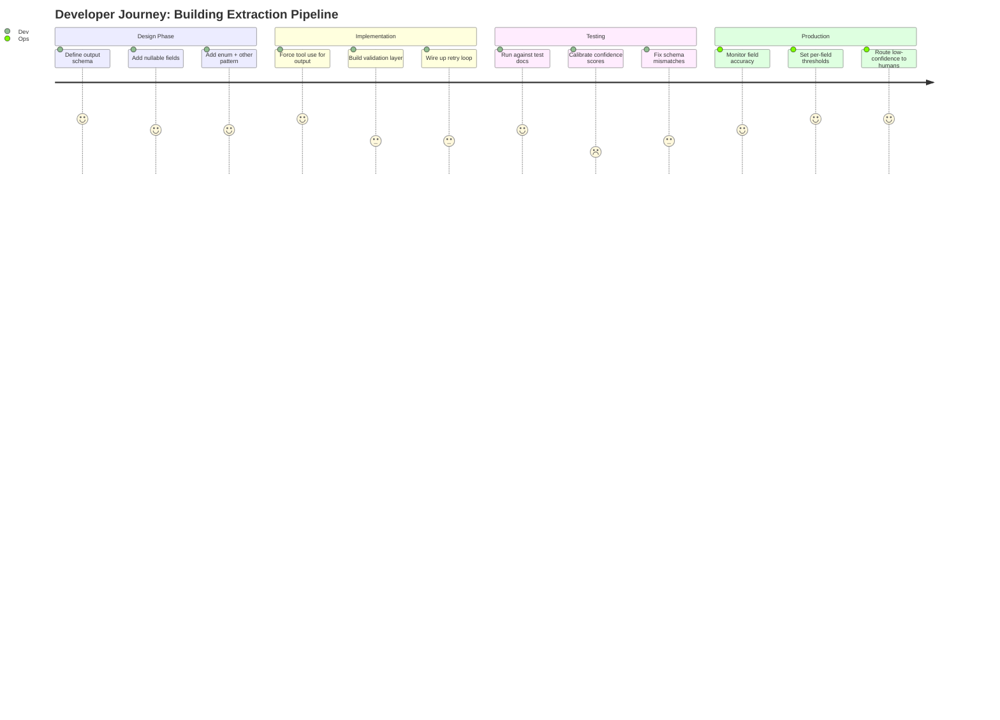
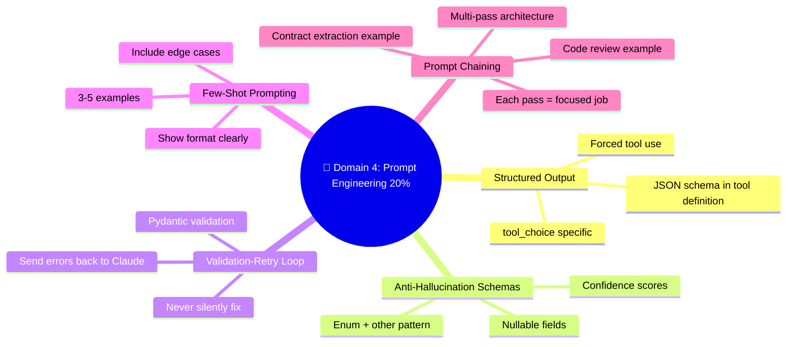

# 💬 Domain 4: Prompt Engineering & Structured Output (20%)

> **~12 questions.** Focus on forced tool use for structured output, validation-retry loops, few-shot patterns, and prompt chaining.


---

## 📘 Topic 4.1: Getting Structured Output from Claude

### The Challenge

Claude naturally outputs free-form text. But production systems need **structured JSON** that matches a specific schema. How do you guarantee this?

### The Technique: Forced Tool Use

The primary technique for structured output is a clever trick:

1. **Define a "tool"** whose input schema IS your desired output schema
2. **Force Claude to use it** with `tool_choice: {"type":"tool","name":"extract_X"}`
3. Claude MUST return data matching the schema

```json
{
  "name": "extract_invoice",
  "description": "Extract structured invoice data from the document",
  "input_schema": {
    "type": "object",
    "properties": {
      "vendor_name": { "type": "string" },
      "invoice_number": { "type": ["string", "null"] },
      "total_amount": { "type": "number" },
      "currency": { "type": "string", "enum": ["USD", "EUR", "GBP", "other"] },
      "line_items": {
        "type": ["array", "null"],
        "items": {
          "type": "object",
          "properties": {
            "description": { "type": "string" },
            "quantity": { "type": ["number", "null"] },
            "unit_price": { "type": ["number", "null"] },
            "amount": { "type": "number" }
          },
          "required": ["description", "amount"]
        }
      },
      "confidence": {
        "type": "object",
        "properties": {
          "vendor_name": { "type": "number" },
          "total_amount": { "type": "number" }
        }
      }
    },
    "required": ["vendor_name", "total_amount"]
  }
}
```

**Then set:**
```json
"tool_choice": {"type": "tool", "name": "extract_invoice"}
```

Claude is **forced** to call this "tool" — which means it must produce JSON matching your schema.

---

## 📘 Topic 4.2: Anti-Hallucination Schema Patterns

One of the biggest risks with structured extraction is **hallucination** — Claude making up data that doesn't exist in the source. Schema design can prevent this.

### Pattern 1: Nullable Fields

```json
"invoice_number": { "type": ["string", "null"] }
```

**Why:** If Claude can return `null`, it won't feel pressured to invent a value when the data isn't in the source document.

**Without nullable:** Claude might generate "INV-12345" for an invoice that doesn't show a number.
**With nullable:** Claude returns `null` — honest and detectable.

### Pattern 2: Enum + "Other" + Detail Field

```json
"payment_method": { 
  "enum": ["credit_card", "wire_transfer", "check", "other"] 
},
"payment_method_detail": { 
  "type": ["string", "null"] 
}
```

**Why:** Handles unexpected values without:
- ❌ Forcing unusual methods into existing categories
- ❌ Leaving the field completely unconstrained
- ✅ Capturing the actual value while maintaining categorization

### Pattern 3: Required vs Optional

```json
"required": ["vendor_name", "total_amount"]
```

Be explicit about what MUST exist. Don't require everything — fields that might not be in the source should be optional (and nullable).

### Pattern 4: Field-Level Confidence

```json
"confidence": {
  "vendor_name": 0.95,
  "total_amount": 0.72,
  "date": 0.88
}
```

**Why:** Lets downstream systems decide which fields need human review based on confidence thresholds.

### 🧱 Anti-Hallucination Schema Defenses — At a Glance



---

## 📘 Topic 4.3: The Validation-Retry Loop (Pydantic Pattern)

### The Pattern

This is a critical architectural pattern tested on the exam:

```
     ┌──────────────────────────────────────────────┐
     │                                              │
     ▼                                              │
┌─────────┐    ┌──────────┐    ┌──────────────┐     │
│  Claude  │───▶│ Validate │───▶│   Valid?     │     │
│generates │    │(Pydantic/│    │              │     │
│  output  │    │  JSON    │    │ Yes → Done ✅│     │
└─────────┘    │ Schema)  │    │              │     │
               └──────────┘    │ No → Send    │─────┘
                               │   errors     │
                               │   back to    │
                               │   Claude     │
                               │   (max N     │
                               │    retries)  │
                               └──────────────┘
```

### The Process

1. **Send request** to Claude with schema definition
2. **Receive response** — Claude generates structured data
3. **Validate** against schema (Pydantic, JSON Schema, etc.)
4. **If valid** → Done ✅
5. **If invalid** → Send the **specific validation errors** back to Claude
6. **Claude corrects** based on the error feedback
7. **Repeat** until valid or max retries exhausted

### ⚠️ Critical Exam Trap: Never Silently Fix Output

**Scenario:** Claude returns a negative number for `total_amount`. What do you do?

❌ **Wrong:** Replace the negative with its absolute value (silent fix)
❌ **Wrong:** Use a default value of 0.00
❌ **Wrong:** Skip this record and move to the next

✅ **Right:** Send the validation error back to Claude and request a corrected extraction

**WHY?** Claude may have fundamentally **misread the source document**. A negative total might mean Claude was reading the wrong column, or confusing a credit with a debit. Silently "fixing" it hides the real problem. Sending the error back lets Claude re-examine the source and correct its understanding.

### 🔄 Validation-Retry Loop — State Diagram



---

## 📘 Topic 4.4: Few-Shot Prompting

### What Is It?

Few-shot prompting means providing Claude with a few examples of desired input/output pairs before asking it to handle new cases.

### When to Use Few-Shot Examples

| Situation | Why Few-Shot Helps |
|---|---|
| Ambiguous interpretation | Examples clarify what you mean |
| Format consistency critical | Examples demonstrate the exact format |
| Classification tasks | Examples define decision boundaries |
| Reducing false positives | Negative examples show what NOT to match |
| Novel pattern generalization | Examples show how to handle new cases |

### Best Practices — The Rules

| Rule | Rationale |
|---|---|
| **2-5 examples** (not 20+) | Enough to establish the pattern without wasting context |
| **Positive AND negative** examples | Shows both what to match and what to reject |
| **Include edge cases** | The tricky scenarios Claude might get wrong |
| **Consistent format** | All examples should follow the same structure |
| **Targeted, not exhaustive** | Quality over quantity |

### Example: Classification

```
Here are examples of how to classify support requests:

Example 1 (Billing → High Priority):
  Input: "I was charged twice for my subscription"
  Output: {"category": "billing", "priority": "high", "action": "refund_review"}

Example 2 (Technical → Medium Priority):
  Input: "The export button isn't working"
  Output: {"category": "technical", "priority": "medium", "action": "bug_report"}

Example 3 (General → Low Priority):
  Input: "What are your business hours?"
  Output: {"category": "general", "priority": "low", "action": "faq_response"}

Example 4 (NOT a support request):
  Input: "I love your product, keep it up!"
  Output: {"category": "feedback", "priority": "none", "action": "acknowledge"}
```

---

## 📘 Topic 4.5: Prompt Chaining (Multi-Pass Architecture)

### The Concept

Instead of asking Claude to do everything in one massive prompt, break complex tasks into **focused sequential passes**. Each pass has a narrow scope, reducing cognitive load.

### The Generic Pattern

```
Pass 1: Extract raw data
    └── "Extract all text, numbers, and dates from this document"
         │
         ▼
Pass 2: Classify and categorize
    └── "Categorize each extracted item as billing/shipping/product/other"
         │
         ▼
Pass 3: Validate and cross-reference
    └── "Check for inconsistencies between extracted values"
         │
         ▼
Pass 4: Final structured output
    └── "Generate the final JSON with confidence scores"
```

### Applied Example: Code Review

For reviewing a large PR:

```
Pass 1: Security Vulnerabilities
    └── "Identify any SQL injection, XSS, auth bypass, or data exposure risks"
         │
         ▼
Pass 2: Logic Errors and Bugs
    └── "Find potential null pointer errors, off-by-one, race conditions"
         │
         ▼
Pass 3: Style and Best Practices
    └── "Check coding standards, naming conventions, documentation"
         │
         ▼
Pass 4: Aggregate and Deduplicate
    └── "Combine all findings, remove duplicates, prioritize by severity"
```

### Why Multi-Pass is Better Than Single-Pass

| Single-Pass | Multi-Pass |
|---|---|
| Claude tries to do everything at once | Each pass has a focused goal |
| Higher chance of missing issues | Systematic coverage |
| Context overload for large inputs | Each pass gets clean context |
| Harder to debug what went wrong | Easy to identify which pass failed |

### Applied Example: Contract Data Extraction

For complex multi-page contracts:

| Pass | Focus | Output |
|---|---|---|
| 1 | Identify document type and sections | Document structure map |
| 2 | Extract per-section data | Raw structured data per section |
| 3 | Cross-reference and validate | Consistency-checked data |
| 4 | Generate final output with confidence | Complete structured JSON with scores |

The **four-pass approach** is the best answer for complex extraction tasks on the exam.

### 🧱 Multi-Pass Architecture — Pipeline View

```mermaid
graph TB
    subgraph PIPELINE["🔄 Prompt Chaining Pipeline"]
        direction LR
        subgraph PASS1["📥 Pass 1: Extract"]
            P1A["Raw data extraction"]
            P1B["Text, numbers, dates"]
            P1C["Narrow focus"]
        end
        subgraph PASS2["🏷️ Pass 2: Classify"]
            P2A["Categorize items"]
            P2B["Apply labels"]
            P2C["Clean context"]
        end
        subgraph PASS3["✅ Pass 3: Validate"]
            P3A["Cross-reference"]
            P3B["Consistency check"]
            P3C["Flag conflicts"]
        end
        subgraph PASS4["📤 Pass 4: Output"]
            P4A["Final structured JSON"]
            P4B["Confidence scores"]
            P4C["Production-ready"]
        end
    end

    PASS1 --> PASS2 --> PASS3 --> PASS4

    style PASS1 fill:#2196F3,color:#fff
    style PASS2 fill:#9C27B0,color:#fff
    style PASS3 fill:#FF9800,color:#fff
    style PASS4 fill:#4CAF50,color:#fff
    style PIPELINE fill:#1a1a2e,color:#fff
```



---

## 📘 Topic 4.6: Prompt Design Principles

### Key Principles for Exam Questions

| Principle | What It Means |
|---|---|
| **Be explicit, not vague** | "Review for SQL injection, XSS, and auth bypass" beats "Review for security" |
| **Define criteria** | "Flag functions longer than 50 lines" beats "Find long functions" |
| **Structured instructions** | Use numbered steps, clear sections |
| **Include edge cases** | Tell Claude how to handle ambiguity |
| **State what NOT to do** | "Do NOT fix the code, only report issues" |

### ⚠️ Exam Trap

**Wrong:** "Use vague prompts to be flexible"
**Right:** Vague prompts cause **inconsistent** results. Be explicit about criteria, expected format, and edge case handling.

### 👤 Building a Data Extraction System — Journey Map



---

## 🧠 Think Like an Architect: Domain 4 Scenarios

### Scenario: You need to extract payment method from invoices. Most use standard methods, but some are unusual.

**Answer:** Use `"enum": ["credit_card", "wire", "check", "other"]` with a `"payment_method_detail"` field.

**Not:** Unconstrained string (loses categorization) or strict enum without "other" (forces unusual methods into wrong categories).

### Scenario: Claude extracts a negative dollar amount for an invoice total.

**Answer:** Send the validation error back to Claude for re-extraction.

**Not:** Take the absolute value (hides a potentially serious misreading of the source document).

---

## 📊 Visual Summary: Domain 4 at a Glance



---

## 📝 Domain 4 Key Terms Glossary

| Term | Definition |
|---|---|
| **Forced tool use** | Setting `tool_choice` to a specific tool for guaranteed structured output |
| **Nullable fields** | Schema pattern using `["type", "null"]` to prevent hallucination |
| **Validation-retry loop** | Pattern: generate → validate → if invalid, send errors back → retry |
| **Pydantic pattern** | The validation-retry loop named after the Python library |
| **Few-shot prompting** | Providing examples to guide Claude's behavior |
| **Prompt chaining** | Breaking tasks into focused sequential passes |
| **Multi-pass review** | Multiple focused review passes (security → logic → style → aggregate) |
| **Anti-hallucination** | Schema design patterns that prevent Claude from inventing data |
