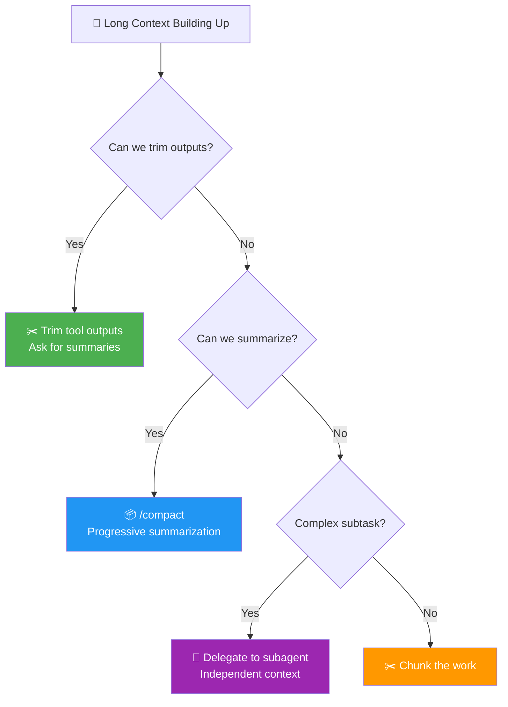
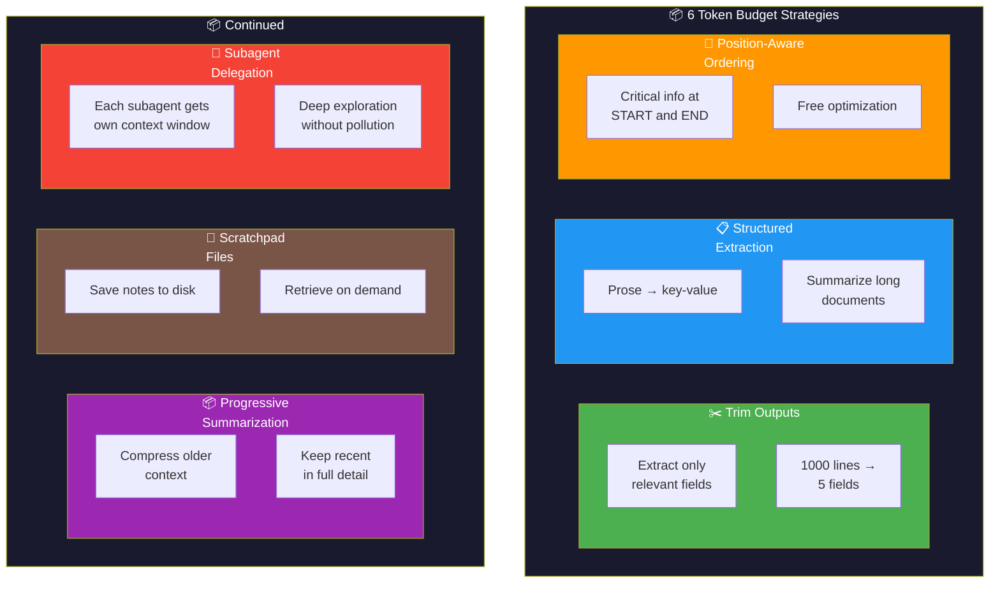
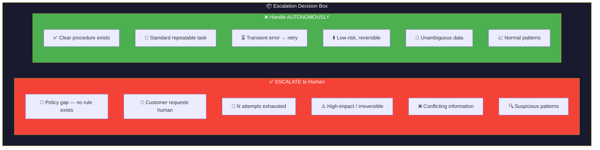
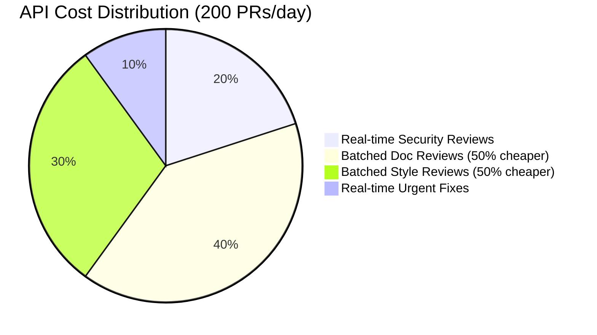
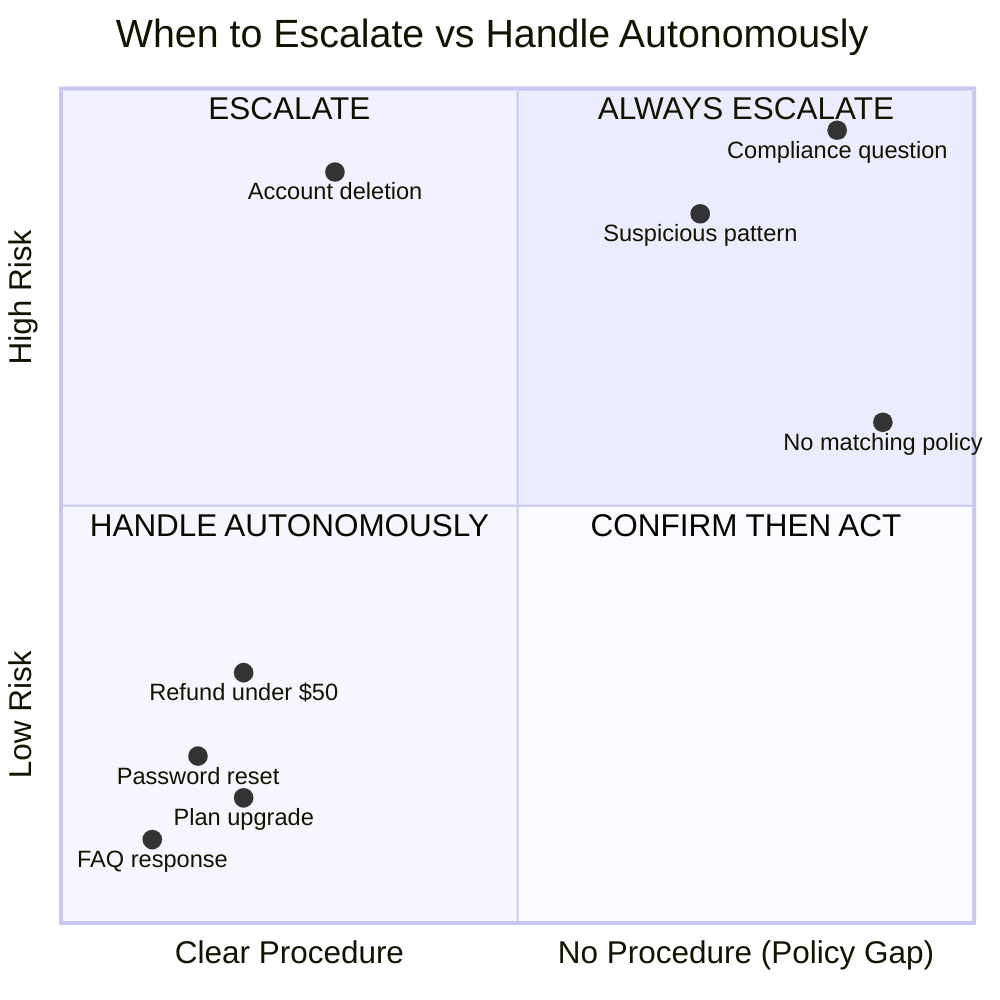
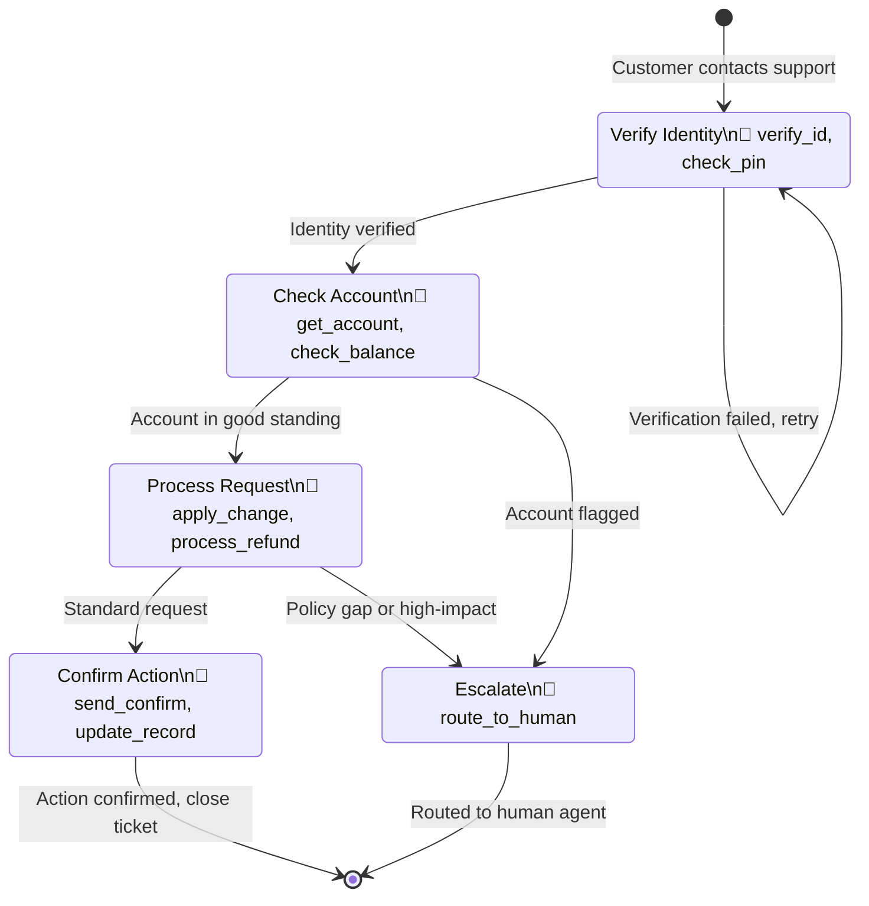
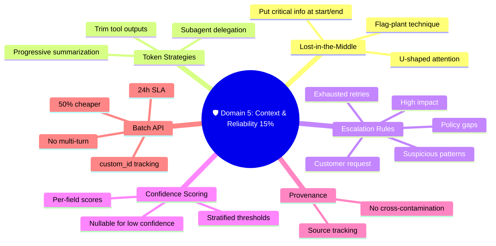

# 🛡️ Domain 5: Context Management & Reliability (15%)

> **~9 questions.** Focus on lost-in-the-middle effect, escalation rules, confidence scoring, and batch processing.

---

## 📘 Topic 5.1: The Lost-in-the-Middle Effect

### What Is It?

LLMs (including Claude) pay **unequal attention** to different parts of their context window. Attention follows a **U-shaped curve**:

```
Attention Level:

HIGH  ████░░░░░░░░░░░░░░░░░░████
      ████░░░░░░░░░░░░░░░░░░████
      ████░░░░░░░░░░░░░░░░░░████
MED   ████████░░░░░░░░░░████████
      ████████░░░░░░░░░░████████
      ████████████░░████████████
LOW   ██████████████████████████
      
      START    MIDDLE      END
      ↑ High   ↓ Low       ↑ High
      attention             attention
```

### What This Means for You

- **Beginning of context:** HIGH attention — put critical instructions here
- **Middle of context:** LOW attention — information here gets "lost"
- **End of context:** HIGH attention — put critical data here too

### Practical Implications

| ✅ Do | ❌ Don't |
|---|---|
| Put critical instructions at the START | Bury important rules in the middle |
| Put critical data at the END | Only put critical info in one position |
| Use structured extraction to pull key info out | Trust that a 50-page document in the middle will be fully processed |
| Use subagents for deep analysis of long documents | Dump everything into one massive context |

### Mitigation Strategies

1. **Position-aware ordering:** Critical content first and last
2. **Structured extraction:** Convert long prose into key-value pairs
3. **Subagent delegation:** Each subagent gets a focused chunk
4. **Progressive summarization:** Compress older content, keep recent in full detail

---

## 📘 Topic 5.2: Token Budget Strategies

### Managing Context Window Usage



### The Problem

Context windows are finite. Long conversations, verbose tool outputs, and large documents eat tokens fast. When the context fills up, Claude starts losing information.

### The Six Strategies — Know All of Them

| Strategy | How It Works | When to Use |
|---|---|---|
| **Trim tool outputs** | Extract only relevant fields from large API responses | Tool returns 1000 lines but you need 5 fields |
| **Structured fact extraction** | Convert prose into key-value pairs or bullets | Long documents that can be summarized |
| **Position-aware ordering** | Put critical context at start and end | Always — it's free optimization |
| **Progressive summarization** | Compress older context, keep recent in full | Long-running sessions |
| **Scratchpad files** | Save notes to disk, retrieve on demand | Deep analysis with many intermediate results |
| **Subagent delegation** | Offload deep work to subagents with own context | Complex tasks that need deep exploration |

### 🧱 Token Budget Strategies — Toolkit View



### Progressive Summarization in Detail

As conversation grows:

```
Turn 1-5:   Full detail
Turn 6-10:  Full detail
Turn 11-15: Full detail      ← Context getting full!

After /compact:

Turn 1-10:  Compressed summary (3 bullet points)
Turn 11-15: Full detail
Turn 16-20: Full detail (new space freed up)
```

The `/compact` command triggers this in Claude Code.

### ⚠️ Important Warning

> Cascaded summaries can accumulate errors or lose nuance. For critical systems, reference **source material**, not just summaries.

---

## 📘 Topic 5.3: Human Review & Escalation Patterns

### The Escalation Decision Rule

This is a common exam question pattern: "Should the agent escalate or handle autonomously?"

| ✅ ESCALATE to Human | ❌ RESOLVE Autonomously |
|---|---|
| **Policy gap** — no clear rule exists for this situation | Well-defined procedure is available |
| **Customer explicitly requests** a human | Standard, repeatable task |
| **Cannot make progress** after N attempts | Error is clearly transient/retryable |
| **High-impact / irreversible** actions | Low-risk, reversible operations |
| **Conflicting information** from sources | Unambiguous data |
| **Suspicious patterns** (even if individual actions are within limits) | Normal patterns |

### ⚠️ Exam Trap: Over-Escalation

**Wrong:** "Auto-escalate every error to humans"
**Right:** Only escalate for policy gaps, conflicts, exhausted retries, and high-impact actions.

Transient errors (timeouts, rate limits) should be **retried**, not escalated. Standard procedures should be **followed**, not escalated.

### 🧱 Escalate vs Handle — Comparison View



### Pattern Detection Example

**Scenario:** A customer requests a $480 refund (under the $500 autonomous limit). But they've had 5 refund requests this month.

**Answer:** **Escalate** — the pattern is suspicious even though individual amounts are within policy limits.

**Not:** "Process it — it's under $500" (ignores the suspicious pattern)
**Not:** "Deny it automatically" (no authority to deny without review)

---

## 📘 Topic 5.4: Confidence Scoring

### Field-Level, Not Document-Level

Assign confidence scores to **individual fields**, not just the overall extraction:

```json
{
  "vendor_name": { "value": "Acme Corp", "confidence": 0.95 },
  "total_amount": { "value": 1250.00, "confidence": 0.88 },
  "invoice_date": { "value": "2025-03-15", "confidence": 0.72 },
  "line_items": { "value": [...], "confidence": 0.65 }
}
```

### Why Field-Level Matters

Different fields have **different accuracy rates**:
- Company names: 92% accurate (high)
- Account IDs: 68% accurate (low)
- Dates: 85% accurate (medium)
- Dollar amounts: 78% accurate (medium-low)

A single threshold (like 0.80) for all fields would:
- ❌ Auto-approve uncertain account IDs (too lenient for IDs)
- ❌ Send confident names to human review (too strict for names)

### Confidence Calibration Process

1. **Create a labeled validation set** — documents with known correct extractions
2. **Compare predicted confidence vs actual accuracy** — is Claude's 0.90 confidence actually 90% correct?
3. **Stratified sampling** — measure by document type AND field type
4. **Segment accuracy by field** — numeric fields may be less accurate than text
5. **Set independent thresholds** per field:
   - Names: auto-approve above 0.85
   - Account IDs: human review below 0.95
   - Dollar amounts: human review below 0.90

### Calibration Problem Example

**Scenario:** Claude reports 95% confidence on invoice totals, but actual accuracy is only 78%.

**Diagnosis:** The model is **overconfident** (poorly calibrated) for numeric fields.

**Fix:** Create a stratified validation set per field type and adjust confidence thresholds independently using calibration curves.

**Not:** "Average it out" (masks the problem) or "Lower global threshold" (penalizes well-calibrated fields).

---

## 📘 Topic 5.5: Information Provenance

### What Is It?

For research and extraction tasks, track WHERE every piece of information came from and how reliable it is.

### The Four Provenance Pillars

| Pillar | What to Track | Why |
|---|---|---|
| **Claim-source mappings** | Which source supports each claim | Human reviewer can verify |
| **Temporal data handling** | When was the info last updated | Stale data detection |
| **Conflict annotation** | Flag contradictions between sources | Don't average or arbitrarily pick one |
| **Coverage gap reporting** | What info is missing or uncertain | Know what you DON'T know |

### Cross-Source Synthesis Example

Three subagents return research findings:
- Subagent A: "Revenue grew 15%"
- Subagent B: "Revenue grew 12%"  
- Subagent C: Doesn't mention revenue

**Correct approach (C):** Report both claims with source citations, flag the discrepancy, note Subagent C's coverage gap.

**Wrong approaches:**
- ❌ Average the values (13.5%) — mathematically nonsensical for conflicting claims
- ❌ Use the most recent source — recency doesn't equal accuracy
- ❌ Ask Claude to pick the "reliable" one — Claude can't determine source reliability

---

## 📘 Topic 5.6: Batch Processing (Message Batches API)

### Key Facts — Memorize These

| Feature | Value |
|---|---|
| **Cost savings** | **50% cheaper** than real-time API |
| **Max batch size** | 100,000 requests or 256 MB |
| **SLA** | Up to **24 hours** (most finish within 1 hour) |
| **Correlation** | Use `custom_id` per request to match results |
| **Critical limitation** | ❌ **No multi-turn tool calling** within batches |
| **Failure handling** | Track by `custom_id`, retry **only failed** requests |

### When to Use Batches

| ✅ Use Batches For | ❌ Don't Use Batches For |
|---|---|
| Large-scale evaluation | Real-time user-facing requests |
| Content moderation at scale | Tasks requiring multi-turn interaction |
| Bulk document processing | Urgent/time-sensitive work |
| Batch data extraction | Interactive conversations |
| Non-urgent PR reviews | Security-critical real-time reviews |

### 📊 Batch API Cost Savings



### 📊 Escalation Decision — Quadrant Chart



### ⚠️ Critical Exam Traps

**Trap 1: "Resubmit entire batch for 15 failures"**
**Right:** Track by `custom_id`, retry only the 15 failed requests.
**Why:** Resubmitting 10,000 requests when only 15 failed wastes money and time.

**Trap 2: "Multi-turn tool calling in batches"**
**Right:** Batches API does NOT support multi-turn tool calling.
**Why:** Each batch request is independent — no conversation flow.

**Trap 3: "Results in submission order"**
**Right:** Results are NOT in order. Use `custom_id` for correlation.

### Batch Failure Recovery Pattern

```
1. Submit batch of 10,000 with custom_ids
2. Batch completes — 15 failures
3. Identify failures by custom_id
4. Analyze error patterns (are they all the same type?)
5. Fix schema/prompt if needed
6. Resubmit ONLY the 15 failed requests
```

---

## 📘 Topic 5.7: Reliability Patterns

### Workflow State Machines

For critical workflows (like customer support), enforce sequence programmatically:

```
┌─────────────┐    ┌─────────────┐    ┌─────────────┐    ┌─────────────┐
│ VERIFY      │───▶│ CHECK       │───▶│ PROCESS     │───▶│ CONFIRM     │
│ IDENTITY    │    │ ACCOUNT     │    │ REQUEST     │    │ ACTION      │
└─────────────┘    └─────────────┘    └─────────────┘    └─────────────┘
     │                   │                   │                  │
     │ Tools:            │ Tools:            │ Tools:           │ Tools:
     │ - verify_id       │ - get_account     │ - apply_change   │ - send_confirm
     │ - check_pin       │ - check_balance   │ - process_refund │ - update_record
     └───────────────────┴───────────────────┴──────────────────┘
```

**Key:** Restrict available tools based on current state. In the VERIFY IDENTITY state, only identity-related tools are available. The agent cannot skip to PROCESS REQUEST.

### 🔄 Customer Support — State Diagram



**This is better than:**
- Just telling Claude the sequence in the prompt (unreliable)
- Using few-shot examples (inconsistent)
- Separate agents for each step (over-engineering for simple flows)

### Ambiguous Intent Handling

When user intent is unclear:

**Best pattern:** Check available data to infer intent, then **confirm** with the user.

**Example:** Customer says "I want to change my plan."
1. Check their billing history (are they on a premium plan? have they been browsing cheaper options?)
2. Infer the most likely intent
3. Ask a targeted confirmation: "It looks like you might be interested in switching to our Basic plan. Is that right, or were you looking to upgrade?"

This is better than:
- ❌ Defaulting to the most common interpretation (risky)
- ❌ Asking a generic "what did you mean?" (poor UX)
- ❌ Presenting all options without context (overwhelming)

---

## 🧠 Think Like an Architect: Domain 5 Scenarios

### Scenario: Your extraction system reports 95% confidence on totals but actual accuracy is 78%.

**Diagnosis:** Overconfident on numeric fields (poor calibration).
**Fix:** Stratified validation set per field type, independent thresholds.
**Why not "increase few-shot examples"?** The problem is calibration, not extraction accuracy.

### Scenario: Processing 50K invoices via Batches API, 8% fail validation.

**Fix:**
1. Identify failures by `custom_id`
2. Analyze common error patterns
3. Fix schema/prompt for those patterns
4. Resubmit only the failed items

**Why not resubmit all 50K?** Wastes money — 92% already succeeded.

### Scenario: 15 research documents for synthesis. Where to put the most important ones?

**Answer:** Beginning and end (U-shaped attention pattern).
**Not:** Middle (that's where attention is lowest).

---

## 📊 Visual Summary: Domain 5 at a Glance



---

## 📝 Domain 5 Key Terms Glossary

| Term | Definition |
|---|---|
| **Lost-in-the-middle** | LLMs attend less to middle of context (U-shaped attention) |
| **Progressive summarization** | Compressing older context to free space |
| **Position-aware ordering** | Placing critical info at start and end |
| **Escalation** | Routing to human when agent can't handle |
| **Policy gap** | Situation with no clear rule — always escalate |
| **Field-level confidence** | Confidence scores per individual field, not per document |
| **Calibration** | Comparing predicted confidence to actual accuracy |
| **Stratified thresholds** | Different confidence thresholds per field type |
| **Information provenance** | Tracking source, timing, and conflicts for each claim |
| **Message Batches API** | Bulk processing API, 50% cheaper, up to 24h SLA |
| **custom_id** | Unique identifier per batch request for correlation |
| **State machine** | Programmatic workflow enforcement with tool restrictions per state |
