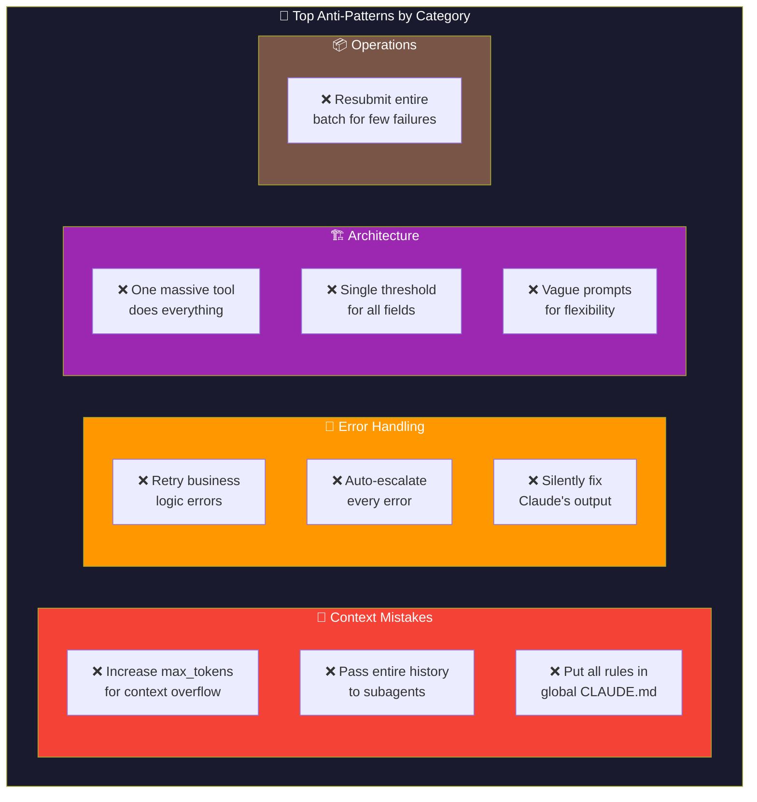
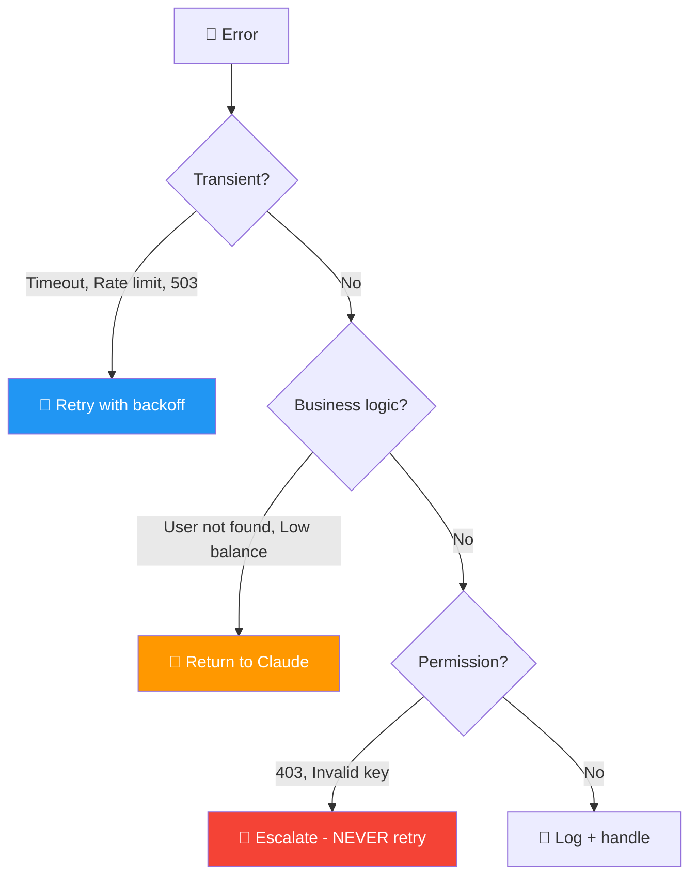
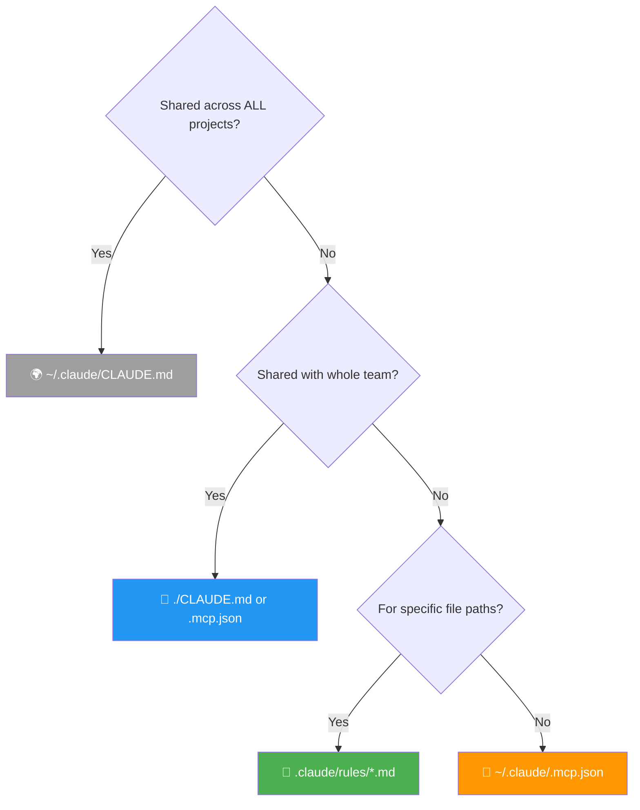
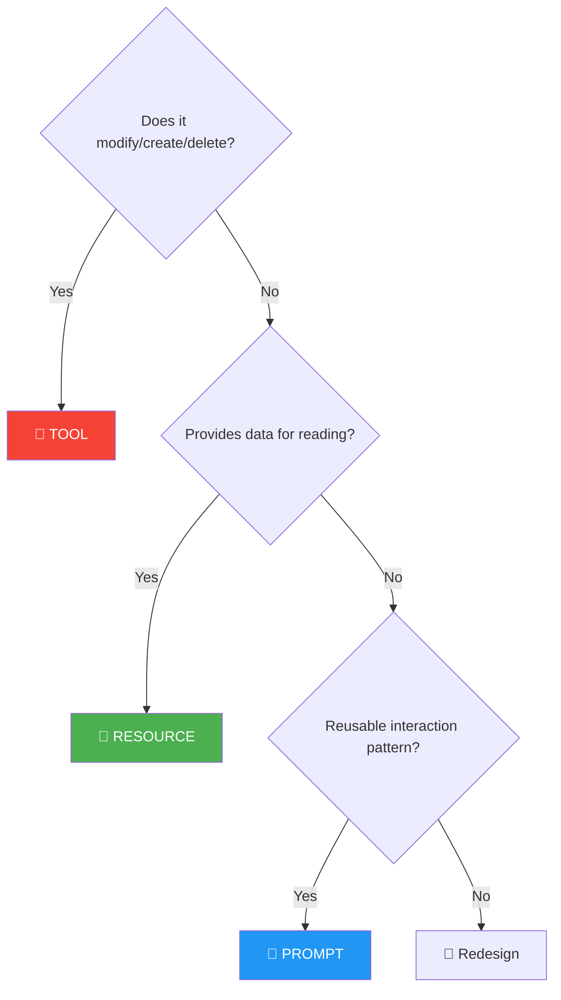
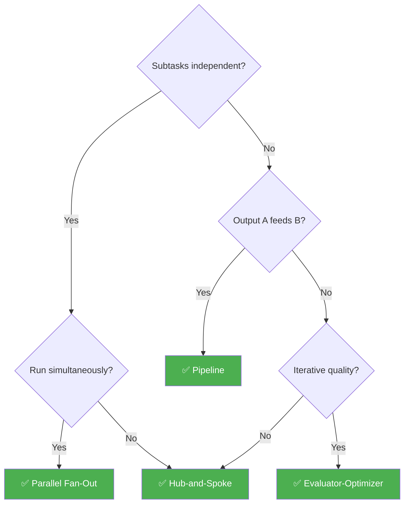
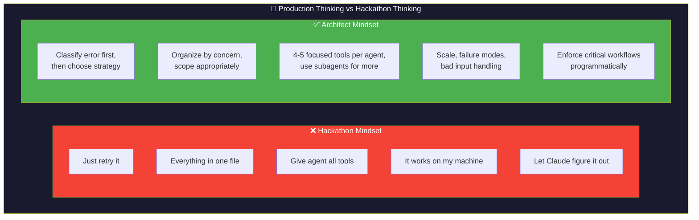
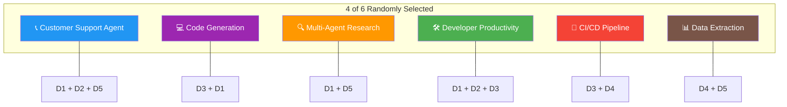
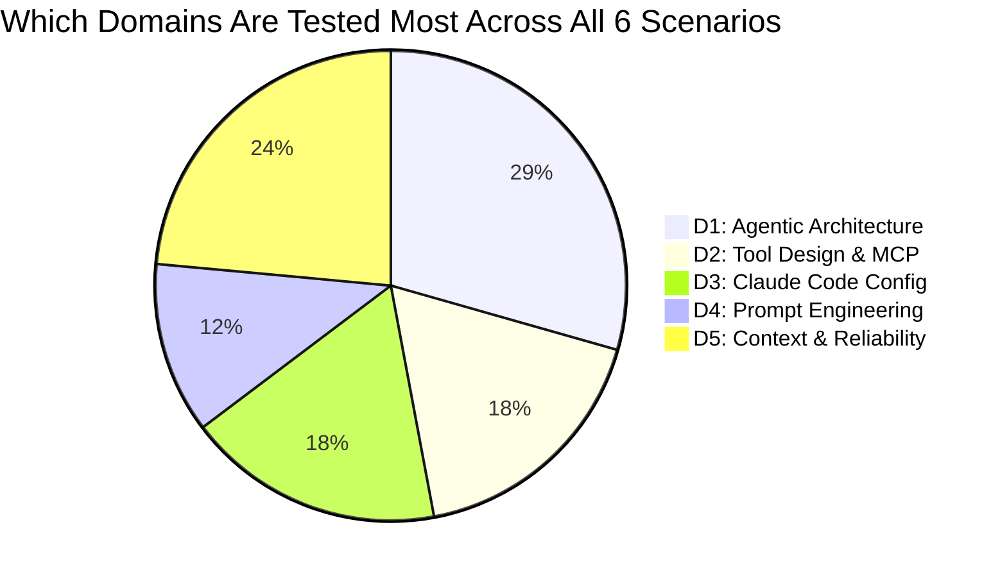

# ⚠️ Exam Strategy: Anti-Patterns, Decision Trees & Traps

> **Master these and you'll avoid the most common wrong answers on exam day.**


---

## 🚫 Top 10 Anti-Patterns (Wrong Answers That Sound Right)

These are the answers the exam **wants** you to fall for. Each one sounds reasonable at first glance but is architecturally wrong.

| # | The Anti-Pattern | Why It's WRONG | What's RIGHT |
|---|---|---|---|
| 1 | "Increase `max_tokens` to fix context overflow" | `max_tokens` is **output limit**, not context window. More output tokens don't give Claude more memory | Use `/compact`, subagents, or progressive summarization |
| 2 | "Retry business logic errors" | "User not found" won't change with retries. It's a data problem, not a transient failure | Return to Claude for decision-making |
| 3 | "Pass entire conversation to subagents" | Defeats context isolation. Pollutes subagent with irrelevant info | Pass only relevant summaries |
| 4 | "Use vague prompts to be flexible" | Vague → inconsistent results. Claude needs clear criteria | Be explicit about criteria, format, edge cases |
| 5 | "Single confidence threshold for all fields" | Names are 92% accurate, IDs are 68%. One threshold can't serve both | Stratified thresholds per field type |
| 6 | "Silently fix Claude's output errors" | Claude may have **misread the source entirely**. Fixing the symptom hides the root cause | Send errors back to Claude for re-extraction |
| 7 | "Put all rules in global CLAUDE.md" | Wastes context on irrelevant rules. Gets unwieldy in large projects | Use path-scoped `.claude/rules/` with globs |
| 8 | "One massive tool that does everything" | High complexity = high error rate. Claude can't distinguish when to use which feature | Split by purpose, 4-5 tools per agent |
| 9 | "Auto-escalate every error to humans" | Transient errors should be retried. Standard procedures should be followed | Only escalate policy gaps, conflicts, exhausted retries |
| 10 | "Resubmit entire batch for 15 failures" | 99.85% already succeeded. Resubmitting wastes time and money | Track by `custom_id`, retry only failed requests |

### 🧱 Anti-Pattern Categories — Overview



---

## 🌲 Decision Trees for Exam Questions (Visual)

### Decision Tree 1: Error Handling



### Decision Tree 2: Configuration Placement



### Decision Tree 3: MCP Primitive Selection



### Decision Tree 4: Multi-Agent Pattern



### Decision Tree 1: "How should we handle this error?"

```
Is it transient? (timeout, rate limit, 503)
├── YES → Retry with exponential backoff
└── NO → Is it a business logic error? ("User not found", "Insufficient balance")
    ├── YES → Return to Claude for decision
    └── NO → Is it a permission error? ("403 Forbidden", "Invalid API key")
        ├── YES → Escalate to human (NEVER retry)
        └── NO → Log + handle gracefully
```

### Decision Tree 2: "Where should this configuration go?"

```
Is it shared across ALL projects on this machine?
├── YES → ~/.claude/CLAUDE.md (global)
└── NO → Is it shared with the whole team?
    ├── YES → ./CLAUDE.md or .mcp.json (project root)
    └── NO → Is it for specific file paths?
        ├── YES → .claude/rules/*.md with glob patterns
        └── NO → ~/.claude/.mcp.json (personal user config)
```

### Decision Tree 3: "Should we use plan mode?"

```
Is it multi-file or architectural?
├── YES → Plan mode
└── NO → Is it high-risk or ambiguous?
    ├── YES → Plan mode
    └── NO → Direct execution
```

### Decision Tree 4: "Should we escalate to a human?"

```
Is there a policy gap (no rule exists)?
├── YES → Escalate
└── NO → Did the customer explicitly request a human?
    ├── YES → Escalate
    └── NO → Have we exhausted N attempts?
        ├── YES → Escalate
        └── NO → Is it high-impact or irreversible?
            ├── YES → Escalate
            └── NO → Is there conflicting information?
                ├── YES → Escalate
                └── NO → Is there a suspicious pattern?
                    ├── YES → Escalate
                    └── NO → Handle autonomously
```

### Decision Tree 5: "What MCP primitive should this be?"

```
Does it modify, create, or delete anything?
├── YES → TOOL (has side effects / mutations)
└── NO → Does it provide data for browsing/reading?
    ├── YES → RESOURCE (read-only)
    └── NO → Is it a reusable interaction pattern?
        ├── YES → PROMPT (template)
        └── NO → Re-evaluate the design
```

### Decision Tree 6: "What's the best multi-agent pattern?"

```
Are subtasks independent?
├── YES → Can they run simultaneously?
│   ├── YES → Parallel fan-out
│   └── NO → Hub-and-spoke (sequential delegation)
└── NO → Does output of A feed into B?
    ├── YES → Pipeline (sequential chain)
    └── NO → Is iterative quality improvement needed?
        ├── YES → Evaluator-optimizer loop
        └── NO → Hub-and-spoke
```

---

## 🎯 The "Architect Mindset" — How the Exam Tests You

### Key Principle: Production Thinking, Not Hackathon Thinking

Every answer should reflect **what a senior architect would recommend for production**, not what's fastest or simplest.

| Hackathon Thinking ❌ | Architect Thinking ✅ |
|---|---|
| "Just retry it" | "Classify the error first, then choose the right strategy" |
| "Put everything in one file" | "Organize by concern, scope appropriately" |
| "Give the agent all the tools" | "4-5 focused tools per agent, use subagents for more" |
| "It works on my machine" | "How does this behave at scale, under failure, with bad input?" |
| "Let Claude figure it out" | "Enforce critical workflows programmatically" |

### Watch for These Words in Answers

- **"Always"** and **"never"** → Usually WRONG in architecture questions (there are almost always exceptions)
- **"Silently"** → Almost always WRONG (hiding behavior is dangerous)
- **"All"** → Usually WRONG (one-size-fits-all approaches fail)
- **"Automatically"** → Check context — sometimes right, sometimes dangerously wrong
- **"Simply"** → Hides complexity — usually the wrong answer for complex scenarios

### 🧱 Architect vs Hackathon Mindset



---

## 🧠 The 6 Exam Scenarios — What to Expect

The exam randomly selects 4 of these 6 scenarios. You **must study all 6**.



| # | Scenario | Key Domains Tested | Focus Areas |
|---|---|---|---|
| 1 | **Customer Support Agent** | D1 (Agentic), D2 (Tools), D5 (Reliability) | Escalation rules, error handling, state machines, pattern detection |
| 2 | **Code Generation (Claude Code)** | D3 (Config), D1 (Agentic) | CLAUDE.md hierarchy, plan mode, skills, hooks |
| 3 | **Multi-Agent Research** | D1 (Agentic), D5 (Context) | Hub-and-spoke, context isolation, provenance, lost-in-middle |
| 4 | **Developer Productivity** | D1 (Agentic), D2 (Tools), D3 (Config) | Tool descriptions, session management, path-scoped rules |
| 5 | **CI/CD with Claude Code** | D3 (Config), D4 (Prompts) | `-p` flag, hooks, multi-stage pipelines, JSON validation |
| 6 | **Structured Data Extraction** | D4 (Prompts), D5 (Reliability) | Schema design, validation-retry, batch API, confidence scoring |

### 📊 Scenario Domain Coverage



---

## ⏱️ Time Management Strategy

| Phase | Questions | Time | Strategy |
|---|---|---|---|
| **First pass** | Q1-60 | 90 min | Answer confident ones quickly (~1.5 min each) |
| **Flag hard ones** | ~10-15 | 0 min | Mark and skip — don't waste time on uncertain answers |
| **Second pass** | Flagged | 30 min | Return with fresh eyes, eliminate wrong answers |

**Key:** Don't spend 5 minutes on one question. Flag it and return.

### 📅 Exam Time Management — Gantt Chart

```mermaid
gantt
    title Exam Time Strategy (120 minutes)
    dateFormat mm
    axisFormat %M min

    section First Pass (90 min)
        Confident answers (~45 Qs)     :a1, 00, 68min
        Flag uncertain ones (~15 Qs)   :a2, after a1, 22min

    section Second Pass (30 min)
        Review flagged questions        :a3, after a2, 20min
        Final check & submit            :a4, after a3, 10min
```



---

## 📋 Last-Minute Checklist

- [ ] I know all 4 `stop_reason` values and what to do for each
- [ ] I can classify errors (transient vs business logic vs permission)
- [ ] I know the 5 multi-agent rules (context isolation, summaries, manifest, no shared memory, 4-5 tools)
- [ ] I know the CLAUDE.md hierarchy (global → project → directory → path-scoped rules)
- [ ] I know when to use plan mode vs direct execution
- [ ] I know all 4 hook types (Pre/Post ToolUse, Notification, Stop)
- [ ] I know the 3 MCP primitives (Tools = write, Resources = read, Prompts = templates)
- [ ] I know the `tool_choice` options (auto, any, specific, none)
- [ ] I understand forced tool use for structured output
- [ ] I know the validation-retry loop (never silently fix)
- [ ] I understand anti-hallucination schema patterns (nullable, enum+other)
- [ ] I know the lost-in-the-middle effect (U-shaped attention)
- [ ] I know the escalation decision rules
- [ ] I know field-level confidence scoring with stratified thresholds
- [ ] I know Message Batches API facts (50% cheaper, custom_id, no multi-turn, 24h SLA)
- [ ] I know CI/CD flags (-p, --output-format json, --json-schema)
- [ ] I can explain WHY for every concept, not just WHAT
