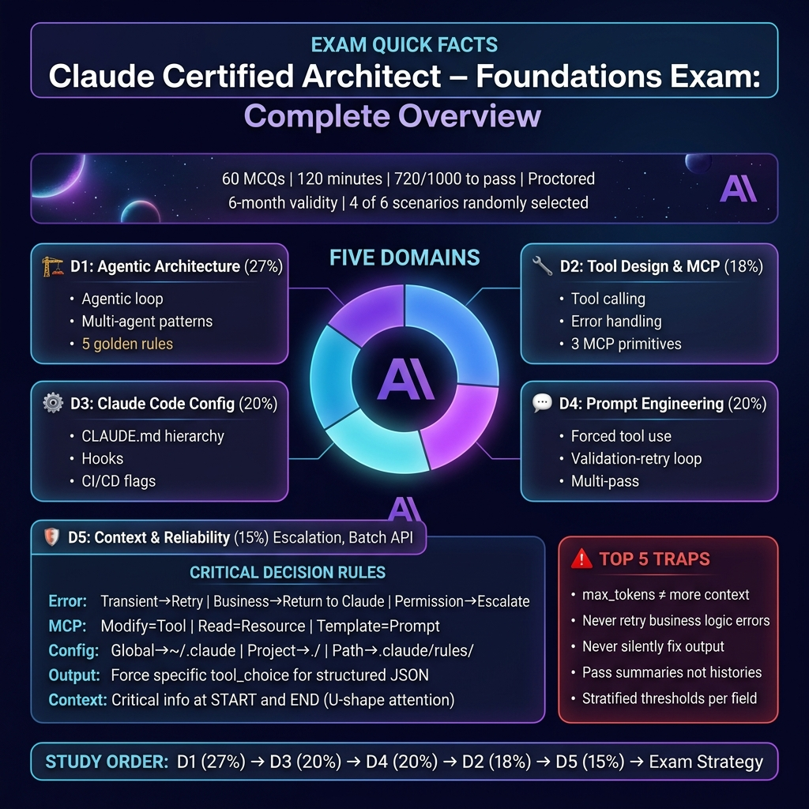
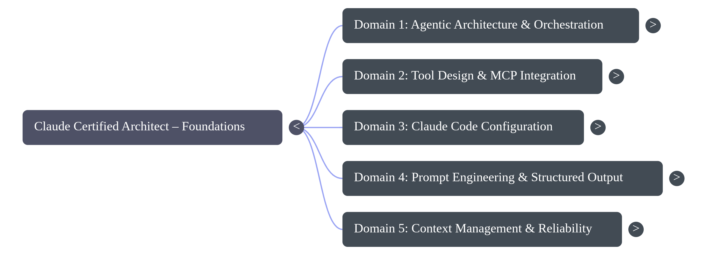

# 📚 Claude Certified Architect — Learning Materials

> **Complete topic-by-topic learning guide for the Claude Certified Architect – Foundations exam.**

These materials are designed for deep learning — not just memorization. Each guide includes:
- 📖 **Detailed explanations** with real-world analogies
- 📊 **Diagrams and flowcharts** for visual learners
- ⚠️ **Exam traps** — wrong answers that sound right
- 🌲 **Decision trees** — frameworks for reasoning through questions
- 🧠 **"Think Like an Architect"** practice scenarios
- 📝 **Key terms glossary** for quick reference

---

## New Visual Resources

### 🧠 Architecture Mind Map

### 🗺️ Certification Exam Blueprint

<video width="100%" controls>
  <source src="./posters/Thinking_Like_a_Claude_Architect.mp4" type="video/mp4">
  Your browser does not support the video tag.
</video>

- **[Download Blueprint Presentation (PPTX)](./posters/Claude_Architect_Blueprint.pptx)**
- **[Official Certification Exam Guide (PDF)](../Claude+Certified+Architect+–+Foundations+Certification+Exam+Guide.pdf)**

---

## 📋 Study Order (Recommended)

Study in order of **domain weight** — highest weight first:

| # | File | Domain | Weight | Est. Study Time |
|---|---|---|---|---|
| 1 | [01_agentic_architecture.md](./01_agentic_architecture.md) | Agentic Architecture & Orchestration | **27%** | 2-3 hours |
| 2 | [03_claude_code_config.md](./03_claude_code_config.md) | Claude Code Configuration & Workflows | **20%** | 1.5-2 hours |
| 3 | [04_prompt_engineering.md](./04_prompt_engineering.md) | Prompt Engineering & Structured Output | **20%** | 1.5-2 hours |
| 4 | [02_tool_design_mcp.md](./02_tool_design_mcp.md) | Tool Design & MCP Integration | **18%** | 1.5-2 hours |
| 5 | [05_context_management.md](./05_context_management.md) | Context Management & Reliability | **15%** | 1-1.5 hours |
| 6 | [06_exam_strategy.md](./06_exam_strategy.md) | Exam Strategy & Anti-Patterns | — | 1 hour |

**Total estimated study time: 8-12 hours**

---

## 🎯 After These Guides

Once you've studied the topic guides, test yourself with:

| Resource | What It Is |
|---|---|
| [claude_architect_practice_questions.md](../claude_architect_practice_questions.md) | 25 scenario-based practice questions (Set 1) |
| [claude_architect_advanced_questions.md](../claude_architect_advanced_questions.md) | 25 harder questions covering CI/CD & Dev Productivity (Set 2) |
| [claude_architect_cheat_sheet.md](../claude_architect_cheat_sheet.md) | Quick-reference for exam day revision |
| [claude_architect_study_guide.md](../claude_architect_study_guide.md) | Original condensed study guide |

---

## 📊 Exam Quick Facts

| Detail | Value |
|---|---|
| **Questions** | 60 MCQs |
| **Time** | 120 minutes |
| **Passing Score** | 720 / 1000 (scaled) |
| **Format** | Scenario-based (4 of 6 scenarios randomly selected) |
| **Proctored** | Yes — no external resources, no breaks |
| **Validity** | 6 months |

---

> 💡 **Tip:** Study the learning guides first, then do the practice questions. Review anything you got wrong, and use the cheat sheet for final revision on exam day.
