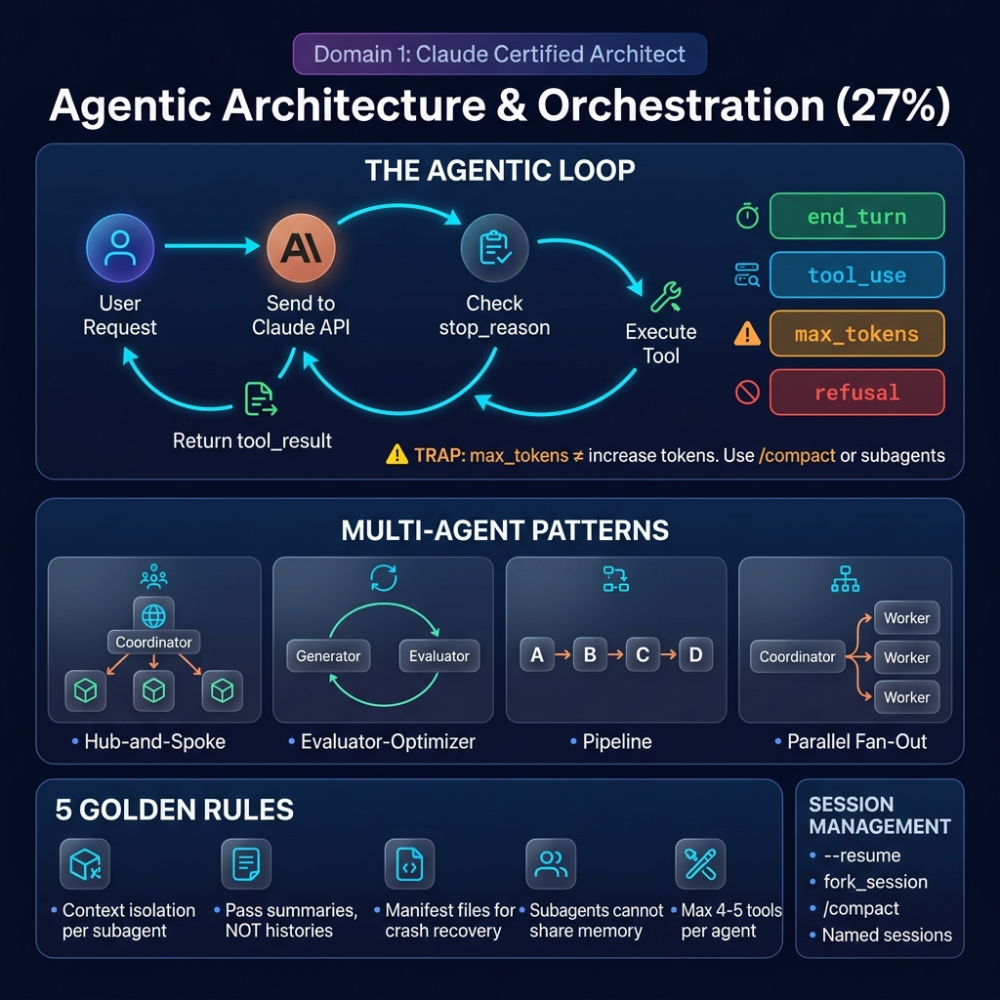
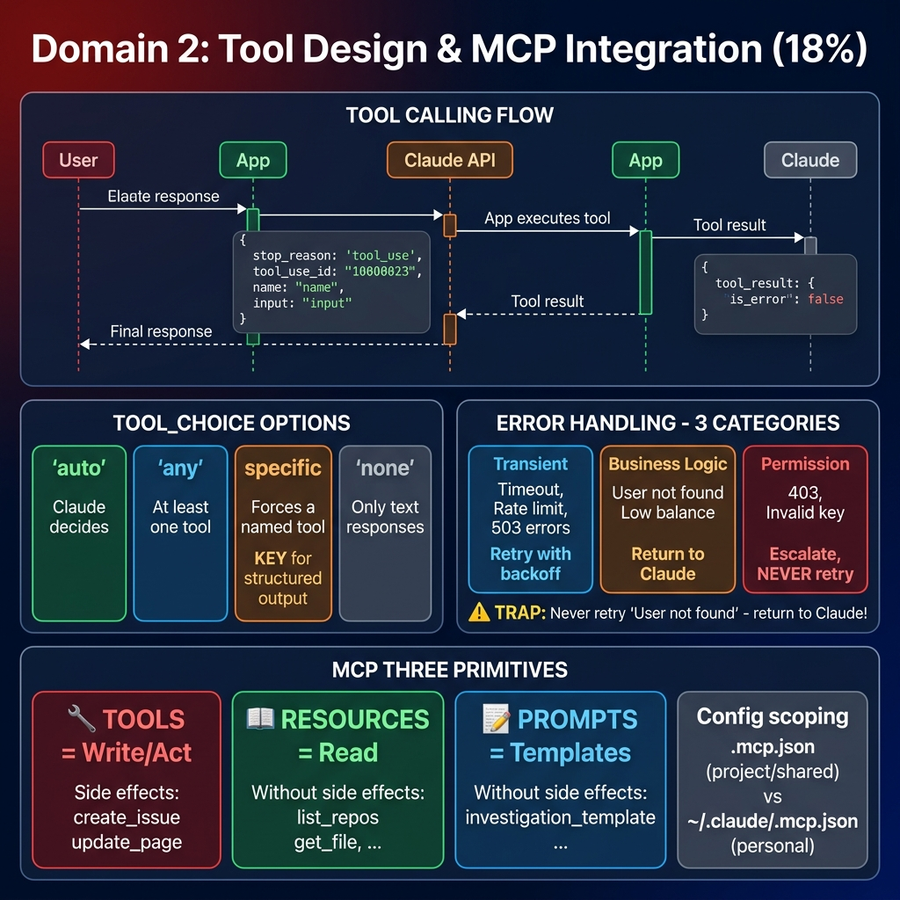
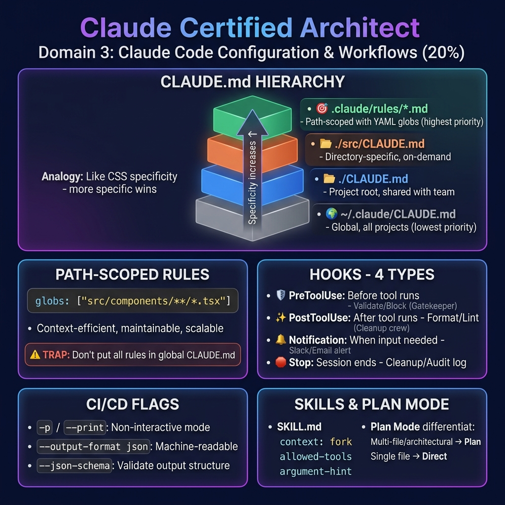
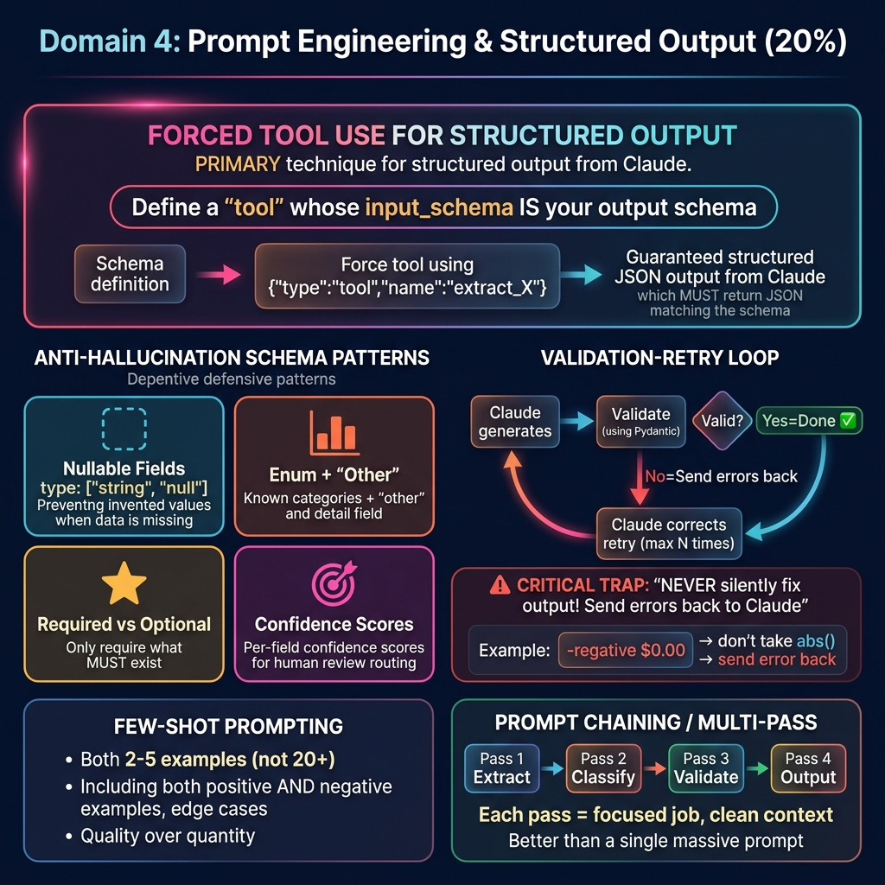
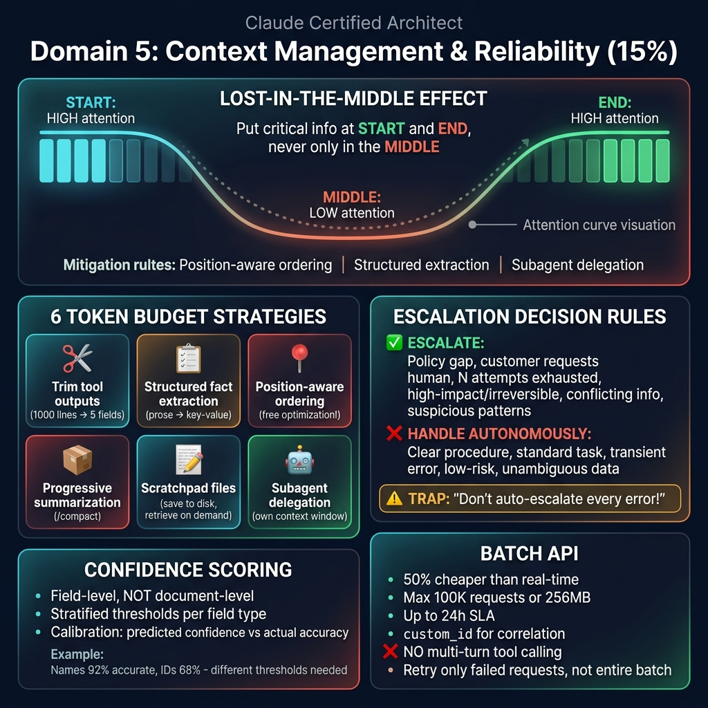

# 🖼️ Claude Certified Architect – Poster Gallery

A consolidated view of all the visual study aids for the Claude Certified Architect Foundations Exam.

## Master Exam Overview

## Domain 1: Agentic Architecture (27%)

## Domain 2: Tool Design & MCP (18%)

## Domain 3: Claude Code Config (20%)

## Domain 4: Prompt Engineering (20%)

## Domain 5: Context Management & Reliability (15%)

## Exam Strategy & Anti-Patterns

---

# 📚 Additional Study Resources

## Exam Blueprints

## Presentations & Video Content
- **[Download Claude Architect Blueprint Presentation (PPTX)](./posters/Claude_Architect_Blueprint.pptx)**
- **[Official Certification Exam Guide (PDF)](../Claude+Certified+Architect+–+Foundations+Certification+Exam+Guide.pdf)**

<iframe src="https://view.officeapps.live.com/op/embed.aspx?src=https%3A%2F%2Fraw.githubusercontent.com%2Fsamargupta096%2Fsoftware-engineering%2Fmain%2Fclaude%2Flearning%2Fposters%2FClaude_Architect_Blueprint.pptx" width="100%" height="600px" frameborder="0" title="Claude Architect Blueprint Presentation">This is an embedded <a target="_blank" href="https://office.com">Microsoft Office</a> presentation, powered by <a target="_blank" href="https://office.com/webapps">Office</a>.</iframe>

**Watch the Architect Blueprint Video:**
https://github.com/samargupta096/software-engineering/raw/main/claude/learning/posters/Thinking_Like_a_Claude_Architect.mp4

## Architecture Mind Map

