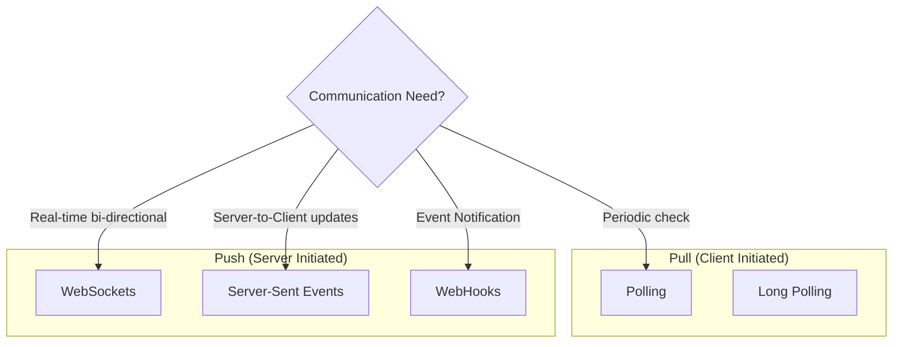
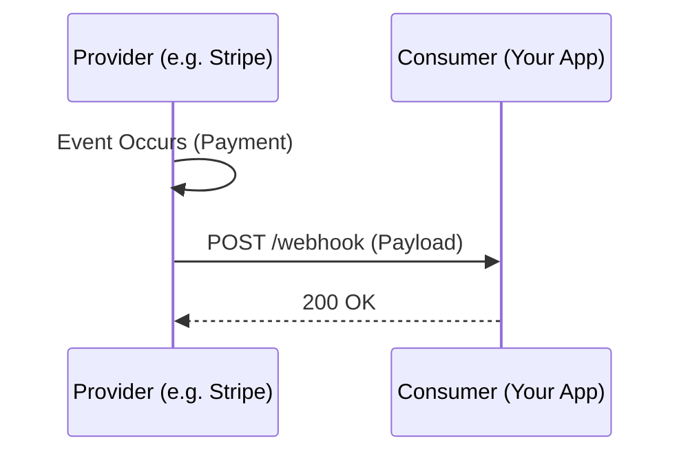

# System Communication Patterns

A deep dive into how systems talk to each other, comparing synchronous vs. asynchronous, and push vs. pull models.

---

## 1. Overview Map

Choosing the right communication pattern depends on **Latency**, **Frequency**, and **Direction**.



---

## 2. Polling Patterns

### Short Polling
The client repeatedly sends HTTP requests to the server at fixed intervals to check for new data.

- **Flow**: Request -> Response (No Data) -> Wait 2s -> Request -> Response (Data).
- **Pros**: Simple to implement. Standard HTTP.
- **Cons**: Wasteful (bandwidth & server resources), latency issues (data arrives between polls).
- **Use Case**: Non-critical dashboards (e.g., weather updates every 10 mins).

### Long Polling
The client sends a request, and the **server holds the connection open** until data is available or a timeout occurs.

- **Flow**:
  1. Client: "Any new messages?"
  2. Server: ... (Waits 20s) ...
  3. Server: "Yes, here!" (or Timeout)
  4. Client: Processes data -> Immediately sends new request.
- **Pros**: Better latency than short polling.
- **Cons**: Server resource intensity (holding threads).
- **Use Case**: Simple notification systems (e.g., waiting for a report generation to finish).

---

## 3. Server-Sent Events (SSE)

A standard for streaming data from server to client over a single HTTP connection.

- **Protocol**: HTTP (Text-based, `Content-Type: text/event-stream`).
- **Direction**: Unidirectional (Server -> Client).
- **Flow**:
  1. Client connects via `EventSource`.
  2. Server keeps connection open and pushes "events".
  3. Automatic reconnection built-in.

```javascript
// Client Code
const evtSource = new EventSource("/api/stream-updates");
evtSource.onmessage = (event) => {
  console.log("New data:", event.data);
};
```

- **Pros**: Simple, uses standard HTTP, traversing firewalls easily.
- **Cons**: Unidirectional only.
- **Use Case**: Stock tickers, news feeds, sport scores.

---

## 4. WebSockets

A persistent, full-duplex communication channel over a single TCP connection.

- **Protocol**: `ws://` (or `wss://` for secure). Starts as HTTP Upgrade handshake.
- **Direction**: Bidirectional (Server <-> Client).
- **Flow**:
  1. Client sends HTTP GET with `Upgrade: websocket`.
  2. Server responds `101 Switching Protocols`.
  3. Connection remains open for binary/text frames.

- **Pros**: Lowest latency, full duplex.
- **Cons**: Complex to scale (stateful connections requires sticky sessions or Redis Pub/Sub backend).
- **Use Case**: Chat apps, multiplayer games, collaborative editing (Google Docs).

---

## 5. WebHooks (Reverse API)

User-defined HTTP callbacks. Instead of you polling the API, **the API calls you** when an event happens.

- **Direction**: Server (Provider) -> Server (Consumer).
- **Flow**:
  1. You register a URL (`https://api.myapp.com/hooks/stripe`) with the provider.
  2. Event happens (e.g., Payment Succeeded).
  3. Provider makes a POST request to your URL with the event payload.



### Critical Design Challenges

1.  **Security**: How do you know the request is actually from Stripe?
    - **Solution**: **HMAC Signatures**. Provider hashes the payload with a shared secret and sends it in a header (`X-Signature`). You re-hash and compare.
2.  **Reliability**: What if your server is down?
    - **Solution**: **Retries with Exponential Backoff**. Provider should retry (e.g., at 1m, 5m, 30m).
3.  **Idempotency**: What if you receive the same webhook twice?
    - **Solution**: Use `event_id` to track processed events. If processed, return 200 OK but ignore logic.
4.  **Ordering**: Events may arrive out of order.
    - **Solution**: Include `timestamp` in payload. Only update state if timestamp > current_state_timestamp.

---

## 6. Comparison Matrix

| Feature | Polling | Long Polling | SSE | WebSockets | WebHooks |
| :--- | :--- | :--- | :--- | :--- | :--- |
| **Direction** | Client -> Server | Client -> Server | Server -> Client | Bi-directional | Server -> Server |
| **Protocol** | HTTP | HTTP | HTTP | TCP (WS) | HTTP (POST) |
| **Latency** | High | Medium | Low | Lowest | Low |
| **Complexity** | Low | Medium | Low | High | Medium |
| **Stateful?** | No | Yes (during hold) | Yes | Yes | No |
| **Best For** | Non-urgent data | Job completion | Live Feeds | Games, Chat | Event Notifications |

---

### Summary
- Use **WebHooks** for system-to-system notifications.
- Use **WebSockets** for real-time interactive apps.
- Use **SSE** for live feed updates.
- Use **Polling** only when simplicity is key and latency doesn't matter.
