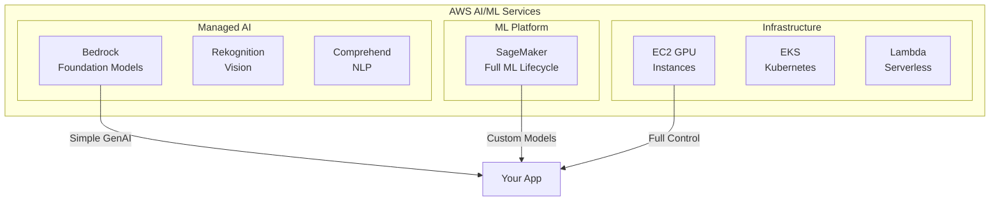
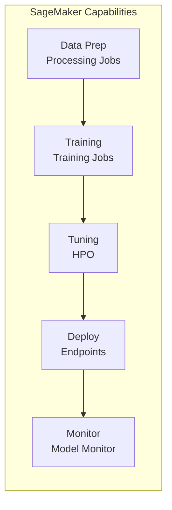
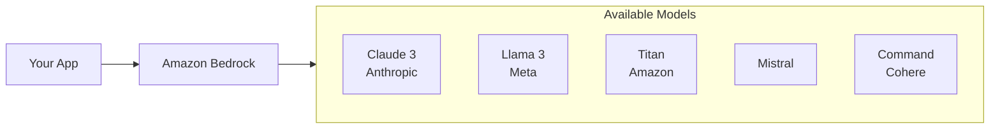
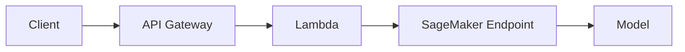
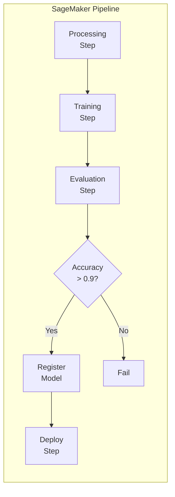
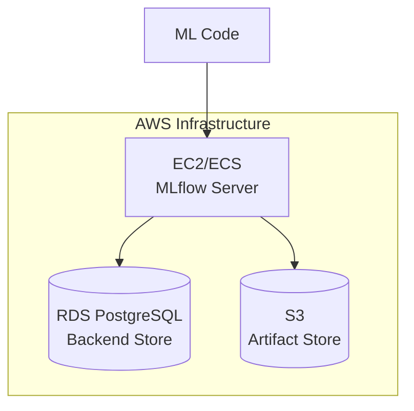

# AWS GenAI & MLOps Deep Dive

> Building Production ML Systems on AWS

---

## 📋 Table of Contents

1. [AWS ML Landscape](#-aws-ml-landscape)
2. [Amazon SageMaker](#-amazon-sagemaker)
3. [Amazon Bedrock](#-amazon-bedrock)
4. [Model Deployment Patterns](#-model-deployment-patterns)
5. [SageMaker Pipelines](#-sagemaker-pipelines)
6. [MLflow on AWS](#-mlflow-on-aws)
7. [Monitoring & Observability](#-monitoring--observability)
8. [Cost Optimization](#-cost-optimization)
9. [Interview Questions](#-interview-questions)

---

## 🌐 AWS ML Landscape



### When to Use What

| Service | Use Case | Complexity | Cost |
|---------|----------|------------|------|
| **Bedrock** | Use pre-built LLMs (Claude, Llama) | Low | Pay-per-token |
| **SageMaker** | Custom training, fine-tuning | Medium-High | Compute-based |
| **EC2 + Docker** | Full control, specialized needs | High | Instance-based |
| **Lambda** | Lightweight inference | Low | Per-invocation |

---

## 🧪 Amazon SageMaker

### What is SageMaker?

SageMaker is AWS's fully managed ML platform covering the entire lifecycle:



### Key SageMaker Components

| Component | Purpose |
|-----------|---------|
| **Studio** | IDE for ML development |
| **Training Jobs** | Managed training on any instance type |
| **Processing Jobs** | Data preprocessing at scale |
| **Endpoints** | Real-time inference hosting |
| **Batch Transform** | Batch inference |
| **Pipelines** | ML workflow orchestration |
| **Model Registry** | Model versioning and governance |
| **Feature Store** | Centralized feature management |
| **Experiments** | Track and compare experiments |

### Training a Model

```python
import sagemaker
from sagemaker.huggingface import HuggingFace

# Initialize session
session = sagemaker.Session()
role = sagemaker.get_execution_role()

# Define Hugging Face estimator
huggingface_estimator = HuggingFace(
    entry_point='train.py',
    source_dir='./scripts',
    instance_type='ml.p3.2xlarge',
    instance_count=1,
    role=role,
    transformers_version='4.37',
    pytorch_version='2.1',
    py_version='py310',
    hyperparameters={
        'epochs': 3,
        'train_batch_size': 8,
        'learning_rate': 2e-5,
        'model_name': 'meta-llama/Llama-3.2-3B'
    }
)

# Start training
huggingface_estimator.fit({
    'train': 's3://my-bucket/train-data',
    'validation': 's3://my-bucket/val-data'
})
```

### Training Script (train.py)

```python
import argparse
import torch
from transformers import (
    AutoModelForCausalLM,
    AutoTokenizer,
    Trainer,
    TrainingArguments
)
from datasets import load_from_disk

def parse_args():
    parser = argparse.ArgumentParser()
    parser.add_argument('--epochs', type=int, default=3)
    parser.add_argument('--train_batch_size', type=int, default=8)
    parser.add_argument('--learning_rate', type=float, default=2e-5)
    parser.add_argument('--model_name', type=str)
    
    # SageMaker specific
    parser.add_argument('--model_dir', type=str, default=os.environ.get('SM_MODEL_DIR'))
    parser.add_argument('--train', type=str, default=os.environ.get('SM_CHANNEL_TRAIN'))
    
    return parser.parse_args()

def main():
    args = parse_args()
    
    # Load model and tokenizer
    tokenizer = AutoTokenizer.from_pretrained(args.model_name)
    model = AutoModelForCausalLM.from_pretrained(args.model_name)
    
    # Load dataset from S3 (SageMaker downloads to local)
    train_dataset = load_from_disk(args.train)
    
    # Training arguments
    training_args = TrainingArguments(
        output_dir=args.model_dir,
        num_train_epochs=args.epochs,
        per_device_train_batch_size=args.train_batch_size,
        learning_rate=args.learning_rate,
        save_strategy='epoch',
        logging_steps=100,
    )
    
    # Train
    trainer = Trainer(
        model=model,
        args=training_args,
        train_dataset=train_dataset,
        tokenizer=tokenizer,
    )
    trainer.train()
    
    # Save model
    trainer.save_model(args.model_dir)

if __name__ == '__main__':
    main()
```

### Deploying an Endpoint

```python
from sagemaker.huggingface import HuggingFaceModel

# Deploy trained model
huggingface_model = HuggingFaceModel(
    model_data=huggingface_estimator.model_data,  # S3 path to model.tar.gz
    role=role,
    transformers_version='4.37',
    pytorch_version='2.1',
    py_version='py310',
)

# Create endpoint
predictor = huggingface_model.deploy(
    initial_instance_count=1,
    instance_type='ml.g5.xlarge',
    endpoint_name='my-llm-endpoint'
)

# Invoke
response = predictor.predict({
    "inputs": "What is machine learning?",
    "parameters": {"max_new_tokens": 100}
})
```

### Instance Types for GenAI

| Instance | GPU | VRAM | Use Case |
|----------|-----|------|----------|
| ml.g5.xlarge | 1x A10G | 24GB | 7B model inference |
| ml.g5.2xlarge | 1x A10G | 24GB | 7B + larger batch |
| ml.g5.12xlarge | 4x A10G | 96GB | 70B model (quantized) |
| ml.p4d.24xlarge | 8x A100 | 320GB | Training large models |
| ml.inf2.xlarge | Inferentia2 | - | Cost-effective inference |

---

## 🪨 Amazon Bedrock

### What is Bedrock?

Bedrock is AWS's managed service for foundation models - no infrastructure to manage:



### Using Bedrock

```python
import boto3
import json

# Create Bedrock client
bedrock = boto3.client('bedrock-runtime', region_name='us-east-1')

def invoke_claude(prompt: str) -> str:
    """Invoke Claude via Bedrock"""
    body = json.dumps({
        "anthropic_version": "bedrock-2023-05-31",
        "max_tokens": 1024,
        "messages": [
            {"role": "user", "content": prompt}
        ]
    })
    
    response = bedrock.invoke_model(
        modelId="anthropic.claude-3-sonnet-20240229-v1:0",
        body=body
    )
    
    result = json.loads(response['body'].read())
    return result['content'][0]['text']

# Use it
response = invoke_claude("Explain RAG in 3 sentences")
print(response)
```

### Bedrock with LangChain

```python
from langchain_aws import ChatBedrock
from langchain_core.messages import HumanMessage

# Initialize
llm = ChatBedrock(
    model_id="anthropic.claude-3-sonnet-20240229-v1:0",
    region_name="us-east-1",
    model_kwargs={"temperature": 0.7, "max_tokens": 1024}
)

# Simple invocation
response = llm.invoke([HumanMessage(content="What is GenAI?")])
print(response.content)

# With streaming
for chunk in llm.stream([HumanMessage(content="Write a poem")]):
    print(chunk.content, end="", flush=True)
```

### Bedrock Knowledge Bases (RAG)

```python
import boto3

# Create knowledge base with vector store
bedrock_agent = boto3.client('bedrock-agent', region_name='us-east-1')

# Query knowledge base
response = bedrock_agent.retrieve_and_generate(
    input={'text': 'What are our refund policies?'},
    retrieveAndGenerateConfiguration={
        'type': 'KNOWLEDGE_BASE',
        'knowledgeBaseConfiguration': {
            'knowledgeBaseId': 'your-kb-id',
            'modelArn': 'arn:aws:bedrock:us-east-1::foundation-model/anthropic.claude-3-sonnet-20240229-v1:0'
        }
    }
)

print(response['output']['text'])
```

---

## 🚀 Model Deployment Patterns

### Pattern 1: Real-time Endpoint (SageMaker)



```python
# Lambda handler for SageMaker endpoint
import boto3
import json

runtime = boto3.client('sagemaker-runtime')

def lambda_handler(event, context):
    body = json.loads(event['body'])
    
    response = runtime.invoke_endpoint(
        EndpointName='my-llm-endpoint',
        ContentType='application/json',
        Body=json.dumps({
            "inputs": body['prompt'],
            "parameters": {"max_new_tokens": 256}
        })
    )
    
    result = json.loads(response['Body'].read())
    
    return {
        'statusCode': 200,
        'body': json.dumps({'response': result})
    }
```

### Pattern 2: Serverless (Bedrock + Lambda)

```python
# Lightweight Lambda for Bedrock
import boto3
import json

bedrock = boto3.client('bedrock-runtime')

def lambda_handler(event, context):
    body = json.loads(event['body'])
    
    response = bedrock.invoke_model(
        modelId="anthropic.claude-3-haiku-20240307-v1:0",  # Fast model
        body=json.dumps({
            "anthropic_version": "bedrock-2023-05-31",
            "max_tokens": 512,
            "messages": [{"role": "user", "content": body['prompt']}]
        })
    )
    
    result = json.loads(response['body'].read())
    
    return {
        'statusCode': 200,
        'body': json.dumps({'response': result['content'][0]['text']})
    }
```

### Pattern 3: Container on ECS/EKS

```dockerfile
# Dockerfile for custom LLM service
FROM python:3.11-slim

WORKDIR /app

COPY requirements.txt .
RUN pip install -r requirements.txt

COPY . .

# Download model at build time (or mount from S3)
RUN python download_model.py

EXPOSE 8080

CMD ["uvicorn", "main:app", "--host", "0.0.0.0", "--port", "8080"]
```

---

## 🔄 SageMaker Pipelines

### What is SageMaker Pipelines?

ML workflow orchestration - define, automate, and track ML workflows:



### Building a Pipeline

```python
from sagemaker.workflow.pipeline import Pipeline
from sagemaker.workflow.steps import ProcessingStep, TrainingStep
from sagemaker.workflow.conditions import ConditionGreaterThanOrEqualTo
from sagemaker.workflow.condition_step import ConditionStep
from sagemaker.processing import ScriptProcessor
from sagemaker.huggingface import HuggingFace

# Step 1: Data Processing
processor = ScriptProcessor(
    image_uri='your-processing-image',
    role=role,
    instance_count=1,
    instance_type='ml.m5.xlarge'
)

processing_step = ProcessingStep(
    name="PreprocessData",
    processor=processor,
    inputs=[...],
    outputs=[...],
    code='preprocess.py'
)

# Step 2: Training
estimator = HuggingFace(
    entry_point='train.py',
    instance_type='ml.p3.2xlarge',
    instance_count=1,
    role=role,
    transformers_version='4.37',
    pytorch_version='2.1',
    py_version='py310',
)

training_step = TrainingStep(
    name="TrainModel",
    estimator=estimator,
    inputs={'train': processing_step.properties.ProcessingOutputConfig.Outputs["train"].S3Output.S3Uri}
)

# Step 3: Condition (check metrics)
condition = ConditionGreaterThanOrEqualTo(
    left=training_step.properties.FinalMetricDataList[0].Value,
    right=0.9
)

condition_step = ConditionStep(
    name="CheckAccuracy",
    conditions=[condition],
    if_steps=[register_step, deploy_step],
    else_steps=[fail_step]
)

# Create Pipeline
pipeline = Pipeline(
    name="MyMLPipeline",
    steps=[processing_step, training_step, condition_step],
    sagemaker_session=session
)

# Execute
pipeline.upsert(role_arn=role)
execution = pipeline.start()
```

---

## 📊 MLflow on AWS

### Setting Up MLflow on AWS



### Using MLflow with SageMaker

```python
import mlflow
import mlflow.sagemaker

# Set tracking URI
mlflow.set_tracking_uri("http://your-mlflow-server:5000")
mlflow.set_experiment("genai-experiments")

# Start run
with mlflow.start_run(run_name="llama-finetune-v1") as run:
    # Log parameters
    mlflow.log_params({
        "model_name": "meta-llama/Llama-3.2-3B",
        "learning_rate": 2e-5,
        "epochs": 3,
        "lora_r": 16
    })
    
    # Train model
    trainer.train()
    
    # Log metrics
    mlflow.log_metrics({
        "train_loss": trainer.state.log_history[-1]['loss'],
        "eval_loss": eval_results['eval_loss']
    })
    
    # Log model artifact
    mlflow.log_artifacts("./model", artifact_path="model")
    
    # Register model
    mlflow.register_model(
        f"runs:/{run.info.run_id}/model",
        "llama-3-finetuned"
    )
```

### MLflow Model Registry

```python
from mlflow.tracking import MlflowClient

client = MlflowClient()

# Transition model to production
client.transition_model_version_stage(
    name="llama-3-finetuned",
    version=1,
    stage="Production"
)

# Load production model
model = mlflow.pyfunc.load_model("models:/llama-3-finetuned/Production")
```

---

## 📈 Monitoring & Observability

### SageMaker Model Monitor

```python
from sagemaker.model_monitor import DefaultModelMonitor
from sagemaker.model_monitor.dataset_format import DatasetFormat

# Create monitor
monitor = DefaultModelMonitor(
    role=role,
    instance_count=1,
    instance_type='ml.m5.xlarge',
    volume_size_in_gb=20,
    max_runtime_in_seconds=3600,
)

# Create baseline
monitor.suggest_baseline(
    baseline_dataset='s3://bucket/baseline-data.csv',
    dataset_format=DatasetFormat.csv(header=True),
    output_s3_uri='s3://bucket/baseline-results',
)

# Schedule monitoring
from sagemaker.model_monitor import CronExpressionGenerator

monitor.create_monitoring_schedule(
    monitor_schedule_name='my-monitor-schedule',
    endpoint_input=endpoint_name,
    output_s3_uri='s3://bucket/monitoring-results',
    schedule_cron_expression=CronExpressionGenerator.hourly(),
)
```

### CloudWatch Metrics

```python
import boto3

cloudwatch = boto3.client('cloudwatch')

# Custom metric for model latency
cloudwatch.put_metric_data(
    Namespace='GenAI/Inference',
    MetricData=[
        {
            'MetricName': 'InferenceLatency',
            'Value': latency_ms,
            'Unit': 'Milliseconds',
            'Dimensions': [
                {'Name': 'Endpoint', 'Value': 'my-llm-endpoint'},
                {'Name': 'Model', 'Value': 'llama-3-finetuned'}
            ]
        }
    ]
)
```

---

## 💰 Cost Optimization

### Strategies

| Strategy | Savings | When to Use |
|----------|---------|-------------|
| **Spot Instances** | Up to 90% | Training jobs |
| **Inference Components** | 30-50% | Multi-model endpoints |
| **Graviton Instances** | 20-30% | CPU inference |
| **Inferentia** | 50-70% | High-volume inference |
| **Bedrock** | Variable | Simple use cases |

### Using Spot Instances

```python
from sagemaker.huggingface import HuggingFace

estimator = HuggingFace(
    entry_point='train.py',
    instance_type='ml.p3.2xlarge',
    instance_count=1,
    role=role,
    use_spot_instances=True,               # Enable spot
    max_wait=7200,                          # Max wait time
    max_run=3600,                           # Max training time
    checkpoint_s3_uri='s3://bucket/checkpoints', # For spot interruption
    transformers_version='4.37',
    pytorch_version='2.1',
)
```

---

## 🎯 Interview Questions

**Q1: When would you use Bedrock vs SageMaker for LLM deployment?**

**Answer:**
- **Bedrock**: Use pre-trained models (Claude, Llama), no infrastructure management, pay-per-token, quick prototyping
- **SageMaker**: Custom training, fine-tuning, full control over infrastructure, cost optimization at scale, custom models

---

**Q2: How do you handle model versioning and deployment in AWS?**

**Answer:**
1. **Model Registry**: SageMaker Model Registry or MLflow for versioning
2. **Approval workflow**: Manual or automated approval before production
3. **Blue-green deployment**: Deploy new version alongside old
4. **Gradual rollout**: Use endpoint traffic splitting
5. **Rollback**: Keep previous version available for quick rollback

---

**Q3: How do you optimize costs for LLM inference on AWS?**

**Answer:**
1. **Right-size instances**: Match instance to model size
2. **Auto-scaling**: Scale based on traffic
3. **Spot instances**: For non-critical or batch inference
4. **Model optimization**: Quantization, distillation
5. **Caching**: Cache frequent responses
6. **Batching**: Group requests for efficiency
7. **Inferentia**: Use AWS custom chips for supported models

---

**Q4: Explain SageMaker Pipeline components.**

**Answer:**
- **Processing Step**: Data preprocessing, feature engineering
- **Training Step**: Model training with any estimator
- **Condition Step**: Branch based on metrics
- **Model Step**: Create model from training artifacts
- **Register Step**: Add to model registry
- **Deploy Step**: Create/update endpoint
- **Lambda Step**: Run custom Lambda functions
- **Callback Step**: Wait for external approvals

---

## 📚 Further Reading

- [SageMaker Developer Guide](https://docs.aws.amazon.com/sagemaker/)
- [Bedrock User Guide](https://docs.aws.amazon.com/bedrock/)
- [MLflow on AWS](https://aws.amazon.com/blogs/machine-learning/managing-your-machine-learning-lifecycle-with-mlflow-and-amazon-sagemaker/)
- [SageMaker Examples GitHub](https://github.com/aws/amazon-sagemaker-examples)

---

*Previous: [Agentic AI Guide](./agentic-ai-guide.md) | Next: [FastAPI Guide](./fastapi-guide.md)*
