# Deep Learning Fundamentals

A comprehensive guide to Neural Networks and Deep Learning, with intuitive explanations, mathematics, Python code, and real-world applications.

---

## 🏛️ Overview: What is Deep Learning?

Deep Learning is a subset of **Machine Learning** that uses **Artificial Neural Networks** with many layers (hence "deep") to learn patterns directly from raw data.

### The Problem Layer
Traditionally, machine learning required "manual feature engineering" (humans picking important features). **Deep Learning automates this** by learning the features itself.

### Deep Learning vs. Machine Learning

| Feature | Machine Learning | Deep Learning |
| :--- | :--- | :--- |
| **Data requirement** | Performs well on small/medium data | Requires **tens of thousands** of samples |
| **Feature engineering** | Most features are manual | **Automatic** feature discovery |
| **Hardware** | Works on standard CPUs | Requires **GPUs/TPUs** for parallel math |
| **Training time** | Minutes to hours | Days to weeks (for large models) |
| **Interpretability** | Easier to explain (White box) | Very difficult to explain (Black box) |

---


## 🗺️ Learning Roadmap

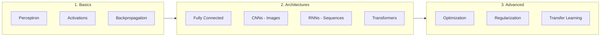

---

## 1️⃣ Neural Network Fundamentals

### What is a Neural Network?

A **Neural Network** is a computational model inspired by the human brain. It consists of interconnected nodes (neurons) organized in layers that learn to map inputs to outputs by adjusting connection weights during training.

**Why it works**: Neural networks are **universal function approximators** - given enough neurons, they can learn any continuous function from data. This makes them incredibly powerful for tasks like image recognition, language understanding, and decision making.

```mermaid
graph LR
    subgraph Input["Input Layer"]
        I1[x₁]
        I2[x₂]
        I3[x₃]
    end
    
    subgraph Hidden["Hidden Layer"]
        H1[h₁]
        H2[h₂]
    end
    
    subgraph Output["Output Layer"]
        O1[ŷ]
    end
    
    I1 & I2 & I3 --> H1 & H2
    H1 & H2 --> O1
```

### The Perceptron (Single Neuron)

The **perceptron** is the simplest neural network - a single neuron that takes weighted inputs, sums them, adds a bias, and passes through an activation function.

**Intuition**: Think of it as a decision-maker. Each input has a "vote" (weight), and if the total vote exceeds a threshold (bias), it fires (outputs 1).

$$y = \sigma\left(\sum_{i=1}^{n} w_i x_i + b\right) = \sigma(\mathbf{w}^T \mathbf{x} + b)$$

Where:
- $\mathbf{x}$ = input features
- $\mathbf{w}$ = weights (learnable)
- $b$ = bias (learnable)
- $\sigma$ = activation function

```python
import numpy as np

class Perceptron:
    def __init__(self, n_inputs):
        self.weights = np.random.randn(n_inputs)
        self.bias = 0
    
    def forward(self, x):
        z = np.dot(self.weights, x) + self.bias
        return self.sigmoid(z)
    
    def sigmoid(self, z):
        return 1 / (1 + np.exp(-z))

# Usage
neuron = Perceptron(3)
output = neuron.forward([0.5, 0.3, 0.2])
```

---

## 2️⃣ Activation Functions

### Why Activation Functions?

Without activation functions, a neural network would just be **linear transformations stacked together**, which collapses to a single linear function. Activation functions introduce **non-linearity**, enabling networks to learn complex patterns.

**Analogy**: Imagine a network without activations as stacking transparent sheets - no matter how many you stack, you can still see through. Activations are like adding colored filters that create rich, complex patterns.

### Common Activation Functions

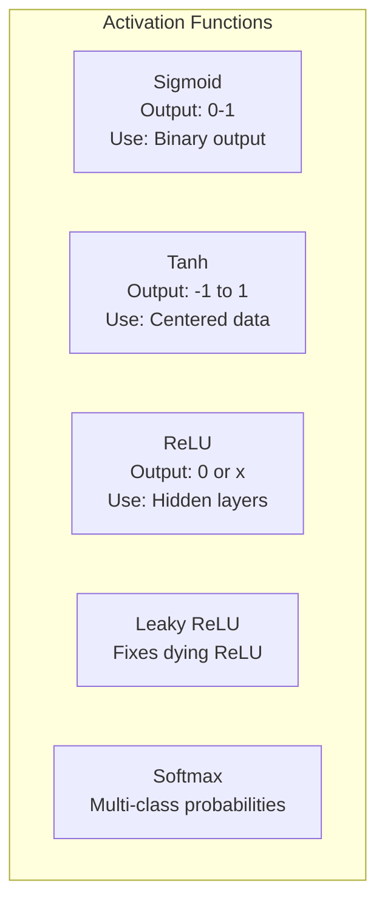

| Function | Formula | Range | Pros | Cons |
| :--- | :--- | :--- | :--- | :--- |
| **Sigmoid** | $\frac{1}{1+e^{-x}}$ | (0, 1) | Smooth, probabilistic | Vanishing gradient |
| **Tanh** | $\frac{e^x - e^{-x}}{e^x + e^{-x}}$ | (-1, 1) | Zero-centered | Vanishing gradient |
| **ReLU** | $\max(0, x)$ | [0, ∞) | Fast, no saturation | Dying neurons |
| **Leaky ReLU** | $\max(0.01x, x)$ | (-∞, ∞) | No dying neurons | Extra hyperparameter |
| **Softmax** | $\frac{e^{x_i}}{\sum e^{x_j}}$ | (0, 1) | Probabilities sum to 1 | Expensive |

```python
import numpy as np

def relu(x):
    """Most popular for hidden layers - fast and effective"""
    return np.maximum(0, x)

def leaky_relu(x, alpha=0.01):
    """Fixes the 'dying ReLU' problem by allowing small negative gradients"""
    return np.where(x > 0, x, alpha * x)

def softmax(x):
    """Converts logits to probabilities for multi-class classification"""
    exp_x = np.exp(x - np.max(x))  # Subtract max for numerical stability
    return exp_x / exp_x.sum()

# Example
logits = [2.0, 1.0, 0.1]
print(softmax(logits))  # [0.659, 0.242, 0.099] - probabilities sum to 1
```

---

## 3️⃣ Forward and Backward Propagation

### Forward Propagation

**Forward propagation** is the process of passing inputs through the network layer by layer to get predictions. Each layer transforms the input using weights, biases, and activations.

**Intuition**: Data flows like water through pipes. Each layer is a filter that transforms the water, extracting more abstract features as it flows deeper.

```mermaid
flowchart LR
    X[Input X] --> L1["Layer 1\nz₁ = W₁x + b₁\na₁ = σ(z₁)"]
    L1 --> L2["Layer 2\nz₂ = W₂a₁ + b₂\na₂ = σ(z₂)"]
    L2 --> Y["Output ŷ"]
```

```python
import numpy as np

class NeuralNetwork:
    def __init__(self):
        # Layer 1: 3 inputs -> 4 hidden neurons
        self.W1 = np.random.randn(4, 3) * 0.01
        self.b1 = np.zeros((4, 1))
        # Layer 2: 4 hidden -> 1 output
        self.W2 = np.random.randn(1, 4) * 0.01
        self.b2 = np.zeros((1, 1))
    
    def forward(self, X):
        # Layer 1
        self.z1 = np.dot(self.W1, X) + self.b1
        self.a1 = np.maximum(0, self.z1)  # ReLU
        
        # Layer 2
        self.z2 = np.dot(self.W2, self.a1) + self.b2
        self.a2 = 1 / (1 + np.exp(-self.z2))  # Sigmoid
        
        return self.a2
```

### Backpropagation

**Backpropagation** is the algorithm that calculates how much each weight contributed to the error. It uses the **chain rule** of calculus to propagate gradients backward through the network.

**Intuition**: Imagine you're adjusting a recipe. If the dish is too salty, you trace back: Was it the salt added at step 3? Or did step 1's broth contribute? Backprop does exactly this - it assigns "blame" to each ingredient (weight) for the final taste (error).

$$\frac{\partial L}{\partial w} = \frac{\partial L}{\partial \hat{y}} \cdot \frac{\partial \hat{y}}{\partial z} \cdot \frac{\partial z}{\partial w}$$

```mermaid
flowchart RL
    LOSS[Loss L] --> dL["∂L/∂ŷ"]
    dL --> dZ2["∂L/∂z₂"]
    dZ2 --> dW2["∂L/∂W₂"]
    dZ2 --> dA1["∂L/∂a₁"]
    dA1 --> dZ1["∂L/∂z₁"]
    dZ1 --> dW1["∂L/∂W₁"]
```

```python
def backward(self, X, y):
    m = X.shape[1]  # Number of samples
    
    # Output layer gradients
    dZ2 = self.a2 - y  # Derivative of sigmoid + cross-entropy
    dW2 = (1/m) * np.dot(dZ2, self.a1.T)
    db2 = (1/m) * np.sum(dZ2, axis=1, keepdims=True)
    
    # Hidden layer gradients
    dA1 = np.dot(self.W2.T, dZ2)
    dZ1 = dA1 * (self.z1 > 0)  # ReLU derivative
    dW1 = (1/m) * np.dot(dZ1, X.T)
    db1 = (1/m) * np.sum(dZ1, axis=1, keepdims=True)
    
    return dW1, db1, dW2, db2
```

---

## 4️⃣ Loss Functions

Loss functions measure **how wrong** the model's predictions are. Training minimizes this loss.

### For Regression

**Mean Squared Error (MSE)**: Penalizes large errors heavily due to squaring.

$$L = \frac{1}{n} \sum (y - \hat{y})^2$$

**Use case**: Predicting house prices, stock values.

### For Classification

**Binary Cross-Entropy**: Measures how well predicted probabilities match true labels (0 or 1).

$$L = -\frac{1}{n} \sum [y \log(\hat{y}) + (1-y) \log(1-\hat{y})]$$

**Intuition**: If true label is 1 and you predict 0.99, loss is very small (-log(0.99) ≈ 0.01). If you predict 0.01, loss is huge (-log(0.01) ≈ 4.6).

**Categorical Cross-Entropy**: For multi-class classification.

$$L = -\sum_{c=1}^{C} y_c \log(\hat{y}_c)$$

```python
import numpy as np

def mse_loss(y_true, y_pred):
    return np.mean((y_true - y_pred) ** 2)

def binary_cross_entropy(y_true, y_pred):
    epsilon = 1e-15  # Prevent log(0)
    y_pred = np.clip(y_pred, epsilon, 1 - epsilon)
    return -np.mean(y_true * np.log(y_pred) + (1 - y_true) * np.log(1 - y_pred))
```

---

## 5️⃣ Optimization Algorithms

Optimizers update weights to minimize loss. The choice of optimizer dramatically affects training speed and final performance.

### Gradient Descent Variants

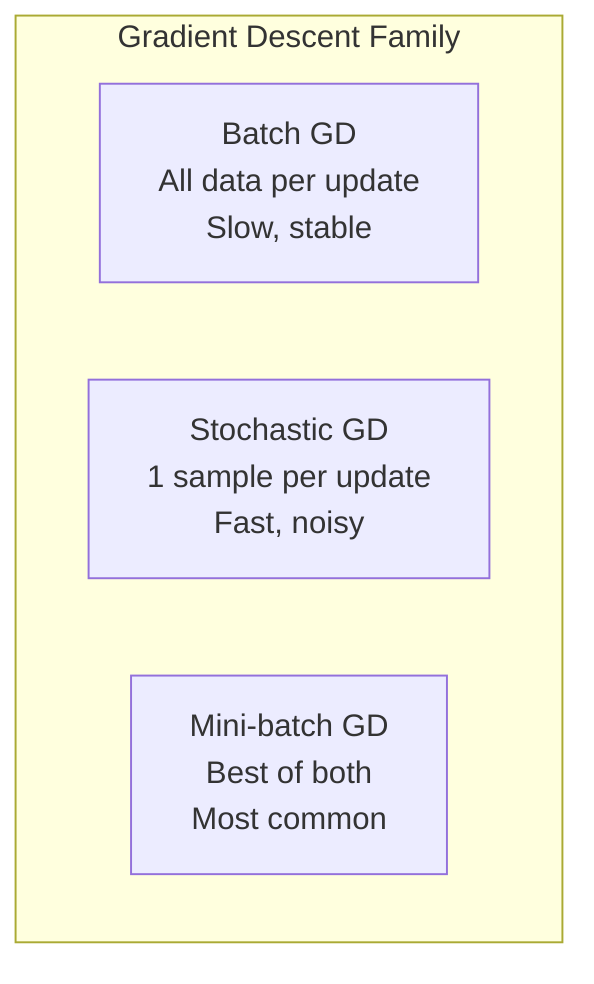

### SGD (Stochastic Gradient Descent)

**Basic update rule**: Move weights in the direction that reduces loss.

$$w = w - \alpha \cdot \nabla_w L$$

**Problem**: Can be slow and oscillate in ravines.

### Momentum

**Idea**: Accumulate velocity in directions of consistent gradient, like a ball rolling downhill.

$$v_t = \beta v_{t-1} + \nabla_w L$$
$$w = w - \alpha \cdot v_t$$

**Intuition**: Helps escape local minima and accelerates convergence.

### Adam (Adaptive Moment Estimation)

**The most popular optimizer**. Combines momentum with adaptive learning rates per parameter.

$$m_t = \beta_1 m_{t-1} + (1-\beta_1) g_t \quad \text{(momentum)}$$
$$v_t = \beta_2 v_{t-1} + (1-\beta_2) g_t^2 \quad \text{(RMSprop)}$$
$$w = w - \alpha \cdot \frac{\hat{m}_t}{\sqrt{\hat{v}_t} + \epsilon}$$

**Why Adam works**: It adapts the learning rate for each parameter based on historical gradients. Parameters with sparse gradients get larger updates.

```python
import tensorflow as tf

# Most common choice
optimizer = tf.keras.optimizers.Adam(learning_rate=0.001)

# For fine-tuning with smaller learning rate
optimizer = tf.keras.optimizers.Adam(learning_rate=1e-5)

# SGD with momentum for specific cases
optimizer = tf.keras.optimizers.SGD(learning_rate=0.01, momentum=0.9)
```

| Optimizer | Best For | Learning Rate |
| :--- | :--- | :--- |
| **SGD + Momentum** | Computer vision, large datasets | 0.01 - 0.1 |
| **Adam** | Most tasks, default choice | 0.001 |
| **AdamW** | Transformers, NLP | 1e-4 to 1e-5 |
| **RMSprop** | RNNs | 0.001 |

---

## 6️⃣ Regularization Techniques

Regularization prevents **overfitting** - when the model memorizes training data but fails on new data.

### Dropout

**Idea**: During training, randomly "drop" (set to 0) a percentage of neurons in each layer.

**Why it works**: Forces the network to not rely on any single neuron, creating redundancy. It's like training an ensemble of smaller networks.

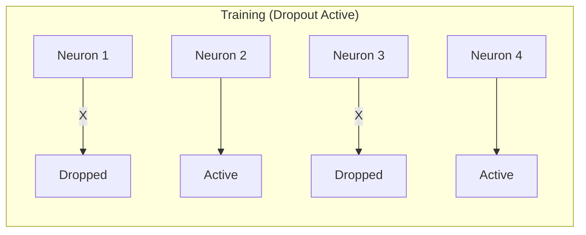

```python
from tensorflow.keras.layers import Dense, Dropout

model = tf.keras.Sequential([
    Dense(256, activation='relu'),
    Dropout(0.5),  # Drop 50% of neurons during training
    Dense(128, activation='relu'),
    Dropout(0.3),  # Drop 30%
    Dense(10, activation='softmax')
])
```

### Batch Normalization

**Idea**: Normalize the inputs to each layer to have zero mean and unit variance.

**Why it works**: 
1. Allows higher learning rates (faster training)
2. Reduces internal covariate shift (layer input distributions changing during training)
3. Has slight regularization effect

$$\hat{x} = \frac{x - \mu}{\sqrt{\sigma^2 + \epsilon}} \cdot \gamma + \beta$$

```python
from tensorflow.keras.layers import BatchNormalization

model = tf.keras.Sequential([
    Dense(256),
    BatchNormalization(),
    tf.keras.layers.Activation('relu'),
    Dense(128),
    BatchNormalization(),
    tf.keras.layers.Activation('relu'),
    Dense(10, activation='softmax')
])
```

### Early Stopping

**Idea**: Stop training when validation loss stops improving.

**Why it works**: Prevents the model from overfitting to training data in later epochs.

```python
early_stopping = tf.keras.callbacks.EarlyStopping(
    monitor='val_loss',
    patience=10,  # Wait 10 epochs for improvement
    restore_best_weights=True
)

model.fit(X_train, y_train, 
          validation_split=0.2,
          epochs=100,
          callbacks=[early_stopping])
```

---

## 7️⃣ Convolutional Neural Networks (CNNs)

CNNs are specialized for **grid-like data** (images, audio spectrograms). They use convolution operations to detect local patterns.

### Why CNNs for Images?

**Problem with Fully Connected**: A 224x224 RGB image has 150,528 input values. Connecting each to 1000 hidden neurons = 150 million weights. Memory-intensive and prone to overfitting.

**CNN Solution**: 
1. **Parameter sharing**: Same filter applied across entire image
2. **Local connectivity**: Each neuron only sees a small region
3. **Translation invariance**: Can detect a cat whether it's left or top of image

### CNN Architecture

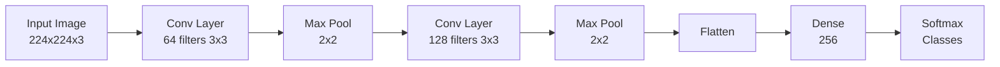

### Convolution Operation

A **filter** (kernel) slides across the image, computing dot products to detect patterns like edges, textures, and shapes.

```python
from tensorflow.keras.layers import Conv2D, MaxPooling2D, Flatten, Dense

model = tf.keras.Sequential([
    # Convolutional layers - feature extraction
    Conv2D(32, (3, 3), activation='relu', input_shape=(224, 224, 3)),
    MaxPooling2D((2, 2)),
    
    Conv2D(64, (3, 3), activation='relu'),
    MaxPooling2D((2, 2)),
    
    Conv2D(128, (3, 3), activation='relu'),
    MaxPooling2D((2, 2)),
    
    # Fully connected layers - classification
    Flatten(),
    Dense(256, activation='relu'),
    Dropout(0.5),
    Dense(10, activation='softmax')
])
```

### Key CNN Concepts

| Concept | Description |
| :--- | :--- |
| **Stride** | How many pixels the filter moves each step |
| **Padding** | Adding zeros around image to preserve size |
| **Pooling** | Downsampling to reduce spatial dimensions |
| **Receptive Field** | Area of input that affects a neuron's output |

---

## 8️⃣ Recurrent Neural Networks (RNNs)

RNNs are designed for **sequential data** where order matters (text, time series, speech).

### Why RNNs?

**Problem**: Standard networks assume inputs are independent. But in "I grew up in France, I speak ___", the answer depends on earlier context.

**Solution**: RNNs have **memory** - they pass information from previous steps.

### RNN Architecture

```mermaid
flowchart LR
    X1[x₁] --> H1[h₁]
    X2[x₂] --> H2[h₂]
    X3[x₃] --> H3[h₃]
    H1 --> |Hidden State| H2
    H2 --> |Hidden State| H3
    H3 --> Y[Output]
```

$$h_t = \tanh(W_{xh} x_t + W_{hh} h_{t-1} + b_h)$$

### LSTM (Long Short-Term Memory)

**Problem with vanilla RNN**: Vanishing gradient - can't learn long-range dependencies (forgets early words in long sentences).

**LSTM Solution**: Introduces **gates** that control information flow:
- **Forget Gate**: What to forget from previous state
- **Input Gate**: What new information to add
- **Output Gate**: What to output from cell state

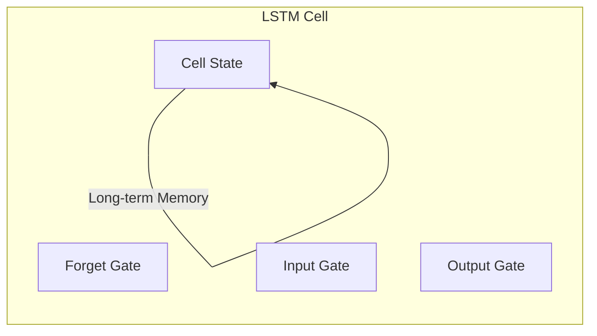

```python
from tensorflow.keras.layers import LSTM, Dense, Embedding

# Text classification with LSTM
model = tf.keras.Sequential([
    Embedding(vocab_size, 128, input_length=max_length),
    LSTM(128, return_sequences=True),
    LSTM(64),
    Dense(1, activation='sigmoid')
])
```

### GRU (Gated Recurrent Unit)

**Simplified LSTM** with 2 gates instead of 3. Faster to train, often similar performance.

```python
from tensorflow.keras.layers import GRU

model = tf.keras.Sequential([
    Embedding(vocab_size, 128),
    GRU(128),
    Dense(num_classes, activation='softmax')
])
```

---

## 9️⃣ Transformers & Attention

The **Transformer** architecture revolutionized NLP and is now used in vision too.

### Why Transformers?

**RNN Limitations**:
1. Sequential processing - can't parallelize
2. Still struggles with very long sequences
3. Distant words have weak influence

**Transformer Solution**: **Attention** - allows each position to directly attend to all other positions.

### Self-Attention Mechanism

**Intuition**: For each word, compute how much it should "attend" to every other word in the sentence.

In "The cat sat on the mat because **it** was tired", attention helps "it" strongly attend to "cat".

$$\text{Attention}(Q, K, V) = \text{softmax}\left(\frac{QK^T}{\sqrt{d_k}}\right)V$$

```mermaid
flowchart TB
    INPUT[Input Embeddings] --> Q[Query Q]
    INPUT --> K[Key K]
    INPUT --> V[Value V]
    Q --> ATTN[Attention Scores\nQ·K^T / √d]
    K --> ATTN
    ATTN --> SOFT[Softmax]
    SOFT --> OUT[Weighted Sum with V]
    V --> OUT
```

### Transformer Architecture

```python
from transformers import TFAutoModel

# Load pre-trained BERT
model = TFAutoModel.from_pretrained('bert-base-uncased')

# For classification, add a head
from tensorflow.keras.layers import Dense

class BERTClassifier(tf.keras.Model):
    def __init__(self, num_classes):
        super().__init__()
        self.bert = TFAutoModel.from_pretrained('bert-base-uncased')
        self.classifier = Dense(num_classes, activation='softmax')
    
    def call(self, inputs):
        outputs = self.bert(inputs)
        pooled = outputs.last_hidden_state[:, 0, :]  # [CLS] token
        return self.classifier(pooled)
```

---

## 🔟 Transfer Learning

**Transfer Learning** uses knowledge from a model trained on one task to help with another task. This is crucial because:
1. Training large models from scratch is expensive
2. Not everyone has millions of labeled examples
3. Pre-trained models have learned useful general features

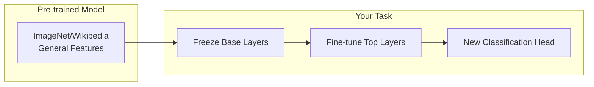

### Transfer Learning Strategies

| Strategy | When to Use |
| :--- | :--- |
| **Feature Extraction** | Small dataset, similar domain |
| **Fine-tuning (last layers)** | Medium dataset |
| **Full fine-tuning** | Large dataset, different domain |

```python
from tensorflow.keras.applications import ResNet50
from tensorflow.keras.layers import Dense, GlobalAveragePooling2D

# Load pre-trained ResNet (without top classification layer)
base_model = ResNet50(weights='imagenet', include_top=False, input_shape=(224, 224, 3))

# Freeze base model weights
base_model.trainable = False

# Add custom classification head
model = tf.keras.Sequential([
    base_model,
    GlobalAveragePooling2D(),
    Dense(256, activation='relu'),
    Dropout(0.5),
    Dense(10, activation='softmax')
])

# Train only the new layers
model.compile(optimizer='adam', loss='categorical_crossentropy', metrics=['accuracy'])
model.fit(train_data, epochs=10)

# Fine-tune: Unfreeze top layers of base model
base_model.trainable = True
for layer in base_model.layers[:-20]:  # Freeze all but last 20 layers
    layer.trainable = False

# Re-compile with lower learning rate for fine-tuning
model.compile(optimizer=tf.keras.optimizers.Adam(1e-5), 
              loss='categorical_crossentropy', 
              metrics=['accuracy'])
model.fit(train_data, epochs=10)
```

---

## 1️⃣1️⃣ Generative Adversarial Networks (GANs)

GANs are a framework for training **generative models** by pitting two networks against each other in a game.

### The Genius Idea

**Intuition**: Imagine a counterfeiter (Generator) trying to create fake money, and a detective (Discriminator) trying to catch fakes. As the detective gets better, the counterfeiter must improve. Eventually, the counterfeiter produces perfect fakes.

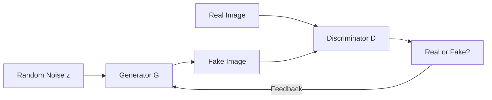

### GAN Training

**Discriminator Goal**: Maximize correct classification of real vs fake.
**Generator Goal**: Fool the discriminator (minimize discriminator's accuracy on fakes).

$$\min_G \max_D V(D, G) = \mathbb{E}[\log D(x)] + \mathbb{E}[\log(1 - D(G(z)))]$$

```python
import tensorflow as tf
from tensorflow.keras.layers import Dense, Reshape, Flatten, LeakyReLU

# Generator: noise -> fake image
def build_generator():
    model = tf.keras.Sequential([
        Dense(256, input_dim=100),
        LeakyReLU(0.2),
        Dense(512),
        LeakyReLU(0.2),
        Dense(784, activation='tanh'),  # 28x28 flattened
        Reshape((28, 28, 1))
    ])
    return model

# Discriminator: image -> real/fake probability
def build_discriminator():
    model = tf.keras.Sequential([
        Flatten(input_shape=(28, 28, 1)),
        Dense(512),
        LeakyReLU(0.2),
        Dense(256),
        LeakyReLU(0.2),
        Dense(1, activation='sigmoid')
    ])
    return model
```

### GAN Variants

| Variant | Description | Use Case |
| :--- | :--- | :--- |
| **DCGAN** | Uses convolutions instead of dense | Image generation |
| **Conditional GAN** | Adds class label as input | Controlled generation |
| **StyleGAN** | Separates style and content | Realistic face generation |
| **CycleGAN** | Unpaired image-to-image translation | Horse↔Zebra |
| **Pix2Pix** | Paired image-to-image translation | Sketch→Photo |

---

## 1️⃣2️⃣ Autoencoders

Autoencoders learn to **compress** data into a lower-dimensional representation and then **reconstruct** it.

### Architecture

**Intuition**: Like learning to summarize a book into a tweet, then expanding the tweet back into a book. The "summary" (latent space) captures the essence.

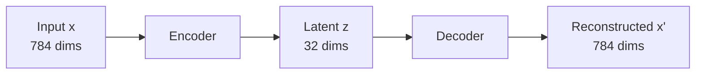

**Loss Function**: Reconstruction error (how close is output to input).

$$L = ||x - x'||^2$$

```python
from tensorflow.keras.layers import Input, Dense
from tensorflow.keras.models import Model

# Encoder
input_layer = Input(shape=(784,))
encoded = Dense(256, activation='relu')(input_layer)
encoded = Dense(64, activation='relu')(encoded)
latent = Dense(32, activation='relu')(encoded)  # Bottleneck

# Decoder
decoded = Dense(64, activation='relu')(latent)
decoded = Dense(256, activation='relu')(decoded)
output = Dense(784, activation='sigmoid')(decoded)

autoencoder = Model(input_layer, output)
autoencoder.compile(optimizer='adam', loss='mse')
```

### Variational Autoencoder (VAE)

**Difference from regular AE**: Instead of learning a fixed latent vector, VAE learns a **probability distribution** (mean and variance).

**Why this matters**: Enables smooth interpolation in latent space and proper generation of new samples.

$$L = \text{Reconstruction} + \text{KL Divergence}$$

The KL term ensures the latent space is well-organized (close to a standard normal distribution).

```python
class VAE(tf.keras.Model):
    def __init__(self, latent_dim):
        super().__init__()
        self.encoder = self._build_encoder(latent_dim)
        self.decoder = self._build_decoder(latent_dim)
    
    def reparameterize(self, mean, log_var):
        eps = tf.random.normal(shape=tf.shape(mean))
        return mean + tf.exp(0.5 * log_var) * eps
    
    def call(self, x):
        mean, log_var = self.encoder(x)
        z = self.reparameterize(mean, log_var)
        return self.decoder(z)
```

### Use Cases

| Application | How it Works |
| :--- | :--- |
| **Dimensionality Reduction** | Use latent space as compressed features |
| **Denoising** | Train on noisy input, clean target |
| **Anomaly Detection** | High reconstruction error = anomaly |
| **Image Generation** | Sample from latent space (VAE) |

---

## 1️⃣3️⃣ Vision Transformers (ViT)

Transformers are not just for text! **Vision Transformers** apply the Transformer architecture to images.

### How ViT Works

**Key Insight**: Split an image into patches, treat each patch like a "word", and apply Transformer self-attention.

```mermaid
flowchart LR
    IMG[Image 224x224] --> PATCH[Split into\n16x16 patches]
    PATCH --> EMB[Patch Embeddings\n+ Position]
    EMB --> CLS[[CLS] Token]
    CLS --> TRANSFORMER[Transformer\nEncoder]
    TRANSFORMER --> HEAD[Classification\nHead]
```

### ViT Architecture

1. **Patch Embedding**: Split image into N patches (e.g., 14x14 = 196 patches for 224x224 image with 16x16 patches)
2. **Position Embedding**: Add learnable position information
3. **Transformer Encoder**: Standard transformer layers with self-attention
4. **Classification Token**: Special [CLS] token for final classification

```python
from transformers import ViTForImageClassification, ViTImageProcessor
from PIL import Image
import requests

# Load pre-trained ViT
model = ViTForImageClassification.from_pretrained('google/vit-base-patch16-224')
processor = ViTImageProcessor.from_pretrained('google/vit-base-patch16-224')

# Inference
url = "http://images.cocodataset.org/val2017/000000039769.jpg"
image = Image.open(requests.get(url, stream=True).raw)

inputs = processor(images=image, return_tensors="pt")
outputs = model(**inputs)
predicted_class = outputs.logits.argmax(-1).item()
```

### CNN vs ViT

| Aspect | CNN | ViT |
| :--- | :--- | :--- |
| **Inductive Bias** | Strong (locality, translation invariance) | Weak (learns from data) |
| **Data Required** | Works with less data | Needs large datasets |
| **Long-range Dependencies** | Limited by receptive field | Excellent (self-attention) |
| **Compute** | Efficient | Expensive (quadratic attention) |

---

## 1️⃣4️⃣ Practical Training Tips

### Learning Rate Schedules

The learning rate is the **most important hyperparameter**. Proper scheduling dramatically improves results.

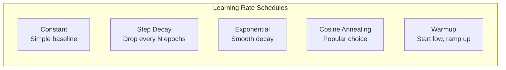

```python
# Cosine Annealing with Warmup (best for most cases)
from tensorflow.keras.optimizers.schedules import CosineDecay

lr_schedule = CosineDecay(
    initial_learning_rate=0.001,
    decay_steps=10000,
    alpha=0.0  # Final LR = initial * alpha
)

# Warmup + Cosine
class WarmupCosineSchedule(tf.keras.optimizers.schedules.LearningRateSchedule):
    def __init__(self, warmup_steps, total_steps, peak_lr):
        self.warmup_steps = warmup_steps
        self.total_steps = total_steps
        self.peak_lr = peak_lr
    
    def __call__(self, step):
        if step < self.warmup_steps:
            return self.peak_lr * (step / self.warmup_steps)
        else:
            progress = (step - self.warmup_steps) / (self.total_steps - self.warmup_steps)
            return self.peak_lr * 0.5 * (1 + tf.cos(np.pi * progress))
```

### Data Augmentation

Artificially increase training data diversity by applying transformations.

**Why it works**: Forces the model to learn invariant features. A cat is still a cat when flipped or slightly rotated.

```python
from tensorflow.keras.preprocessing.image import ImageDataGenerator

datagen = ImageDataGenerator(
    rotation_range=20,
    width_shift_range=0.2,
    height_shift_range=0.2,
    horizontal_flip=True,
    zoom_range=0.2,
    fill_mode='nearest'
)

# Modern approach with tf.data
augment = tf.keras.Sequential([
    tf.keras.layers.RandomFlip("horizontal"),
    tf.keras.layers.RandomRotation(0.1),
    tf.keras.layers.RandomZoom(0.1),
    tf.keras.layers.RandomContrast(0.1)
])
```

### Gradient Clipping

Prevents exploding gradients by capping gradient magnitudes.

**When to use**: RNNs, deep networks, unstable training.

```python
optimizer = tf.keras.optimizers.Adam(learning_rate=0.001, clipnorm=1.0)
# or
optimizer = tf.keras.optimizers.Adam(learning_rate=0.001, clipvalue=0.5)
```

### Mixed Precision Training

Use 16-bit floats for some operations to train faster with less memory.

```python
from tensorflow.keras import mixed_precision

policy = mixed_precision.Policy('mixed_float16')
mixed_precision.set_global_policy(policy)

# Your model now uses float16 for computations, float32 for variables
```

### Training Checklist

| Step | Action |
| :--- | :--- |
| **1. Baseline** | Overfit on small batch first |
| **2. Regularization** | Add dropout, augmentation |
| **3. Learning Rate** | Use LR finder, then cosine schedule |
| **4. Batch Size** | Larger = faster, but may need warmup |
| **5. Monitor** | Track train/val loss curves |
| **6. Early Stop** | Prevent overfitting |
| **7. Ensemble** | Combine multiple models |

---

## 1️⃣5️⃣ Famous Architectures Timeline

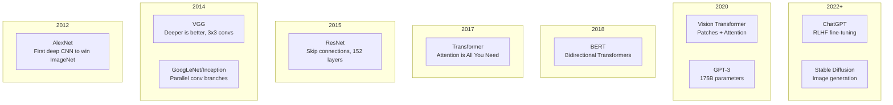

### Key Architectures

| Model | Year | Key Innovation | Impact |
| :--- | :--- | :--- | :--- |
| **AlexNet** | 2012 | ReLU, Dropout, GPU training | Started deep learning revolution |
| **VGG** | 2014 | Uniform 3x3 convs | Simple but effective |
| **ResNet** | 2015 | Skip connections | Enabled 100+ layer networks |
| **Transformer** | 2017 | Self-attention | Foundation of modern NLP/CV |
| **BERT** | 2018 | Bidirectional pretraining | Revolutionized NLP benchmarks |
| **GPT** | 2018-23 | Autoregressive LLMs | ChatGPT, coding assistants |
| **ViT** | 2020 | Patches + Transformers | Unified vision and NLP |
| **Diffusion** | 2022 | Iterative denoising | DALL-E, Stable Diffusion |

---

## 1️⃣6️⃣ Diffusion Models

Diffusion models are the technology behind **Stable Diffusion**, **DALL-E**, and **Midjourney**. They generate images by learning to reverse a gradual noising process.

### How Diffusion Works

**Forward Process**: Gradually add noise to an image until it becomes pure noise.
**Reverse Process**: Learn to denoise step by step, recovering the original image.

**Intuition**: Imagine slowly dissolving an ice sculpture into water (forward), then learning to freeze water back into the exact sculpture (reverse). The model learns this "freezing" process.

```mermaid
flowchart LR
    subgraph Forward["Forward Process (Fixed)"]
        X0[Clean Image x₀] --> X1[x₁ + noise]
        X1 --> X2[x₂ + noise]
        X2 --> XT[xₜ = Pure Noise]
    end
    
    subgraph Reverse["Reverse Process (Learned)"]
        XT2[Pure Noise] --> R1[Denoise]
        R1 --> R2[Denoise]
        R2 --> X02[Generated Image]
    end
```

### The Math

**Forward**: $q(x_t|x_{t-1}) = \mathcal{N}(x_t; \sqrt{1-\beta_t}x_{t-1}, \beta_t I)$

**Reverse**: Train a neural network $\epsilon_\theta$ to predict the noise added at each step.

**Loss**: $L = \mathbb{E}[||\epsilon - \epsilon_\theta(x_t, t)||^2]$ (Mean squared error between actual and predicted noise)

### Using Diffusion Models

```python
from diffusers import StableDiffusionPipeline
import torch

# Load pre-trained Stable Diffusion
pipe = StableDiffusionPipeline.from_pretrained(
    "runwayml/stable-diffusion-v1-5",
    torch_dtype=torch.float16
).to("cuda")

# Generate image from text
prompt = "A cat wearing sunglasses, digital art, vibrant colors"
image = pipe(prompt, num_inference_steps=50).images[0]
image.save("cat_sunglasses.png")
```

### Key Concepts

| Concept | Description |
| :--- | :--- |
| **Noise Schedule** | How much noise to add at each step (linear, cosine) |
| **U-Net** | The neural network architecture that predicts noise |
| **Classifier-Free Guidance** | Balances prompt following vs image quality |
| **Latent Diffusion** | Works in compressed latent space (faster) |
| **ControlNet** | Adds spatial control (pose, edges) |

---

## 1️⃣7️⃣ Self-Supervised & Contrastive Learning

Train models **without labeled data** by creating tasks from the data itself.

### Why Self-Supervised?

**Problem**: Labeled data is expensive and limited.
**Solution**: Create "free" labels from the structure of the data itself.

### Contrastive Learning

**Idea**: Learn representations where similar things are close and different things are far apart.

```mermaid
flowchart TB
    IMG[Original Image] --> AUG1[Augment 1\nCrop + Flip]
    IMG --> AUG2[Augment 2\nColor + Blur]
    AUG1 --> ENC1[Encoder]
    AUG2 --> ENC2[Encoder\n(shared weights)]
    ENC1 --> Z1[Embedding z₁]
    ENC2 --> Z2[Embedding z₂]
    Z1 --> LOSS[Contrastive Loss\nPull z₁, z₂ together\nPush away from others]
    Z2 --> LOSS
```

### SimCLR Framework

```python
import torch
import torch.nn.functional as F

def contrastive_loss(z1, z2, temperature=0.5):
    """
    z1, z2: Embeddings from two augmented views of same images
    Pull same-image embeddings together, push different-image apart
    """
    batch_size = z1.shape[0]
    
    # Normalize embeddings
    z1 = F.normalize(z1, dim=1)
    z2 = F.normalize(z2, dim=1)
    
    # Compute similarity matrix
    representations = torch.cat([z1, z2], dim=0)
    similarity = torch.matmul(representations, representations.T) / temperature
    
    # Labels: positive pairs are (i, i+batch_size) and (i+batch_size, i)
    labels = torch.arange(batch_size, device=z1.device)
    labels = torch.cat([labels + batch_size, labels])
    
    # Mask out self-similarity
    mask = torch.eye(2 * batch_size, device=z1.device).bool()
    similarity.masked_fill_(mask, -float('inf'))
    
    return F.cross_entropy(similarity, labels)
```

### Popular Methods

| Method | Task | Key Idea |
| :--- | :--- | :--- |
| **SimCLR** | Contrastive | Augmented views as positives |
| **MoCo** | Contrastive | Momentum encoder, queue of negatives |
| **BYOL** | Non-contrastive | Predict one view from another |
| **MAE** | Masked prediction | Reconstruct masked image patches |
| **CLIP** | Vision-language | Align images with text descriptions |

### CLIP: Bridging Vision and Language

```python
from transformers import CLIPProcessor, CLIPModel
from PIL import Image

model = CLIPModel.from_pretrained("openai/clip-vit-base-patch32")
processor = CLIPProcessor.from_pretrained("openai/clip-vit-base-patch32")

image = Image.open("photo.jpg")
text_options = ["a photo of a cat", "a photo of a dog", "a photo of a car"]

inputs = processor(text=text_options, images=image, return_tensors="pt", padding=True)
outputs = model(**inputs)

# Similarity scores
probs = outputs.logits_per_image.softmax(dim=1)
print(f"Predictions: {list(zip(text_options, probs[0].tolist()))}")
```

---

## 1️⃣8️⃣ Model Compression & Deployment

Making models smaller, faster, and production-ready.

### Why Compress?

| Challenge | Solution |
| :--- | :--- |
| Model too large for device | Quantization, Pruning |
| Inference too slow | Distillation, ONNX |
| Memory limited | Gradient checkpointing |
| Latency critical | TensorRT, Edge deployment |

### Quantization

Reduce precision from 32-bit floats to 8-bit integers (or lower).

```python
import torch

# Post-training Dynamic Quantization (easiest)
quantized_model = torch.quantization.quantize_dynamic(
    model,
    {torch.nn.Linear},  # Quantize linear layers
    dtype=torch.qint8
)

# Static Quantization (better accuracy, needs calibration)
model.qconfig = torch.quantization.get_default_qconfig('fbgemm')
torch.quantization.prepare(model, inplace=True)
# Run calibration data through model
torch.quantization.convert(model, inplace=True)
```

### Knowledge Distillation

Train a small "student" model to mimic a large "teacher" model.

```mermaid
flowchart LR
    INPUT[Input] --> TEACHER[Large Teacher\n(frozen)]
    INPUT --> STUDENT[Small Student]
    TEACHER --> SOFT[Soft Labels\n(probabilities)]
    STUDENT --> PRED[Student Predictions]
    SOFT --> LOSS[Distillation Loss]
    PRED --> LOSS
```

```python
import torch.nn.functional as F

def distillation_loss(student_logits, teacher_logits, true_labels, temperature=4, alpha=0.7):
    """
    Combine soft targets from teacher with hard labels
    """
    # Soft targets (knowledge from teacher)
    soft_loss = F.kl_div(
        F.log_softmax(student_logits / temperature, dim=1),
        F.softmax(teacher_logits / temperature, dim=1),
        reduction='batchmean'
    ) * (temperature ** 2)
    
    # Hard targets (true labels)
    hard_loss = F.cross_entropy(student_logits, true_labels)
    
    return alpha * soft_loss + (1 - alpha) * hard_loss
```

### Pruning

Remove unimportant weights (set to zero).

```python
import torch.nn.utils.prune as prune

# Prune 30% of weights with smallest magnitude
prune.l1_unstructured(model.fc1, name='weight', amount=0.3)

# Make pruning permanent
prune.remove(model.fc1, 'weight')
```

### Export for Production

```python
# ONNX Export (cross-platform)
import torch.onnx

dummy_input = torch.randn(1, 3, 224, 224)
torch.onnx.export(model, dummy_input, "model.onnx", 
                  input_names=['image'], output_names=['prediction'])

# TorchScript (for C++ deployment)
scripted_model = torch.jit.script(model)
scripted_model.save("model.pt")

# TensorFlow Lite (mobile)
import tensorflow as tf
converter = tf.lite.TFLiteConverter.from_saved_model("saved_model")
converter.optimizations = [tf.lite.Optimize.DEFAULT]
tflite_model = converter.convert()
```

---

## 1️⃣9️⃣ PyTorch Essentials

PyTorch is the most popular framework for research. Here's a complete guide.

### Tensors (The Foundation)

```python
import torch

# Creating tensors
x = torch.tensor([1, 2, 3])
x = torch.zeros(3, 4)
x = torch.randn(3, 4)  # Normal distribution
x = torch.arange(0, 10, 2)  # [0, 2, 4, 6, 8]

# GPU operations
device = torch.device("cuda" if torch.cuda.is_available() else "cpu")
x = x.to(device)

# Gradients
x = torch.randn(3, requires_grad=True)
y = x.sum()
y.backward()  # Compute gradients
print(x.grad)  # dy/dx
```

### Building Models

```python
import torch.nn as nn

# Sequential (simple)
model = nn.Sequential(
    nn.Linear(784, 256),
    nn.ReLU(),
    nn.Dropout(0.5),
    nn.Linear(256, 10)
)

# Custom Module (flexible)
class MyModel(nn.Module):
    def __init__(self, input_size, hidden_size, num_classes):
        super().__init__()
        self.fc1 = nn.Linear(input_size, hidden_size)
        self.bn1 = nn.BatchNorm1d(hidden_size)
        self.fc2 = nn.Linear(hidden_size, num_classes)
        self.dropout = nn.Dropout(0.5)
    
    def forward(self, x):
        x = self.fc1(x)
        x = self.bn1(x)
        x = torch.relu(x)
        x = self.dropout(x)
        x = self.fc2(x)
        return x
```

### Training Loop

```python
import torch.optim as optim
from torch.utils.data import DataLoader

# Setup
model = MyModel(784, 256, 10).to(device)
optimizer = optim.Adam(model.parameters(), lr=0.001)
criterion = nn.CrossEntropyLoss()

# Training loop
for epoch in range(num_epochs):
    model.train()
    for batch_idx, (data, target) in enumerate(train_loader):
        data, target = data.to(device), target.to(device)
        
        # Forward pass
        output = model(data)
        loss = criterion(output, target)
        
        # Backward pass
        optimizer.zero_grad()  # Clear old gradients
        loss.backward()        # Compute gradients
        optimizer.step()       # Update weights
    
    # Validation
    model.eval()
    with torch.no_grad():
        for data, target in val_loader:
            output = model(data)
            # ... compute metrics
```

### Data Loading

```python
from torch.utils.data import Dataset, DataLoader
from torchvision import transforms

class CustomDataset(Dataset):
    def __init__(self, data, labels, transform=None):
        self.data = data
        self.labels = labels
        self.transform = transform
    
    def __len__(self):
        return len(self.data)
    
    def __getitem__(self, idx):
        x = self.data[idx]
        y = self.labels[idx]
        if self.transform:
            x = self.transform(x)
        return x, y

# Transforms
transform = transforms.Compose([
    transforms.Resize(256),
    transforms.CenterCrop(224),
    transforms.ToTensor(),
    transforms.Normalize(mean=[0.485, 0.456, 0.406], 
                         std=[0.229, 0.224, 0.225])
])

# DataLoader
train_loader = DataLoader(dataset, batch_size=32, shuffle=True, num_workers=4)
```

### Saving & Loading

```python
# Save
torch.save({
    'epoch': epoch,
    'model_state_dict': model.state_dict(),
    'optimizer_state_dict': optimizer.state_dict(),
    'loss': loss,
}, 'checkpoint.pth')

# Load
checkpoint = torch.load('checkpoint.pth')
model.load_state_dict(checkpoint['model_state_dict'])
optimizer.load_state_dict(checkpoint['optimizer_state_dict'])
```

---

## 2️⃣0️⃣ Debugging Deep Learning

Common problems and how to fix them.

### Loss Not Decreasing

```mermaid
flowchart TD
    PROBLEM[Loss Not Decreasing] --> CHECK1{Learning rate?}
    CHECK1 -->|Too high| FIX1[Reduce LR by 10x]
    CHECK1 -->|Too low| FIX2[Increase LR by 10x]
    CHECK1 -->|OK| CHECK2{Data correct?}
    CHECK2 -->|Labels shuffled| FIX3[Check data pipeline]
    CHECK2 -->|OK| CHECK3{Model architecture?}
    CHECK3 -->|Too simple| FIX4[Add layers/width]
    CHECK3 -->|OK| CHECK4{Gradients?}
    CHECK4 -->|Zero/NaN| FIX5[Check activations, init]
```

### Debug Checklist

| Issue | Check | Fix |
| :--- | :--- | :--- |
| **Loss = NaN** | Gradients exploding | Reduce LR, add gradient clipping |
| **Loss stuck** | LR too low | Increase LR, use LR finder |
| **Train good, val bad** | Overfitting | Add dropout, augmentation, data |
| **Both train/val bad** | Underfitting | Bigger model, more features |
| **Slow training** | Bottleneck | Profile, use mixed precision |
| **Out of memory** | Batch too large | Reduce batch, gradient accumulation |

### Gradient Checking

```python
# Check for vanishing/exploding gradients
for name, param in model.named_parameters():
    if param.grad is not None:
        grad_norm = param.grad.norm()
        if grad_norm == 0:
            print(f"⚠️ Zero gradient: {name}")
        elif grad_norm > 100:
            print(f"⚠️ Exploding gradient: {name} = {grad_norm}")
        elif grad_norm < 1e-7:
            print(f"⚠️ Vanishing gradient: {name} = {grad_norm}")
```

### Overfit on One Batch First

**Always start by overfitting on one batch**. If your model can't fit 1 batch perfectly, something is wrong.

```python
# Get one batch
batch_x, batch_y = next(iter(train_loader))

# Try to overfit
for i in range(1000):
    output = model(batch_x)
    loss = criterion(output, batch_y)
    optimizer.zero_grad()
    loss.backward()
    optimizer.step()
    
    if i % 100 == 0:
        print(f"Step {i}, Loss: {loss.item():.4f}")

# Loss should go to ~0
```

### Visualization Tips

```python
import matplotlib.pyplot as plt

# Plot training curves
def plot_training(train_losses, val_losses):
    plt.figure(figsize=(10, 4))
    
    plt.subplot(1, 2, 1)
    plt.plot(train_losses, label='Train')
    plt.plot(val_losses, label='Validation')
    plt.xlabel('Epoch')
    plt.ylabel('Loss')
    plt.legend()
    plt.title('Loss Curves')
    
    # Check for overfitting: gap between train and val
    
    plt.tight_layout()
    plt.show()

# Visualize activations
def visualize_activations(model, input_data):
    activations = {}
    
    def hook(name):
        def fn(module, input, output):
            activations[name] = output.detach()
        return fn
    
    for name, layer in model.named_modules():
        layer.register_forward_hook(hook(name))
    
    model(input_data)
    return activations
```

---

## 📚 Quick Reference

| Architecture | Best For | Key Idea |
| :--- | :--- | :--- |
| **MLP** | Tabular data | Fully connected layers |
| **CNN** | Images, spatial data | Convolution filters |
| **RNN/LSTM** | Sequences, time series | Hidden state memory |
| **Transformer** | NLP, long sequences | Self-attention |
| **GAN** | Image generation | Generator vs Discriminator |
| **Autoencoder** | Compression, denoising | Encode-decode |
| **VAE** | Generation, interpolation | Probabilistic latent space |
| **ViT** | Images with large data | Patch + Attention |
| **Diffusion** | High-quality generation | Iterative denoising |
| **CLIP** | Vision + Language | Contrastive alignment |

---

## 🛠️ Framework Comparison

| Feature | PyTorch | TensorFlow/Keras |
| :--- | :--- | :--- |
| **Debug** | Easy (eager by default) | Need tf.function |
| **Research** | Most papers | Less common |
| **Production** | TorchServe, ONNX | TF Serving, TFLite |
| **Mobile** | PyTorch Mobile | TensorFlow Lite |
| **TPU Support** | Limited | Native |
| **Learning Curve** | Pythonic | More abstraction |

---

## 🧪 Interview Questions

1. **Explain backpropagation in simple terms.**
2. **Why do we need activation functions?**
3. **What's the vanishing gradient problem? How to solve it?**
4. **Difference between batch, mini-batch, and stochastic GD?**
5. **How does dropout prevent overfitting?**
6. **Explain the attention mechanism.**
7. **CNN vs RNN - when to use each?**
8. **What is transfer learning and why is it useful?**
9. **Explain batch normalization.**
10. **What's the difference between LSTM and GRU?**
11. **How do GANs work? What's mode collapse?**
12. **Explain the difference between AE and VAE.**
13. **How does Vision Transformer process images?**
14. **What learning rate schedule would you use?**
15. **How would you debug a model that's not learning?**
16. **How do diffusion models generate images?**
17. **Explain contrastive learning (SimCLR/CLIP).**
18. **How would you reduce model size for mobile?**
19. **PyTorch vs TensorFlow - pros and cons?**
20. **Walk through a PyTorch training loop.**

---

## 📖 Resources

### Books
- **Deep Learning** by Goodfellow, Bengio, Courville (The Bible)
- **Hands-On Machine Learning** by Aurélien Géron
- **Dive into Deep Learning** (d2l.ai - Free online)

### Courses
- **Fast.ai** - Practical deep learning
- **Stanford CS231n** - CNNs for Visual Recognition
- **Stanford CS224n** - NLP with Deep Learning
- **DeepMind x UCL** - Advanced Deep Learning

### Papers to Read
1. **AlexNet** (2012) - ImageNet revolution
2. **ResNet** (2015) - Skip connections
3. **Attention Is All You Need** (2017) - Transformers
4. **BERT** (2018) - Bidirectional pretraining
5. **GPT-3** (2020) - Few-shot learning

---

*From Perceptrons to Transformers! 🚀*


