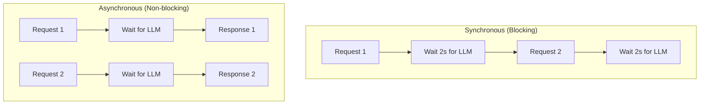

# FastAPI for GenAI Applications

> Building Production-Ready ML APIs

---

## 📋 Table of Contents

1. [Why FastAPI?](#-why-fastapi)
2. [FastAPI Fundamentals](#-fastapi-fundamentals)
3. [Request/Response Models](#-requestresponse-models)
4. [Async & Concurrency](#-async--concurrency)
5. [LLM Integration Patterns](#-llm-integration-patterns)
6. [Streaming Responses](#-streaming-responses)
7. [Production Best Practices](#-production-best-practices)
8. [Deployment](#-deployment)
9. [Interview Questions](#-interview-questions)

---

## 🚀 Why FastAPI?

### FastAPI vs Other Frameworks

| Feature | FastAPI | Flask | Django |
|---------|---------|-------|--------|
| **Performance** | ⭐⭐⭐ Async native | ⭐ WSGI | ⭐ WSGI |
| **Type hints** | ⭐⭐⭐ Built-in | ❌ Manual | ❌ Manual |
| **Auto docs** | ⭐⭐⭐ OpenAPI/Swagger | ❌ Extensions | ❌ Extensions |
| **Validation** | ⭐⭐⭐ Pydantic | ❌ Manual | ⭐ Forms |
| **ML/AI workloads** | ⭐⭐⭐ Ideal | ⭐ Okay | ❌ Overkill |

### Key Benefits for GenAI

- **Async support**: Handle concurrent LLM requests efficiently
- **Streaming**: Native support for SSE (Server-Sent Events)
- **Pydantic**: Validate complex AI request/response structures
- **Auto documentation**: OpenAPI docs for API consumers

---

## 📚 FastAPI Fundamentals

### Basic Application

```python
from fastapi import FastAPI, HTTPException
from pydantic import BaseModel

app = FastAPI(
    title="GenAI API",
    description="Production LLM Service",
    version="1.0.0"
)

# Health check
@app.get("/health")
async def health_check():
    return {"status": "healthy"}

# Simple endpoint
@app.get("/")
async def root():
    return {"message": "GenAI API is running"}
```

### Running the App

```bash
# Development
uvicorn main:app --reload --host 0.0.0.0 --port 8000

# Production
uvicorn main:app --host 0.0.0.0 --port 8000 --workers 4

# With Gunicorn (production)
gunicorn main:app -w 4 -k uvicorn.workers.UvicornWorker -b 0.0.0.0:8000
```

### Project Structure

```
project/
├── app/
│   ├── __init__.py
│   ├── main.py              # FastAPI app
│   ├── config.py            # Settings
│   ├── models/              # Pydantic models
│   │   ├── __init__.py
│   │   ├── requests.py
│   │   └── responses.py
│   ├── routers/             # API routes
│   │   ├── __init__.py
│   │   ├── chat.py
│   │   └── embeddings.py
│   ├── services/            # Business logic
│   │   ├── __init__.py
│   │   ├── llm_service.py
│   │   └── vector_service.py
│   └── utils/
│       ├── __init__.py
│       └── helpers.py
├── tests/
├── requirements.txt
├── Dockerfile
└── docker-compose.yml
```

---

## 📦 Request/Response Models

### Pydantic Models

```python
from pydantic import BaseModel, Field
from typing import Optional, List
from enum import Enum

class ModelName(str, Enum):
    GPT4 = "gpt-4o"
    CLAUDE = "claude-3-sonnet"
    LLAMA = "llama-3.2-3b"

class Message(BaseModel):
    role: str = Field(..., pattern="^(system|user|assistant)$")
    content: str = Field(..., min_length=1, max_length=100000)

class ChatRequest(BaseModel):
    messages: List[Message]
    model: ModelName = ModelName.CLAUDE
    temperature: float = Field(default=0.7, ge=0, le=2)
    max_tokens: int = Field(default=1024, ge=1, le=4096)
    stream: bool = False

    class Config:
        json_schema_extra = {
            "example": {
                "messages": [
                    {"role": "system", "content": "You are a helpful assistant"},
                    {"role": "user", "content": "What is RAG?"}
                ],
                "model": "claude-3-sonnet",
                "temperature": 0.7
            }
        }

class ChatResponse(BaseModel):
    id: str
    content: str
    model: str
    usage: dict
    finish_reason: str

class ErrorResponse(BaseModel):
    error: str
    detail: Optional[str] = None
```

### Using Models in Endpoints

```python
from fastapi import FastAPI, HTTPException, status
from app.models.requests import ChatRequest
from app.models.responses import ChatResponse, ErrorResponse

app = FastAPI()

@app.post(
    "/v1/chat/completions",
    response_model=ChatResponse,
    responses={
        400: {"model": ErrorResponse},
        500: {"model": ErrorResponse}
    }
)
async def chat_completion(request: ChatRequest):
    try:
        # Call LLM service
        result = await llm_service.generate(
            messages=request.messages,
            model=request.model,
            temperature=request.temperature,
            max_tokens=request.max_tokens
        )
        return ChatResponse(**result)
    except ValueError as e:
        raise HTTPException(status_code=400, detail=str(e))
    except Exception as e:
        raise HTTPException(status_code=500, detail="Internal server error")
```

---

## ⚡ Async & Concurrency

### Why Async Matters for LLMs



### Async LLM Calls

```python
import httpx
from typing import List

class LLMService:
    def __init__(self):
        self.client = httpx.AsyncClient(timeout=60.0)
    
    async def generate(self, messages: List[dict], **kwargs) -> dict:
        """Async call to LLM provider"""
        response = await self.client.post(
            "https://api.anthropic.com/v1/messages",
            headers={"Authorization": f"Bearer {API_KEY}"},
            json={
                "model": "claude-3-sonnet-20240229",
                "messages": messages,
                **kwargs
            }
        )
        return response.json()
    
    async def generate_batch(self, prompts: List[str]) -> List[str]:
        """Process multiple prompts concurrently"""
        import asyncio
        
        tasks = [
            self.generate([{"role": "user", "content": p}])
            for p in prompts
        ]
        results = await asyncio.gather(*tasks)
        return [r["content"][0]["text"] for r in results]

# Usage in endpoint
llm_service = LLMService()

@app.post("/batch")
async def batch_generate(prompts: List[str]):
    results = await llm_service.generate_batch(prompts)
    return {"results": results}
```

### Background Tasks

```python
from fastapi import BackgroundTasks

def log_usage(user_id: str, tokens: int):
    """Log usage to database (sync function)"""
    db.log_usage(user_id, tokens)

@app.post("/chat")
async def chat(
    request: ChatRequest,
    background_tasks: BackgroundTasks,
    user_id: str = Depends(get_current_user)
):
    result = await llm_service.generate(request.messages)
    
    # Non-blocking logging
    background_tasks.add_task(log_usage, user_id, result["usage"]["total_tokens"])
    
    return result
```

---

## 🌊 Streaming Responses

### Server-Sent Events (SSE)

```python
from fastapi import FastAPI
from fastapi.responses import StreamingResponse
import asyncio

async def generate_stream(messages: List[dict]):
    """Stream tokens from LLM"""
    async with httpx.AsyncClient() as client:
        async with client.stream(
            "POST",
            "https://api.anthropic.com/v1/messages",
            headers={"Authorization": f"Bearer {API_KEY}"},
            json={
                "model": "claude-3-sonnet-20240229",
                "messages": messages,
                "stream": True
            }
        ) as response:
            async for line in response.aiter_lines():
                if line.startswith("data: "):
                    data = line[6:]
                    if data != "[DONE]":
                        yield f"data: {data}\n\n"

@app.post("/v1/chat/stream")
async def chat_stream(request: ChatRequest):
    return StreamingResponse(
        generate_stream(request.messages),
        media_type="text/event-stream",
        headers={
            "Cache-Control": "no-cache",
            "Connection": "keep-alive"
        }
    )
```

### Client-Side Consumption

```python
# Python client
import httpx

async def consume_stream():
    async with httpx.AsyncClient() as client:
        async with client.stream(
            "POST",
            "http://localhost:8000/v1/chat/stream",
            json={"messages": [{"role": "user", "content": "Hello"}]}
        ) as response:
            async for line in response.aiter_lines():
                if line.startswith("data: "):
                    print(line[6:], end="", flush=True)
```

```javascript
// JavaScript client
const response = await fetch('/v1/chat/stream', {
    method: 'POST',
    headers: {'Content-Type': 'application/json'},
    body: JSON.stringify({messages: [{role: 'user', content: 'Hello'}]})
});

const reader = response.body.getReader();
const decoder = new TextDecoder();

while (true) {
    const {done, value} = await reader.read();
    if (done) break;
    const chunk = decoder.decode(value);
    console.log(chunk);
}
```

---

## 🔧 LLM Integration Patterns

### Pattern 1: Direct API Wrapper

```python
from fastapi import FastAPI, Depends
from functools import lru_cache
import openai

class Settings:
    openai_api_key: str
    model: str = "gpt-4o"

@lru_cache
def get_settings():
    return Settings()

@app.post("/generate")
async def generate(
    prompt: str,
    settings: Settings = Depends(get_settings)
):
    client = openai.AsyncOpenAI(api_key=settings.openai_api_key)
    
    response = await client.chat.completions.create(
        model=settings.model,
        messages=[{"role": "user", "content": prompt}]
    )
    
    return {"response": response.choices[0].message.content}
```

### Pattern 2: LangChain Integration

```python
from langchain_openai import ChatOpenAI
from langchain_core.messages import HumanMessage
from langchain_core.output_parsers import StrOutputParser

# Initialize chain at startup
@app.on_event("startup")
async def startup():
    global chain
    llm = ChatOpenAI(model="gpt-4o", temperature=0.7)
    chain = llm | StrOutputParser()

@app.post("/chat")
async def chat(message: str):
    result = await chain.ainvoke([HumanMessage(content=message)])
    return {"response": result}
```

### Pattern 3: RAG Endpoint

```python
from langchain_openai import OpenAIEmbeddings
from langchain_community.vectorstores import FAISS
from langchain_openai import ChatOpenAI
from langchain_core.prompts import ChatPromptTemplate

# Load vector store at startup
@app.on_event("startup")
async def startup():
    global vector_store, llm
    embeddings = OpenAIEmbeddings()
    vector_store = FAISS.load_local("./faiss_index", embeddings)
    llm = ChatOpenAI(model="gpt-4o")

@app.post("/rag/query")
async def rag_query(query: str, k: int = 5):
    # Retrieve relevant docs
    docs = vector_store.similarity_search(query, k=k)
    
    # Build context
    context = "\n\n".join([doc.page_content for doc in docs])
    
    # Generate answer
    prompt = ChatPromptTemplate.from_template("""
    Answer based on the context. If unsure, say so.
    
    Context: {context}
    
    Question: {question}
    """)
    
    chain = prompt | llm
    result = await chain.ainvoke({"context": context, "question": query})
    
    return {
        "answer": result.content,
        "sources": [{"content": d.page_content[:200]} for d in docs]
    }
```

---

## 🏭 Production Best Practices

### Configuration Management

```python
# config.py
from pydantic_settings import BaseSettings
from functools import lru_cache

class Settings(BaseSettings):
    # API Keys
    openai_api_key: str
    anthropic_api_key: str
    
    # App settings
    app_name: str = "GenAI API"
    debug: bool = False
    
    # Model settings
    default_model: str = "gpt-4o"
    max_tokens: int = 4096
    
    # Rate limiting
    rate_limit_per_minute: int = 60
    
    class Config:
        env_file = ".env"

@lru_cache
def get_settings():
    return Settings()
```

### Rate Limiting

```python
from slowapi import Limiter, _rate_limit_exceeded_handler
from slowapi.util import get_remote_address
from slowapi.errors import RateLimitExceeded

limiter = Limiter(key_func=get_remote_address)
app.state.limiter = limiter
app.add_exception_handler(RateLimitExceeded, _rate_limit_exceeded_handler)

@app.post("/chat")
@limiter.limit("10/minute")
async def chat(request: Request, body: ChatRequest):
    return await process_chat(body)
```

### Error Handling

```python
from fastapi import FastAPI, Request
from fastapi.responses import JSONResponse
import logging

logger = logging.getLogger(__name__)

@app.exception_handler(Exception)
async def global_exception_handler(request: Request, exc: Exception):
    logger.error(f"Unhandled error: {exc}", exc_info=True)
    
    return JSONResponse(
        status_code=500,
        content={
            "error": "internal_server_error",
            "message": "An unexpected error occurred"
        }
    )

class LLMError(Exception):
    def __init__(self, message: str, status_code: int = 500):
        self.message = message
        self.status_code = status_code

@app.exception_handler(LLMError)
async def llm_error_handler(request: Request, exc: LLMError):
    return JSONResponse(
        status_code=exc.status_code,
        content={"error": "llm_error", "message": exc.message}
    )
```

### Middleware

```python
from fastapi import FastAPI, Request
import time
import uuid

@app.middleware("http")
async def add_request_id(request: Request, call_next):
    request_id = str(uuid.uuid4())
    request.state.request_id = request_id
    
    start_time = time.time()
    response = await call_next(request)
    process_time = time.time() - start_time
    
    response.headers["X-Request-ID"] = request_id
    response.headers["X-Process-Time"] = str(process_time)
    
    logger.info(
        f"Request {request_id}: {request.method} {request.url.path} "
        f"completed in {process_time:.3f}s"
    )
    
    return response
```

---

## 🐳 Deployment

### Dockerfile

```dockerfile
FROM python:3.11-slim

WORKDIR /app

# Install dependencies
COPY requirements.txt .
RUN pip install --no-cache-dir -r requirements.txt

# Copy application
COPY app/ ./app/

# Non-root user
RUN adduser --disabled-password --gecos '' appuser
USER appuser

EXPOSE 8000

CMD ["uvicorn", "app.main:app", "--host", "0.0.0.0", "--port", "8000"]
```

### Docker Compose

```yaml
version: '3.8'

services:
  api:
    build: .
    ports:
      - "8000:8000"
    environment:
      - OPENAI_API_KEY=${OPENAI_API_KEY}
      - ANTHROPIC_API_KEY=${ANTHROPIC_API_KEY}
    volumes:
      - ./faiss_index:/app/faiss_index
    healthcheck:
      test: ["CMD", "curl", "-f", "http://localhost:8000/health"]
      interval: 30s
      timeout: 10s
      retries: 3

  redis:
    image: redis:alpine
    ports:
      - "6379:6379"
```

### AWS Lambda (Mangum)

```python
from fastapi import FastAPI
from mangum import Mangum

app = FastAPI()

# ... your routes ...

# Lambda handler
handler = Mangum(app, lifespan="off")
```

---

## 🎯 Interview Questions

**Q1: Why is FastAPI preferred for ML APIs?**

**Answer:**
1. **Async native**: Handle concurrent LLM calls (3-10s each) without blocking
2. **Pydantic validation**: Auto-validate complex AI payloads
3. **Type hints**: Self-documenting code, IDE support
4. **OpenAPI auto-docs**: Easy API exploration
5. **Streaming**: Native SSE support for token streaming
6. **Performance**: ASGI-based, faster than Flask/Django

---

**Q2: How do you handle long-running LLM requests?**

**Answer:**
1. **Async endpoints**: Use `async def` for non-blocking I/O
2. **Streaming**: Return tokens as they're generated
3. **Background tasks**: For post-processing
4. **Timeouts**: Set appropriate client/server timeouts
5. **Queue-based**: For very long tasks, use Celery/SQS

---

**Q3: Explain dependency injection in FastAPI.**

**Answer:** Dependencies are reusable components injected into endpoints:

```python
def get_db():
    db = Database()
    try:
        yield db
    finally:
        db.close()

@app.get("/items")
async def get_items(db: Database = Depends(get_db)):
    return db.get_all()
```

Benefits: Reusability, testing (mock dependencies), separation of concerns.

---

**Q4: How do you implement authentication in FastAPI?**

**Answer:**
```python
from fastapi.security import HTTPBearer, HTTPAuthorizationCredentials

security = HTTPBearer()

async def verify_token(credentials: HTTPAuthorizationCredentials = Depends(security)):
    token = credentials.credentials
    # Validate JWT or API key
    if not is_valid(token):
        raise HTTPException(status_code=401)
    return decode_token(token)

@app.post("/protected")
async def protected_route(user = Depends(verify_token)):
    return {"user": user}
```

---

## 📚 Further Reading

- [FastAPI Documentation](https://fastapi.tiangolo.com/)
- [Pydantic Documentation](https://docs.pydantic.dev/)
- [Uvicorn Documentation](https://www.uvicorn.org/)
- [Real Python FastAPI Tutorial](https://realpython.com/fastapi-python-web-apis/)

---

*Previous: [AWS GenAI & MLOps](./aws-genai-mlops.md) | Next: [Practical Project](../projects/rag-api-project/README.md)*
