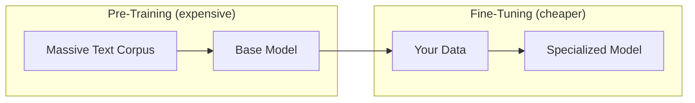
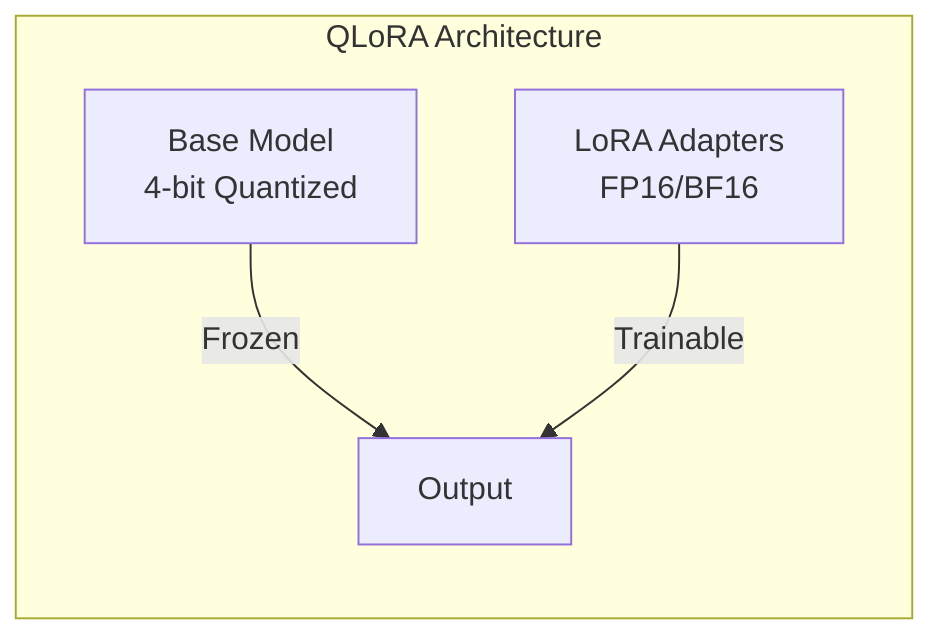
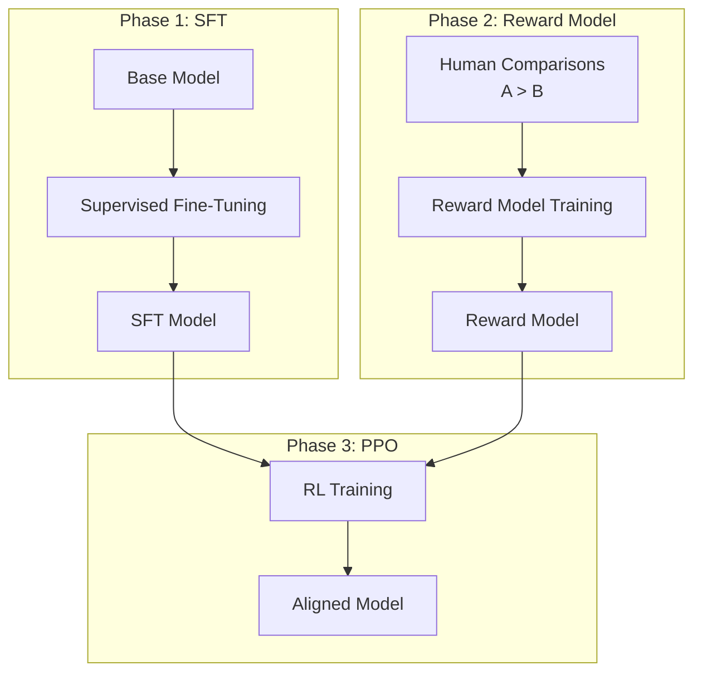
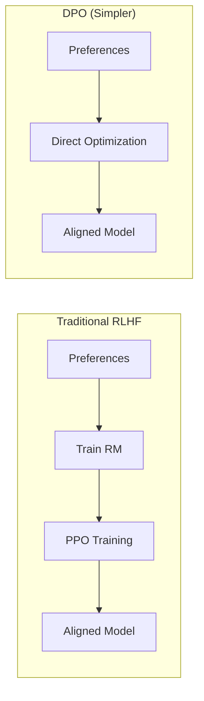
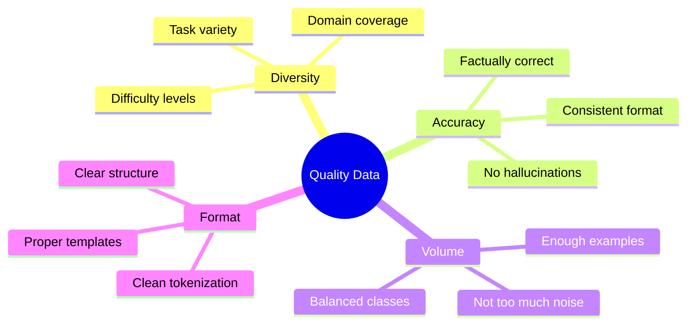

# LLM Fine-Tuning Deep Dive

> From Transfer Learning to RLHF - Specializing Models for Your Use Case

---

## 📋 Table of Contents

1. [Why Fine-Tune?](#-why-fine-tune)
2. [Fine-Tuning Fundamentals](#-fine-tuning-fundamentals)
3. [Parameter-Efficient Fine-Tuning (PEFT)](#-parameter-efficient-fine-tuning-peft)
4. [LoRA and Variants](#-lora-and-variants)
5. [Instruction Tuning](#-instruction-tuning)
6. [RLHF and Alignment](#-rlhf-and-alignment)
7. [Dataset Preparation](#-dataset-preparation)
8. [Practical Guide](#-practical-guide)
9. [Interview Questions](#-interview-questions)

---

## 🎯 Why Fine-Tune?

### The Problem with Base Models

Pre-trained LLMs are trained on general text and may not:
- Follow instructions well
- Output in your desired format
- Have domain-specific knowledge
- Behave according to your guidelines

### When to Fine-Tune vs Other Approaches

```mermaid
flowchart TD
    Q[Need specialized behavior?]
    Q -->|Simple task| PE[Prompt Engineering]
    Q -->|Need external knowledge| RAG[RAG Pipeline]
    Q -->|Complex behavior change| FT[Fine-Tuning]
    
    PE --> PE1["• Few-shot examples
    • System prompts
    • Chain-of-thought"]
    
    RAG --> RAG1["• Vector database
    • Document retrieval
    • Contextual generation"]
    
    FT --> FT1["• Instruction following
    • Domain adaptation
    • Output format control"]
```



| Approach | When to Use | Effort | Cost |
|----------|-------------|--------|------|
| **Prompt Engineering** | Simple format changes, few examples | Low | Free |
| **RAG** | Need current/external knowledge | Medium | Infrastructure |
| **Fine-Tuning** | Behavior/style changes, domain expertise | High | Compute + Data |

---

## 📚 Fine-Tuning Fundamentals

### Transfer Learning

Transfer learning leverages knowledge from pre-training:



### Types of Fine-Tuning

| Type | Description | Parameters Updated |
|------|-------------|-------------------|
| **Full Fine-Tuning** | Update all model parameters | 100% |
| **Feature Extraction** | Freeze base, train classifier head | <1% |
| **PEFT (LoRA, etc.)** | Train small adapter matrices | 0.1-1% |
| **Prefix Tuning** | Train virtual token embeddings | <0.1% |

### Full Fine-Tuning

Update all model weights on your dataset:

```python
from transformers import AutoModelForCausalLM, Trainer, TrainingArguments

model = AutoModelForCausalLM.from_pretrained("meta-llama/Llama-3.2-3B")

training_args = TrainingArguments(
    output_dir="./output",
    learning_rate=2e-5,
    per_device_train_batch_size=4,
    num_train_epochs=3,
    gradient_accumulation_steps=8,
    fp16=True,
)

trainer = Trainer(
    model=model,
    args=training_args,
    train_dataset=train_dataset,
)
trainer.train()
```

**Pros:** Maximum adaptation capability
**Cons:** 
- Requires massive GPU memory (7B model ≈ 150GB+ for training)
- Risk of catastrophic forgetting
- Need large, high-quality dataset

---

## 🔧 Parameter-Efficient Fine-Tuning (PEFT)

### The Memory Problem

Training a 7B parameter model requires:
- Model weights: ~14GB (FP16)
- Gradients: ~14GB
- Optimizer states: ~28GB (Adam)
- Activations: ~10-20GB
- **Total: 60-80GB GPU memory**

PEFT solves this by training only a small subset of parameters.

### PEFT Methods Comparison

```mermaid
flowchart TB
    PEFT[PEFT Methods]
    PEFT --> ADAPTER[Adapter Methods]
    PEFT --> PROMPT[Prompt Methods]
    PEFT --> SPECIFIC[Specification Methods]
    
    ADAPTER --> LoRA[LoRA / QLoRA]
    ADAPTER --> DoRA[DoRA]
    ADAPTER --> AdaLoRA[AdaLoRA]
    
    PROMPT --> PT[Prompt Tuning]
    PROMPT --> PREFIX[Prefix Tuning]
    
    SPECIFIC --> IA3["IA³"]
    SPECIFIC --> BITFIT[BitFit]
```



| Method | Trainable Params | Memory | Performance |
|--------|------------------|--------|-------------|
| Full Fine-Tuning | 100% | Very High | Best |
| **LoRA** | 0.1-1% | Low | 95-99% of full |
| **QLoRA** | 0.1-1% | Very Low | 90-95% of full |
| Prefix Tuning | <0.1% | Very Low | Good for some tasks |
| Prompt Tuning | <0.01% | Minimal | Task-specific |

---

## 🎯 LoRA and Variants

### How LoRA Works

**Low-Rank Adaptation (LoRA)** freezes the base model and trains small decomposed matrices:

Instead of updating weight matrix W, we add a low-rank delta:

```
W' = W + ΔW = W + BA
```

Where:
- W: Original frozen weights (d × d)
- B: Low-rank matrix (d × r)
- A: Low-rank matrix (r × d)
- r: Rank (typically 8-64) << d

```mermaid
flowchart LR
    subgraph Original["Original Layer"]
        X1[Input x] --> W1[W: d×d]
        W1 --> Y1[Output]
    end
    
    subgraph LoRA["LoRA Layer"]
        X2[Input x] --> W2[W: Frozen]
        X2 --> A[A: r×d<br/>Trainable]
        A --> B[B: d×r<br/>Trainable]
        W2 --> ADD((+))
        B --> ADD
        ADD --> Y2[Output]
    end
```



### LoRA Implementation

```python
import torch
import torch.nn as nn

class LoRALayer(nn.Module):
    def __init__(self, original_layer, r=8, alpha=16):
        super().__init__()
        self.original = original_layer
        self.original.weight.requires_grad = False  # Freeze
        
        # Low-rank matrices
        d_out, d_in = original_layer.weight.shape
        self.lora_A = nn.Parameter(torch.zeros(r, d_in))
        self.lora_B = nn.Parameter(torch.zeros(d_out, r))
        
        # Scaling factor
        self.scaling = alpha / r
        
        # Initialize A with random, B with zeros
        nn.init.kaiming_uniform_(self.lora_A)
        nn.init.zeros_(self.lora_B)
    
    def forward(self, x):
        # Original path (frozen)
        original_out = self.original(x)
        # LoRA path (trainable)
        lora_out = (x @ self.lora_A.T @ self.lora_B.T) * self.scaling
        return original_out + lora_out
```

### LoRA Hyperparameters

| Parameter | Description | Typical Values |
|-----------|-------------|----------------|
| **r (rank)** | Dimensionality of low-rank matrices | 8, 16, 32, 64 |
| **alpha** | Scaling factor for LoRA outputs | 16, 32 |
| **target_modules** | Which layers to apply LoRA | q_proj, v_proj, k_proj, o_proj |
| **dropout** | Dropout for LoRA layers | 0.05-0.1 |

```python
from peft import LoraConfig, get_peft_model

lora_config = LoraConfig(
    r=16,                                    # Rank
    lora_alpha=32,                           # Scaling
    target_modules=["q_proj", "v_proj"],     # Which layers
    lora_dropout=0.05,
    bias="none",
    task_type="CAUSAL_LM"
)

model = get_peft_model(base_model, lora_config)
model.print_trainable_parameters()
# Output: trainable params: 4,194,304 || all params: 6,742,609,920 || trainable%: 0.062
```

### QLoRA: Quantized LoRA

QLoRA combines LoRA with 4-bit quantization for even lower memory:



**Key innovations:**
1. **4-bit NormalFloat (NF4)**: Better quantization for normally distributed weights
2. **Double Quantization**: Quantize the quantization constants
3. **Paged Optimizers**: Handle memory spikes gracefully

```python
from transformers import BitsAndBytesConfig
import torch

# 4-bit quantization config
bnb_config = BitsAndBytesConfig(
    load_in_4bit=True,
    bnb_4bit_quant_type="nf4",
    bnb_4bit_compute_dtype=torch.bfloat16,
    bnb_4bit_use_double_quant=True,
)

# Load quantized model
model = AutoModelForCausalLM.from_pretrained(
    "meta-llama/Llama-3.2-7B",
    quantization_config=bnb_config,
    device_map="auto"
)

# Add LoRA on top
model = get_peft_model(model, lora_config)
```

**Memory comparison (7B model):**
| Method | VRAM Required |
|--------|---------------|
| Full Fine-Tuning | ~60-80 GB |
| LoRA (FP16) | ~16-20 GB |
| QLoRA (4-bit) | ~6-8 GB |

### DoRA: Weight-Decomposed LoRA

DoRA (2024) improves on LoRA by decomposing weights into magnitude and direction:

```
W' = m × (W + BA) / ||W + BA||
```

Where `m` is a trainable magnitude vector.

**Benefits:** Closer to full fine-tuning performance, more stable training.

---

## 📖 Instruction Tuning

### What is Instruction Tuning?

Instruction tuning trains the model to follow natural language instructions:

```
Base Model:
  Input: "Translate to French: Hello"
  Output: (unpredictable, might continue sentence)

Instruction-Tuned:
  Input: "Translate to French: Hello"
  Output: "Bonjour"
```

### Instruction Dataset Format

```python
# Alpaca format
{
    "instruction": "Summarize the following text",
    "input": "The quick brown fox jumped over the lazy dog...",
    "output": "A fox jumped over a dog."
}

# ChatML format (for chat models)
[
    {"role": "system", "content": "You are a helpful assistant."},
    {"role": "user", "content": "What is 2+2?"},
    {"role": "assistant", "content": "2+2 equals 4."}
]
```

### Popular Instruction Datasets

| Dataset | Size | Description |
|---------|------|-------------|
| **Alpaca** | 52K | Self-instruct from GPT |
| **Dolly** | 15K | Human-curated instructions |
| **OpenAssistant** | 160K | Multi-turn conversations |
| **FLAN** | Millions | Massive multi-task |
| **UltraChat** | 1.5M | GPT-4 conversations |

---

## 🏆 RLHF and Alignment

### What is RLHF?

Reinforcement Learning from Human Feedback aligns models with human preferences:



### RLHF Components

**1. Supervised Fine-Tuning (SFT):**
Train on high-quality demonstrations

**2. Reward Model (RM):**
Learn human preferences from comparison data:
```
Prompt: "Write a poem about AI"
Response A: [enthusiastic, creative]
Response B: [bland, short]
Human: A > B → Train RM to predict this
```

**3. PPO (Reinforcement Learning):**
Optimize policy to maximize reward while staying close to SFT model:
```
Loss = -reward + β × KL(policy || reference)
```

### DPO: Direct Preference Optimization

DPO (2023) simplifies RLHF by directly optimizing from preferences without a reward model:



```python
# DPO Loss (simplified)
def dpo_loss(model, ref_model, preferred, rejected, beta=0.1):
    # Log probabilities
    log_p_preferred = model.log_prob(preferred)
    log_p_rejected = model.log_prob(rejected)
    log_ref_preferred = ref_model.log_prob(preferred)
    log_ref_rejected = ref_model.log_prob(rejected)
    
    # DPO objective
    log_ratio_preferred = log_p_preferred - log_ref_preferred
    log_ratio_rejected = log_p_rejected - log_ref_rejected
    
    loss = -torch.log(torch.sigmoid(beta * (log_ratio_preferred - log_ratio_rejected)))
    return loss.mean()
```

### RLHF vs DPO Comparison

| Aspect | RLHF | DPO |
|--------|------|-----|
| Complexity | High (3 phases) | Low (1 phase) |
| Stability | Can be unstable | More stable |
| Compute | Higher | Lower |
| Performance | Slightly better | Competitive |
| Online learning | Supported | Offline only |

---

## 📊 Dataset Preparation

### Data Quality Principles



### Preparing Your Dataset

```python
from datasets import Dataset

def format_instruction(example):
    """Format data for instruction tuning"""
    
    # Alpaca format
    if example.get("input"):
        text = f"""### Instruction:
{example['instruction']}

### Input:
{example['input']}

### Response:
{example['output']}"""
    else:
        text = f"""### Instruction:
{example['instruction']}

### Response:
{example['output']}"""
    
    return {"text": text}

# Load and format
dataset = Dataset.from_json("my_data.json")
dataset = dataset.map(format_instruction)

# Split
dataset = dataset.train_test_split(test_size=0.1)
```

### Common Pitfalls

| Pitfall | Problem | Solution |
|---------|---------|----------|
| Too little data | Overfitting | Use data augmentation, smaller rank |
| Low quality | Model learns mistakes | Manual review, filtering |
| Imbalanced | Biased to common cases | Stratified sampling |
| Wrong format | Poor instruction following | Match chat template exactly |
| Data leakage | Inflated metrics | Proper train/val/test split |

---

## 🛠️ Practical Guide

### Complete Fine-Tuning Pipeline

```python
from transformers import (
    AutoModelForCausalLM, 
    AutoTokenizer,
    TrainingArguments,
    Trainer,
    BitsAndBytesConfig
)
from peft import LoraConfig, get_peft_model, prepare_model_for_kbit_training
from datasets import load_dataset
import torch

# 1. Load tokenizer
tokenizer = AutoTokenizer.from_pretrained("meta-llama/Llama-3.2-3B")
tokenizer.pad_token = tokenizer.eos_token

# 2. Quantization config (for QLoRA)
bnb_config = BitsAndBytesConfig(
    load_in_4bit=True,
    bnb_4bit_quant_type="nf4",
    bnb_4bit_compute_dtype=torch.bfloat16,
)

# 3. Load model
model = AutoModelForCausalLM.from_pretrained(
    "meta-llama/Llama-3.2-3B",
    quantization_config=bnb_config,
    device_map="auto"
)
model = prepare_model_for_kbit_training(model)

# 4. LoRA config
lora_config = LoraConfig(
    r=16,
    lora_alpha=32,
    target_modules=["q_proj", "k_proj", "v_proj", "o_proj"],
    lora_dropout=0.05,
    bias="none",
    task_type="CAUSAL_LM"
)
model = get_peft_model(model, lora_config)

# 5. Load dataset
dataset = load_dataset("json", data_files="train.json")

def tokenize(example):
    return tokenizer(
        example["text"],
        truncation=True,
        max_length=512,
        padding="max_length"
    )

tokenized_dataset = dataset.map(tokenize, remove_columns=["text"])

# 6. Training arguments
training_args = TrainingArguments(
    output_dir="./llama-finetuned",
    num_train_epochs=3,
    per_device_train_batch_size=4,
    gradient_accumulation_steps=4,
    learning_rate=2e-4,
    warmup_ratio=0.1,
    lr_scheduler_type="cosine",
    logging_steps=10,
    save_strategy="epoch",
    fp16=True,
    optim="paged_adamw_8bit",
)

# 7. Train
trainer = Trainer(
    model=model,
    args=training_args,
    train_dataset=tokenized_dataset["train"],
    tokenizer=tokenizer,
)
trainer.train()

# 8. Save LoRA weights
model.save_pretrained("./llama-lora-adapter")

# 9. Merge with base (optional, for deployment)
merged_model = model.merge_and_unload()
merged_model.save_pretrained("./llama-merged")
```

### Hyperparameter Guidelines

| Parameter | Small Dataset (<1K) | Medium (1K-10K) | Large (>10K) |
|-----------|-------------------|-----------------|--------------|
| Epochs | 5-10 | 3-5 | 1-3 |
| Learning Rate | 1e-4 | 2e-4 | 3e-4 |
| LoRA r | 8 | 16 | 32-64 |
| Batch Size | 4-8 | 8-16 | 16-32 |

---

## 🎯 Interview Questions

### Fundamentals

**Q1: What is the difference between fine-tuning and pre-training?**

**Answer:**
- **Pre-training**: Train from scratch on massive general data (trillions of tokens). Learns language understanding, world knowledge. Very expensive.
- **Fine-tuning**: Adapt pre-trained model to specific task on smaller dataset. Leverages pre-training knowledge. Much cheaper.

---

**Q2: Why might fine-tuning cause catastrophic forgetting?**

**Answer:** When training on a narrow domain, the model updates weights to optimize for that domain, potentially overwriting knowledge from pre-training. Solutions:
- Lower learning rate
- LoRA/PEFT (freeze base weights)
- Mix in general data
- Early stopping with validation

---

**Q3: Explain how LoRA reduces memory requirements.**

**Answer:** LoRA freezes the original weights and trains small low-rank matrices:
- Original: W (d×d) → d² parameters
- LoRA: A (r×d) + B (d×r) → 2rd parameters where r << d

For r=16, d=4096: 2×16×4096 = 131K vs 16M (0.8% of original). Only gradients for small matrices needed.

---

### Advanced

**Q4: Compare LoRA, QLoRA, and DoRA.**

**Answer:**

| Method | Base Model | Adapters | Key Innovation |
|--------|------------|----------|----------------|
| LoRA | FP16/BF16 | FP32 | Low-rank decomposition |
| QLoRA | 4-bit NF4 | FP16 | Quantized base + paged optimizers |
| DoRA | FP16/BF16 | FP32 | Weight = magnitude × direction |

DoRA splits weight updates into magnitude (scalar) and direction (unit vector), achieving closer to full fine-tuning performance.

---

**Q5: When would you use RLHF vs DPO?**

**Answer:**
- **RLHF**: When you need online learning, have compute for reward model, or need maximum performance
- **DPO**: When you have static preference data, want simpler training, or are resource-constrained

DPO is becoming preferred due to simplicity and competitive results.

---

**Q6: How do you evaluate fine-tuning quality?**

**Answer:**
1. **Perplexity**: Lower is better language modeling
2. **Task-specific metrics**: Accuracy, F1, BLEU
3. **Human evaluation**: Preference rankings
4. **LLM-as-judge**: GPT-4 evaluation
5. **Benchmark suites**: MMLU, HellaSwag for capabilities retention

---

**Q7: What is the optimal LoRA rank to use?**

**Answer:** It depends on:
- **Task complexity**: More complex → higher rank
- **Dataset size**: More data can utilize higher rank
- **Base model size**: Larger models may need higher rank

Common starting points:
- Simple adaptation: r=8
- Moderate complexity: r=16
- Complex domain shift: r=32-64

Use validation loss to tune.

---

## 📚 Further Reading

- [LoRA Paper (2021)](https://arxiv.org/abs/2106.09685)
- [QLoRA Paper (2023)](https://arxiv.org/abs/2305.14314)
- [DPO Paper (2023)](https://arxiv.org/abs/2305.18290)
- [PEFT Library Documentation](https://huggingface.co/docs/peft)
- [Hugging Face TRL (Transformer Reinforcement Learning)](https://huggingface.co/docs/trl)

---

*Previous: [GenAI Fundamentals](./genai-fundamentals.md) | Next: [RAG Deep Dive](./rag-deep-dive.md)*
