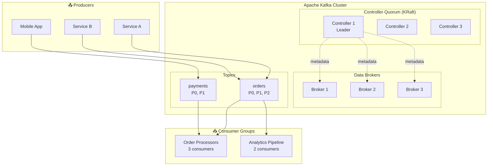
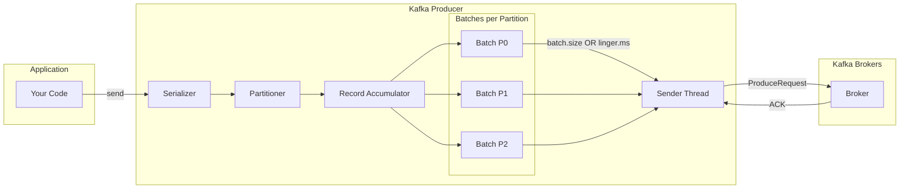
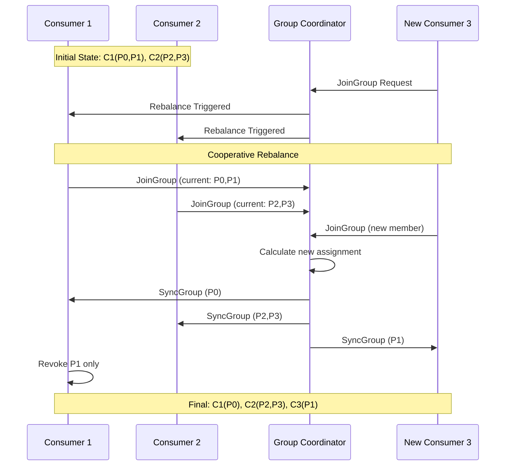
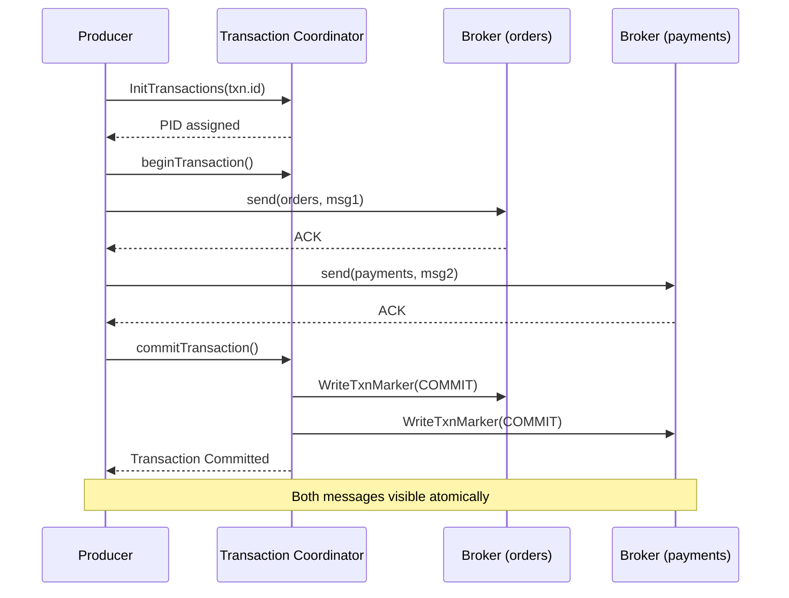
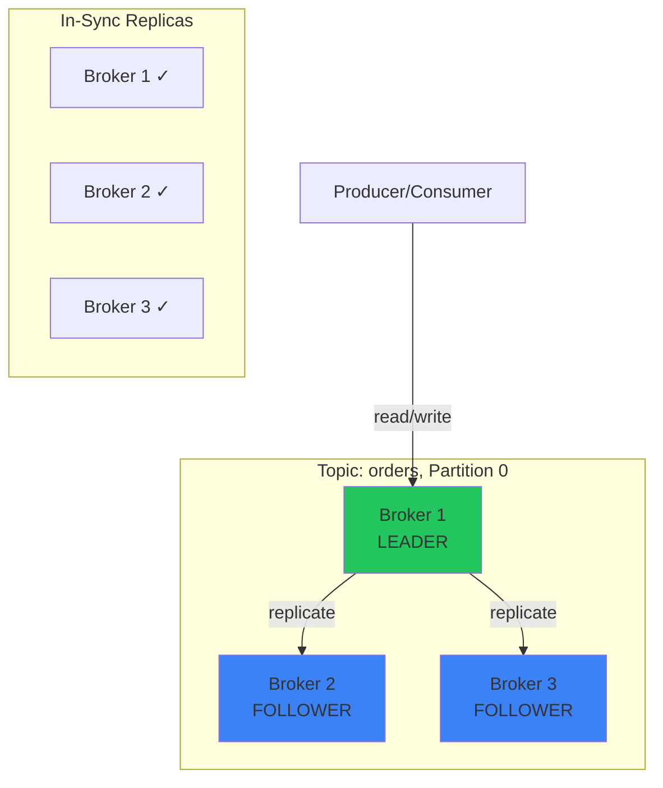

[🏠 Home](../README.md) | [⬅️ Components Overview](./00-components-overview.md)

# 🚀 Apache Kafka In-Depth Guide

> Master event streaming internals - from producers to KRaft consensus

---

## 📋 Table of Contents

1. [What is Apache Kafka?](#-what-is-apache-kafka)
2. [Core Concepts](#-core-concepts)
3. [Architecture Overview](#-architecture-overview)
4. [KRaft Mode Deep Dive](#-kraft-mode-deep-dive)
5. [Producers Internals](#-producers-internals)
6. [Consumers Internals](#-consumers-internals)
7. [Partitioning Strategy](#-partitioning-strategy)
8. [Important Configurations](#-important-configurations)
9. [Idempotency & Transactions](#-idempotency--transactions)
10. [AWS MSK Deployment](#-aws-msk-deployment)
11. [Real-World Use Cases](#-real-world-use-cases)
12. [Visual Architecture (Mermaid Diagrams)](#-visual-architecture-mermaid-diagrams)
13. [Interview Questions & Answers](#-interview-questions--answers)

---

## 🎯 What is Apache Kafka?

Apache Kafka is a **distributed event streaming platform** designed for high-throughput, fault-tolerant, real-time data pipelines. Unlike traditional message queues, Kafka persists messages and allows replay.

### Kafka vs Traditional Message Queues

| Feature | Kafka | RabbitMQ/ActiveMQ |
|---------|-------|-------------------|
| **Message Persistence** | Persists all messages | Typically deletes after consumption |
| **Replay Capability** | Yes, via offset seek | No |
| **Throughput** | Millions/sec | Thousands/sec |
| **Ordering** | Per partition | Per queue |
| **Consumer Model** | Pull-based | Push-based |
| **Use Case** | Event streaming, logs | Task queues, RPC |

### When to Use Kafka

✅ **Use Kafka for:**
- Event sourcing & CQRS
- Real-time analytics pipelines
- Log aggregation
- Change Data Capture (CDC)
- Microservices event-driven communication

❌ **Avoid Kafka for:**
- Simple request-reply patterns
- Low-volume messaging
- When message ordering across all messages is required

---

## 📚 Core Concepts

### Key Terminology

```
┌─────────────────────────────────────────────────────────────────┐
│                      KAFKA ECOSYSTEM                            │
├─────────────────────────────────────────────────────────────────┤
│                                                                 │
│  ┌──────────────────────────────────────────────────────────┐   │
│  │                       CLUSTER                             │   │
│  │  ┌─────────┐  ┌─────────┐  ┌─────────┐                   │   │
│  │  │ Broker 1│  │ Broker 2│  │ Broker 3│                   │   │
│  │  │(Ctrl+Brk)│  │ (Broker)│  │ (Broker)│                   │   │
│  │  └─────────┘  └─────────┘  └─────────┘                   │   │
│  │       │            │            │                         │   │
│  │       └────────────┴────────────┘                         │   │
│  │                    │                                      │   │
│  │              ┌─────┴─────┐                                │   │
│  │              │   TOPIC   │ (orders)                       │   │
│  │              ├───────────┤                                │   │
│  │   ┌──────────┼───────────┼──────────┐                     │   │
│  │   │          │           │          │                     │   │
│  │ ┌─┴─┐      ┌─┴─┐       ┌─┴─┐      ┌─┴─┐                   │   │
│  │ │P0 │      │P1 │       │P2 │      │P3 │  ← Partitions     │   │
│  │ └───┘      └───┘       └───┘      └───┘                   │   │
│  │                                                           │   │
│  └──────────────────────────────────────────────────────────┘   │
│                                                                 │
│  Producer ──────► Topic ──────► Consumer Group                  │
│                                                                 │
└─────────────────────────────────────────────────────────────────┘
```

| Term | Description |
|------|-------------|
| **Broker** | Kafka server that stores data and serves clients |
| **Topic** | Named category/feed to which records are published |
| **Partition** | Ordered, immutable sequence of records within a topic |
| **Offset** | Unique sequential ID for each record within a partition |
| **Producer** | Client that publishes records to topics |
| **Consumer** | Client that reads records from topics |
| **Consumer Group** | Set of consumers sharing the work of reading a topic |
| **Replica** | Copy of a partition for fault tolerance |
| **Leader** | Partition replica that handles all reads/writes |
| **ISR** | In-Sync Replicas - replicas caught up with leader |

### Message Structure

```
┌─────────────────────────────────────────────────────────────────┐
│                    KAFKA RECORD (MESSAGE)                        │
├─────────────────────────────────────────────────────────────────┤
│                                                                 │
│  ┌─────────────────────────────────────────────────────────┐   │
│  │  Headers (optional)                                      │   │
│  │  ┌─────────────────┬─────────────────┐                   │   │
│  │  │ correlation-id  │ abc-123         │                   │   │
│  │  │ source          │ payment-service │                   │   │
│  │  └─────────────────┴─────────────────┘                   │   │
│  ├─────────────────────────────────────────────────────────┤   │
│  │  Key (optional): "user-123"                              │   │
│  │  • Used for partitioning                                 │   │
│  │  • Same key → Same partition                             │   │
│  ├─────────────────────────────────────────────────────────┤   │
│  │  Value: {"orderId": "ORD-456", "amount": 99.99}         │   │
│  │  • The actual message payload                            │   │
│  │  • Can be JSON, Avro, Protobuf, bytes                    │   │
│  ├─────────────────────────────────────────────────────────┤   │
│  │  Timestamp: 1706356800000                                │   │
│  │  • CreateTime or LogAppendTime                           │   │
│  └─────────────────────────────────────────────────────────┘   │
│                                                                 │
└─────────────────────────────────────────────────────────────────┘
```

---

## 🏗️ Architecture Overview

### Cluster Architecture

```
┌─────────────────────────────────────────────────────────────────┐
│                    KAFKA CLUSTER ARCHITECTURE                    │
├─────────────────────────────────────────────────────────────────┤
│                                                                 │
│   ┌─────────────────────────────────────────────────────────┐   │
│   │                    Controller Quorum                     │   │
│   │        (KRaft mode - manages metadata)                   │   │
│   │  ┌───────────┐ ┌───────────┐ ┌───────────┐              │   │
│   │  │Controller │ │Controller │ │Controller │              │   │
│   │  │  (Active) │ │ (Follower)│ │ (Follower)│              │   │
│   │  └─────┬─────┘ └─────┬─────┘ └─────┬─────┘              │   │
│   │        └─────────────┼─────────────┘                     │   │
│   └──────────────────────┼──────────────────────────────────┘   │
│                          │ Metadata                              │
│   ┌──────────────────────┼──────────────────────────────────┐   │
│   │                      ▼                                   │   │
│   │  ┌─────────────┐ ┌─────────────┐ ┌─────────────┐        │   │
│   │  │  Broker 1   │ │  Broker 2   │ │  Broker 3   │        │   │
│   │  ├─────────────┤ ├─────────────┤ ├─────────────┤        │   │
│   │  │ Topic A     │ │ Topic A     │ │ Topic A     │        │   │
│   │  │ ┌─────────┐ │ │ ┌─────────┐ │ │ ┌─────────┐ │        │   │
│   │  │ │P0 Leader│ │ │ │P0 Follow│ │ │ │P1 Leader│ │        │   │
│   │  │ │P1 Follow│ │ │ │P1 Follow│ │ │ │P2 Leader│ │        │   │
│   │  │ │P2 Follow│ │ │ │P2 Follow│ │ │ │P0 Follow│ │        │   │
│   │  │ └─────────┘ │ │ └─────────┘ │ │ └─────────┘ │        │   │
│   │  └─────────────┘ └─────────────┘ └─────────────┘        │   │
│   │                      DATA BROKERS                        │   │
│   └─────────────────────────────────────────────────────────┘   │
│                                                                 │
│   Clients: Producers & Consumers connect to Brokers             │
│                                                                 │
└─────────────────────────────────────────────────────────────────┘
```

### Write Path

```
┌─────────────────────────────────────────────────────────────────┐
│                        WRITE PATH                                │
├─────────────────────────────────────────────────────────────────┤
│                                                                 │
│  Producer                                                        │
│     │                                                            │
│     │ 1. Send record with key="user-123"                        │
│     │    partition = hash("user-123") % num_partitions          │
│     ▼                                                            │
│  ┌─────────────────────────────────────────┐                    │
│  │           Partition Leader              │                    │
│  │  1. Append to local log                 │                    │
│  │  2. Update LEO (Log End Offset)         │                    │
│  │  3. Wait for ISR acknowledgment         │                    │
│  └────────────────┬────────────────────────┘                    │
│                   │                                              │
│          ┌────────┴────────┐                                    │
│          ▼                 ▼                                    │
│    ┌──────────┐      ┌──────────┐                               │
│    │ Follower │      │ Follower │                               │
│    │ Replica 1│      │ Replica 2│                               │
│    │ (fetch)  │      │ (fetch)  │                               │
│    └────┬─────┘      └────┬─────┘                               │
│         │                  │                                     │
│         └────────┬─────────┘                                     │
│                  ▼                                               │
│         ACK sent to Leader                                       │
│                  │                                               │
│                  ▼                                               │
│         Leader ACKs Producer (based on acks setting)             │
│                                                                 │
│  acks=0  → No wait (fire and forget)                            │
│  acks=1  → Wait for leader only                                 │
│  acks=all → Wait for all ISR replicas                           │
│                                                                 │
└─────────────────────────────────────────────────────────────────┘
```

---

## ⚡ KRaft Mode Deep Dive

### What is KRaft?

KRaft (Kafka Raft) is Kafka's **ZooKeeper-free** mode, using the Raft consensus algorithm for metadata management. Production-ready since Kafka 3.3+.

### ZooKeeper vs KRaft

```
┌─────────────────────────────────────────────────────────────────┐
│              ZOOKEEPER MODE (Legacy)                             │
├─────────────────────────────────────────────────────────────────┤
│                                                                 │
│  ┌────────────────┐         ┌────────────────────────────────┐  │
│  │   ZooKeeper    │◄───────►│         Kafka Cluster          │  │
│  │   Ensemble     │         │  • Broker metadata             │  │
│  │  (3-5 nodes)   │         │  • Topic configs               │  │
│  │                │         │  • ACLs                        │  │
│  └────────────────┘         └────────────────────────────────┘  │
│                                                                 │
│  Problems:                                                       │
│  • Separate system to manage                                    │
│  • Different failure modes                                      │
│  • Scalability limited (~200K partitions)                       │
│  • Controller failover can take minutes                         │
│                                                                 │
└─────────────────────────────────────────────────────────────────┘

┌─────────────────────────────────────────────────────────────────┐
│                    KRAFT MODE (Modern)                           │
├─────────────────────────────────────────────────────────────────┤
│                                                                 │
│  ┌─────────────────────────────────────────────────────────┐   │
│  │                   Kafka Cluster                          │   │
│  │  ┌─────────────────────────────────────────────────┐     │   │
│  │  │          Controller Quorum (Raft)               │     │   │
│  │  │  • Active Controller (Leader)                   │     │   │
│  │  │  • Follower Controllers                         │     │   │
│  │  │  • __cluster_metadata topic                     │     │   │
│  │  └─────────────────────────────────────────────────┘     │   │
│  │                                                          │   │
│  │  ┌─────────────┐ ┌─────────────┐ ┌─────────────┐        │   │
│  │  │   Broker    │ │   Broker    │ │   Broker    │        │   │
│  │  └─────────────┘ └─────────────┘ └─────────────┘        │   │
│  └─────────────────────────────────────────────────────────┘   │
│                                                                 │
│  Benefits:                                                       │
│  • Single system to manage                                      │
│  • Faster failover (seconds vs minutes)                         │
│  • Millions of partitions supported                             │
│  • Simpler operations                                           │
│                                                                 │
└─────────────────────────────────────────────────────────────────┘
```

### KRaft Internal Architecture

```
┌─────────────────────────────────────────────────────────────────┐
│                  KRAFT METADATA MANAGEMENT                       │
├─────────────────────────────────────────────────────────────────┤
│                                                                 │
│  __cluster_metadata Topic (Single Partition)                    │
│  ┌─────────────────────────────────────────────────────────┐   │
│  │  Offset 0: RegisterBrokerRecord(brokerId=1, ...)        │   │
│  │  Offset 1: TopicRecord(topicId=xyz, name="orders")      │   │
│  │  Offset 2: PartitionRecord(topicId=xyz, partitionId=0)  │   │
│  │  Offset 3: ConfigRecord(type=TOPIC, name="orders", ...) │   │
│  │  Offset 4: ProducerIdsRecord(brokerId=1, ...)           │   │
│  │  ...                                                     │   │
│  └─────────────────────────────────────────────────────────┘   │
│                                                                 │
│  Controller Operations:                                          │
│  1. Append metadata changes to __cluster_metadata               │
│  2. Replicate via Raft to follower controllers                  │
│  3. Brokers fetch metadata updates                              │
│  4. Periodic snapshots to prevent unbounded growth              │
│                                                                 │
│  ┌─────────────────────────────────────────────────────────┐   │
│  │              Raft Consensus Protocol                     │   │
│  │                                                          │   │
│  │  Leader Election:                                        │   │
│  │  • Followers timeout → become candidates                 │   │
│  │  • Candidates request votes                              │   │
│  │  • Majority wins → becomes leader                        │   │
│  │  • Leader sends heartbeats to maintain leadership        │   │
│  │                                                          │   │
│  │  Log Replication:                                        │   │
│  │  • Leader appends entry with new epoch                   │   │
│  │  • Followers replicate (pull-based)                      │   │
│  │  • Entry committed when majority acknowledges            │   │
│  └─────────────────────────────────────────────────────────┘   │
│                                                                 │
└─────────────────────────────────────────────────────────────────┘
```

### KRaft Configuration

```properties
# server.properties for KRaft mode

# Node roles: controller, broker, or both
process.roles=broker,controller

# Unique node ID
node.id=1

# Controller quorum voters (node.id@host:port)
controller.quorum.voters=1@localhost:9093,2@localhost:9094,3@localhost:9095

# Listeners
listeners=PLAINTEXT://:9092,CONTROLLER://:9093
controller.listener.names=CONTROLLER
inter.broker.listener.name=PLAINTEXT

# Log directories
log.dirs=/var/kafka-logs
metadata.log.dir=/var/kafka-metadata
```

---

## 📤 Producers Internals

### Producer Architecture

```
┌─────────────────────────────────────────────────────────────────┐
│                    PRODUCER INTERNALS                            │
├─────────────────────────────────────────────────────────────────┤
│                                                                 │
│  Application Thread                                              │
│       │                                                          │
│       │ producer.send(record)                                   │
│       ▼                                                          │
│  ┌─────────────────────────────────────────────────────────┐   │
│  │  1. Serializer                                           │   │
│  │     Key → bytes, Value → bytes                           │   │
│  ├─────────────────────────────────────────────────────────┤   │
│  │  2. Partitioner                                          │   │
│  │     • If key != null: hash(key) % numPartitions          │   │
│  │     • If key == null: round-robin or sticky              │   │
│  ├─────────────────────────────────────────────────────────┤   │
│  │  3. Record Accumulator (Buffer)                          │   │
│  │     ┌─────────┐ ┌─────────┐ ┌─────────┐                  │   │
│  │     │ Batch 0 │ │ Batch 1 │ │ Batch 2 │  ← Per partition │   │
│  │     │ (P0)    │ │ (P1)    │ │ (P2)    │    batching      │   │
│  │     └─────────┘ └─────────┘ └─────────┘                  │   │
│  └─────────────────────────────────────────────────────────┘   │
│                          │                                       │
│                          │ When batch.size reached OR            │
│                          │ linger.ms elapsed                     │
│                          ▼                                       │
│  ┌─────────────────────────────────────────────────────────┐   │
│  │  Sender Thread (Background)                              │   │
│  │  • Groups batches by broker                              │   │
│  │  • Sends ProduceRequest                                  │   │
│  │  • Handles retries (with backoff)                        │   │
│  │  • Manages in-flight requests                            │   │
│  └─────────────────────────────────────────────────────────┘   │
│                          │                                       │
│                          ▼                                       │
│                    Kafka Broker                                  │
│                                                                 │
└─────────────────────────────────────────────────────────────────┘
```

### Key Producer Configurations

| Config | Default | Description |
|--------|---------|-------------|
| `acks` | `all` (3.0+) | 0=no wait, 1=leader only, all=ISR |
| `retries` | `MAX_INT` | Number of retries on failure |
| `batch.size` | 16384 | Max batch size in bytes |
| `linger.ms` | 0 | Time to wait for more records |
| `buffer.memory` | 33554432 | Total buffer memory |
| `max.in.flight.requests.per.connection` | 5 | Concurrent requests per broker |
| `enable.idempotence` | `true` (3.0+) | Enable exactly-once per partition |

### Java Producer Example

```java
Properties props = new Properties();
props.put(ProducerConfig.BOOTSTRAP_SERVERS_CONFIG, "localhost:9092");
props.put(ProducerConfig.KEY_SERIALIZER_CLASS_CONFIG, StringSerializer.class);
props.put(ProducerConfig.VALUE_SERIALIZER_CLASS_CONFIG, StringSerializer.class);

// Performance tuning
props.put(ProducerConfig.BATCH_SIZE_CONFIG, 32768);      // 32KB batches
props.put(ProducerConfig.LINGER_MS_CONFIG, 20);          // Wait 20ms
props.put(ProducerConfig.COMPRESSION_TYPE_CONFIG, "lz4"); // Compress

// Reliability
props.put(ProducerConfig.ACKS_CONFIG, "all");
props.put(ProducerConfig.ENABLE_IDEMPOTENCE_CONFIG, true);

try (KafkaProducer<String, String> producer = new KafkaProducer<>(props)) {
    ProducerRecord<String, String> record = new ProducerRecord<>(
        "orders",           // topic
        "user-123",         // key (determines partition)
        "{\"orderId\": 1}"  // value
    );
    
    // Async send with callback
    producer.send(record, (metadata, exception) -> {
        if (exception == null) {
            System.out.printf("Sent to partition %d, offset %d%n",
                metadata.partition(), metadata.offset());
        } else {
            exception.printStackTrace();
        }
    });
}
```

---

## 📥 Consumers Internals

### Consumer Group Architecture

```
┌─────────────────────────────────────────────────────────────────┐
│                   CONSUMER GROUP ARCHITECTURE                    │
├─────────────────────────────────────────────────────────────────┤
│                                                                 │
│  Topic: orders (4 partitions)                                    │
│  ┌─────┐ ┌─────┐ ┌─────┐ ┌─────┐                                │
│  │ P0  │ │ P1  │ │ P2  │ │ P3  │                                │
│  └──┬──┘ └──┬──┘ └──┬──┘ └──┬──┘                                │
│     │       │       │       │                                    │
│     └───────┴───┬───┴───────┘                                   │
│                 │                                                │
│                 ▼                                                │
│  ┌─────────────────────────────────────────────────────────┐   │
│  │           Consumer Group: "order-processors"             │   │
│  │                                                          │   │
│  │  ┌─────────────┐  ┌─────────────┐  ┌─────────────┐      │   │
│  │  │ Consumer 1  │  │ Consumer 2  │  │ Consumer 3  │      │   │
│  │  │ (P0, P1)    │  │ (P2)        │  │ (P3)        │      │   │
│  │  └─────────────┘  └─────────────┘  └─────────────┘      │   │
│  │                                                          │   │
│  │  Group Coordinator (Broker)                              │   │
│  │  • Manages membership                                    │   │
│  │  • Triggers rebalance                                    │   │
│  │  • Stores committed offsets                              │   │
│  └─────────────────────────────────────────────────────────┘   │
│                                                                 │
│  Rules:                                                          │
│  • Each partition → exactly one consumer per group              │
│  • More consumers than partitions → some idle                   │
│  • Consumer leaves → partitions redistributed                   │
│                                                                 │
└─────────────────────────────────────────────────────────────────┘
```

### Consumer Rebalancing

```
┌─────────────────────────────────────────────────────────────────┐
│                    REBALANCE TRIGGERS                            │
├─────────────────────────────────────────────────────────────────┤
│                                                                 │
│  Rebalance happens when:                                         │
│  • Consumer joins the group                                     │
│  • Consumer leaves (graceful shutdown)                          │
│  • Consumer crashes (heartbeat timeout)                         │
│  • New partitions added to topic                                │
│  • Subscription changes                                          │
│                                                                 │
│  ┌─────────────────────────────────────────────────────────┐   │
│  │              EAGER REBALANCE (Legacy)                    │   │
│  │                                                          │   │
│  │  1. All consumers stop processing                        │   │
│  │  2. All consumers revoke ALL partitions                  │   │
│  │  3. Group coordinator reassigns                          │   │
│  │  4. All consumers resume with new assignments            │   │
│  │                                                          │   │
│  │  Problem: Complete processing pause                       │   │
│  └─────────────────────────────────────────────────────────┘   │
│                                                                 │
│  ┌─────────────────────────────────────────────────────────┐   │
│  │           COOPERATIVE REBALANCE (Recommended)            │   │
│  │                                                          │   │
│  │  1. Consumers continue processing                        │   │
│  │  2. Only affected partitions are revoked                 │   │
│  │  3. Incremental reassignment                             │   │
│  │  4. Minimal disruption                                   │   │
│  │                                                          │   │
│  │  Enable: partition.assignment.strategy=                  │   │
│  │          CooperativeStickyAssignor                       │   │
│  └─────────────────────────────────────────────────────────┘   │
│                                                                 │
└─────────────────────────────────────────────────────────────────┘
```

### Offset Management

```
┌─────────────────────────────────────────────────────────────────┐
│                    OFFSET MANAGEMENT                             │
├─────────────────────────────────────────────────────────────────┤
│                                                                 │
│  Partition Log:                                                  │
│  ┌────┬────┬────┬────┬────┬────┬────┬────┬────┬────┐            │
│  │ 0  │ 1  │ 2  │ 3  │ 4  │ 5  │ 6  │ 7  │ 8  │ 9  │            │
│  └────┴────┴────┴────┴────┴────┴────┴────┴────┴────┘            │
│                          ▲              ▲                        │
│                          │              │                        │
│              Committed Offset (5)   Current Position (8)         │
│              (stored in            (in-memory, where             │
│               __consumer_offsets)   consumer will read next)     │
│                                                                 │
│  Commit Strategies:                                              │
│  ┌─────────────────────────────────────────────────────────┐   │
│  │  AUTO COMMIT (enable.auto.commit=true)                   │   │
│  │  • Commits every auto.commit.interval.ms (5000ms)        │   │
│  │  • Risk: Message loss or duplicates on crash             │   │
│  ├─────────────────────────────────────────────────────────┤   │
│  │  MANUAL SYNC (commitSync())                              │   │
│  │  • Blocks until commit confirmed                         │   │
│  │  • Slowest but safest                                    │   │
│  ├─────────────────────────────────────────────────────────┤   │
│  │  MANUAL ASYNC (commitAsync())                            │   │
│  │  • Non-blocking, uses callback                           │   │
│  │  • Best for throughput                                   │   │
│  └─────────────────────────────────────────────────────────┘   │
│                                                                 │
└─────────────────────────────────────────────────────────────────┘
```

### Java Consumer Example

```java
Properties props = new Properties();
props.put(ConsumerConfig.BOOTSTRAP_SERVERS_CONFIG, "localhost:9092");
props.put(ConsumerConfig.GROUP_ID_CONFIG, "order-processors");
props.put(ConsumerConfig.KEY_DESERIALIZER_CLASS_CONFIG, StringDeserializer.class);
props.put(ConsumerConfig.VALUE_DESERIALIZER_CLASS_CONFIG, StringDeserializer.class);

// Offset management
props.put(ConsumerConfig.ENABLE_AUTO_COMMIT_CONFIG, false);
props.put(ConsumerConfig.AUTO_OFFSET_RESET_CONFIG, "earliest");

// Rebalance strategy
props.put(ConsumerConfig.PARTITION_ASSIGNMENT_STRATEGY_CONFIG,
          CooperativeStickyAssignor.class.getName());

try (KafkaConsumer<String, String> consumer = new KafkaConsumer<>(props)) {
    consumer.subscribe(List.of("orders"));
    
    while (true) {
        ConsumerRecords<String, String> records = consumer.poll(Duration.ofMillis(100));
        
        for (ConsumerRecord<String, String> record : records) {
            System.out.printf("Partition: %d, Offset: %d, Key: %s, Value: %s%n",
                record.partition(), record.offset(), record.key(), record.value());
            
            // Process record...
        }
        
        // Manual commit after processing
        consumer.commitSync();
    }
}
```

---

## 📊 Partitioning Strategy

### How to Decide Number of Partitions

```
┌─────────────────────────────────────────────────────────────────┐
│              PARTITION COUNT DECISION FRAMEWORK                  │
├─────────────────────────────────────────────────────────────────┤
│                                                                 │
│  FORMULA:                                                        │
│                                                                 │
│  partitions = max(Tp/p, Tc/c)                                   │
│                                                                 │
│  Where:                                                          │
│  • Tp = Target throughput (MB/s)                                │
│  • p  = Throughput per producer partition (~10 MB/s)            │
│  • Tc = Target throughput (MB/s)                                │
│  • c  = Throughput per consumer partition (~5-10 MB/s)          │
│                                                                 │
│  Example:                                                        │
│  • Need 100 MB/s throughput                                     │
│  • Producer: 100 / 10 = 10 partitions                           │
│  • Consumer: 100 / 5 = 20 partitions                            │
│  • Result: max(10, 20) = 20 partitions                          │
│                                                                 │
└─────────────────────────────────────────────────────────────────┘

┌─────────────────────────────────────────────────────────────────┐
│                    CONSIDERATIONS                                │
├─────────────────────────────────────────────────────────────────┤
│                                                                 │
│  ✅ MORE PARTITIONS:                                             │
│  • Higher parallelism                                           │
│  • More consumers can process simultaneously                    │
│  • Better scalability                                           │
│                                                                 │
│  ❌ TOO MANY PARTITIONS:                                         │
│  • More file handles on brokers                                 │
│  • Longer leader election time                                  │
│  • More memory for consumers                                    │
│  • Increased end-to-end latency                                 │
│                                                                 │
│  📋 GUIDELINES:                                                  │
│  • Start with 6-12 partitions for new topics                    │
│  • Plan for 12-18 month growth                                  │
│  • Choose divisible numbers (12, 24, 48)                        │
│  • Max ~4000 partitions per broker                              │
│  • Cannot reduce partitions (only increase)                     │
│                                                                 │
└─────────────────────────────────────────────────────────────────┘
```

### Partitioning Strategies

| Strategy | Use Case | Ordering Guarantee |
|----------|----------|-------------------|
| **Key-based** | Events for same entity together | Per key |
| **Round-robin** | Max throughput, no ordering needed | None |
| **Custom** | Business logic (region, priority) | Depends |

```java
// Custom partitioner example
public class RegionPartitioner implements Partitioner {
    @Override
    public int partition(String topic, Object key, byte[] keyBytes,
                        Object value, byte[] valueBytes, Cluster cluster) {
        String region = extractRegion(key);
        int numPartitions = cluster.partitionsForTopic(topic).size();
        
        return switch(region) {
            case "US" -> 0;
            case "EU" -> numPartitions / 3;
            case "APAC" -> 2 * numPartitions / 3;
            default -> Math.abs(key.hashCode()) % numPartitions;
        };
    }
}
```

---

## 🔒 Idempotency & Transactions

### Delivery Semantics

```
┌─────────────────────────────────────────────────────────────────┐
│                   DELIVERY SEMANTICS                             │
├─────────────────────────────────────────────────────────────────┤
│                                                                 │
│  AT-MOST-ONCE:                                                   │
│  ┌─────────────────────────────────────────┐                    │
│  │  Producer ──send──► Broker              │                    │
│  │     │         ✗ (no retry on failure)   │                    │
│  │     └──────► Message may be LOST        │                    │
│  └─────────────────────────────────────────┘                    │
│                                                                 │
│  AT-LEAST-ONCE (Default):                                        │
│  ┌─────────────────────────────────────────┐                    │
│  │  Producer ──send──► Broker              │                    │
│  │     │         timeout                    │                    │
│  │     └──retry──► Broker                  │                    │
│  │         ✓✓ (Message may be DUPLICATED)  │                    │
│  └─────────────────────────────────────────┘                    │
│                                                                 │
│  EXACTLY-ONCE (Idempotent + Transactional):                      │
│  ┌─────────────────────────────────────────┐                    │
│  │  Producer ──send(PID, SeqNum)──► Broker │                    │
│  │     │         timeout                    │                    │
│  │     └──retry(PID, SeqNum)──► Broker     │                    │
│  │         Broker detects duplicate        │                    │
│  │         ✓ (One and only one)            │                    │
│  └─────────────────────────────────────────┘                    │
│                                                                 │
└─────────────────────────────────────────────────────────────────┘
```

### Idempotent Producer

```
┌─────────────────────────────────────────────────────────────────┐
│                  IDEMPOTENT PRODUCER                             │
├─────────────────────────────────────────────────────────────────┤
│                                                                 │
│  How it works:                                                   │
│                                                                 │
│  1. Producer gets PID (Producer ID) from broker                 │
│  2. Each message gets sequence number per partition             │
│  3. Broker tracks: {PID, PartitionId} → LastSeqNum              │
│  4. On retry, broker detects duplicate and rejects              │
│                                                                 │
│  ┌─────────────────────────────────────────────────────────┐   │
│  │  Producer (PID=42)                                       │   │
│  │     │                                                    │   │
│  │     │ Send: {PID=42, Partition=0, SeqNum=5, msg="A"}     │   │
│  │     │                                                    │   │
│  │     ▼                                                    │   │
│  │  Broker                                                  │   │
│  │  ┌──────────────────────────────────────────┐           │   │
│  │  │ Seq Tracker: {(42,0): 4}                 │           │   │
│  │  │                                          │           │   │
│  │  │ Incoming SeqNum=5, Expected=5 ✓ Accept   │           │   │
│  │  │ Update: {(42,0): 5}                      │           │   │
│  │  └──────────────────────────────────────────┘           │   │
│  │                                                          │   │
│  │  If network timeout causes retry with same SeqNum:       │   │
│  │  Incoming SeqNum=5, Last=5 → Duplicate! Reject           │   │
│  └─────────────────────────────────────────────────────────┘   │
│                                                                 │
│  Configuration:                                                  │
│  enable.idempotence=true (default in Kafka 3.0+)                │
│  max.in.flight.requests.per.connection ≤ 5                      │
│  acks=all                                                       │
│  retries > 0                                                    │
│                                                                 │
└─────────────────────────────────────────────────────────────────┘
```

### Transactional Producer

```java
Properties props = new Properties();
props.put(ProducerConfig.BOOTSTRAP_SERVERS_CONFIG, "localhost:9092");
props.put(ProducerConfig.TRANSACTIONAL_ID_CONFIG, "order-processor-1");
props.put(ProducerConfig.ENABLE_IDEMPOTENCE_CONFIG, true);

KafkaProducer<String, String> producer = new KafkaProducer<>(props);

// Initialize transactions (call once)
producer.initTransactions();

try {
    // Start transaction
    producer.beginTransaction();
    
    // Send multiple messages atomically
    producer.send(new ProducerRecord<>("orders", "key1", "order1"));
    producer.send(new ProducerRecord<>("payments", "key1", "payment1"));
    producer.send(new ProducerRecord<>("inventory", "key1", "reserve1"));
    
    // Commit transaction (all or nothing)
    producer.commitTransaction();
    
} catch (Exception e) {
    // Abort transaction on failure
    producer.abortTransaction();
    throw e;
}
```

### Read-Process-Write Pattern (Exactly-Once)

```
┌─────────────────────────────────────────────────────────────────┐
│              CONSUME-TRANSFORM-PRODUCE PATTERN                   │
├─────────────────────────────────────────────────────────────────┤
│                                                                 │
│  ┌───────────┐    ┌───────────────────┐    ┌───────────┐       │
│  │  Source   │ ──►│    Application    │ ──►│  Target   │       │
│  │  Topic    │    │                   │    │  Topic    │       │
│  └───────────┘    │  consumer.poll()  │    └───────────┘       │
│                   │  process()        │                         │
│                   │  producer.send()  │                         │
│                   └───────────────────┘                         │
│                                                                 │
│  WITHOUT TRANSACTIONS:                                           │
│  • Process message → produce output → commit offset             │
│  • Crash after produce but before commit = DUPLICATE            │
│  • Commit before produce = MESSAGE LOSS                         │
│                                                                 │
│  WITH TRANSACTIONS:                                              │
│  producer.beginTransaction();                                    │
│  producer.send(outputRecord);                                   │
│  producer.sendOffsetsToTransaction(consumedOffsets, groupId);   │
│  producer.commitTransaction();                                   │
│                                                                 │
│  → Offset commit and output are ATOMIC                          │
│  → Consumer uses: isolation.level=read_committed                │
│                                                                 │
└─────────────────────────────────────────────────────────────────┘
```

---

## ⚙️ Important Configurations

### Broker Configurations

| Config | Default | Recommendation | Purpose |
|--------|---------|----------------|---------|
| `num.partitions` | 1 | 6-12 | Default partitions for new topics |
| `default.replication.factor` | 1 | 3 | Replicas for fault tolerance |
| `min.insync.replicas` | 1 | 2 | Min replicas for acks=all |
| `log.retention.hours` | 168 (7d) | Based on use case | How long to keep data |
| `log.segment.bytes` | 1GB | 1GB | Segment file size |
| `message.max.bytes` | 1MB | 1-10MB | Max message size |

### Producer Configurations

| Config | Default | High Throughput | High Reliability |
|--------|---------|-----------------|------------------|
| `acks` | all | 1 | all |
| `batch.size` | 16KB | 64KB-128KB | 16KB |
| `linger.ms` | 0 | 20-100 | 5 |
| `compression.type` | none | lz4/snappy | lz4 |
| `buffer.memory` | 32MB | 64MB+ | 32MB |
| `enable.idempotence` | true | true | true |

### Consumer Configurations

| Config | Default | Recommendation | Purpose |
|--------|---------|----------------|---------|
| `fetch.min.bytes` | 1 | 1-1024 | Min data before returning |
| `fetch.max.wait.ms` | 500 | 100-500 | Max wait time |
| `max.poll.records` | 500 | 100-1000 | Records per poll |
| `max.poll.interval.ms` | 300000 | Processing time + buffer | Max time between polls |
| `session.timeout.ms` | 45000 | 10000-30000 | Heartbeat timeout |
| `auto.offset.reset` | latest | earliest/latest | Behavior when no offset |

---

## ☁️ AWS MSK Deployment

### MSK Architecture

```
┌─────────────────────────────────────────────────────────────────┐
│                      AWS MSK CLUSTER                             │
├─────────────────────────────────────────────────────────────────┤
│                                                                 │
│  ┌─────────────────────────────────────────────────────────┐   │
│  │                         VPC                              │   │
│  │  ┌─────────────┐ ┌─────────────┐ ┌─────────────┐        │   │
│  │  │     AZ-a    │ │     AZ-b    │ │     AZ-c    │        │   │
│  │  │  ┌───────┐  │ │  ┌───────┐  │ │  ┌───────┐  │        │   │
│  │  │  │Broker1│  │ │  │Broker2│  │ │  │Broker3│  │        │   │
│  │  │  └───────┘  │ │  └───────┘  │ │  └───────┘  │        │   │
│  │  │             │ │             │ │             │        │   │
│  │  │  ┌───────┐  │ │  ┌───────┐  │ │  ┌───────┐  │        │   │
│  │  │  │  EBS  │  │ │  │  EBS  │  │ │  │  EBS  │  │        │   │
│  │  │  └───────┘  │ │  └───────┘  │ │  └───────┘  │        │   │
│  │  └─────────────┘ └─────────────┘ └─────────────┘        │   │
│  │                                                          │   │
│  │  Security: IAM Auth / SASL/SCRAM / mTLS                  │   │
│  │  Encryption: At-rest (KMS) + In-transit (TLS)            │   │
│  └─────────────────────────────────────────────────────────┘   │
│                                                                 │
│  Monitoring: CloudWatch + Prometheus (Open Monitoring)          │
│                                                                 │
└─────────────────────────────────────────────────────────────────┘
```

### MSK Best Practices

| Category | Recommendation |
|----------|----------------|
| **Sizing** | CPU utilization < 60%, plan for 3 AZs |
| **Storage** | Use provisioned throughput for predictable performance |
| **Security** | Enable IAM auth, TLS, encrypt at rest with KMS |
| **Monitoring** | Enable Enhanced monitoring, set CloudWatch alarms |
| **Networking** | Private subnets, VPC endpoints for clients |

### MSK Configuration Example

```java
// Spring Boot application.yml for AWS MSK
spring:
  kafka:
    bootstrap-servers: ${MSK_BOOTSTRAP_SERVERS}
    security:
      protocol: SASL_SSL
    properties:
      sasl.mechanism: AWS_MSK_IAM
      sasl.jaas.config: software.amazon.msk.auth.iam.IAMLoginModule required;
      sasl.client.callback.handler.class: software.amazon.msk.auth.iam.IAMClientCallbackHandler
    ssl:
      trust-store-location: classpath:kafka.client.truststore.jks
```

---

## 🌍 Real-World Use Cases

### Use Case 1: Event Sourcing

```
┌─────────────────────────────────────────────────────────────────┐
│                      EVENT SOURCING                              │
├─────────────────────────────────────────────────────────────────┤
│                                                                 │
│  Commands ──► Event Store (Kafka) ──► Projections               │
│                                                                 │
│  ┌─────────────────────────────────────────────────────────┐   │
│  │  Topic: account-events                                   │   │
│  │  ┌──────────────────────────────────────────────────┐   │   │
│  │  │ Key: acc-123 │ AccountCreated {balance: 0}       │   │   │
│  │  │ Key: acc-123 │ MoneyDeposited {amount: 100}      │   │   │
│  │  │ Key: acc-123 │ MoneyWithdrawn {amount: 50}       │   │   │
│  │  │ Key: acc-123 │ MoneyDeposited {amount: 200}      │   │   │
│  │  └──────────────────────────────────────────────────┘   │   │
│  │                                                          │   │
│  │  Current Balance = replay(events) = 250                  │   │
│  └─────────────────────────────────────────────────────────┘   │
│                                                                 │
│  Benefits:                                                       │
│  • Complete audit trail                                         │
│  • Rebuild state at any point in time                           │
│  • Easy debugging (replay events)                               │
│                                                                 │
└─────────────────────────────────────────────────────────────────┘
```

### Use Case 2: Log Aggregation

```
┌─────────────────────────────────────────────────────────────────┐
│                     LOG AGGREGATION                              │
├─────────────────────────────────────────────────────────────────┤
│                                                                 │
│  ┌─────────┐  ┌─────────┐  ┌─────────┐                         │
│  │Service A│  │Service B│  │Service C│                         │
│  │  logs   │  │  logs   │  │  logs   │                         │
│  └────┬────┘  └────┬────┘  └────┬────┘                         │
│       │            │            │                               │
│       └────────────┼────────────┘                               │
│                    ▼                                            │
│  ┌─────────────────────────────────────────────────────────┐   │
│  │             Kafka Topic: logs                            │   │
│  │  • Partitioned by service                                │   │
│  │  • Retention: 7 days                                     │   │
│  └─────────────────────────────────────────────────────────┘   │
│                    │                                            │
│       ┌────────────┼────────────┐                               │
│       ▼            ▼            ▼                               │
│  ┌─────────┐  ┌─────────┐  ┌─────────┐                         │
│  │Elastic- │  │  S3     │  │Real-time│                         │
│  │search   │  │ Archive │  │Alerting │                         │
│  └─────────┘  └─────────┘  └─────────┘                         │
│                                                                 │
└─────────────────────────────────────────────────────────────────┘
```

### Use Case 3: Microservices Communication

```
┌─────────────────────────────────────────────────────────────────┐
│              EVENT-DRIVEN MICROSERVICES                          │
├─────────────────────────────────────────────────────────────────┤
│                                                                 │
│  ┌────────────┐         ┌────────────┐         ┌────────────┐  │
│  │   Order    │  ─────► │   Kafka    │  ─────► │  Payment   │  │
│  │  Service   │         │            │         │  Service   │  │
│  └────────────┘         │ ┌────────┐ │         └────────────┘  │
│                         │ │orders  │ │                          │
│                         │ └────────┘ │         ┌────────────┐  │
│                         │            │  ─────► │ Inventory  │  │
│                         │ ┌────────┐ │         │  Service   │  │
│                         │ │payments│ │         └────────────┘  │
│                         │ └────────┘ │                          │
│                         │            │         ┌────────────┐  │
│                         │ ┌────────┐ │  ─────► │Notification│  │
│                         │ │notif.  │ │         │  Service   │  │
│                         │ └────────┘ │         └────────────┘  │
│                         └────────────┘                          │
│                                                                 │
│  Pattern: Saga / Choreography                                   │
│  • OrderCreated → PaymentService validates                      │
│  • PaymentProcessed → InventoryService reserves                 │
│  • InventoryReserved → NotificationService sends email          │
│                                                                 │
└─────────────────────────────────────────────────────────────────┘
```

---

## 🔗 Quick Reference

### CLI Commands

```bash
# Create topic
kafka-topics.sh --create --topic orders \
  --partitions 12 --replication-factor 3 \
  --bootstrap-server localhost:9092

# List topics
kafka-topics.sh --list --bootstrap-server localhost:9092

# Describe topic
kafka-topics.sh --describe --topic orders \
  --bootstrap-server localhost:9092

# Produce messages
kafka-console-producer.sh --topic orders \
  --bootstrap-server localhost:9092

# Consume messages
kafka-console-consumer.sh --topic orders \
  --from-beginning --bootstrap-server localhost:9092

# Consumer groups
kafka-consumer-groups.sh --list --bootstrap-server localhost:9092
kafka-consumer-groups.sh --describe --group my-group \
  --bootstrap-server localhost:9092
```

### Spring Kafka Annotations

```java
// Producer
@Autowired
private KafkaTemplate<String, String> kafkaTemplate;

kafkaTemplate.send("topic", "key", "value");

// Consumer
@KafkaListener(topics = "orders", groupId = "order-processors")
public void listen(ConsumerRecord<String, String> record) {
    // Process record
}

// With error handling
@KafkaListener(topics = "orders")
@RetryableTopic(
    attempts = "3",
    backoff = @Backoff(delay = 1000, multiplier = 2)
)
public void listen(String message) {
    // Process with retry
}

@DltHandler
public void handleDlt(String message) {
    // Handle dead letter
}
```

---

## 📊 Visual Architecture (Mermaid Diagrams)

### Complete Kafka Flow



### Producer Internal Flow



### Consumer Rebalancing Flow



### Transaction Flow



### Partition Leader Election



---

## 🎯 Interview Questions & Answers

### Beginner Level

**Q1: What is Apache Kafka and how does it differ from traditional message queues?**

**Answer:** Apache Kafka is a distributed event streaming platform designed for high-throughput, fault-tolerant data pipelines. Key differences:

| Aspect | Kafka | Traditional MQ (RabbitMQ) |
|--------|-------|---------------------------|
| Storage | Persists messages on disk | Deletes after consumption |
| Replay | Consumers can replay by resetting offset | Not possible |
| Consumption | Pull-based | Push-based |
| Throughput | Millions messages/sec | Thousands/sec |
| Ordering | Per partition | Per queue |

---

**Q2: Explain Topic, Partition, and Offset.**

**Answer:**
- **Topic**: Logical category/feed for messages (like a database table)
- **Partition**: Ordered, immutable log. Each topic has 1+ partitions for parallelism
- **Offset**: Unique sequential ID for each message within a partition

```
Topic "orders" (3 partitions):
P0: [0][1][2][3][4] → offset 0-4
P1: [0][1][2]       → offset 0-2  
P2: [0][1][2][3]    → offset 0-3
```

---

**Q3: What is a Consumer Group?**

**Answer:** A Consumer Group is a set of consumers that collaborate to consume messages from a topic:
- Each partition is consumed by **exactly one consumer** in the group
- Multiple consumer groups can consume the same topic independently
- Enables horizontal scaling of consumption

**Rule:** If consumers > partitions, some consumers will be idle.

---

### Intermediate Level

**Q4: Explain the difference between `acks=0`, `acks=1`, and `acks=all`.**

**Answer:**

| Setting | Behavior | Durability | Performance |
|---------|----------|------------|-------------|
| `acks=0` | Fire and forget, no wait | Message may be lost | Fastest |
| `acks=1` | Wait for leader ACK | May lose if leader fails before replication | Medium |
| `acks=all` | Wait for ALL ISR replicas | Highest durability | Slowest |

**Production recommendation:** Use `acks=all` with `min.insync.replicas=2` for critical data.

---

**Q5: What is an Idempotent Producer and how does it work?**

**Answer:** An idempotent producer ensures exactly-once delivery per partition by:

1. **Producer ID (PID)**: Assigned by broker at startup
2. **Sequence Number**: Each message gets incrementing sequence per partition
3. **Deduplication**: Broker tracks `{PID, Partition} → LastSeqNum`

```
Producer sends: {PID=42, Partition=0, SeqNum=5}
Broker tracks: Last SeqNum for (42,0) = 4
If SeqNum=5 → Accept (expected)
If SeqNum=5 again (retry) → Duplicate! Reject

Config: enable.idempotence=true (default in Kafka 3.0+)
```

---

**Q6: What triggers a Consumer Group rebalance?**

**Answer:** Rebalances occur when:
- ✅ Consumer joins the group
- ✅ Consumer leaves gracefully
- ✅ Consumer crashes (heartbeat timeout)
- ✅ New partitions added to subscribed topic
- ✅ Consumer subscription changes

**Minimizing rebalance impact:**
```properties
partition.assignment.strategy=CooperativeStickyAssignor
session.timeout.ms=30000
heartbeat.interval.ms=10000
```

---

**Q7: Explain the difference between Eager and Cooperative rebalancing.**

**Answer:**

| Aspect | Eager (Legacy) | Cooperative (Recommended) |
|--------|----------------|---------------------------|
| Revocation | ALL partitions from ALL consumers | Only affected partitions |
| Processing | Complete stop-the-world | Minimal disruption |
| Iterations | Single round | May need multiple rounds |
| Config | RangeAssignor, RoundRobinAssignor | CooperativeStickyAssignor |

---

### Advanced Level

**Q8: What is KRaft mode and why was ZooKeeper removed?**

**Answer:** KRaft (Kafka Raft) is Kafka's ZooKeeper-free mode (production-ready since 3.3+):

**Problems with ZooKeeper:**
- Separate distributed system to manage
- Controller failover took minutes
- Limited to ~200K partitions
- Different failure modes

**KRaft Benefits:**
- Single system architecture
- Failover in seconds
- Millions of partitions supported
- Metadata stored in `__cluster_metadata` topic
- Uses Raft consensus for leader election

---

**Q9: Explain exactly-once semantics with Kafka transactions.**

**Answer:** Exactly-once requires three components:

1. **Idempotent Producer**: Prevents duplicates per partition
2. **Transactional Producer**: Atomic writes across multiple topics
3. **Consumer `isolation.level=read_committed`**: Only reads committed messages

```java
producer.initTransactions();
producer.beginTransaction();
producer.send(new ProducerRecord<>("topic1", msg1));
producer.send(new ProducerRecord<>("topic2", msg2));
producer.sendOffsetsToTransaction(offsets, groupId);
producer.commitTransaction(); // Atomic!
```

**Use case:** Read-process-write pattern (consume → transform → produce)

---

**Q10: How do you decide the number of partitions for a topic?**

**Answer:** Use the formula:

```
partitions = max(Tp/p, Tc/c)

Where:
Tp = Target producer throughput (MB/s)
p = Throughput per producer (~10 MB/s)
Tc = Target consumer throughput (MB/s)
c = Throughput per consumer (~5-10 MB/s)
```

**Example:** Need 100 MB/s → `max(100/10, 100/5) = 20 partitions`

**Guidelines:**
- Start with 6-12 for new topics
- Plan for 12-18 month growth
- Max ~4000 partitions per broker
- Cannot reduce partitions (only increase)

---

**Q11: What is Log Compaction and when would you use it?**

**Answer:** Log compaction keeps only the **latest value per key**, deleting older messages with the same key.

```
Before compaction:
[k1:v1][k2:v1][k1:v2][k3:v1][k1:v3]

After compaction:
[k2:v1][k3:v1][k1:v3]  ← Only latest per key
```

**Use cases:**
- Changelog for database (CDC)
- State storage (key-value store)
- Event sourcing snapshots

**Config:** `cleanup.policy=compact`

---

**Q12: How does Kafka achieve high throughput?**

**Answer:** Multiple optimizations:

| Technique | Explanation |
|-----------|-------------|
| **Sequential I/O** | Append-only log, no random seeks |
| **Zero-copy** | sendfile() syscall bypasses user space |
| **Batching** | Groups messages for efficient I/O |
| **Compression** | LZ4/Snappy reduces network/disk |
| **Page cache** | Linux memory cache for hot data |
| **Partitioning** | Parallelism across brokers |

---

**Q13: Explain the ISR (In-Sync Replicas) concept.**

**Answer:** ISR is the set of replicas that are "caught up" with the leader:

- **Leader**: Handles all reads/writes
- **Followers**: Fetch and replicate from leader
- **ISR**: Replicas within `replica.lag.time.max.ms` (default 30s)

**Failover:** Only ISR members can become new leader

**Config:**
```properties
min.insync.replicas=2  # At least 2 replicas in ISR
acks=all               # Wait for all ISR to acknowledge
```

If ISR < `min.insync.replicas`, producer receives `NotEnoughReplicasException`.

---

**Q14: What is the difference between `at-most-once`, `at-least-once`, and `exactly-once`?**

**Answer:**

| Semantics | Behavior | Config |
|-----------|----------|--------|
| **At-most-once** | Message may be lost, no duplicates | `acks=0` or commit before process |
| **At-least-once** | Message delivered, may have duplicates | `acks=all` + retries (default) |
| **Exactly-once** | Message delivered once, no loss/duplicates | Idempotent + Transactional producer |

---

**Q15: How would you handle poison pill messages (messages that always fail)?**

**Answer:** Implement Dead Letter Queue (DLQ) pattern:

```java
@RetryableTopic(
    attempts = "4",
    backoff = @Backoff(delay = 1000, multiplier = 2),
    dltTopicSuffix = "-dlt"
)
@KafkaListener(topics = "orders")
public void process(Order order) {
    // May throw exception
}

@DltHandler
public void handleDlt(Order order) {
    // Log, store in DB, alert ops team
}
```

**Flow:** `orders` → retry 3x → `orders-dlt` (dead letter topic)

---

## 📖 Further Reading

- [Apache Kafka Documentation](https://kafka.apache.org/documentation/)
- [Confluent Developer](https://developer.confluent.io/)
- [AWS MSK Documentation](https://docs.aws.amazon.com/msk/)
- [KRaft Architecture (KIP-500)](https://cwiki.apache.org/confluence/display/KAFKA/KIP-500)
- [Designing Event-Driven Systems (O'Reilly)](https://www.confluent.io/designing-event-driven-systems/)

---

*Last updated: January 2026*
