# Kafka Fundamentals & Core Concepts

> 📘 **Level: Beginner to Intermediate** | ⏱️ **Reading Time: 45 min** | 🔗 **[← Learning Hub](./kafka-deep-dive.md)** | **[Internals Guide →](./kafka-internals-architecture.md)**

---

## 🗺️ Quick Navigation

| Section | What You'll Learn |
|---------|-------------------|
| [Core Concepts](#core-concepts) | Topics, Partitions, Offsets, Consumer Groups |
| [Architecture](#kafka-architecture) | Brokers, Clusters, Zookeeper/KRaft |
| [Producers](#producers) | Publishing messages, Partitioning strategies |
| [Consumers](#consumers) | Subscribing, Consumer Groups, Offsets |
| [Message Delivery](#message-delivery-guarantees) | At-least-once, Exactly-once semantics |
| [Real-World Examples](#real-world-examples) | Event sourcing, Log aggregation |

> [!TIP]
> **New to Kafka?** Start with the [Learning Hub](./kafka-deep-dive.md) for an overview before diving into details.

---

## Core Concepts

### What is Kafka?

Apache Kafka is a **distributed event streaming platform** capable of:
- Publishing and subscribing to streams of records
- Storing streams of records durably and reliably  
- Processing streams of records as they occur

### Core Components Overview

```mermaid
graph TB
    subgraph Producers["📤 Producers"]
        P1["App 1"]
        P2["App 2"]
        P3["Service"]
    end
    
    subgraph Kafka["Apache Kafka Cluster"]
        subgraph Topic["Topic: orders"]
            Part0["Partition 0"]
            Part1["Partition 1"]
            Part2["Partition 2"]
        end
    end
    
    subgraph Consumers["📥 Consumer Group"]
        C1["Consumer 1"]
        C2["Consumer 2"]
    end
    
    P1 --> Part0
    P2 --> Part1
    P3 --> Part2
    
    Part0 --> C1
    Part1 --> C1
    Part2 --> C2
    
    style Kafka fill:#FF6B35,color:white
    style Topic fill:#004E89,color:white
```



### Key Terminology

| Concept | Description | Analogy |
|---------|-------------|---------|
| **Topic** | Named feed/category for messages | Like a database table |
| **Partition** | Ordered, immutable sequence of messages | Like a commit log file |
| **Offset** | Unique ID for each message in a partition | Like a line number |
| **Broker** | Kafka server that stores data | Like a database node |
| **Consumer Group** | Set of consumers sharing workload | Like a worker pool |
| **Replica** | Copy of a partition for fault tolerance | Like a database replica |

---

## Kafka Architecture

### Cluster Architecture


> 🟢 **Leader** = Handles reads/writes | 🔵 **Replica** = Follower for failover

### Topic & Partition Structure


**Key Points:**
- Messages within a partition are **strictly ordered**
- Ordering is **NOT guaranteed** across partitions
- Each partition is an **immutable, append-only log**
- Partitions enable **horizontal scaling**

---

## Producers

### How Producers Work


### Partitioning Strategies

```mermaid
flowchart TD
    Start["Message to Send"] --> HasKey{Has Key?}
    
    HasKey -->|Yes| Hash["hash(key) % partitions"]
    HasKey -->|No| RoundRobin["Round Robin / Sticky"]
    
    Hash --> P1["Same key → Same partition"]
    RoundRobin --> P2["Distributed across partitions"]
    
    P1 --> Ordered["✅ Ordering guaranteed for key"]
    P2 --> Distributed["✅ Load balanced"]
    
    style Start fill:#FF6B35,color:white
    style Ordered fill:#4CAF50,color:white
    style Distributed fill:#2196F3,color:white
```



### Producer Configuration

```java
Properties props = new Properties();
props.put("bootstrap.servers", "localhost:9092");
props.put("key.serializer", "org.apache.kafka.common.serialization.StringSerializer");
props.put("value.serializer", "org.apache.kafka.common.serialization.StringSerializer");

// Durability settings
props.put("acks", "all");           // Wait for all replicas
props.put("retries", 3);            // Retry on failure
props.put("enable.idempotence", true);  // Exactly-once

KafkaProducer<String, String> producer = new KafkaProducer<>(props);
```

| Setting | Options | Trade-off |
|---------|---------|-----------|
| `acks=0` | Fire and forget | Fastest, may lose data |
| `acks=1` | Leader only | Balanced |
| `acks=all` | All replicas | Slowest, most durable |

---

## Consumers

### Consumer Group Mechanics


**Key Rules:**
- Each partition → **exactly one consumer** per group
- Multiple groups → **each receives all messages** (pub-sub)
- Max consumers per group = number of partitions

### Consumer Rebalancing


### Offset Management


**Commit Strategies:**
- **Auto-commit**: Easy but may lose/duplicate messages
- **Manual sync commit**: Blocks until confirmed
- **Manual async commit**: Non-blocking, best for performance

---

## Message Delivery Guarantees

```mermaid
flowchart LR
    subgraph Guarantees
        AtMost["At-Most-Once"]
        AtLeast["At-Least-Once"]
        Exactly["Exactly-Once"]
    end
    
    AtMost --> |"May lose messages"| Loss["❌ Data Loss Risk"]
    AtLeast --> |"May duplicate messages"| Dup["⚠️ Duplicates OK"]
    Exactly --> |"Transactional"| Perfect["✅ Perfect"]
    
    style AtMost fill:#f44336,color:white
    style AtLeast fill:#FF9800,color:white
    style Exactly fill:#4CAF50,color:white
```



| Guarantee | How to Achieve | Use Case |
|-----------|----------------|----------|
| **At-most-once** | `acks=0`, auto-commit | Metrics, logs (loss OK) |
| **At-least-once** | `acks=all`, manual commit | Most applications |
| **Exactly-once** | Idempotent producer + transactions | Financial, critical data |

### Exactly-Once Configuration

```java
// Producer
props.put("enable.idempotence", true);
props.put("transactional.id", "my-transactional-id");

// Consumer
props.put("isolation.level", "read_committed");
```

---

## Real-World Examples

### Example 1: E-Commerce Order Processing


### Example 2: Log Aggregation


---

## Common Commands

```bash
# Create topic
kafka-topics.sh --create --topic my-topic --partitions 3 --replication-factor 2

# List topics
kafka-topics.sh --list --bootstrap-server localhost:9092

# Describe topic
kafka-topics.sh --describe --topic my-topic

# Produce messages
kafka-console-producer.sh --topic my-topic --bootstrap-server localhost:9092

# Consume messages
kafka-console-consumer.sh --topic my-topic --from-beginning --bootstrap-server localhost:9092

# Consumer groups
kafka-consumer-groups.sh --list --bootstrap-server localhost:9092
kafka-consumer-groups.sh --describe --group my-group
```

---

## Summary

| Concept | Key Takeaway |
|---------|--------------|
| **Topics** | Logical channels for messages |
| **Partitions** | Enable parallelism and ordering |
| **Consumer Groups** | Enable scalable, fault-tolerant consumption |
| **Replication** | Provides fault tolerance |
| **Offsets** | Track consumer progress |

---

**Next:** [🔧 Kafka Internals & Architecture →](./kafka-internals-architecture.md)

---

## 📚 Resources

- [Apache Kafka Documentation](https://kafka.apache.org/documentation/)
- [Confluent Developer](https://developer.confluent.io/)
- [Kafka: The Definitive Guide](https://www.confluent.io/resources/kafka-the-definitive-guide/)
