[🏠 Home](../README.md) | [⬅️ PostgreSQL Guide](../fundamentals/04-postgresql-guide.md) | [➡️ Elasticsearch](./elasticsearch-deep-dive.md)

# 🧩 Common System Design Components

> Building blocks every System Architect uses

---

## 📋 Component Overview

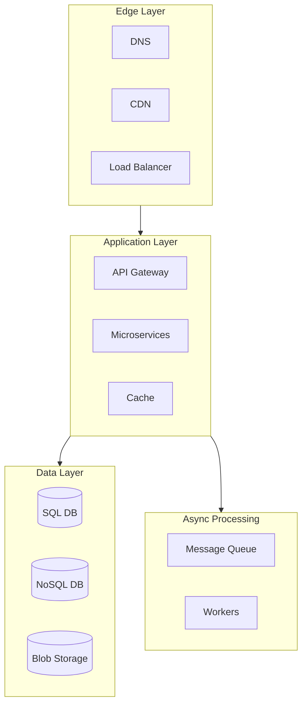

---

## 1️⃣ Load Balancer

Distributes incoming traffic across multiple servers.

### Types of Load Balancing

| Algorithm | Description | Use Case |
|-----------|-------------|----------|
| **Round Robin** | Rotate through servers | Equal capacity servers |
| **Weighted Round Robin** | Based on server capacity | Different server specs |
| **Least Connections** | Send to least busy server | Long-lived connections |
| **IP Hash** | Consistent routing by IP | Session persistence |

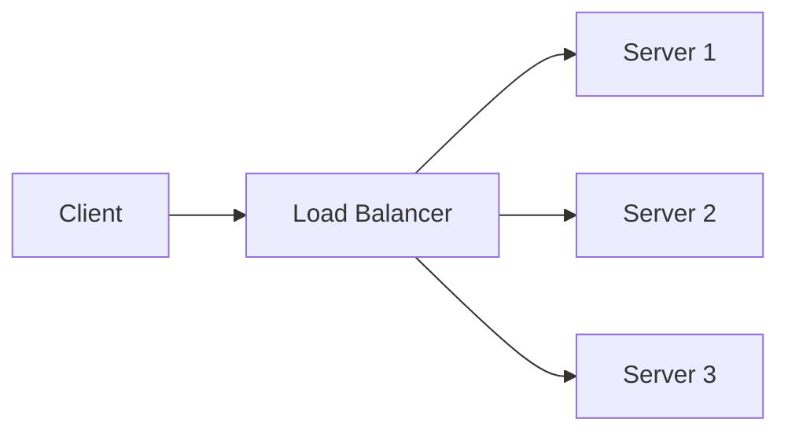

### Popular Tools
- **AWS ELB / ALB**
- **Nginx**
- **HAProxy**
- **Traefik**

---

## 2️⃣ API Gateway

Single entry point for all client requests.

### Responsibilities

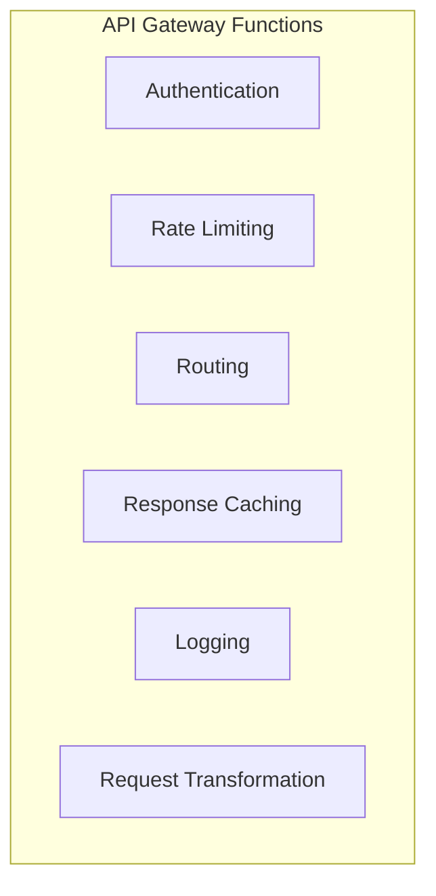

### Rate Limiting Algorithms

| Algorithm | Description |
|-----------|-------------|
| **Token Bucket** | Tokens added at fixed rate, consumed per request |
| **Leaky Bucket** | Requests processed at constant rate |
| **Fixed Window** | Limit requests per time window |
| **Sliding Window** | Rolling window for smoother limiting |

### Popular Tools
- **Kong**
- **AWS API Gateway**
- **Nginx**
- **Zuul**

---

## 3️⃣ Caching

Store frequently accessed data closer to the user.

### Cache Levels

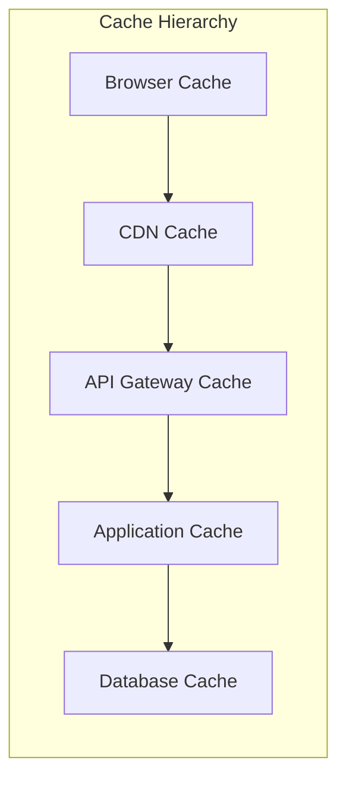

### Caching Strategies

| Strategy | Description | Best For |
|----------|-------------|----------|
| **Cache Aside** | App manages cache + db | Read-heavy workloads |
| **Write Through** | Write to cache + db together | Consistency needed |
| **Write Behind** | Write to cache, async to db | Write-heavy workloads |
| **Read Through** | Cache loads from db on miss | Simplicity |

### Cache Aside Pattern

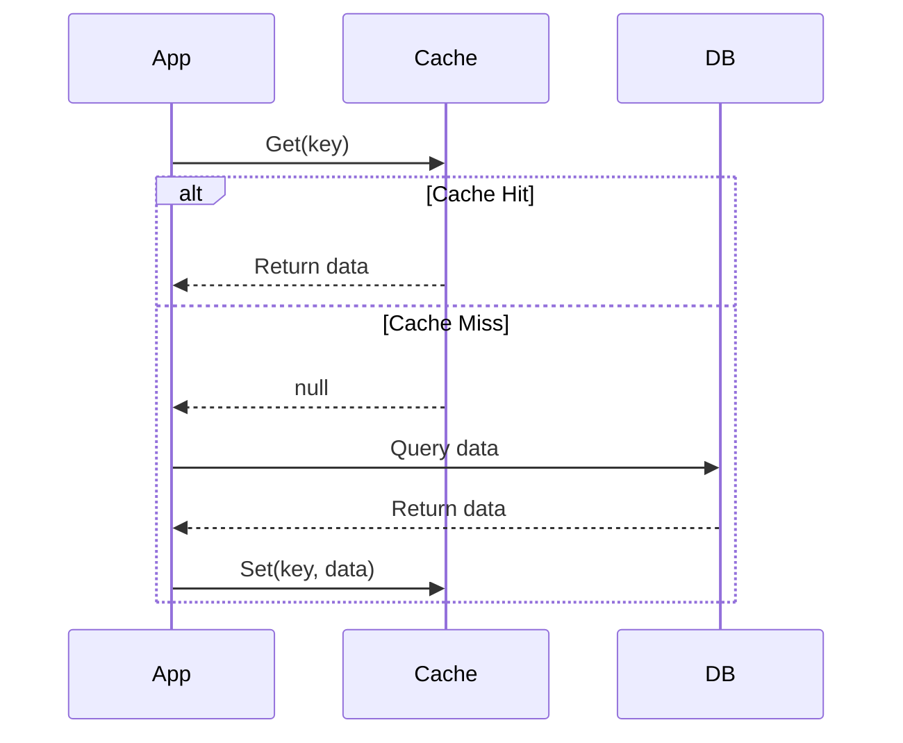

### Popular Tools
- **Redis**
- **Memcached**
- **Varnish**

---

## 4️⃣ Message Queues

Enable asynchronous communication between services.

### Use Cases

- **Decoupling** services
- **Load leveling** during spikes
- **Reliable delivery** of events
- **Event-driven** architectures

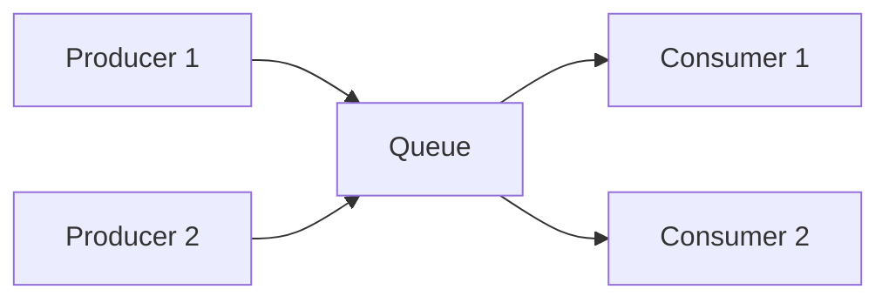

### Queue vs Pub/Sub

| Pattern | Description | Use Case |
|---------|-------------|----------|
| **Queue** | Message consumed by one consumer | Task distribution |
| **Pub/Sub** | Message sent to all subscribers | Event broadcasting |

### Popular Tools
- **Apache Kafka** - High throughput streaming
- **RabbitMQ** - Flexible routing
- **AWS SQS** - Managed queue service
- **Redis Pub/Sub** - Simple messaging

---

## 5️⃣ CDN (Content Delivery Network)

Distribute content globally for fast delivery.

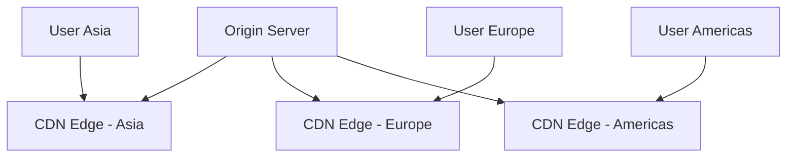

### What to Cache on CDN

| Content Type | Cache Strategy |
|--------------|----------------|
| Static files (JS, CSS, Images) | Long TTL (months) |
| API responses | Short TTL (seconds/minutes) |
| Videos | Edge caching with HLS |
| Dynamic HTML | Don't cache or very short TTL |

### Popular CDNs
- **CloudFlare**
- **AWS CloudFront**
- **Akamai**
- **Fastly**

---

## 6️⃣ Databases

### SQL vs NoSQL Decision Matrix

| Factor | SQL | NoSQL |
|--------|-----|-------|
| **Structure** | Fixed schema | Flexible schema |
| **Relationships** | Complex joins | Denormalized |
| **Scaling** | Vertical (mostly) | Horizontal |
| **ACID** | Strong | Eventual consistency (usually) |
| **Best for** | Transactions, reporting | High scale, flexible data |

### Database Selection Guide

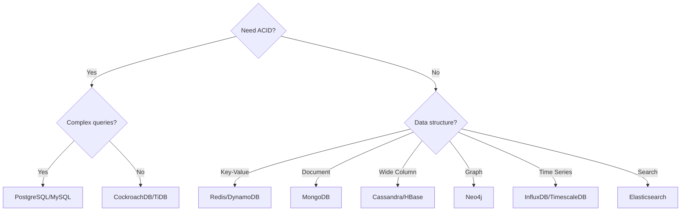

---

## 7️⃣ Blob Storage

Store large unstructured data like images, videos, files.

### Popular Services
- **AWS S3**
- **Azure Blob Storage**
- **Google Cloud Storage**
- **MinIO** (self-hosted)

### Best Practices

1. Use CDN in front for delivery
2. Implement proper access controls
3. Use lifecycle policies for cost optimization
4. Enable versioning for important files

---

## 8️⃣ Search Engine

Optimized for full-text search and filtering.

### When to Use

- Text search with relevance scoring
- Fuzzy matching
- Faceted filtering
- Auto-complete

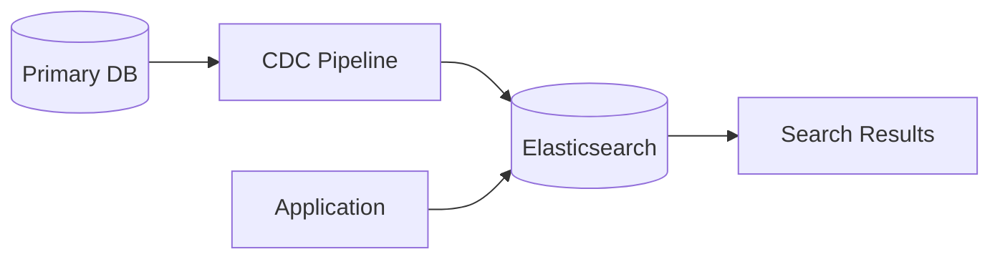

### Popular Tools
- **Elasticsearch**
- **Apache Solr**
- **Algolia**
- **Meilisearch**

---

## 9️⃣ Monitoring & Observability

### The Three Pillars

| Pillar | Purpose | Tools |
|--------|---------|-------|
| **Logs** | What happened | ELK Stack, Loki |
| **Metrics** | How the system performs | Prometheus, Grafana |
| **Traces** | Request flow across services | Jaeger, Zipkin |

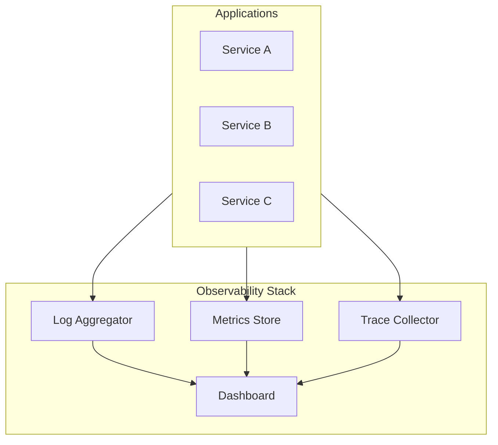

---

## 🔟 Communication Patterns

System-to-system and Client-to-Server communication strategies.

| Pattern | Type | Best For |
|---------|------|----------|
| **Polling** | Pull | Periodic, non-urgent checks |
| **WebSockets** | Push (Bi-directional) | Chat, Games, Real-time |
| **SSE** | Push (One-way) | Stock tickers, News feeds |
| **WebHooks** | Push (Event-driven) | Payment confirmations, Git events |

---

## 🔗 How Components Work Together

### Typical Request Flow

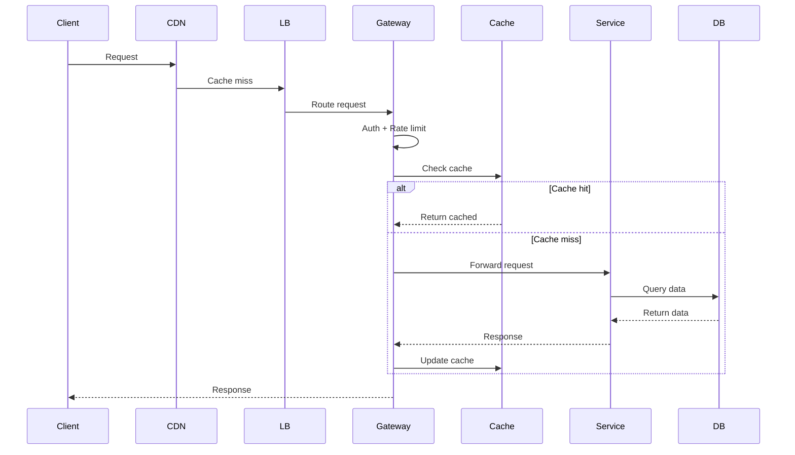

---

## 📚 Next Steps

- Study each component in depth
- Understand trade-offs
- Practice combining components in system designs

### 🔖 Deep Dive Guides

| Component | Guide |
|-----------|-------|
| Spring Ecosystem | [Spring Cloud, Config, Security, AI Deep Dive](./spring/ecosystem-deep-dive.md) |
| Spring AI | [Multi-Agent, RAG, Function Calling, Production Patterns](./spring/ai-deep-dive.md) |
| Spring WebFlux | [Reactive Stack, R2DBC, WebClient, Modulith](./spring/webflux-deep-dive.md) |
| Redis | [Redis Deep Dive](./caching/redis-deep-dive.md) |
| Elasticsearch | [Elasticsearch Deep Dive](./search/elasticsearch-deep-dive.md) |
| Apache Kafka | [Kafka Deep Dive](./messaging/kafka-deep-dive.md) |
| GenAI Fundamentals | [Neural Networks, Transformers, LLMs](./genai/genai-fundamentals.md) |
| Fine-Tuning | [LoRA, QLoRA, RLHF, DPO](./genai/fine-tuning-guide.md) |
| RAG | [Retrieval-Augmented Generation](./genai/rag-deep-dive.md) |
| Agentic AI & MCP | [AI Agents, Tool Use, MCP Protocol](./genai/agentic-ai-guide.md) |
| AWS GenAI & MLOps | [SageMaker, Bedrock, MLflow](./genai/aws-genai-mlops.md) |
| FastAPI for GenAI | [Production ML APIs](./genai/fastapi-guide.md) |
| Security & IAM | [OAuth2, OIDC, JWT, mTLS](./security/security-deep-dive.md) |
| Resiliency Patterns | [Circuit Breaker, Rate Limiting, Retry](./resiliency/resiliency-patterns.md) |
| Communication Patterns | [WebHooks, Polling, SSE, WebSockets](./communication/communication-patterns.md) |
| CI/CD & GitOps | [GitHub Actions, Jenkins, ArgoCD](./devops/cicd-deep-dive.md) |
| Docker & Kubernetes | [Containers, K8s, Helm](./devops/docker-k8s-deep-dive.md) |

---

*Master these components to design any scalable system!*
