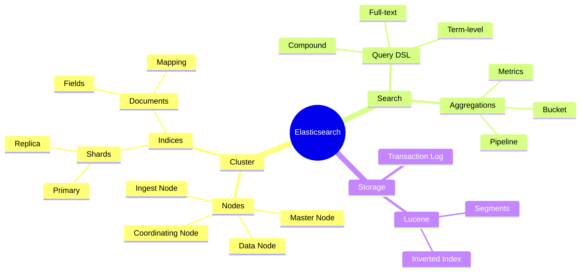
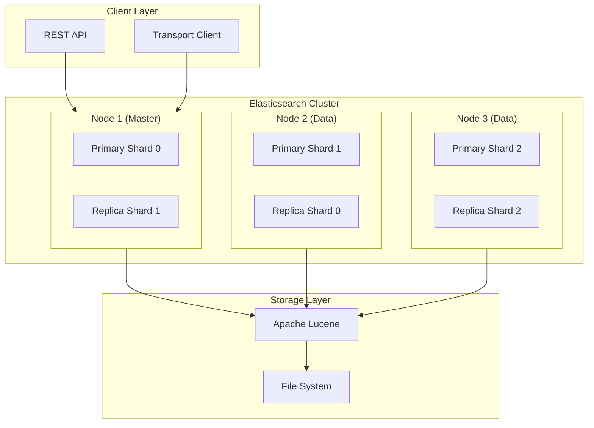
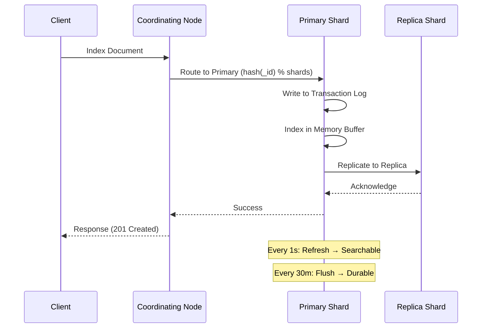

# 🔍 Elasticsearch Deep Dive - Learning Hub

> **Distributed, RESTful search and analytics engine built on Apache Lucene.**

---

## 🗺️ Navigation

| Document | Level | Description |
|----------|-------|-------------|
| 📍 **You are here** | Entry | Learning path and overview |
| [📘 Research Guide](./elasticsearch-research.md) | Beginner-Intermediate | Core concepts, Query DSL, real-world examples |
| [🔧 Internals & Architecture](./elasticsearch-internals-architecture.md) | Advanced | Deep internals, Lucene, performance tuning |

---

## 📚 Learning Path

```mermaid
flowchart LR
    subgraph Beginner["🟢 Beginner"]
        A[Core Concepts] --> B[Basic Queries]
        B --> C[CRUD Operations]
    end
    
    subgraph Intermediate["🟡 Intermediate"]
        D[Query DSL] --> E[Aggregations]
        E --> F[Cluster Management]
    end
    
    subgraph Advanced["🔴 Advanced"]
        G[Lucene Internals] --> H[Performance Tuning]
        H --> I[Production Best Practices]
    end
    
    C --> D
    F --> G
    
    style A fill:#90EE90
    style B fill:#90EE90
    style C fill:#90EE90
    style D fill:#FFD700
    style E fill:#FFD700
    style F fill:#FFD700
    style G fill:#FF6B6B
    style H fill:#FF6B6B
    style I fill:#FF6B6B
```

---

## 🎯 Skill Level Matrix

| Topic | Beginner | Intermediate | Advanced |
|-------|:--------:|:------------:|:--------:|
| **Core Concepts** | ✅ Start here | - | - |
| **CRUD Operations** | ✅ | - | - |
| **Query DSL** | - | ✅ | - |
| **Aggregations** | - | ✅ | - |
| **Cluster Management** | - | ✅ | - |
| **Lucene Internals** | - | - | ✅ |
| **Performance Tuning** | - | - | ✅ |
| **Production Setup** | - | - | ✅ |

---

## 📋 Quick Reference - Key Concepts

---

## 🏗️ High-Level Architecture

---

## 📊 Key Concepts Summary

| Concept | Description | Analogy |
|---------|-------------|---------|
| **Cluster** | Collection of nodes working together | A team of servers |
| **Node** | Single server instance | One computer |
| **Index** | Collection of documents | Database table |
| **Document** | JSON object storing data | Database row |
| **Shard** | Horizontal partition of index | Table partition |
| **Replica** | Copy of shard for HA | Backup copy |
| **Mapping** | Schema definition | Table schema |

---

## 🔄 Document Flow Overview

---

## 🚀 Getting Started

### 1️⃣ **New to Elasticsearch?**
Start with → [📘 Research Guide](./elasticsearch-research.md)
- Learn core concepts
- Master Query DSL
- Practice with real-world examples

### 2️⃣ **Ready for Deep Dive?**
Continue to → [🔧 Internals & Architecture](./elasticsearch-internals-architecture.md)
- Understand Lucene internals
- Learn performance tuning
- Master production best practices

---

## ⏱️ Estimated Learning Time

| Document | Reading Time | Practice Time | Total |
|----------|:------------:|:-------------:|:-----:|
| This Overview | 10 min | - | 10 min |
| Research Guide | 45 min | 1-2 hours | ~2.5 hours |
| Internals Guide | 60 min | 2-3 hours | ~4 hours |
| **Total** | **~2 hours** | **3-5 hours** | **~6-7 hours** |

---

## 📝 Common Use Cases

| Use Case | What to Learn | Recommended Doc |
|----------|---------------|-----------------|
| **E-commerce Search** | Full-text, Filters, Aggregations | Research Guide |
| **Log Analytics** | Time-series, ILM, Aggregations | Both |
| **Metrics/Monitoring** | Aggregations, Alerting | Research Guide |
| **SIEM/Security** | Real-time search, Analytics | Both |
| **Performance Tuning** | Internals, Caching, Sharding | Internals Guide |

---

## 🔗 External Resources

- [Official Documentation](https://www.elastic.co/guide/en/elasticsearch/reference/current/index.html)
- [Query DSL Reference](https://www.elastic.co/guide/en/elasticsearch/reference/current/query-dsl.html)
- [Kibana](https://www.elastic.co/kibana) - Visualization
- [Logstash](https://www.elastic.co/logstash) - Data Pipeline
- [Beats](https://www.elastic.co/beats) - Data Shippers

---

**Next Step:** [📘 Start Learning with Research Guide →](./elasticsearch-research.md)

---
*Last updated: 2026-02-09*
