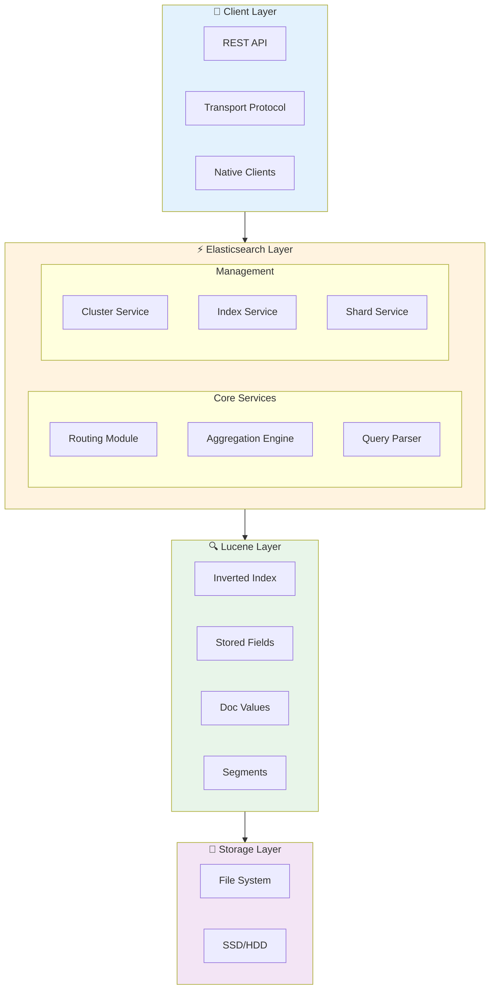
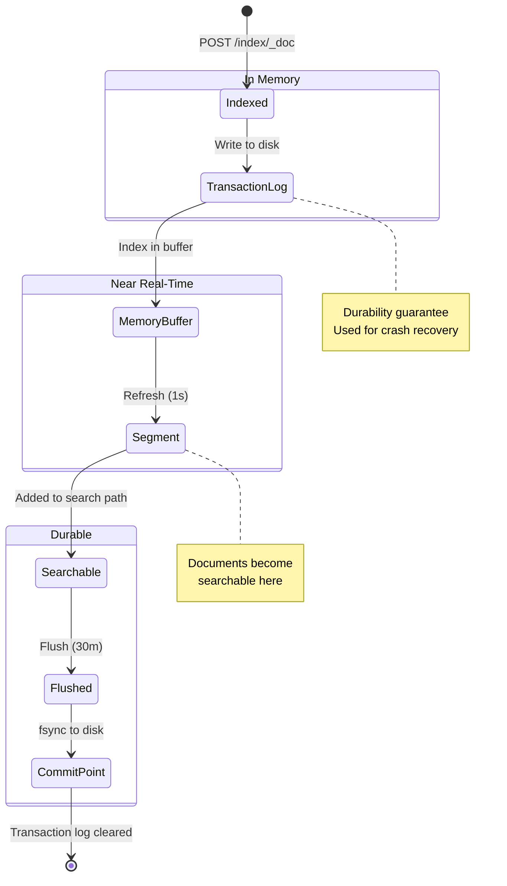

# Elasticsearch Internals, Architecture & Best Practices

> 🔧 **Level: Advanced** | ⏱️ **Reading Time: 60 min** | 🔗 **[← Learning Hub](./elasticsearch-deep-dive.md)** | **[← Research Guide](./elasticsearch-research.md)**

---

## 🗺️ Quick Navigation

| Section | What You'll Learn |
|---------|-------------------|
| [Internal Architecture](#internal-architecture) | Layered design, Node structure, Memory layout |
| [How ES Works](#how-elasticsearch-works-under-the-hood) | Document lifecycle, Transaction logs |
| [Lucene Integration](#lucene-integration) | Segments, Inverted index internals |
| [Shard Internals](#shard-internals) | Sizing, Allocation, Rebalancing |
| [Search Execution](#search-execution) | Query phases, Caching, BM25 scoring |
| [Memory Management](#memory--storage-management) | Heap vs Off-heap, GC tuning |
| [Scaling Patterns](#scaling-patterns) | Hot-Warm-Cold architecture |
| [Best Practices](#best-practices) | Production checklist |

> [!IMPORTANT]
> **Prerequisites:** Understanding of [Elasticsearch basics](./elasticsearch-research.md) is strongly recommended before diving into internals.

---

## Table of Contents

1. [Internal Architecture](#internal-architecture)
2. [How Elasticsearch Works Under the Hood](#how-elasticsearch-works-under-the-hood)
3. [Lucene Integration](#lucene-integration)
4. [Shard Internals](#shard-internals)
5. [Indexing Pipeline](#indexing-pipeline)
6. [Search Execution](#search-execution)
7. [Memory & Storage Management](#memory--storage-management)
8. [Cluster Coordination](#cluster-coordination)
9. [Scaling Patterns](#scaling-patterns)
10. [Best Practices](#best-practices)
11. [Common Pitfalls & Solutions](#common-pitfalls--solutions)

---

## Internal Architecture


### The Layered Architecture



<details>
<summary>📝 ASCII Version (click to expand)</summary>

```text
┌─────────────────────────────────────────────────────────────┐
│                     CLIENT LAYER                             │
│  (REST API, Transport Protocol, Native Clients)              │
└─────────────────────────────────────────────────────────────┘
                            ↓
┌─────────────────────────────────────────────────────────────┐
│                 ELASTICSEARCH LAYER                          │
│  ┌──────────────┐ ┌──────────────┐ ┌──────────────┐        │
│  │   Routing    │ │  Aggregation │ │    Query     │        │
│  │   Module     │ │    Engine    │ │    Parser    │        │
│  └──────────────┘ └──────────────┘ └──────────────┘        │
│                                                              │
│  ┌──────────────┐ ┌──────────────┐ ┌──────────────┐        │
│  │   Cluster    │ │    Index     │ │    Shard     │        │
│  │   Service    │ │   Service    │ │   Service    │        │
│  └──────────────┘ └──────────────┘ └──────────────┘        │
└─────────────────────────────────────────────────────────────┘
                            ↓
┌─────────────────────────────────────────────────────────────┐
│                    LUCENE LAYER                              │
│  ┌──────────────┐ ┌──────────────┐ ┌──────────────┐        │
│  │   Inverted   │ │    Stored    │ │   Doc Values │        │
│  │    Index     │ │    Fields    │ │              │        │
│  └──────────────┘ └──────────────┘ └──────────────┘        │
│                                                              │
│  ┌──────────────┐ ┌──────────────┐ ┌──────────────┐        │
│  │   Segments   │ │    Codec     │ │  Directory   │        │
│  │              │ │              │ │              │        │
│  └──────────────┘ └──────────────┘ └──────────────┘        │
└─────────────────────────────────────────────────────────────┘
                            ↓
┌─────────────────────────────────────────────────────────────┐
│                  STORAGE LAYER                               │
│         (File System, SSD/HDD, Network Storage)              │
└─────────────────────────────────────────────────────────────┘
```

</details>


### Node Architecture Deep Dive

```
┌─────────────────────────────────────────────────────────────┐
│                    ELASTICSEARCH NODE                        │
│                                                              │
│  ┌────────────────────────────────────────────────────────┐ │
│  │                    JVM HEAP                             │ │
│  │  ┌──────────────┐  ┌──────────────┐  ┌─────────────┐  │ │
│  │  │  Query Cache │  │  Field Data  │  │   Request   │  │ │
│  │  │              │  │    Cache     │  │   Cache     │  │ │
│  │  └──────────────┘  └──────────────┘  └─────────────┘  │ │
│  │                                                         │ │
│  │  ┌──────────────┐  ┌──────────────┐  ┌─────────────┐  │ │
│  │  │  Index Buffer│  │  Thread Pools│  │   Network   │  │ │
│  │  │              │  │              │  │   Buffers   │  │ │
│  │  └──────────────┘  └──────────────┘  └─────────────┘  │ │
│  └────────────────────────────────────────────────────────┘ │
│                            ↓                                 │
│  ┌────────────────────────────────────────────────────────┐ │
│  │                  FILE SYSTEM CACHE                      │ │
│  │           (OS-managed, uses remaining RAM)              │ │
│  └────────────────────────────────────────────────────────┘ │
│                            ↓                                 │
│  ┌────────────────────────────────────────────────────────┐ │
│  │                     DISK STORAGE                        │ │
│  │  ┌──────────┐  ┌──────────┐  ┌──────────┐             │ │
│  │  │ Segments │  │Transaction│ │  Commit  │             │ │
│  │  │  (.cfs)  │  │ Log (wal) │ │  Point   │             │ │
│  │  └──────────┘  └──────────┘  └──────────┘             │ │
│  └────────────────────────────────────────────────────────┘ │
└─────────────────────────────────────────────────────────────┘
```

### Memory Breakdown (Typical 64GB Server)

```
Total RAM: 64 GB
│
├─ JVM Heap: 31 GB (50% of RAM, max 32GB due to compressed OOPs)
│  ├─ Old Generation: ~24 GB
│  ├─ Young Generation: ~7 GB
│  └─ Caches:
│     ├─ Query Cache: ~10% of heap
│     ├─ Field Data Cache: ~40% of heap
│     └─ Index Buffer: 10% of heap (default)
│
└─ OS File System Cache: 33 GB (50% of RAM)
   └─ Used for caching Lucene segments
```

**Why 31GB and not 32GB for heap?**
- Java uses "Compressed OOPs" (Ordinary Object Pointers) below 32GB
- Crossing 32GB disables compression → effective memory decreases
- Sweet spot: 31GB heap, rest for OS cache

---

## How Elasticsearch Works Under the Hood

### Document Lifecycle



> 📌 **Key Timing:** Refresh = ~1s (searchable) | Flush = ~30min (durable)

<details>
<summary>📝 Full document lifecycle details (click to expand)</summary>

```text
┌─────────────────────────────────────────────────────────────┐
│  1. CLIENT SENDS DOCUMENT                                    │
│     POST /products/_doc/123                                  │
└─────────────────────────────────────────────────────────────┘
                            ↓
┌─────────────────────────────────────────────────────────────┐
│  2. COORDINATING NODE                                        │
│     - Receives request                                       │
│     - Determines routing: hash(_id) % num_primary_shards     │
│     - Identifies primary shard location                      │
└─────────────────────────────────────────────────────────────┘
                            ↓
┌─────────────────────────────────────────────────────────────┐
│  3. PRIMARY SHARD (Node 2)                                   │
│     a) Validates document                                    │
│     b) Writes to Transaction Log (fsync to disk)             │
│     c) Indexes into Lucene in-memory buffer                  │
│     d) Forwards to replica shards (parallel)                 │
└─────────────────────────────────────────────────────────────┘
                            ↓
┌─────────────────────────────────────────────────────────────┐
│  4. REPLICA SHARDS (Node 1, Node 3)                          │
│     - Write to transaction log                               │
│     - Index into Lucene buffer                               │
│     - Acknowledge to primary                                 │
└─────────────────────────────────────────────────────────────┘
                            ↓
┌─────────────────────────────────────────────────────────────┐
│  5. PRIMARY SHARD                                            │
│     - Waits for quorum (configurable)                        │
│     - Returns success to coordinating node                   │
└─────────────────────────────────────────────────────────────┘
                            ↓
┌─────────────────────────────────────────────────────────────┐
│  6. REFRESH CYCLE (default: every 1 second)                  │
│     - In-memory buffer → new Lucene segment                  │
│     - Segment written to file system cache                   │
│     - Document becomes searchable (near real-time)           │
└─────────────────────────────────────────────────────────────┘
                            ↓
┌─────────────────────────────────────────────────────────────┐
│  7. FLUSH CYCLE (default: every 30 min or 512MB translog)   │
│     - All segments fsync'd to disk                           │
│     - Transaction log truncated                              │
│     - Commit point created                                   │
└─────────────────────────────────────────────────────────────┘
```

</details>


### Transaction Log (Write-Ahead Log)

**Purpose**: Durability & crash recovery

```
Time    Action                      Memory          Disk
─────────────────────────────────────────────────────────────
T0      Index doc 1                 Buffer          Translog ✓
T1      Index doc 2                 Buffer          Translog ✓
T2      Index doc 3                 Buffer          Translog ✓
T3      Refresh (1s)                → Segment       Translog ✓
                                    (searchable)
T4      Index doc 4                 Buffer          Translog ✓
T5      Index doc 5                 Buffer          Translog ✓
T6      Refresh (1s)                → Segment       Translog ✓
T7      Flush (30m)                 → Fsync all     Translog cleared
                                      segments
```

**On Crash:**
1. Elasticsearch reads last commit point
2. Replays transaction log from last commit
3. Recovers all indexed but unflushed documents

---

## Lucene Integration

### What is Lucene?

Lucene is the **core search library** that Elasticsearch wraps. Understanding Lucene is key to understanding Elasticsearch internals.

```
Elasticsearch Index
├─ Shard 0 (Lucene Index)
│  ├─ Segment 1
│  ├─ Segment 2
│  └─ Segment 3
├─ Shard 1 (Lucene Index)
│  ├─ Segment 1
│  └─ Segment 2
└─ Shard 2 (Lucene Index)
   ├─ Segment 1
   └─ Segment 2
```

**Key Point**: Each Elasticsearch shard = one Lucene index

### Lucene Segment Structure

```
Segment_1/
├─ _0.cfs         # Compound file (contains all below)
├─ _0.cfe         # Compound file entries
│
├─ Inverted Index # Term → Document mapping
│  ├─ .tim        # Term dictionary
│  ├─ .tip        # Term index (pointer to .tim)
│  └─ .doc/.pos   # Document/position data
│
├─ Stored Fields  # Original document storage
│  ├─ .fdt        # Field data
│  └─ .fdx        # Field index
│
├─ Doc Values     # Column-oriented storage
│  ├─ .dvd        # Doc values data
│  └─ .dvm        # Doc values metadata
│
├─ Norms          # Field length normalization
├─ Term Vectors   # Per-document term statistics
└─ Deleted Docs   # .liv (live docs - deleted bitmap)
```

### Inverted Index Deep Dive

**Example Documents:**
```
Doc 1: "Elasticsearch is fast"
Doc 2: "Lucene is powerful"
Doc 3: "Elasticsearch uses Lucene"
```

**After Analysis (lowercase, tokenize):**
```
Term           → Documents   Positions
───────────────────────────────────────
elasticsearch  → [1, 3]      [1:0, 3:0]
fast           → [1]         [1:2]
is             → [1, 2]      [1:1, 2:1]
lucene         → [2, 3]      [2:0, 3:2]
powerful       → [2]         [2:2]
uses           → [3]         [3:1]
```

**Additional Data Structures:**

1. **Term Dictionary** (sorted)
   ```
   elasticsearch → pointer to posting list
   fast → pointer to posting list
   ...
   ```

2. **Skip Lists** (for fast search)
   ```
   If term appears in 10,000 docs, skip list allows jumping:
   Doc 1 → Doc 100 → Doc 500 → Doc 1000 → ...
   ```

3. **Doc Values** (columnar storage for sorting/aggregations)
   ```
   Doc ID    price    category
   ──────────────────────────────
   1         999.99   electronics
   2         29.99    accessories
   3         1299.99  electronics
   ```

### Segment Merging

**Problem**: Over time, many small segments accumulate

```
Initial State:
Segment_1 (1000 docs)
Segment_2 (500 docs)
Segment_3 (200 docs)
Segment_4 (100 docs)
Segment_5 (50 docs)

After Merge:
Segment_6 (1850 docs)  ← Merged 1,2,3,4,5
```

**Merge Policy** (TieredMergePolicy - default):
- Merges segments of similar sizes
- Limits max segment size (5GB default)
- Runs in background
- Deletes old segments after merge

**Benefits:**
- Fewer segments → faster searches
- Deleted documents purged during merge
- Better compression

**Cost:**
- I/O intensive
- CPU usage
- Temporary disk space (2x segment size)

---

## Shard Internals

### Shard = Lucene Index

```
Primary Shard 0 (on Node 1)
│
├─ Transaction Log
│  ├─ translog-1.tlog
│  └─ translog-2.tlog
│
├─ Segments (Lucene)
│  ├─ _0.cfs (100 docs)
│  ├─ _1.cfs (200 docs)
│  ├─ _2.cfs (500 docs)
│  └─ _3.cfs (1000 docs)
│
├─ Commit Point
│  └─ segments_N (points to active segments)
│
└─ In-Memory Structures
   ├─ Index Buffer (for new docs)
   ├─ Query Cache
   └─ Field Data Cache
```

### Why Shards?

1. **Horizontal Scaling**: Distribute data across nodes
2. **Parallelization**: Query all shards simultaneously
3. **Fault Tolerance**: With replicas, can lose nodes

### Shard Sizing Rules

**Over-Sharding Problems:**
- Each shard has overhead (file handles, memory)
- Too many shards → cluster state bloat
- Small shards → merge overhead

**Under-Sharding Problems:**
- Can't distribute load
- Large shards → slow recovery
- Limited parallelism

**Best Practice Formula:**
```
Shard Size: 20-40 GB (sweet spot)
Max Shard Size: 50 GB

Example:
- Expected index size: 300 GB
- Shards needed: 300 / 30 = 10 shards
- With 1 replica: 20 shards total
```

### Shard Allocation & Rebalancing

**Allocation Decisions:**
```
┌─────────────────────────────────────────────────────────────┐
│  SHARD ALLOCATION DECISION PROCESS                           │
│                                                              │
│  1. Allocation Filters (user-defined)                        │
│     - Force shards to specific nodes                         │
│     - Exclude certain nodes                                  │
│                                                              │
│  2. Allocation Awareness (rack/zone)                         │
│     - Don't put primary + replica in same rack               │
│                                                              │
│  3. Disk Watermarks                                          │
│     - Low (85%): Stop allocating to node                     │
│     - High (90%): Move shards away                           │
│     - Flood (95%): Read-only block                           │
│                                                              │
│  4. Same-Shard Allocation                                    │
│     - Don't put primary + replica on same node               │
│                                                              │
│  5. Load Balancing                                           │
│     - Distribute shards evenly                               │
│     - Consider node resources                                │
└─────────────────────────────────────────────────────────────┘
```

**Rebalancing Example:**
```
Initial State (3 nodes):
Node 1: [P0, P1, R2]  (3 shards)
Node 2: [P2, R0]      (2 shards)
Node 3: [R1]          (1 shard)

After Rebalancing:
Node 1: [P0, R2]      (2 shards)
Node 2: [P1, R0]      (2 shards)
Node 3: [P2, R1]      (2 shards)
```

---

## Indexing Pipeline

### Full Indexing Flow

```
┌─────────────────────────────────────────────────────────────┐
│  1. INGEST PIPELINE (Optional)                               │
│     - Processors: grok, date, geoip, script, etc.            │
│     - Transform/enrich document before indexing              │
└─────────────────────────────────────────────────────────────┘
                            ↓
┌─────────────────────────────────────────────────────────────┐
│  2. MAPPING & ANALYSIS                                       │
│     - Apply mapping (explicit or dynamic)                    │
│     - Run analyzers on text fields                           │
│     - Generate tokens                                        │
└─────────────────────────────────────────────────────────────┘
                            ↓
┌─────────────────────────────────────────────────────────────┐
│  3. LUCENE INDEXING                                          │
│     - Create inverted index entries                          │
│     - Store original fields                                  │
│     - Generate doc values                                    │
│     - Update in-memory buffer                                │
└─────────────────────────────────────────────────────────────┘
                            ↓
┌─────────────────────────────────────────────────────────────┐
│  4. REFRESH (make searchable)                                │
│     - In-memory buffer → new segment                         │
│     - Segment in filesystem cache                            │
│     - Segment added to search path                           │
└─────────────────────────────────────────────────────────────┘
                            ↓
┌─────────────────────────────────────────────────────────────┐
│  5. MERGE (background)                                       │
│     - Small segments merged into larger ones                 │
│     - Deleted docs removed                                   │
│     - Old segments deleted                                   │
└─────────────────────────────────────────────────────────────┘
```

### Analysis Chain

**Example: Analyzing "The Quick BROWN fox!"**

```
Original Text: "The Quick BROWN fox!"
        ↓
┌─────────────────────┐
│  Char Filter        │  (HTML strip, pattern replace)
│  (none in example)  │
└─────────────────────┘
        ↓
"The Quick BROWN fox!"
        ↓
┌─────────────────────┐
│  Tokenizer          │  (standard, whitespace, etc.)
│  (standard)         │
└─────────────────────┘
        ↓
["The", "Quick", "BROWN", "fox"]
        ↓
┌─────────────────────┐
│  Token Filters      │  (lowercase, stop, stemmer, etc.)
│  (lowercase)        │
└─────────────────────┘
        ↓
["the", "quick", "brown", "fox"]
        ↓
┌─────────────────────┐
│  Token Filters      │
│  (stop filter)      │
└─────────────────────┘
        ↓
["quick", "brown", "fox"]  (removed "the")
        ↓
Final Tokens: ["quick", "brown", "fox"]
```

**Custom Analyzer Example:**
```json
PUT /my_index
{
  "settings": {
    "analysis": {
      "analyzer": {
        "my_custom_analyzer": {
          "type": "custom",
          "char_filter": ["html_strip"],
          "tokenizer": "standard",
          "filter": ["lowercase", "stop", "snowball"]
        }
      }
    }
  },
  "mappings": {
    "properties": {
      "content": {
        "type": "text",
        "analyzer": "my_custom_analyzer"
      }
    }
  }
}
```

### Bulk Indexing Internals

**Single vs Bulk:**
```
Single Indexing (1000 docs):
Request 1 → Network → Node → Shard → Lucene
Request 2 → Network → Node → Shard → Lucene
...
Request 1000 → Network → Node → Shard → Lucene

Network round trips: 1000
Per-document overhead: High

Bulk Indexing (1000 docs):
Bulk Request (1000 docs) → Network → Node
Node splits by shard → Parallel processing
Shard 0: [doc1, doc2, ...]
Shard 1: [doc3, doc4, ...]
...

Network round trips: 1
Batch processing: Efficient
```

**Optimal Bulk Size:**
- Start with 5-15 MB per batch
- Monitor queue rejections
- Adjust based on hardware

---

## Search Execution

### Query Execution Phases

```
┌─────────────────────────────────────────────────────────────┐
│  PHASE 1: QUERY PHASE (scatter)                              │
│                                                              │
│  Coordinating Node                                           │
│       ↓                                                      │
│  Broadcasts query to all shards                              │
│       ↓                                                      │
│  ┌──────────┐  ┌──────────┐  ┌──────────┐                  │
│  │ Shard 0  │  │ Shard 1  │  │ Shard 2  │                  │
│  │          │  │          │  │          │                  │
│  │ Executes │  │ Executes │  │ Executes │                  │
│  │ query    │  │ query    │  │ query    │                  │
│  │          │  │          │  │          │                  │
│  │ Returns: │  │ Returns: │  │ Returns: │                  │
│  │ Doc IDs  │  │ Doc IDs  │  │ Doc IDs  │                  │
│  │ + Scores │  │ + Scores │  │ + Scores │                  │
│  └──────────┘  └──────────┘  └──────────┘                  │
│       ↓              ↓              ↓                        │
│       └──────────────┴──────────────┘                        │
│                      ↓                                       │
│         Coordinating Node merges results                     │
│         Sorts by score, takes top N                          │
└─────────────────────────────────────────────────────────────┘
                            ↓
┌─────────────────────────────────────────────────────────────┐
│  PHASE 2: FETCH PHASE (gather)                               │
│                                                              │
│  Coordinating Node identifies which shards have results      │
│       ↓                                                      │
│  Requests full documents from those shards                   │
│       ↓                                                      │
│  ┌──────────┐  ┌──────────┐                                │
│  │ Shard 0  │  │ Shard 2  │                                │
│  │          │  │          │                                │
│  │ Returns  │  │ Returns  │                                │
│  │ Doc 1    │  │ Doc 5    │                                │
│  │ Doc 3    │  │ Doc 8    │                                │
│  └──────────┘  └──────────┘                                │
│       ↓              ↓                                       │
│       └──────────────┘                                       │
│              ↓                                               │
│  Coordinating Node assembles final response                  │
└─────────────────────────────────────────────────────────────┘
```

### Query Optimization

**1. Query Cache (Node Level)**
```
Cache Key: Hash(query + filter + shard)
Cache Size: 10% of heap (default)
Invalidation: On refresh or delete

Example:
First request: {"term": {"status": "active"}}
→ Executes query → Caches result (doc IDs)

Second request: Same query
→ Returns cached doc IDs (instant)
```

**2. Field Data Cache (Heap)**
```
Used for: Sorting, aggregations on text fields
Storage: Loaded per-field, per-segment
Warning: Can cause OOM if not careful

Example:
GET /logs/_search
{
  "aggs": {
    "top_users": {
      "terms": { "field": "username.keyword" }  ← Loads into field data
    }
  }
}
```

**Better Alternative: Doc Values**
```
Doc values: Column-oriented, on-disk storage
Used for: Sorting, aggregations
Memory: Loaded on-demand, OS cache
Performance: Nearly as fast, much safer

Mapping:
{
  "username": {
    "type": "keyword"  ← Doc values enabled by default
  }
}
```

**3. Request Cache (Node Level)**
```
Caches: Entire response (size=0 queries, aggregations)
Key: Hash(entire request + index)
Size: 1% of heap (default)

Use case: Dashboards, repeated aggregations
```

### Scoring & Relevance

**TF-IDF (Classic Scoring)**
```
score(doc, query) = queryNorm × coord × Σ(tf × idf × boost × norm)

Where:
- TF (Term Frequency): How often term appears in document
- IDF (Inverse Document Frequency): Rarity of term across all docs
- Norm: Field length normalization
- Boost: User-defined boost
```

**BM25 (Default in ES 5.0+)**
```
score(doc, query) = IDF × (TF × (k1 + 1)) / (TF + k1 × (1 - b + b × (fieldLen / avgFieldLen)))

Where:
- k1: Controls term frequency saturation (default 1.2)
- b: Controls field length normalization (default 0.75)

Better than TF-IDF:
- Diminishing returns for term frequency
- Better field length normalization
```

**Example:**
```
Document 1: "cat cat cat" (3x "cat")
Document 2: "cat" (1x "cat")

TF-IDF: Doc 1 scores much higher (3x term frequency)
BM25: Doc 1 scores slightly higher (saturation effect)
```

---

## Memory & Storage Management

### Heap vs Off-Heap Memory

```
┌─────────────────────────────────────────────────────────────┐
│  JVM HEAP (31GB)                                             │
│  ─────────────────────────────────────────────────────────  │
│                                                              │
│  OLD GENERATION (~24GB)                                      │
│  ├─ Query Cache (10% = ~3GB)                                │
│  ├─ Field Data Cache (40% = ~12GB)                          │
│  ├─ Index Buffer (10% = ~3GB)                               │
│  ├─ Request Cache (1% = ~300MB)                             │
│  └─ Other objects (segments metadata, cluster state, etc.)  │
│                                                              │
│  YOUNG GENERATION (~7GB)                                     │
│  └─ Short-lived objects (requests, responses, temp data)    │
└─────────────────────────────────────────────────────────────┘
                            ↓ GC
┌─────────────────────────────────────────────────────────────┐
│  OFF-HEAP (OS File System Cache ~33GB)                      │
│  ─────────────────────────────────────────────────────────  │
│                                                              │
│  ├─ Lucene Segments (mmap'd files)                          │
│  ├─ Doc Values                                              │
│  ├─ Term Dictionary                                         │
│  └─ Stored Fields                                           │
│                                                              │
│  Benefits:                                                   │
│  - No GC overhead                                            │
│  - OS manages caching intelligently                          │
│  - Can use all available RAM                                 │
└─────────────────────────────────────────────────────────────┘
```

### Garbage Collection

**G1GC (Default in ES 7.0+)**
```
Young GC (frequent, <100ms):
- Clears young generation
- Promotes survivors to old generation

Mixed GC (periodic):
- Clears young + portions of old generation
- Goal: Keep pauses low

Full GC (rare, BAD):
- Stop-the-world
- Can take seconds/minutes
- Sign of heap pressure
```

**GC Tuning:**
```
# elasticsearch.yml or jvm.options
-Xms31g
-Xmx31g
-XX:+UseG1GC
-XX:MaxGCPauseMillis=200
-XX:InitiatingHeapOccupancyPercent=75

Monitor:
GET /_nodes/stats/jvm
```

### Disk I/O Optimization

**1. Use SSDs**
```
HDD vs SSD for Elasticsearch:

HDD (7200 RPM):
- Random IOPS: ~100
- Sequential: ~150 MB/s
- Merge storms: Painful
- Search latency: High

SSD (NVMe):
- Random IOPS: ~500,000
- Sequential: ~3,500 MB/s
- Merge storms: Handled easily
- Search latency: Low

Elasticsearch is I/O bound → SSDs = massive improvement
```

**2. RAID Configuration**
```
Don't use RAID for Elasticsearch:
- Elasticsearch provides replication
- RAID adds complexity
- RAID rebuild time is high
- Use replicas instead (faster recovery)

Exception: RAID 0 for temp/cache (if you're crazy)
```

**3. File System**
```
Recommended: ext4 or XFS
- Good performance
- Stable
- Well-tested with Elasticsearch

Avoid:
- NFS (network overhead)
- Windows NTFS (slower)
```

---

## Cluster Coordination

### Master Node Election

**Zen Discovery (ES < 7.0):**
```
1. Nodes vote for master
2. Majority wins (quorum)
3. Minimum master nodes = (total_nodes / 2) + 1

Problem: Split-brain if misconfigured
```

**Voting Configuration (ES 7.0+):**
```
Auto-managed quorum:
- No manual minimum_master_nodes
- Cluster auto-adjusts voting configuration
- Safer, prevents split-brain

Election Process:
1. Master candidate broadcasts: "I want to be master"
2. Nodes vote
3. Majority wins
4. New master publishes cluster state
```

### Cluster State

**What is Cluster State?**
```json
{
  "cluster_name": "my-cluster",
  "version": 42,
  "master_node": "node-1",
  "nodes": {
    "node-1": { "name": "node-1", "roles": ["master", "data"] },
    "node-2": { "name": "node-2", "roles": ["data"] }
  },
  "metadata": {
    "indices": {
      "products": {
        "settings": { "number_of_shards": 5 },
        "mappings": { ... },
        "aliases": { ... }
      }
    },
    "templates": { ... }
  },
  "routing_table": {
    "indices": {
      "products": {
        "shards": {
          "0": [
            { "state": "STARTED", "primary": true, "node": "node-1" },
            { "state": "STARTED", "primary": false, "node": "node-2" }
          ]
        }
      }
    }
  }
}
```

**Cluster State Updates:**
```
1. Master receives change (e.g., create index)
2. Master updates cluster state (in-memory)
3. Master publishes new state to all nodes
4. Nodes acknowledge
5. Change committed
```

**Problem: Large Cluster State**
```
Symptoms:
- Slow cluster state updates
- High master CPU
- Delayed index creation

Causes:
- Too many indices (thousands)
- Too many shards (tens of thousands)
- Large mappings

Solution:
- Use index lifecycle management
- Reduce shard count
- Use rollover for time-series data
```

---

## Scaling Patterns

### Horizontal Scaling (Add Nodes)

**Scaling Data Nodes:**
```
Before (3 nodes, 9 shards):
Node 1: [P0, P1, P2]
Node 2: [R0, R1, R2]
Node 3: [R0, R1, R2]

Add Node 4:
Elasticsearch rebalances automatically

After (4 nodes, 9 shards):
Node 1: [P0, R1]
Node 2: [P1, R2]
Node 3: [P2, R0]
Node 4: [R0, R1, R2]

Benefits:
- More RAM for caching
- More CPU for queries
- Better distribution
```

### Vertical Scaling (Bigger Nodes)

```
Option 1: Many small nodes
- 10 nodes × 16GB RAM = 160GB total
- Pros: Better fault tolerance
- Cons: More network overhead

Option 2: Few large nodes
- 3 nodes × 64GB RAM = 192GB total
- Pros: Less overhead, better for aggregations
- Cons: Longer recovery time if node fails

Recommendation: Balance based on use case
- Logs/time-series: More small nodes
- Analytics: Fewer large nodes
```

### Hot-Warm-Cold Architecture

```
┌────────────────────────────────────────────────────────────┐
│  HOT TIER (Fast writes, recent data)                       │
│  ├─ High-performance SSDs                                  │
│  ├─ More CPU/RAM                                           │
│  ├─ Active indexing + searching                            │
│  └─ Example: Last 7 days of logs                           │
└────────────────────────────────────────────────────────────┘
                            ↓ (ILM policy)
┌────────────────────────────────────────────────────────────┐
│  WARM TIER (Read-only, older data)                         │
│  ├─ Standard SSDs                                          │
│  ├─ Moderate resources                                     │
│  ├─ Searching only (no indexing)                           │
│  └─ Example: 7-30 days of logs                             │
└────────────────────────────────────────────────────────────┘
                            ↓ (ILM policy)
┌────────────────────────────────────────────────────────────┐
│  COLD TIER (Archival, rarely accessed)                     │
│  ├─ HDDs or cheap storage                                  │
│  ├─ Low resources                                          │
│  ├─ Infrequent searches                                    │
│  └─ Example: 30+ days of logs                              │
└────────────────────────────────────────────────────────────┘
                            ↓ (ILM policy)
┌────────────────────────────────────────────────────────────┐
│  FROZEN TIER (ES 7.12+) or Delete                          │
│  └─ Searchable snapshots, minimal cost                     │
└────────────────────────────────────────────────────────────┘
```

**Configuration:**
```yaml
# Hot node
node.attr.data: hot
node.roles: [data_hot, ingest]

# Warm node
node.attr.data: warm
node.roles: [data_warm]

# Cold node
node.attr.data: cold
node.roles: [data_cold]
```

**ILM Policy:**
```json
PUT /_ilm/policy/logs_policy
{
  "policy": {
    "phases": {
      "hot": {
        "actions": {
          "rollover": {
            "max_size": "50GB",
            "max_age": "7d"
          }
        }
      },
      "warm": {
        "min_age": "7d",
        "actions": {
          "allocate": {
            "require": { "data": "warm" }
          },
          "forcemerge": { "max_num_segments": 1 },
          "shrink": { "number_of_shards": 1 }
        }
      },
      "cold": {
        "min_age": "30d",
        "actions": {
          "allocate": {
            "require": { "data": "cold" }
          }
        }
      },
      "delete": {
        "min_age": "90d",
        "actions": {
          "delete": {}
        }
      }
    }
  }
}
```

---

## Best Practices

### 1. Index Design

**Do:**
✅ Use time-based indices for logs (e.g., `logs-2024-01-15`)
✅ Set shard count based on data size (20-40GB per shard)
✅ Use explicit mappings (avoid dynamic mapping in prod)
✅ Disable `_source` if you don't need original document
✅ Use `keyword` for exact matches, `text` for full-text

**Don't:**
❌ Create too many shards (overhead increases)
❌ Use default field names (can't change later)
❌ Index data you don't need
❌ Use wildcard queries on large datasets
❌ Forget to set replicas (data loss risk)

### 2. Query Optimization

**Do:**
✅ Use `filter` context (cacheable, faster)
```json
{
  "bool": {
    "filter": [
      { "term": { "status": "active" } }
    ]
  }
}
```

✅ Limit `_source` fields
```json
{
  "_source": ["name", "price"],
  "query": { "match_all": {} }
}
```

✅ Use `search_after` for deep pagination
✅ Pre-filter with `range` before `match`

**Don't:**
❌ Use `from` + `size` for deep pagination (slow)
❌ Use wildcard/prefix queries without limits
❌ Load large field data into heap
❌ Use `script` queries in hot paths (slow)

### 3. Indexing Performance

**Do:**
✅ Use bulk API (5-15MB batches)
✅ Disable refresh during bulk indexing
```bash
PUT /my_index/_settings
{ "index.refresh_interval": "-1" }
# After bulk indexing
PUT /my_index/_settings
{ "index.refresh_interval": "1s" }
```

✅ Increase indexing buffer
```yaml
indices.memory.index_buffer_size: 20%
```

✅ Use auto-generated IDs (faster than custom IDs)
✅ Use multiple threads/clients

**Don't:**
❌ Index one document at a time
❌ Use small bulk sizes (overhead)
❌ Refresh after every insert
❌ Over-replicate (slows down indexing)

### 4. Hardware & JVM

**Do:**
✅ Use SSDs (massive performance boost)
✅ Set heap to 50% of RAM (max 31GB)
```yaml
-Xms31g
-Xmx31g
```

✅ Disable swap
```bash
sudo swapoff -a
```

✅ Use G1GC (default in ES 7.0+)
✅ Monitor GC logs

**Don't:**
❌ Set heap > 32GB (compressed OOPs disabled)
❌ Use all RAM for heap (OS cache is critical)
❌ Run other apps on ES nodes
❌ Use spinning disks in production

### 5. Monitoring

**Key Metrics:**
```
Cluster Health:
- Status (green/yellow/red)
- Active shards
- Unassigned shards

Node Metrics:
- CPU usage
- Heap usage (< 75%)
- GC frequency/duration
- Disk usage

Index Metrics:
- Indexing rate (docs/sec)
- Search rate (queries/sec)
- Search latency (ms)
- Merge times

JVM:
- Old gen usage
- GC pauses (< 200ms)
- Thread pool rejections
```

**Tools:**
- Kibana Monitoring
- Elasticsearch Metrics API
- Prometheus + Grafana
- Marvel/X-Pack

### 6. Security

**Do:**
✅ Enable authentication (X-Pack Security)
✅ Use HTTPS (TLS/SSL)
✅ Implement role-based access control
✅ Audit logging
✅ Network isolation (firewall)
✅ Encrypt data at rest

**Don't:**
❌ Expose Elasticsearch to internet without auth
❌ Use default passwords
❌ Give write access to read-only users
❌ Store sensitive data unencrypted

---

## Common Pitfalls & Solutions

### 1. Out of Memory (OOM)

**Symptoms:**
- GC thrashing (constant garbage collection)
- Heap usage > 90%
- Node unresponsive
- `OutOfMemoryError`

**Causes:**
- Field data cache exhaustion
- Too many shards
- Large aggregations
- Memory leaks

**Solutions:**
```bash
# Limit field data cache
PUT /_cluster/settings
{
  "transient": {
    "indices.breaker.fielddata.limit": "40%"
  }
}

# Clear field data cache
POST /_cache/clear?fielddata=true

# Use doc values instead of field data
# (enabled by default on keyword fields)

# Reduce shard count
# Increase heap (up to 31GB)
# Use `search_after` instead of `from`/`size`
```

### 2. Slow Searches

**Causes:**
- Too many shards
- Large result sets
- Heavy aggregations
- Unoptimized queries
- Cold OS cache

**Solutions:**
```bash
# Profile queries
GET /my_index/_search
{
  "profile": true,
  "query": { ... }
}

# Use filters (cacheable)
# Reduce shard count
# Use routing
# Warm up OS cache
# Force merge (read-only indices)
POST /my_index/_forcemerge?max_num_segments=1
```

### 3. Unassigned Shards

**Causes:**
- Not enough nodes for replicas
- Disk watermark exceeded
- Shard allocation disabled
- Node excluded by allocation filtering

**Solutions:**
```bash
# Check allocation explanation
GET /_cluster/allocation/explain

# Reduce replicas
PUT /my_index/_settings
{
  "number_of_replicas": 0
}

# Increase disk watermark
PUT /_cluster/settings
{
  "transient": {
    "cluster.routing.allocation.disk.watermark.low": "90%",
    "cluster.routing.allocation.disk.watermark.high": "95%"
  }
}

# Retry allocation
POST /_cluster/reroute?retry_failed=true
```

### 4. Split Brain (Cluster Partitions)

**Cause:**
- Network partition
- Master node failure
- Misconfigured minimum master nodes (ES < 7.0)

**Prevention (ES 7.0+):**
- Auto-managed voting configuration
- No manual configuration needed

**Prevention (ES < 7.0):**
```yaml
# Set minimum master nodes
discovery.zen.minimum_master_nodes: 2  # For 3 master-eligible nodes
```

**Recovery:**
- Fix network issues
- Restart affected nodes
- May need to rebuild cluster

### 5. High Merge Activity

**Symptoms:**
- High disk I/O
- Slow indexing
- CPU spikes

**Cause:**
- Too many small segments
- Heavy indexing

**Solutions:**
```bash
# Reduce merge pressure
PUT /my_index/_settings
{
  "index.merge.scheduler.max_thread_count": 1
}

# For read-only indices, force merge
POST /my_index/_forcemerge?max_num_segments=1

# Use SSDs (handles merges better)
```

---

## Production Checklist

### Pre-Deployment

- [ ] Hardware: SSDs, sufficient RAM (64GB+)
- [ ] JVM: Heap = 50% RAM, max 31GB
- [ ] Disable swap: `swapoff -a`
- [ ] Set file descriptors: 65535+
- [ ] Network: Low latency between nodes
- [ ] Security: Authentication, HTTPS, firewall
- [ ] Backups: Snapshot repository configured

### Cluster Configuration

- [ ] Cluster name set
- [ ] Node roles defined (master, data, ingest)
- [ ] Discovery configured (seed hosts)
- [ ] Shard count planned (20-40GB per shard)
- [ ] Replicas configured (1-2 for prod)
- [ ] ILM policies for time-series data
- [ ] Templates for common indices

### Monitoring

- [ ] Kibana Monitoring enabled
- [ ] Alerts configured (heap, disk, cluster health)
- [ ] Logs aggregated (Filebeat → Elasticsearch)
- [ ] Metrics exported (Prometheus/Grafana)
- [ ] Runbooks for common issues

### Ongoing Maintenance

- [ ] Monitor heap usage (< 75%)
- [ ] Check cluster health daily
- [ ] Review slow logs
- [ ] Test snapshot restoration
- [ ] Update Elasticsearch regularly
- [ ] Optimize queries based on slow logs
- [ ] Rebalance shards if needed

---

## Summary

**Elasticsearch is a complex distributed system built on:**
1. **Lucene**: The core search library (inverted index, segments)
2. **Distributed Architecture**: Shards, replicas, cluster coordination
3. **Memory Management**: Heap for structures, OS cache for segments
4. **Smart Caching**: Query cache, field data, request cache
5. **Horizontal Scalability**: Add nodes to scale

**Key Takeaways:**
- Understand shard sizing (20-40GB per shard)
- Keep heap ≤ 31GB, rest for OS cache
- Use filters (cacheable) over queries
- Bulk operations for indexing
- SSDs are essential for production
- Monitor heap, GC, cluster health
- Plan for growth with ILM

**Remember:**
> "Elasticsearch is easy to start with, hard to master. Understanding internals is the key to production success."

---

**Document created:** 2026-02-09  
**Companion to:** `elasticsearch-research.md`
