[🏠 Home](../README.md) | [📚 CS Fundamentals](./README.md)

# 🛠️ How to Design & Implement a Compiler

> A comprehensive guide covering every phase from source code to machine code — with diagrams, data structures, and implementation strategies.

---

## 📊 Quick Reference Card

| Phase | Input | Output | Key Data Structure |
|-------|-------|--------|-------------------|
| **Lexer** | Source code (characters) | Token stream | Finite Automata (DFA) |
| **Parser** | Token stream | Parse Tree / AST | Context-Free Grammar |
| **Semantic Analysis** | AST | Annotated AST | Symbol Table |
| **IR Generation** | Annotated AST | Intermediate Representation | Three-Address Code / SSA |
| **Optimization** | IR | Optimized IR | Control Flow Graph |
| **Code Generation** | Optimized IR | Assembly / Machine Code | Register Allocator |

---

## 📋 Table of Contents
1. [The Big Picture](#-the-big-picture)
2. [Phase 1: Lexical Analysis (Lexer)](#-phase-1-lexical-analysis-lexer)
3. [Phase 2: Syntax Analysis (Parser)](#-phase-2-syntax-analysis-parser)
4. [Phase 3: Semantic Analysis](#-phase-3-semantic-analysis)
5. [Phase 4: Intermediate Representation](#-phase-4-intermediate-representation-ir)
6. [Phase 5: Optimization](#-phase-5-optimization)
7. [Phase 6: Code Generation](#-phase-6-code-generation)
8. [Putting It All Together](#-putting-it-all-together)
9. [Compiler vs Interpreter](#-compiler-vs-interpreter)
10. [Tools & Frameworks](#-tools--frameworks)
11. [Interview Questions](#-interview-questions)

---

## 🗺️ The Big Picture

A compiler is a program that translates **source code** (human-readable) into **target code** (machine-executable). It does this through a pipeline of well-defined phases.

### The Compilation Pipeline


### Front End vs Back End


> **Key Insight**: The front end is tied to the *source language*, the back end is tied to the *target machine*. The IR in the middle lets you mix and match. This is why LLVM supports 20+ languages targeting 10+ architectures.

---

## 🔤 Phase 1: Lexical Analysis (Lexer)

The lexer (also called *tokenizer* or *scanner*) reads raw characters and groups them into **tokens** — the "words" of the programming language.

### What It Does

```
Input:  "int x = a + 42;"

Output: [KEYWORD:int] [IDENT:x] [ASSIGN:=] [IDENT:a] [PLUS:+] [INT_LIT:42] [SEMICOLON:;]
```

### Token Structure

```
Token {
    type:    TokenType    // KEYWORD, IDENTIFIER, OPERATOR, LITERAL, etc.
    value:   string       // "int", "x", "42"
    line:    int          // for error messages
    column:  int
}
```

### How It Works — Finite Automata

Each token type is described by a **Regular Expression**, which compiles to a **DFA** (Deterministic Finite Automaton).


### Implementation Strategy

```java
// Pseudocode for a hand-written lexer
Token nextToken() {
    skipWhitespace();
    char c = peek();

    if (isDigit(c))    return readNumber();    // 42, 3.14
    if (isLetter(c))   return readIdentifier(); // x, int, while
    if (c == '"')      return readString();     // "hello"
    if (c == '+')      return Token(PLUS, "+");
    if (c == '=') {
        if (peekNext() == '=') return Token(EQUALS, "==");
        return Token(ASSIGN, "=");
    }
    // ... more cases
}
```

### Key Concepts
*   **Maximal Munch**: Always match the longest possible token. `==` beats `=` + `=`.
*   **Keywords vs Identifiers**: Lex as identifiers first, then check a keyword table (`if`, `while`, `return`...).
*   **Whitespace/Comments**: Usually discarded (not passed to parser).

---

## 🌳 Phase 2: Syntax Analysis (Parser)

The parser takes the token stream and builds a **tree structure** that represents the grammatical structure of the program.

### Grammar: The Rules of the Language

Defined using **Context-Free Grammar (CFG)** in BNF notation:

```
expression  → term (('+' | '-') term)*
term        → factor (('*' | '/') factor)*
factor      → NUMBER | IDENTIFIER | '(' expression ')'
statement   → 'if' '(' expression ')' block ('else' block)?
            | 'while' '(' expression ')' block
            | 'return' expression ';'
            | assignment ';'
```

### Parse Tree vs AST

For `x = a + b * 5`:


> The **AST** removes grammar noise (parentheses, semicolons) and keeps only the semantic structure.

### Parsing Algorithms

| Algorithm | Type | Direction | Complexity | Example |
|-----------|------|-----------|------------|---------|
| **Recursive Descent** | Top-down | LL(1) | O(n) | Hand-written parsers, GCC |
| **Pratt Parser** | Top-down | Precedence climbing | O(n) | Operator expressions |
| **LR(1) / LALR(1)** | Bottom-up | Shift-Reduce | O(n) | yacc/bison generated |
| **Earley Parser** | Chart | Any CFG | O(n³) worst | Ambiguous grammars |
| **PEG (Packrat)** | Top-down | Backtracking + memoize | O(n) | Tree-sitter |

### Recursive Descent Example

```java
// Parses: expression → term (('+' | '-') term)*
ASTNode parseExpression() {
    ASTNode left = parseTerm();
    while (currentToken == PLUS || currentToken == MINUS) {
        Token op = consume();
        ASTNode right = parseTerm();
        left = new BinaryOp(op, left, right);
    }
    return left;
}

// Parses: term → factor (('*' | '/') factor)*
ASTNode parseTerm() {
    ASTNode left = parseFactor();
    while (currentToken == STAR || currentToken == SLASH) {
        Token op = consume();
        ASTNode right = parseFactor();
        left = new BinaryOp(op, left, right);
    }
    return left;
}
```

> **Operator Precedence**: `*` binds tighter than `+` because `parseTerm()` handles `*` and is called from within `parseExpression()`. The recursion nesting naturally enforces precedence!

---

## 🔍 Phase 3: Semantic Analysis

The parser ensures the program is **syntactically valid** (follows grammar rules). Semantic analysis checks if it's **meaningful**.

### What It Checks

| Check | Example Error |
|-------|--------------|
| **Type Checking** | `"hello" + 5` — can't add string to int |
| **Undeclared Variables** | `x = y + 1` — `y` was never declared |
| **Duplicate Declarations** | `int x; int x;` — double definition |
| **Scope Resolution** | Inner `x` shadows outer `x` |
| **Function Signatures** | `foo(1, 2)` called but `foo` expects 3 args |
| **Return Type** | Function returns `int` but body returns `"hello"` |

### The Symbol Table

The core data structure of semantic analysis. It maps names to their declarations.

```mermaid
flowchart TB
    subgraph "Symbol Table (Scope Chain)"
        Global["Global Scope<br/>printf: (string, ...) → void<br/>main: () → int"]
        Main["main() Scope<br/>x: int = 0<br/>y: float = 3.14"]
        If["if-block Scope<br/>z: int = x + 1"]
    end
    If --> Main --> Global

    Note["Lookup 'x' from if-block:<br/>1. Check if-block → not found<br/>2. Check main() → found! int"]
```



### Implementation

```java
class SymbolTable {
    Map<String, Symbol> symbols;
    SymbolTable parent;  // enclosing scope

    Symbol lookup(String name) {
        if (symbols.containsKey(name)) return symbols.get(name);
        if (parent != null) return parent.lookup(name);  // walk up scope chain
        throw new Error("Undeclared variable: " + name);
    }
}
```

### Type Inference vs Type Checking

*   **Type Checking** (Java, C): Types declared by programmer. Compiler just verifies.
*   **Type Inference** (Rust, Haskell, `var` in Java 10+): Compiler **deduces** types from usage.
    *   `var x = 42;` → Compiler infers `x` is `int`.
    *   Uses **Hindley-Milner algorithm** (unification-based).

---

## 📦 Phase 4: Intermediate Representation (IR)

The IR is a **platform-independent** representation that sits between the high-level source and low-level machine code.

### Why IR?

Without IR: **M languages × N targets = M×N compilers**
With IR: **M front-ends + N back-ends = M+N components**

```mermaid
flowchart LR
    subgraph "Without IR: M × N"
        Java1[Java] --> x86_1[x86]
        Java1 --> ARM1[ARM]
        Python1[Python] --> x86_1
        Python1 --> ARM1
        C1[C] --> x86_1
        C1 --> ARM1
    end
```




### Three-Address Code (TAC)

The most common IR form. Each instruction has at most 3 operands.

```
Source:  x = a + b * 5

Three-Address Code:
    t1 = 5
    t2 = b * t1
    t3 = a + t2
    x  = t3
```

### SSA Form (Static Single Assignment)

Each variable is assigned **exactly once**. This makes optimizations much easier.

```
// Before SSA               // After SSA
x = 1                       x₁ = 1
x = 2                       x₂ = 2
y = x                       y₁ = x₂

// Branching uses φ (phi) functions
if (...) x = 1 else x = 2   if (...) x₁ = 1 else x₂ = 2
y = x                       x₃ = φ(x₁, x₂)
                             y₁ = x₃
```

> **SSA Insight**: Since each variable is only written once, def-use chains are trivially obvious. This powers nearly all modern optimizations (LLVM, GCC, V8).

---

## ⚡ Phase 5: Optimization

Transform the IR to make the program **faster** and/or **smaller** without changing behavior.

### Optimization Categories


### Key Optimizations Explained

#### 1. Constant Folding
```
Before:  x = 3 + 5           After:  x = 8
```
Evaluate constant expressions at compile time.

#### 2. Dead Code Elimination
```
x = 10       // x is never used after this
y = 20       → keeps only: y = 20
return y       return y
```

#### 3. Common Subexpression Elimination (CSE)
```
Before:                     After:
a = b + c                  a = b + c
d = b + c  // same!        d = a       // reuse
```

#### 4. Loop Invariant Code Motion
```
Before:                     After:
for (i = 0..n) {           t = x * y     // hoisted!
    a[i] = x * y + i       for (i = 0..n) {
}                               a[i] = t + i
                            }
```

#### 5. Strength Reduction
```
Before:  x = i * 4         After:  x = i << 2    // multiply → shift
```

#### 6. Function Inlining
```
int square(int x) { return x * x; }

Before:  y = square(5)
After:   y = 5 * 5  →  y = 25   // combined with constant folding!
```

---

## 🖥️ Phase 6: Code Generation

Convert optimized IR into actual machine instructions for the target platform.

### Key Challenges

| Challenge | Description |
|-----------|-------------|
| **Instruction Selection** | Map IR ops to real CPU instructions |
| **Register Allocation** | Map unlimited IR variables to limited CPU registers (x86 has ~16) |
| **Instruction Scheduling** | Reorder instructions to avoid pipeline stalls |

### Register Allocation — Graph Coloring


> Two variables that are **live at the same time** can't share a register (they "interfere"). This maps to the graph coloring problem. If we have K registers, we need a K-coloring.

### Example: Full Translation

```
Source:       x = a + b * 5

IR (TAC):     t1 = b * 5
              t2 = a + t1
              x  = t2

x86 Assembly: MOV  EAX, [b]      ; load b into EAX
              IMUL EAX, 5        ; EAX = b * 5
              ADD  EAX, [a]      ; EAX = a + (b*5)
              MOV  [x], EAX      ; store result in x

ARM Assembly: LDR  R0, [b]       ; load b
              MOV  R1, #5        ; load constant 5
              MUL  R2, R0, R1    ; R2 = b * 5
              LDR  R3, [a]       ; load a
              ADD  R4, R3, R2    ; R4 = a + b*5
              STR  R4, [x]       ; store result
```

---

## 🧩 Putting It All Together

### End-to-End: `if (x > 0) y = x * 2; else y = 0;`


> Notice how `x * 2` becomes `SHL EAX, 1` (left shift by 1) — that's **strength reduction** applied during code generation!

---

## ⚖️ Compiler vs Interpreter

| Aspect | Compiler | Interpreter |
|--------|----------|-------------|
| **Execution** | Translates everything first, then runs | Translates and runs line by line |
| **Speed** | Fast execution (pre-compiled) | Slower (translation overhead per execution) |
| **Error Detection** | All errors before run | Errors discovered at runtime |
| **Output** | Standalone executable | No separate file |
| **Examples** | GCC, Clang, rustc, javac (to bytecode) | Python, Ruby, JavaScript (originally) |
| **Debugging** | Harder (optimized code differs from source) | Easier (line-by-line) |

### Modern Reality: Hybrid Approaches

Most modern languages use **both**:


> **JIT (Just-In-Time)**: Compile hot code paths at runtime. Best of both worlds — startup speed of interpreter + runtime speed of compiler.

---

## 🧰 Tools & Frameworks

### Lexer/Parser Generators

| Tool | Language | Type | Notes |
|------|----------|------|-------|
| **Flex** | C | Lexer | Classic Unix tool |
| **Bison/Yacc** | C | Parser (LALR) | Generates shift-reduce parsers |
| **ANTLR** | Java/Python/JS | Lexer + Parser (LL) | Most popular modern tool |
| **Tree-sitter** | C/Rust | Parser (PEG) | Used by editors (VSCode, Neovim) |
| **PEG.js** | JavaScript | Parser (PEG) | Browser-friendly |

### Compiler Frameworks

| Framework | Purpose | Used By |
|-----------|---------|---------|
| **LLVM** | IR + Optimization + CodeGen | Clang, Rust, Swift, Julia |
| **GCC** | Full compiler suite | GNU ecosystem |
| **GraalVM** | Polyglot JIT | Java, JS, Python, Ruby on JVM |
| **Cranelift** | Code generator | Wasmtime, Rust (experimental) |

### Building Your Own (Recommended Path)


---

## 🧠 Interview Questions

1.  **Q**: What is the difference between a compiler and an interpreter?
    *   **A**: A compiler translates the entire program to machine code before execution. An interpreter executes line by line, translating on the fly. Modern languages (Java, JS) use hybrid approaches with JIT compilation.

2.  **Q**: What is the role of the Symbol Table?
    *   **A**: It maps identifiers (variables, functions) to their type, scope, and memory location. It's built during semantic analysis and used through code generation. Implemented as a chain of hash maps (one per scope).

3.  **Q**: Why do we need an Intermediate Representation?
    *   **A**: IR decouples the front end (source language) from the back end (target architecture). Without it, M languages × N targets = M×N compilers. With IR, it's M+N. LLVM IR is the gold standard example.

4.  **Q**: What is SSA form and why is it important?
    *   **A**: Static Single Assignment ensures each variable is defined exactly once. This makes def-use analysis trivial and enables powerful optimizations like constant propagation, dead code elimination, and register allocation via graph coloring.

5.  **Q**: Explain register allocation using graph coloring.
    *   **A**: Build an interference graph where nodes = variables, edges = variables live at the same time. K-color the graph where K = number of registers. If coloring fails, "spill" a variable to memory (stack).

6.  **Q**: What is a JIT compiler?
    *   **A**: Just-In-Time compilation compiles code at runtime. The program starts interpreted, but "hot" functions (called frequently) are compiled to native code. V8 (JS), HotSpot (Java), and .NET use this. It can even optimize based on runtime profiling data — something ahead-of-time compilers can't do.

7.  **Q**: LL vs LR parsing?
    *   **A**: LL = Left-to-right scan, Leftmost derivation (top-down). LR = Left-to-right scan, Rightmost derivation (bottom-up). LL is simpler to implement by hand (recursive descent). LR handles more grammars but requires generator tools (yacc/bison).

---

## 📚 Recommended Resources

*   **Books**:
    *   *Compilers: Principles, Techniques, and Tools* (Dragon Book) — Aho, Lam, Sethi, Ullman
    *   *Crafting Interpreters* by Bob Nystrom — Free online, brilliant hands-on guide
    *   *Engineering a Compiler* by Cooper & Torczon — Practical focus
*   **Courses**:
    *   Stanford CS143 (Compilers) — Alex Aiken
    *   MIT 6.035 (Computer Language Engineering)
*   **Hands-on Projects**:
    *   [Crafting Interpreters](https://craftinginterpreters.com/) — Build a complete language (Lox)
    *   [LLVM Tutorial](https://llvm.org/docs/tutorial/) — Kaleidoscope language from scratch
    *   [Writing an Interpreter in Go](https://interpreterbook.com/) — Thorsten Ball

---
