[🏠 Home](../../README.md) | [🗄️ DBMS Roadmap](./00-roadmap.md) | [➡️ ER Modeling](./02-er-modeling.md)

# 🏛️ DBMS Architecture

> Understanding how database systems are structured internally.

---

## 📊 Quick Reference

| Concept | Description |
|---------|-------------|
| **DBMS** | Software to create, manage, and query databases |
| **Data Independence** | Ability to change schema without affecting applications |
| **3-Tier Architecture** | External, Conceptual, Internal views |

---

## 🏗️ Three-Schema Architecture (ANSI-SPARC)

The foundation of modern database design separates concerns into three levels:

```mermaid
flowchart TB
    subgraph External["🔵 External Level (View)"]
        V1[View 1: Sales App]
        V2[View 2: HR App]
        V3[View 3: Analytics]
    end
    
    subgraph Conceptual["🟢 Conceptual Level (Logical)"]
        Schema[Complete Logical Schema]
        Tables[Tables, Relationships, Constraints]
    end
    
    subgraph Internal["🔴 Internal Level (Physical)"]
        Storage[File Organization]
        Index[Indexes]
        Disk[Disk Blocks]
    end
    
    V1 & V2 & V3 --> Schema
    Schema --> Tables
    Tables --> Storage
    Storage --> Index
    Index --> Disk
    
    style External fill:#e3f2fd
    style Conceptual fill:#e8f5e9
    style Internal fill:#ffebee
```

### Layer Descriptions

| Level | Also Called | What It Defines | Who Uses It |
|-------|-------------|-----------------|-------------|
| **External** | View Level | Subset of data for specific users | End Users, Apps |
| **Conceptual** | Logical Level | Full logical structure (Tables, Keys) | DBAs, Designers |
| **Internal** | Physical Level | Storage format, indexes, file organization | DBMS Engine |

---

## 🔄 Data Independence

The ability to modify one layer without affecting others.

| Type | Definition | Example |
|------|------------|---------|
| **Logical Independence** | Change conceptual schema without changing external views | Add a column; old app queries still work |
| **Physical Independence** | Change storage structures without changing logical schema | Add an index; SQL queries unchanged |

---

## 📦 Data Models

How we structure and represent data.

### Comparison Table

| Model | Structure | Best For | Example DB |
|-------|-----------|----------|------------|
| **Relational** | Tables with rows/columns | Structured data, ACID | MySQL, PostgreSQL |
| **Document** | JSON/BSON documents | Flexible schemas, nested data | MongoDB |
| **Key-Value** | Simple key→value pairs | Caching, sessions | Redis |
| **Wide-Column** | Column families | Time-series, write-heavy | Cassandra |
| **Graph** | Nodes and edges | Relationships, networks | Neo4j |

---

## 🔧 DBMS Components

### Component Responsibilities

| Component | Role |
|-----------|------|
| **Parser** | Validates SQL syntax, creates parse tree |
| **Optimizer** | Finds best execution plan (cost-based) |
| **Buffer Manager** | Manages memory pages (caching) |
| **Lock Manager** | Handles concurrent access |
| **Recovery Manager** | Ensures durability (WAL, checkpoints) |

---

## 🧠 Interview Questions

1. **Q: What is Data Independence?**
   - **A:** Ability to change database structure at one level without affecting other levels. *Logical* independence means changing logical schema doesn't break apps. *Physical* independence means changing storage doesn't affect logical schema.

2. **Q: Why use 3-tier architecture?**
   - **A:** Separation of concerns. Users see simplified views, DBAs manage logical structure, system handles physical optimization independently.

3. **Q: Relational vs Document DB?**
   - **A:** *Relational* for structured data with relationships and ACID needs. *Document* for flexible schemas and when data naturally nests (e.g., blog post with comments).

---
