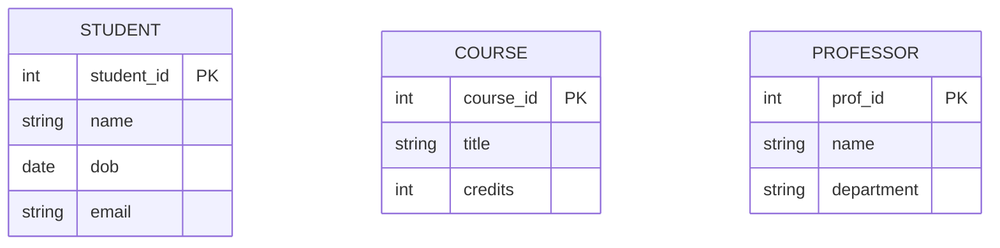
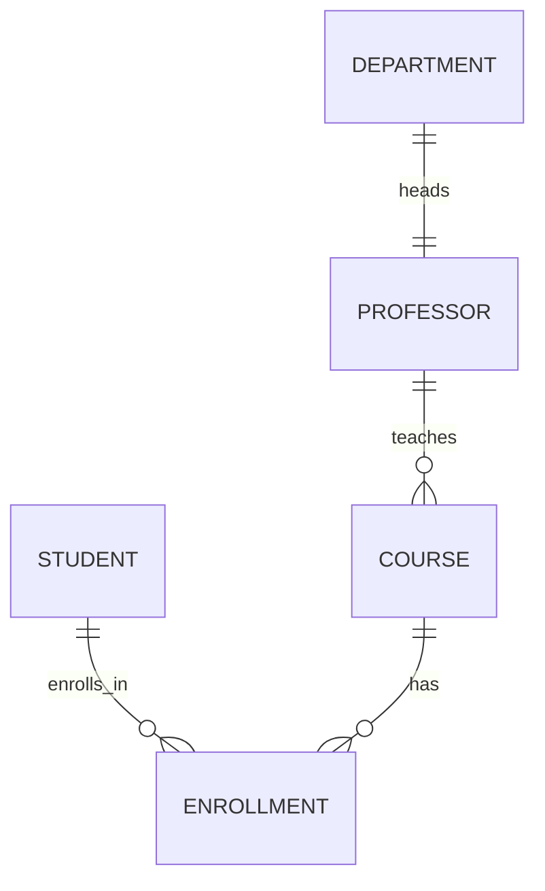
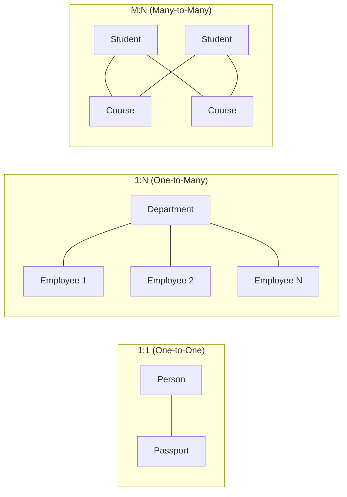
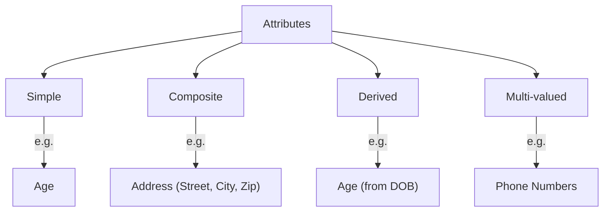
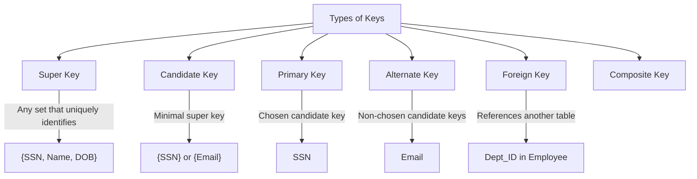
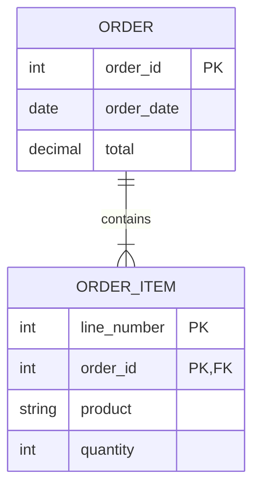
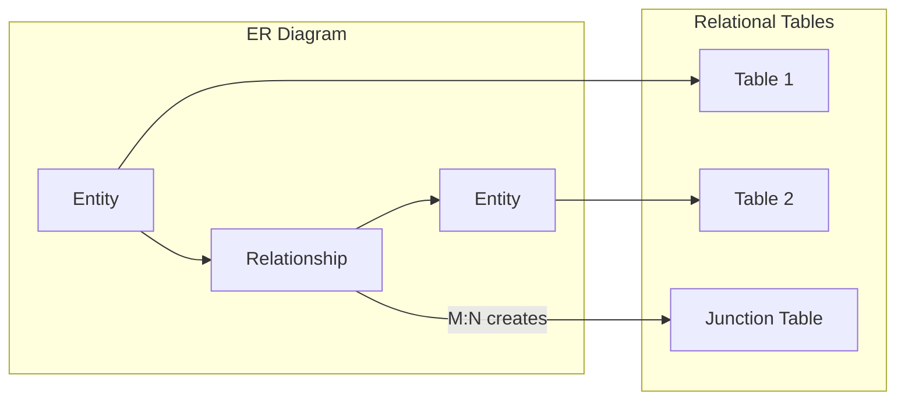

[🏠 Home](../../README.md) | [🗄️ DBMS Roadmap](./00-roadmap.md) | [⬅️ Architecture](./01-architecture.md) | [➡️ Relational Model](./03-relational-model.md)

# 📐 ER Modeling (Entity-Relationship)

> The blueprint for designing databases before implementation.

---

## 📊 Quick Reference

| Symbol | Meaning |
|--------|---------|
| **Rectangle** | Entity (Table) |
| **Ellipse** | Attribute (Column) |
| **Diamond** | Relationship |
| **Double Rectangle** | Weak Entity |
| **Underline** | Primary Key |

---

## 🎯 Core Concepts

### Entities
An entity is a real-world object that can be distinctly identified.

### Entity Types

| Type | Description | Example |
|------|-------------|---------|
| **Strong Entity** | Has its own primary key | Student, Course |
| **Weak Entity** | Depends on strong entity for identification | Order_Item (needs Order) |

---

## 🔗 Relationships

### Cardinality (How Many?)

| Notation | Meaning | Example |
|----------|---------|---------|
| `\|\|--\|\|` | One-to-One | Department has ONE Head |
| `\|\|--o{` | One-to-Many | Professor teaches MANY Courses |
| `}o--o{` | Many-to-Many | Students enroll in MANY Courses |

### Cardinality Visual Guide

---

## 📝 Attributes

### Types of Attributes

| Type | Description | Notation | Example |
|------|-------------|----------|---------|
| **Simple** | Atomic, cannot be divided | Single ellipse | `Age`, `Name` |
| **Composite** | Can be split into sub-parts | Nested ellipses | `Address` → Street, City |
| **Derived** | Calculated from other attributes | Dashed ellipse | `Age` from `DOB` |
| **Multi-valued** | Can have multiple values | Double ellipse | `Phone Numbers` |
| **Key** | Uniquely identifies entity | Underlined | `Student_ID` |

---

## 🔑 Keys

### Key Definitions

| Key Type | Definition |
|----------|------------|
| **Super Key** | Any combination of attributes that uniquely identifies a row |
| **Candidate Key** | Minimal super key (no redundant attributes) |
| **Primary Key** | The candidate key chosen by the designer |
| **Alternate Key** | Candidate keys not chosen as primary |
| **Foreign Key** | Attribute that references primary key of another table |
| **Composite Key** | Primary key made of multiple columns |

---

## 👻 Weak Entities

An entity that cannot be uniquely identified without its owner entity.

**Characteristics:**
- Has a **partial key** (discriminator)
- Combined with owner's PK to form full identification
- Cannot exist without owner entity

---

## 🔄 ER to Relational Mapping

### Mapping Rules

| ER Element | Relational Mapping |
|------------|-------------------|
| Strong Entity | Table with PK |
| Weak Entity | Table with composite PK (owner PK + partial key) |
| 1:1 Relationship | Add FK to either table, or merge tables |
| 1:N Relationship | Add FK to the "many" side |
| M:N Relationship | Create junction/bridge table |
| Multi-valued Attribute | Create separate table |
| Composite Attribute | Flatten into columns OR create subtable |

---

## 🧠 Interview Questions

1. **Q: What is a Weak Entity?**
   - **A:** An entity that cannot be uniquely identified by its own attributes alone. It depends on an "owner" entity. Example: `Order_Item` depends on `Order`.

2. **Q: How do you handle M:N relationships?**
   - **A:** Create a junction table (also called bridge/associative table) containing foreign keys to both entities. Example: `Student_Course` table for Student-Course M:N relationship.

3. **Q: Difference between Candidate Key and Primary Key?**
   - **A:** Candidate keys are all possible minimal keys. Primary key is the ONE candidate key chosen by the designer. Others become alternate keys.

---
