[🏠 Home](../../README.md) | [🗄️ DBMS Roadmap](./00-roadmap.md) | [⬅️ ER Modeling](./02-er-modeling.md) | [➡️ Normalization](./04-normalization.md)

# 🔑 Relational Model & Keys

> The mathematical foundation of modern databases.

---

## 📊 Quick Reference

| Term | Definition |
|------|------------|
| **Relation** | A table (set of tuples) |
| **Tuple** | A row (record) |
| **Attribute** | A column (field) |
| **Domain** | Set of allowed values for an attribute |
| **Degree** | Number of attributes |
| **Cardinality** | Number of tuples |

---

## 📐 Relational Model Terminology


### Formal vs Informal Terms

| Formal Term | Informal Term | Example |
|-------------|---------------|---------|
| Relation | Table | EMPLOYEE |
| Tuple | Row / Record | (101, 'John', 'Sales', 50000) |
| Attribute | Column / Field | emp_id, name, dept |
| Domain | Data Type + Constraints | INT, VARCHAR(50) |

---

## 🔐 Types of Keys

### Key Hierarchy


### Example: Student Table

```sql
CREATE TABLE Student (
    student_id   INT PRIMARY KEY,        -- Primary Key
    email        VARCHAR(100) UNIQUE,    -- Alternate Key (Candidate)
    ssn          CHAR(11) UNIQUE,        -- Alternate Key (Candidate)
    name         VARCHAR(100),
    department   VARCHAR(50)
);
```

**Super Keys:** `{student_id}`, `{email}`, `{ssn}`, `{student_id, email}`, `{student_id, name}`, ...
**Candidate Keys:** `{student_id}`, `{email}`, `{ssn}` (minimal)
**Primary Key:** `{student_id}` (chosen)
**Alternate Keys:** `{email}`, `{ssn}`

---

## 🔗 Foreign Key & Referential Integrity


### Referential Integrity Rules


```sql
CREATE TABLE Employee (
    emp_id INT PRIMARY KEY,
    name VARCHAR(100),
    dept_id INT,
    FOREIGN KEY (dept_id) REFERENCES Department(dept_id)
        ON DELETE CASCADE
        ON UPDATE CASCADE
);
```

---

## 🛡️ Integrity Constraints


### Constraint Types Summary

| Constraint | Description | SQL Syntax |
|------------|-------------|------------|
| **NOT NULL** | Column cannot have NULL | `name VARCHAR(50) NOT NULL` |
| **UNIQUE** | All values must be different | `email VARCHAR(100) UNIQUE` |
| **PRIMARY KEY** | NOT NULL + UNIQUE | `emp_id INT PRIMARY KEY` |
| **FOREIGN KEY** | References another table | `REFERENCES Dept(id)` |
| **CHECK** | Custom condition | `CHECK (salary > 0)` |
| **DEFAULT** | Default value if not provided | `status VARCHAR(10) DEFAULT 'active'` |

---

## 🧮 Relational Algebra

The theoretical foundation for SQL operations.

```mermaid
flowchart LR
    subgraph "Unary Operations"
        Select[σ Selection]
        Project[π Projection]
        Rename[ρ Rename]
    end
    
    subgraph "Binary Operations"
        Union[∪ Union]
        Intersect[∩ Intersection]
        Diff[- Difference]
        Cross[× Cartesian Product]
        Join[⋈ Join]
    end
```



### Operations Explained

| Operation | Symbol | SQL Equivalent | Description |
|-----------|--------|----------------|-------------|
| Selection | σ | `WHERE` | Filter rows |
| Projection | π | `SELECT columns` | Choose columns |
| Union | ∪ | `UNION` | Combine rows from two tables |
| Intersection | ∩ | `INTERSECT` | Common rows |
| Difference | - | `EXCEPT` | Rows in A but not in B |
| Cartesian Product | × | `CROSS JOIN` | All combinations |
| Natural Join | ⋈ | `NATURAL JOIN` | Match on common columns |

### Example

```
-- Relational Algebra: π name (σ salary>50000 (Employee))
-- SQL:
SELECT name FROM Employee WHERE salary > 50000;
```

---

## 🧠 Interview Questions

1. **Q: What is Referential Integrity?**
   - **A:** A constraint ensuring foreign key values either match a primary key in the referenced table or are NULL. Prevents orphan records.

2. **Q: Difference between UNIQUE and PRIMARY KEY?**
   - **A:** PRIMARY KEY = UNIQUE + NOT NULL. A table can have only ONE primary key but multiple UNIQUE constraints. UNIQUE allows one NULL (in most DBs).

3. **Q: What is a Composite Key?**
   - **A:** A primary key made up of two or more columns. Example: In an `Enrollment` table, `(student_id, course_id)` together form the primary key.

---
