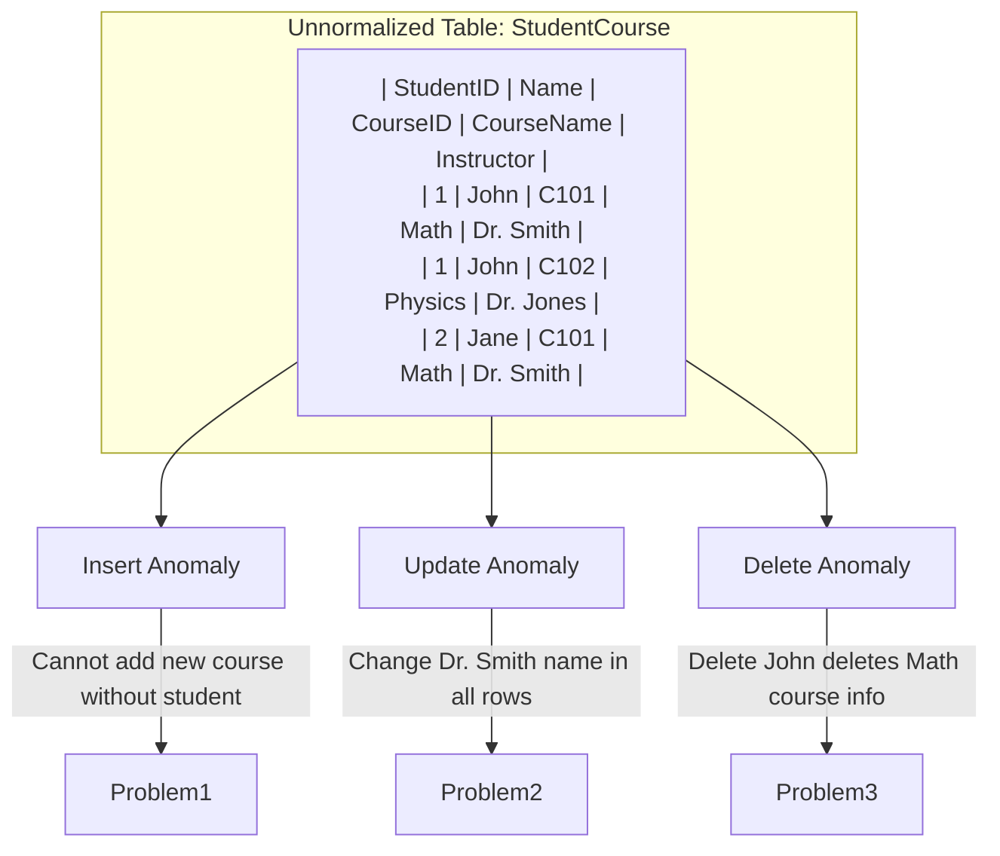
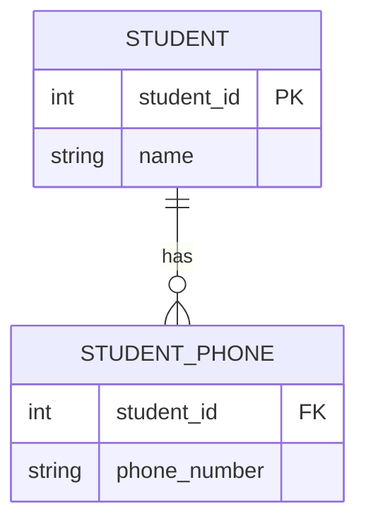
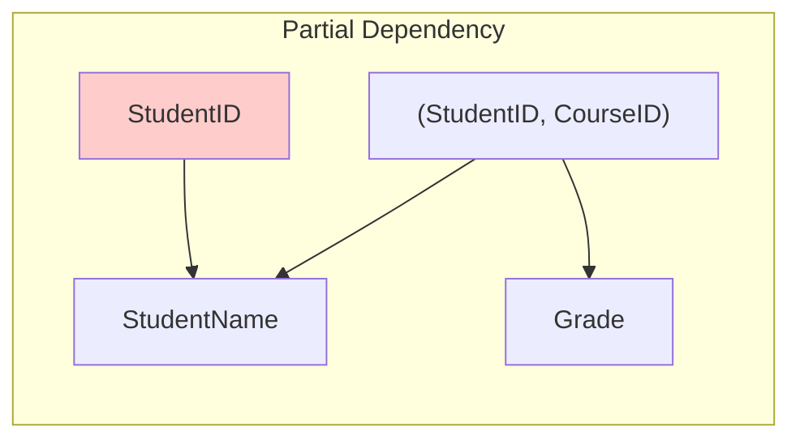
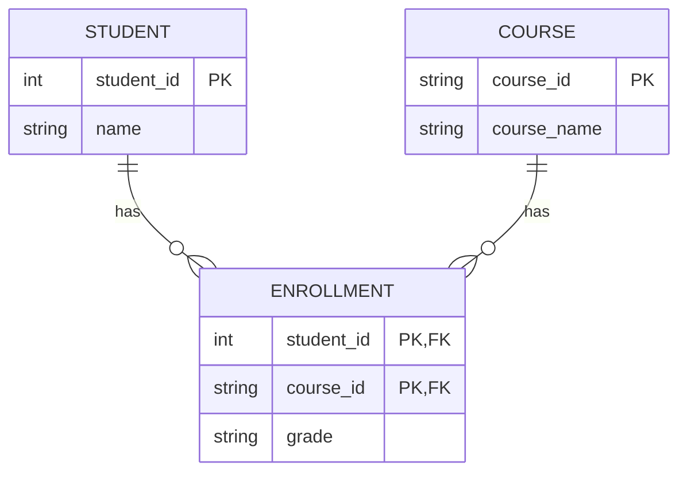
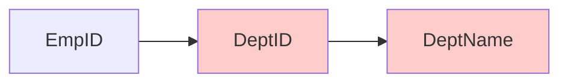
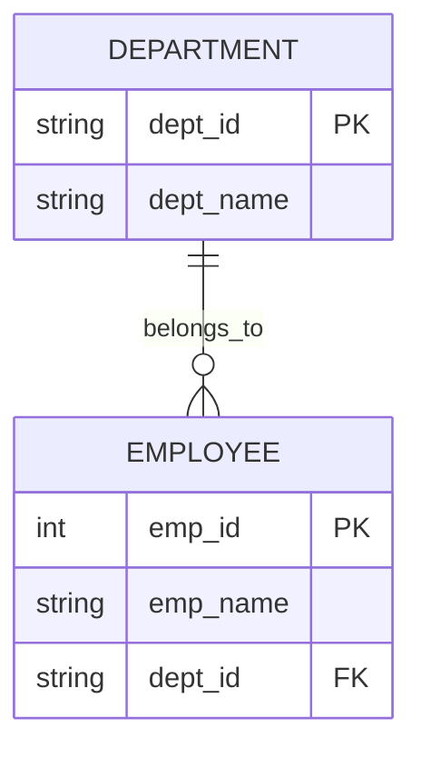
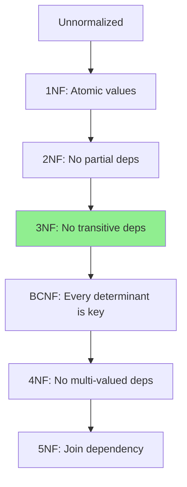
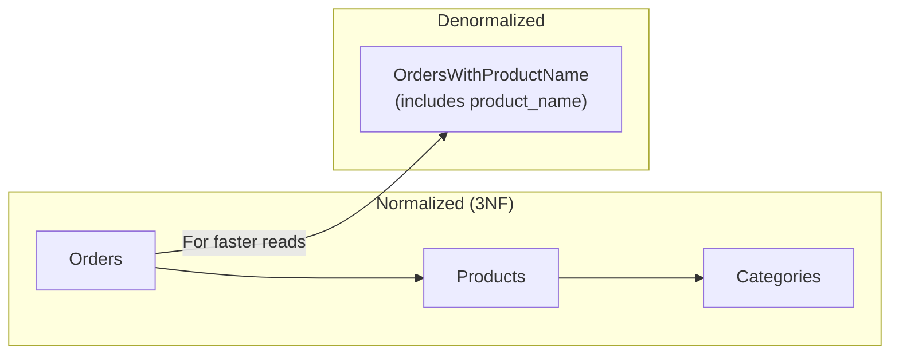

[🏠 Home](../../README.md) | [🗄️ DBMS Roadmap](./00-roadmap.md) | [⬅️ Relational Model](./03-relational-model.md) | [➡️ Storage Internals](./05-storage-internals.md)

# 📊 Normalization

> The process of organizing data to minimize redundancy and dependency.

---

## 📊 Quick Reference

| Normal Form | Requirement |
|-------------|-------------|
| **1NF** | Atomic values, no repeating groups |
| **2NF** | 1NF + No partial dependencies |
| **3NF** | 2NF + No transitive dependencies |
| **BCNF** | 3NF + Every determinant is a candidate key |

---

## 🔴 Why Normalize? The Anomaly Problem

Without normalization, you get data anomalies:

| Anomaly Type | Problem | Example |
|--------------|---------|---------|
| **Insert** | Cannot add data without related data | Can't add a Course without a Student |
| **Update** | Must update multiple rows | Renaming "Math" requires updating all rows |
| **Delete** | Lose unrelated data | Deleting last student in a course loses course info |

---

## 1️⃣ First Normal Form (1NF)

**Rule:** All columns must have atomic (indivisible) values. No repeating groups.

### ❌ Violates 1NF

| StudentID | Name | PhoneNumbers |
|-----------|------|--------------|
| 1 | John | 123-456, 789-012 |
| 2 | Jane | 555-123 |

### ✅ Satisfies 1NF

| StudentID | Name | PhoneNumber |
|-----------|------|-------------|
| 1 | John | 123-456 |
| 1 | John | 789-012 |
| 2 | Jane | 555-123 |

**Or separate table:**

---

## 2️⃣ Second Normal Form (2NF)

**Rule:** Must be in 1NF + No partial dependencies (non-key attribute depends on PART of composite key).

### ❌ Violates 2NF

**Primary Key:** (StudentID, CourseID)

| StudentID | CourseID | StudentName | CourseName | Grade |
|-----------|----------|-------------|------------|-------|
| 1 | C101 | John | Math | A |
| 1 | C102 | John | Physics | B |

**Problem:** `StudentName` depends only on `StudentID`, not on `(StudentID, CourseID)`.

### ✅ Satisfies 2NF (Decompose)

---

## 3️⃣ Third Normal Form (3NF)

**Rule:** Must be in 2NF + No transitive dependencies (non-key → non-key).

### ❌ Violates 3NF

| EmpID | EmpName | DeptID | DeptName |
|-------|---------|--------|----------|
| 1 | John | D1 | Sales |
| 2 | Jane | D1 | Sales |

**Problem:** `EmpID → DeptID → DeptName` (transitive)

### ✅ Satisfies 3NF

---

## 🅱️ Boyce-Codd Normal Form (BCNF)

**Rule:** For every functional dependency X → Y, X must be a superkey.

BCNF is stricter than 3NF. It handles edge cases where 3NF still allows anomalies.

### Example Where 3NF ≠ BCNF

| Student | Subject | Teacher |
|---------|---------|---------|
| John | Math | Dr. A |
| John | Physics | Dr. B |
| Jane | Math | Dr. A |
| Jane | Physics | Dr. C |

**Functional Dependencies:**
- `(Student, Subject) → Teacher` ✅ (Key → non-key)
- `Teacher → Subject` ❌ (non-key → non-key)

Dr. A teaches only Math. But `Teacher` is not a superkey!

### Solution: Decompose

**Table 1: StudentTeacher**
| Student | Teacher |
|---------|---------|
| John | Dr. A |
| John | Dr. B |

**Table 2: TeacherSubject**
| Teacher | Subject |
|---------|---------|
| Dr. A | Math |
| Dr. B | Physics |

---

## 📈 Normal Forms Comparison

| Form | Violations Removed |
|------|-------------------|
| 1NF | Repeating groups, non-atomic values |
| 2NF | Partial dependencies |
| 3NF | Transitive dependencies |
| BCNF | Non-key determinants |

---

## ⚖️ Denormalization

Sometimes we **intentionally violate** normal forms for performance.

| Scenario | Normalize or Denormalize? |
|----------|---------------------------|
| OLTP (transactions) | Normalize (avoid anomalies) |
| OLAP (analytics) | Denormalize (faster reads) |
| Read-heavy workload | Consider denormalization |
| Write-heavy workload | Normalize |

---

## 🧠 Interview Questions

1. **Q: What is the purpose of normalization?**
   - **A:** To eliminate redundancy and avoid insert/update/delete anomalies. It organizes data into logical structures.

2. **Q: Explain 3NF with an example.**
   - **A:** 3NF requires no transitive dependencies. If `EmpID → DeptID → DeptName`, then `DeptName` should be in a separate Department table.

3. **Q: When would you denormalize?**
   - **A:** For read-heavy systems (analytics, reporting) where join overhead is too expensive. Trade storage for speed.

4. **Q: Difference between 3NF and BCNF?**
   - **A:** BCNF is stricter. In 3NF, only non-prime attributes can't have transitive dependencies. In BCNF, EVERY determinant must be a superkey.

---
