[🏠 Home](../../README.md) | [🗄️ DBMS Roadmap](./00-roadmap.md) | [⬅️ Normalization](./04-normalization.md) | [➡️ Indexing: B-Trees](./06-indexing-btree.md)

# 💾 Storage Internals

> How databases store and organize data on disk.

---

## 📊 Quick Reference

| Concept | Description |
|---------|-------------|
| **Page** | Fixed-size block of data (typically 4KB-16KB) |
| **Heap File** | Unordered collection of pages |
| **Slotted Page** | Page structure with slot array |
| **Row Store** | Data stored row-by-row (OLTP) |
| **Column Store** | Data stored column-by-column (OLAP) |

---

## 📦 Page Structure

A **page** (or block) is the smallest unit of I/O between disk and memory.

```mermaid
flowchart TB
    subgraph Page["📄 Page (8KB typical)"]
        Header["Header\n- Page ID\n- Free Space\n- Checksum"]
        Slots["Slot Array\n[0] → Row 1\n[1] → Row 2\n[2] → Row 3"]
        FreeSpace["← Free Space →"]
        Data["Row Data\n(grows from bottom)"]
    end
    
    Header --> Slots
    Slots --> FreeSpace
    FreeSpace --> Data
```



### Slotted Page Layout

```
+------------------+
|     Header       |  ← Page metadata
+------------------+
| Slot 0 | Slot 1  |  ← Pointers to records
+------------------+
|                  |
|   Free Space     |  ← Grows/shrinks
|                  |
+------------------+
|    Record 2      |  ← Actual data (grows upward)
+------------------+
|    Record 1      |
+------------------+
|    Record 0      |
+------------------+
```

**Benefits of Slotted Pages:**
- Records can be moved within page (compaction)
- Variable-length records supported
- Slot array provides stable "record ID"

---

## 📁 File Organization


### File Organization Comparison

| Type | Insert | Point Query | Range Query | Use Case |
|------|--------|-------------|-------------|----------|
| **Heap** | O(1) | O(n) | O(n) | Bulk loading, logs |
| **Sorted** | O(n) | O(log n) | O(log n + k) | Read-heavy, ordered |
| **Hash** | O(1) | O(1) | Not supported | Key-value lookups |
| **B+ Tree** | O(log n) | O(log n) | O(log n + k) | General purpose |

---

## 📊 Row Store vs Column Store


### Comparison

| Aspect | Row Store | Column Store |
|--------|-----------|--------------|
| **Read Pattern** | Full row | Specific columns |
| **Best For** | OLTP, point queries | OLAP, aggregations |
| **Compression** | Limited | Excellent (same type data) |
| **Insert/Update** | Fast | Slow (reconstruct) |
| **Example Query** | `SELECT * FROM users WHERE id=5` | `SELECT AVG(salary) FROM employees` |
| **Examples** | MySQL, PostgreSQL | ClickHouse, Redshift, Parquet |

---

## 🔄 Buffer Pool (Memory Management)

The buffer pool caches frequently accessed pages in RAM.


### Page Replacement Policies

| Policy | Description | Used By |
|--------|-------------|---------|
| **LRU** | Evict least recently used | Many DBs |
| **Clock** | Approximate LRU (cheaper) | PostgreSQL |
| **LRU-K** | Track last K accesses | SQL Server |
| **2Q** | Separate queues for scan vs random | Some systems |

---

## 📝 Write-Ahead Logging (WAL)

**Rule:** Log the change BEFORE modifying the data page.


### Why WAL?

1. **Sequential writes** to log are faster than random writes to data
2. **Durability**: If crash occurs, replay log to recover
3. **Performance**: App doesn't wait for data page flush

---

## 🧠 Interview Questions

1. **Q: Why do databases use fixed-size pages?**
   - **A:** Simplifies memory management, enables efficient disk I/O (aligned reads), and allows consistent buffer pool sizing.

2. **Q: Row Store vs Column Store - when to use each?**
   - **A:** Row store for transactional workloads (OLTP) with full-row access. Column store for analytical workloads (OLAP) that aggregate specific columns.

3. **Q: What is the Buffer Pool?**
   - **A:** In-memory cache of disk pages. Reduces I/O by keeping frequently accessed pages in RAM. Uses eviction policies like LRU.

4. **Q: Explain Write-Ahead Logging.**
   - **A:** Every change is logged to a sequential file before applying to data pages. Ensures durability (can replay log after crash) and provides better performance (sequential vs random I/O).

---
