[🏠 Home](../../README.md) | [🗄️ DBMS Roadmap](./00-roadmap.md) | [⬅️ Storage Internals](./05-storage-internals.md) | [➡️ Advanced Indexing](./07-advanced-indexing.md)

# 🌳 Indexing: B-Trees & B+ Trees

> The data structures that make database queries fast.

---

## 📊 Quick Reference

| Concept | Description |
|---------|-------------|
| **Index** | Data structure to speed up lookups |
| **B-Tree** | Balanced tree, data in all nodes |
| **B+ Tree** | Data only in leaves, linked leaves |
| **Clustered** | Table data sorted by index |
| **Non-Clustered** | Separate structure pointing to data |

---

## 🤔 Why We Need Indexes

Without an index, finding a record requires a **full table scan** (O(n)).

```mermaid
flowchart LR
    subgraph "Without Index"
        Query1["SELECT * FROM users WHERE id = 500"]
        Scan["Scan all 1M rows... 😰"]
    end
    
    subgraph "With Index"
        Query2["SELECT * FROM users WHERE id = 500"]
        Index["B+ Tree lookup: 3 hops ⚡"]
    end
    
    Query1 --> Scan
    Query2 --> Index
```



| Scenario | Without Index | With B+ Tree Index |
|----------|---------------|-------------------|
| 1 Million rows | O(1,000,000) | O(log n) ≈ 20 |
| Time | ~1 second | ~1 millisecond |

---

## 🌲 B-Tree Structure

A **B-Tree** of order `m`:
- Each node has at most `m` children
- Each non-leaf node has at least `⌈m/2⌉` children
- All leaves are at the same level (balanced)


---

## 🌳 B+ Tree Structure (Most Common)

**Key difference from B-Tree:** Data stored ONLY in leaf nodes. Internal nodes are just "signposts."

```mermaid
flowchart TB
    subgraph "B+ Tree"
        Root["[30 | 60]"]
        
        I1["[10 | 20]"]
        I2["[40 | 50]"]
        I3["[70 | 80]"]
        
        L1["10→D | 20→D"]
        L2["30→D | 40→D"]
        L3["50→D | 60→D"]
        L4["70→D | 80→D"]
        
        Root --> I1 --> L1
        Root --> I2 --> L2
        I2 --> L3
        Root --> I3 --> L4
        
        L1 --> |"Linked"| L2
        L2 --> |"Linked"| L3
        L3 --> |"Linked"| L4
    end
```



### B+ Tree Advantages

| Feature | Benefit |
|---------|---------|
| **Leaf linking** | Fast range queries (just follow pointers) |
| **Data only in leaves** | More keys fit in internal nodes → shorter tree |
| **Consistent I/O** | All lookups same depth |

---

## 📖 B-Tree vs B+ Tree


| Aspect | B-Tree | B+ Tree |
|--------|--------|---------|
| Data location | All nodes | Leaves only |
| Leaf linking | No | Yes (doubly linked) |
| Range queries | Slower (traverse tree) | Fast (follow links) |
| Internal node size | Larger (has data) | Smaller (keys only) |
| Used in | File systems (HFS) | Databases (MySQL, PostgreSQL) |

---

## 🔗 Clustered vs Non-Clustered Index


### Comparison

| Aspect | Clustered | Non-Clustered |
|--------|-----------|---------------|
| **Data storage** | Table sorted by index key | Separate structure |
| **Per table** | Only 1 | Many (unlimited) |
| **Leaf content** | Actual row data | Pointers (Row ID) |
| **Range query** | Very fast | Requires extra hop |
| **Insert cost** | Higher (maintain order) | Lower |

**MySQL InnoDB:** Primary key IS the clustered index. Secondary indexes point to PK.

---

## 📊 Index Selectivity

**Selectivity** = Number of distinct values / Total rows


| Selectivity | Index Usefulness | Example Column |
|-------------|------------------|----------------|
| High (> 0.1) | Excellent | `user_id`, `email`, `SSN` |
| Medium | Depends | `country`, `created_year` |
| Low (< 0.01) | Poor | `gender`, `is_active` |

---

## 🎯 Covering Index

An index that contains ALL columns needed by a query.

```sql
-- Query
SELECT name, email FROM users WHERE user_id = 100;

-- Covering index (includes name, email)
CREATE INDEX idx_user_cover ON users(user_id, name, email);
```

```mermaid
flowchart LR
    subgraph "Without Covering Index"
        I1[Index Lookup] --> T1[Table Lookup]
        T1 --> R1[Return Data]
    end
    
    subgraph "With Covering Index"
        I2[Index Lookup] --> R2[Return Data]
        Note["No table access! 🚀"]
    end
```



---

## 🧮 Index Operations Cost

| Operation | B+ Tree Cost | Notes |
|-----------|-------------|-------|
| Search | O(log n) | Height of tree |
| Insert | O(log n) | May cause split |
| Delete | O(log n) | May cause merge |
| Range Scan | O(log n + k) | k = result size |

### When NOT to Use Indexes

- Small tables (sequential scan is fine)
- High write / low read workloads
- Low selectivity columns
- Frequently updated columns

---

## 🧠 Interview Questions

1. **Q: B-Tree vs B+ Tree - which is better for databases?**
   - **A:** B+ Tree. Because: (1) Data only in leaves means more keys per node → shorter tree. (2) Linked leaves enable fast range scans. (3) All queries hit same depth → predictable performance.

2. **Q: What is a Covering Index?**
   - **A:** An index that includes all columns required by a query. The query can be satisfied entirely from the index without accessing the table (index-only scan).

3. **Q: Clustered vs Non-Clustered Index?**
   - **A:** Clustered: Table data physically sorted by index key (only 1 per table). Non-Clustered: Separate structure with pointers to data (can have many).

4. **Q: When would you NOT create an index?**
   - **A:** Low selectivity columns (e.g., boolean), write-heavy tables, very small tables, or if queries don't filter on that column.

---
