[🏠 Home](../../README.md) | [🗄️ DBMS Roadmap](./00-roadmap.md) | [⬅️ Indexing: B-Trees](./06-indexing-btree.md) | [➡️ ACID Properties](./08-acid-properties.md)

# 🔍 Advanced Indexing

> Beyond B+ Trees: Hash, Bitmap, LSM, and Spatial indexes.

---

## 📊 Quick Reference

| Index Type | Best For | Example DB |
|------------|----------|------------|
| **Hash** | Exact match (=) | PostgreSQL, DynamoDB |
| **Bitmap** | Low cardinality, AND/OR | Oracle, PostgreSQL |
| **LSM Tree** | Write-heavy workloads | RocksDB, Cassandra |
| **R-Tree** | Spatial/Geospatial | PostGIS, MongoDB |
| **Full-Text** | Text search | Elasticsearch, PostgreSQL |

---

## #️⃣ Hash Index

Uses a hash function to map keys directly to locations.

```mermaid
flowchart LR
    Key["Key: 'john@email.com'"]
    Hash["hash('john@email.com') = 42"]
    Bucket["Bucket 42"]
    Data["→ Row Pointer"]
    
    Key --> Hash --> Bucket --> Data
```



### Hash Index Structure

```
Bucket Array:
[0] → (key1, ptr1)
[1] → NULL
[2] → (key2, ptr2) → (key3, ptr3)  [Collision: chaining]
...
[99] → (key100, ptr100)
```

### Pros & Cons

| Pros | Cons |
|------|------|
| O(1) for exact match | No range queries |
| Very fast point lookups | Rehashing is expensive |
| Simple implementation | Bad for sorted access |

**When to use:** Session lookups, cache, key-value access patterns.

---

## 🎨 Bitmap Index

Stores a bitmap (array of bits) for each distinct value.


### Query: `WHERE Gender = 'M' AND Dept = 'IT'`

```
Gender M:    1 0 1 0
Dept IT:    0 1 1 0
            -------
AND Result: 0 0 1 0  → Row 3 matches!
```

### When to Use Bitmap

| Scenario | Use Bitmap? |
|----------|-------------|
| Low cardinality (few distinct values) | ✅ Yes |
| High cardinality | ❌ No (B-Tree better) |
| Complex AND/OR queries | ✅ Yes |
| Write-heavy workload | ❌ No (expensive updates) |
| Data warehousing / OLAP | ✅ Yes |

---

## 📝 LSM Tree (Log-Structured Merge Tree)

Optimized for **write-heavy** workloads. Used by Cassandra, RocksDB, LevelDB.


### How It Works

1. **Write:** Insert into in-memory MemTable (sorted tree)
2. **Flush:** When MemTable is full, write to disk as immutable SSTable
3. **Compaction:** Background process merges SSTables, removes duplicates
4. **Read:** Check MemTable → Level 0 → Level 1 → etc.

### LSM vs B+ Tree

| Aspect | B+ Tree | LSM Tree |
|--------|---------|----------|
| Write Pattern | Random I/O | Sequential I/O |
| Write Speed | O(log n) | O(1) amortized |
| Read Speed | O(log n) | O(log n) * levels |
| Space | Compact | Write amplification |
| Best For | OLTP, read-heavy | Write-heavy, time-series |

---

## 🗺️ Spatial Indexes (R-Tree)

For geospatial queries like "find all restaurants within 5km."


### Spatial Index Types

| Type | Structure | Use Case |
|------|-----------|----------|
| **R-Tree** | Hierarchical bounding boxes | Rectangles, polygons |
| **Quad-Tree** | Recursive 4-way split | Point data |
| **GeoHash** | String encoding of location | Proximity search |

### Example Query

```sql
-- PostGIS: Find all restaurants within 5km
SELECT name FROM restaurants 
WHERE ST_DWithin(location, ST_MakePoint(-73.99, 40.73), 5000);
```

---

## 📜 Full-Text Index

For searching text content (like Google).

```mermaid
flowchart TB
    Doc1["Doc 1: 'The quick brown fox'"]
    Doc2["Doc 2: 'Quick brown dogs'"]
    
    subgraph "Inverted Index"
        quick["quick → [1, 2]"]
        brown["brown → [1, 2]"]
        fox["fox → [1]"]
        dogs["dogs → [2]"]
    end
    
    Doc1 --> quick & brown & fox
    Doc2 --> quick & brown & dogs
```



### Full-Text Features

| Feature | Description |
|---------|-------------|
| **Tokenization** | Split text into words |
| **Stemming** | "running" → "run" |
| **Stop Words** | Ignore "the", "a", "is" |
| **Ranking** | TF-IDF, BM25 scoring |

**Tools:** Elasticsearch, Apache Solr, PostgreSQL `tsvector`

---

## 📊 Index Comparison Summary


---

## 🧠 Interview Questions

1. **Q: When would you use LSM Tree over B+ Tree?**
   - **A:** For write-heavy workloads like time-series data, event logs, or IoT data. LSM converts random writes to sequential writes, improving write throughput.

2. **Q: What is a Bitmap Index?**
   - **A:** Index using bit arrays for each distinct value. Excellent for low-cardinality columns and complex boolean queries (AND/OR). Common in data warehouses.

3. **Q: How does Full-Text Search work?**
   - **A:** Uses inverted index mapping words to documents. Supports tokenization, stemming, and relevance ranking (TF-IDF). Much faster than `LIKE '%word%'`.

4. **Q: Hash Index vs B+ Tree Index?**
   - **A:** Hash: O(1) exact match only, no range queries. B+ Tree: O(log n) for all queries, supports ranges and sorting. Most DBs prefer B+ Tree for versatility.

---
