[🏠 Home](../../README.md) | [🗄️ DBMS Roadmap](./00-roadmap.md) | [⬅️ Advanced Indexing](./07-advanced-indexing.md) | [➡️ Concurrency Control](./09-concurrency-control.md)

# ⚛️ ACID Properties

> The four pillars that guarantee reliable database transactions.

---

## 📊 Quick Reference

| Property | Guarantee | Implementation |
|----------|-----------|----------------|
| **Atomicity** | All or nothing | Transaction logs, Undo logs |
| **Consistency** | Valid state before/after | Constraints, Triggers |
| **Isolation** | Transactions don't interfere | Locks, MVCC |
| **Durability** | Committed = Permanent | WAL, Replication |

---

## 🔀 What is a Transaction?

A transaction is a sequence of operations treated as a single logical unit.

```mermaid
sequenceDiagram
    participant App
    participant DB
    
    App->>DB: BEGIN TRANSACTION
    App->>DB: UPDATE accounts SET balance = balance - 100 WHERE id = 1
    App->>DB: UPDATE accounts SET balance = balance + 100 WHERE id = 2
    
    alt Success
        App->>DB: COMMIT
        DB-->>App: Transaction saved ✅
    else Failure
        App->>DB: ROLLBACK
        DB-->>App: Transaction undone ❌
    end
```

---

## ⚛️ Atomicity

> **"All or Nothing"** - Either ALL operations complete, or NONE do.

```mermaid
flowchart LR
    subgraph "Atomic Transaction"
        A[Debit $100 from Account A]
        B[Credit $100 to Account B]
    end
    
    subgraph "Result"
        Success["Both succeed → COMMIT"]
        Fail["Any fails → ROLLBACK everything"]
    end
    
    A & B --> Success
    A & B --> Fail
```

### Implementation: Undo Log

| Scenario | Action |
|----------|--------|
| Transaction succeeds | Discard undo log, COMMIT |
| Transaction fails | Read undo log, restore old values |
| System crash | On restart, undo uncommitted transactions |

---

## ✅ Consistency

> Database moves from one **valid state** to another valid state.

### Enforced By:

| Mechanism | Example |
|-----------|---------|
| **Primary Key** | No duplicate IDs |
| **Foreign Key** | Referential integrity |
| **CHECK Constraint** | `CHECK (balance >= 0)` |
| **Triggers** | Custom validation logic |
| **Application Logic** | Business rules |

---

## 🔒 Isolation

> Concurrent transactions don't interfere with each other.

### Isolation Levels (See detailed guide)

| Level | Dirty Read | Non-Repeatable | Phantom |
|-------|------------|----------------|---------|
| Read Uncommitted | ✅ Possible | ✅ Possible | ✅ Possible |
| Read Committed | ❌ Prevented | ✅ Possible | ✅ Possible |
| Repeatable Read | ❌ Prevented | ❌ Prevented | ✅ Possible |
| Serializable | ❌ Prevented | ❌ Prevented | ❌ Prevented |

---

## 💾 Durability

> Once committed, data survives system failures.

```mermaid
flowchart TB
    Commit["COMMIT"]
    WAL["Write to WAL (disk)"]
    Ack["Acknowledge client"]
    Buffer["Data in buffer pool (RAM)"]
    Flush["Background: Flush to data files"]
    
    Commit --> WAL --> Ack
    WAL --> Buffer --> Flush
    
    Crash["💥 CRASH"]
    Recover["Recovery: Replay WAL"]
    
    Crash --> Recover
```

### Implementation Mechanisms

| Technique | Description |
|-----------|-------------|
| **Write-Ahead Logging (WAL)** | Log changes before applying |
| **Checkpointing** | Periodic flush of dirty pages |
| **Replication** | Multiple copies across servers |
| **RAID Storage** | Disk redundancy |

---

## 🔄 Transaction States

| State | Description |
|-------|-------------|
| **Active** | Executing operations |
| **Partially Committed** | All ops done, waiting for commit |
| **Committed** | Permanently saved |
| **Failed** | Cannot proceed |
| **Aborted** | Rolled back |

---

## 🧠 Interview Questions

1. **Q: Explain ACID with a bank transfer example.**
   - **A:** 
     - *Atomicity*: Debit from A AND credit to B both succeed, or neither happens.
     - *Consistency*: Total money before = Total money after.
     - *Isolation*: Two concurrent transfers don't see intermediate states.
     - *Durability*: After commit, even if server crashes, the transfer is permanent.

2. **Q: How is Atomicity implemented?**
   - **A:** Using undo logs (before images). Before modifying data, the old value is logged. On failure, the undo log is used to restore original state.

3. **Q: How is Durability guaranteed?**
   - **A:** Write-Ahead Logging (WAL). Changes are written to a durable log BEFORE being applied to data files. On crash, replay the log.

4. **Q: What's the trade-off with ACID?**
   - **A:** Performance. Strict ACID requires synchronous disk writes, locking, and coordination. NoSQL databases often relax ACID for scalability (BASE model).

---
