[🏠 Home](../../README.md) | [🗄️ DBMS Roadmap](./00-roadmap.md) | [⬅️ ACID Properties](./08-acid-properties.md) | [➡️ Isolation Levels](./10-isolation-levels.md)

# 🔐 Concurrency Control

> How databases handle multiple transactions accessing the same data simultaneously.

---

## 📊 Quick Reference

| Approach | Description |
|----------|-------------|
| **Pessimistic** | Lock data before accessing |
| **Optimistic** | Detect conflicts at commit time |
| **MVCC** | Multiple versions, readers don't block writers |

---

## 🔥 The Concurrency Problem


---

## 🔒 Lock-Based Protocols

### Types of Locks

```mermaid
flowchart TB
    Locks[Lock Types] --> Shared[Shared Lock (S)]
    Locks --> Exclusive[Exclusive Lock (X)]
    
    Shared --> |"Read Only"| S1["Multiple readers allowed"]
    Exclusive --> |"Read/Write"| X1["Single writer, no readers"]
```

### Lock Compatibility Matrix

| Request \ Hold | None | Shared (S) | Exclusive (X) |
|---------------|------|------------|---------------|
| **Shared (S)** | ✅ Grant | ✅ Grant | ❌ Wait |
| **Exclusive (X)** | ✅ Grant | ❌ Wait | ❌ Wait |

---

## 📋 Two-Phase Locking (2PL)

The standard protocol for serializability.


### 2PL Variants

| Variant | Description | Deadlock? |
|---------|-------------|-----------|
| **Basic 2PL** | Release locks after shrinking phase | Possible |
| **Strict 2PL** | Hold all X locks until commit | Possible, prevents cascading abort |
| **Rigorous 2PL** | Hold ALL locks until commit | Possible, simplest recovery |

---

## 💀 Deadlocks

When two transactions wait for each other indefinitely.

```mermaid
flowchart LR
    T1["Transaction 1\nHolds: Lock A\nWaits: Lock B"]
    T2["Transaction 2\nHolds: Lock B\nWaits: Lock A"]
    
    T1 --> |"Wants"| T2
    T2 --> |"Wants"| T1
    
    Note["💀 DEADLOCK!"]
```



### Deadlock Handling

| Strategy | Description | Pros/Cons |
|----------|-------------|-----------|
| **Prevention** | Impose ordering on locks | No deadlocks, but complex |
| **Detection** | Build wait-for graph, find cycles | Overhead of detection |
| **Timeout** | Abort if waiting too long | Simple, but may abort valid txns |

### Wait-For Graph


---

## 🔄 Lock Granularity

What level do we lock?


### Granularity Trade-offs

| Granularity | Concurrency | Overhead | Use Case |
|-------------|-------------|----------|----------|
| Database | Very Low | Minimal | Admin operations |
| Table | Low | Low | Bulk loads |
| Page | Medium | Medium | Mixed workloads |
| Row | High | High | OLTP |

---

## 🎰 Optimistic Concurrency Control (OCC)

Assume conflicts are rare. Validate at commit time.


### Pessimistic vs Optimistic

| Aspect | Pessimistic (Locks) | Optimistic (OCC) |
|--------|---------------------|------------------|
| Assumption | Conflicts likely | Conflicts rare |
| Blocking | Yes (waits for locks) | No (retry on conflict) |
| Overhead | Lock management | Validation at commit |
| Best for | High contention | Low contention, reads |

---

## 🕐 Timestamp Ordering

Each transaction gets a timestamp. Execute in timestamp order.


### Rules

| Operation | Condition | Action |
|-----------|-----------|--------|
| T reads X | TS(T) < W-TS(X) | Abort T (reading stale data) |
| T writes X | TS(T) < R-TS(X) or TS(T) < W-TS(X) | Abort T |
| Otherwise | - | Execute and update timestamp |

---

## 🧠 Interview Questions

1. **Q: What is Two-Phase Locking?**
   - **A:** A protocol where transactions acquire all needed locks in a "growing" phase, then release in a "shrinking" phase. Guarantees serializability but can cause deadlocks.

2. **Q: How are deadlocks handled?**
   - **A:** Three approaches: (1) Prevention - impose lock ordering, (2) Detection - wait-for graph cycle detection, (3) Timeout - abort after waiting too long.

3. **Q: Pessimistic vs Optimistic concurrency?**
   - **A:** Pessimistic locks data upfront (blocks others). Optimistic allows concurrent access and validates at commit. Use pessimistic for high-conflict scenarios, optimistic for low-conflict.

4. **Q: What is Lock Escalation?**
   - **A:** When too many row locks are acquired, the DB automatically converts them to a table lock to reduce overhead. Trade-off between memory and concurrency.

---
