[🏠 Home](../../README.md) | [🗄️ DBMS Roadmap](./00-roadmap.md) | [⬅️ Concurrency Control](./09-concurrency-control.md) | [➡️ MVCC](./11-mvcc.md)

# 🎭 Isolation Levels

> Controlling how much transactions can see of each other's changes.

---

## 📊 Quick Reference

| Level | Dirty Read | Non-Repeatable | Phantom |
|-------|------------|----------------|---------|
| Read Uncommitted | ✅ Yes | ✅ Yes | ✅ Yes |
| Read Committed | ❌ No | ✅ Yes | ✅ Yes |
| Repeatable Read | ❌ No | ❌ No | ✅ Yes |
| Serializable | ❌ No | ❌ No | ❌ No |

---

## 🐛 Read Anomalies

### 1️⃣ Dirty Read

Reading uncommitted data from another transaction.

```mermaid
sequenceDiagram
    participant T1
    participant DB
    participant T2
    
    T1->>DB: UPDATE balance = 500 (was 1000)
    Note over T1: Not committed yet
    T2->>DB: SELECT balance
    DB-->>T2: Returns 500 (dirty!)
    T1->>DB: ROLLBACK
    Note over DB: Balance is back to 1000
    Note over T2: T2 used wrong value! 💀
```

---

### 2️⃣ Non-Repeatable Read

Same query, different results within one transaction.

```mermaid
sequenceDiagram
    participant T1
    participant DB
    participant T2
    
    T1->>DB: SELECT balance WHERE id=1
    DB-->>T1: Returns 1000
    T2->>DB: UPDATE balance = 500 WHERE id=1
    T2->>DB: COMMIT
    T1->>DB: SELECT balance WHERE id=1
    DB-->>T1: Returns 500 (different!)
    Note over T1: Same query, different result! 🤔
```

---

### 3️⃣ Phantom Read

New rows appear between two range queries.

```mermaid
sequenceDiagram
    participant T1
    participant DB
    participant T2
    
    T1->>DB: SELECT COUNT(*) WHERE age > 20
    DB-->>T1: Returns 5
    T2->>DB: INSERT INTO users (age=25)
    T2->>DB: COMMIT
    T1->>DB: SELECT COUNT(*) WHERE age > 20
    DB-->>T1: Returns 6 (phantom row!)
    Note over T1: New row appeared! 👻
```

---

## 🎚️ Isolation Levels Explained

### Level 1: READ UNCOMMITTED

**SQL:** `SET TRANSACTION ISOLATION LEVEL READ UNCOMMITTED;`

---

### Level 2: READ COMMITTED (Default in PostgreSQL, Oracle)

```mermaid
flowchart TB
    subgraph "Behavior"
        Commit["Only sees committed data"]
        EachRead["Each read sees latest committed version"]
    end
    
    subgraph "Prevents"
        P1["✅ Dirty Reads"]
    end
    
    subgraph "Allows"
        A1["❌ Non-Repeatable Reads"]
        A2["❌ Phantom Reads"]
    end
```

**SQL:** `SET TRANSACTION ISOLATION LEVEL READ COMMITTED;`

---

### Level 3: REPEATABLE READ (Default in MySQL InnoDB)

```mermaid
flowchart TB
    subgraph "Behavior"
        Snapshot["Transaction sees snapshot from start"]
        Stable["Same rows return same values"]
    end
    
    subgraph "Prevents"
        P1["✅ Dirty Reads"]
        P2["✅ Non-Repeatable Reads"]
    end
    
    subgraph "Allows"
        A1["❌ Phantom Reads (in standard SQL)"]
        Note["MySQL InnoDB also prevents phantoms via gap locks"]
    end
```

**SQL:** `SET TRANSACTION ISOLATION LEVEL REPEATABLE READ;`

---

### Level 4: SERIALIZABLE

```mermaid
flowchart TB
    subgraph "Behavior"
        Serial["Transactions execute as if serial"]
        Locks["Range locks prevent phantoms"]
    end
    
    subgraph "Prevents"
        P1["✅ Dirty Reads"]
        P2["✅ Non-Repeatable Reads"]
        P3["✅ Phantom Reads"]
    end
    
    subgraph "Cost"
        Perf["Lowest performance"]
        Block["High blocking"]
    end
```

**SQL:** `SET TRANSACTION ISOLATION LEVEL SERIALIZABLE;`

---

## 📊 Visual Comparison

```mermaid
flowchart TB
    subgraph "Isolation Spectrum"
        RU["Read Uncommitted\n🔓 No isolation"]
        RC["Read Committed\n🔒 Basic isolation"]
        RR["Repeatable Read\n🔒🔒 Snapshot"]
        S["Serializable\n🔒🔒🔒 Full isolation"]
    end
    
    RU --> |"More isolation"| RC --> RR --> S
    
    S --> |"More performance"| RR --> RC --> RU
```

---

## 🔧 Implementation Approaches

| Level | Lock-Based | MVCC |
|-------|------------|------|
| Read Uncommitted | No locks on read | Read current version |
| Read Committed | Short read locks | Read latest committed |
| Repeatable Read | Hold read locks | Read snapshot version |
| Serializable | Range locks | SSI (Serializable Snapshot) |

---

## 💡 Choosing the Right Level

| Use Case | Recommended Level |
|----------|-------------------|
| Banking, Finance | Serializable |
| E-commerce checkout | Repeatable Read |
| Session reads | Read Committed |
| Analytics, Reporting | Read Uncommitted / Read Committed |
| High concurrency web | Read Committed |

---

## 🧠 Interview Questions

1. **Q: Explain the three read anomalies.**
   - **A:** 
     - *Dirty Read*: Reading uncommitted changes.
     - *Non-Repeatable Read*: Same row, different values on re-read.
     - *Phantom Read*: New rows appear in range queries.

2. **Q: What is the default isolation level in MySQL vs PostgreSQL?**
   - **A:** MySQL InnoDB: Repeatable Read. PostgreSQL: Read Committed.

3. **Q: Why not always use Serializable?**
   - **A:** Performance. It requires the most locking/coordination, reducing concurrency and throughput. Most applications can tolerate some anomalies.

4. **Q: How does Repeatable Read differ in MySQL vs standard SQL?**
   - **A:** Standard SQL allows phantom reads at this level. MySQL InnoDB uses "next-key locking" which also prevents phantoms, making it closer to serializable.

---
