[🏠 Home](../../README.md) | [🗄️ DBMS Roadmap](./00-roadmap.md) | [⬅️ Isolation Levels](./10-isolation-levels.md) | [➡️ SQL Commands](./12-sql-commands.md)

# 🔄 MVCC (Multi-Version Concurrency Control)

> How modern databases let readers and writers coexist without blocking.

---

## 📊 Quick Reference

| Concept | Description |
|---------|-------------|
| **MVCC** | Keep multiple versions of data |
| **Snapshot** | Point-in-time view of database |
| **Version Chain** | Linked list of row versions |
| **Garbage Collection** | Remove old versions (vacuuming) |

---

## 🤔 The Problem MVCC Solves

Traditional locking:
```
Reader waits for Writer → Slow!
Writer waits for Reader → Slow!
```

MVCC:
```
Reader reads old version → No wait!
Writer creates new version → No wait!
```


---

## 🏗️ How MVCC Works

Each row has hidden columns for versioning:


### PostgreSQL Example

| id | name | price | xmin | xmax |
|----|------|-------|------|------|
| 1 | Book | $10 | 100 | ∞ |

**After UPDATE (txn 200):**

| id | name | price | xmin | xmax |
|----|------|-------|------|------|
| 1 | Book | $10 | 100 | 200 | ← Old version |
| 1 | Book | $15 | 200 | ∞ | ← New version |

---

## 📸 Snapshot Isolation

Transaction sees a consistent snapshot from when it started.


### Visibility Rules

A version is visible to transaction T if:
1. `xmin` is committed AND `xmin < T.start_ts`
2. `xmax` is uncommitted OR `xmax > T.start_ts`

```mermaid
flowchart TB
    Check["Is version visible?"]
    Check --> C1{"xmin committed?"}
    C1 --> |No| Hidden["Hidden ❌"]
    C1 --> |Yes| C2{"xmin < my start?"}
    C2 --> |No| Hidden
    C2 --> |Yes| C3{"xmax exists?"}
    C3 --> |No| Visible["Visible ✅"]
    C3 --> |Yes| C4{"xmax committed & < my start?"}
    C4 --> |Yes| Hidden
    C4 --> |No| Visible
```



---

## 🗑️ Garbage Collection (Vacuum)

Old versions accumulate. Must be cleaned up.


### PostgreSQL Vacuum

| Type | Description |
|------|-------------|
| **VACUUM** | Marks dead tuples as reusable |
| **VACUUM FULL** | Compacts table (rewrites) |
| **Autovacuum** | Background daemon |

**Why it matters:** Without vacuum, table bloats, queries slow down.

---

## 🆚 MVCC Implementations

### PostgreSQL

- Stores multiple physical copies
- xmin/xmax in each row
- Requires VACUUM for cleanup

### MySQL InnoDB

- Undo log for old versions
- Roll pointer in row header
- Purge thread for cleanup


---

## ⚔️ Write Conflicts

MVCC prevents read anomalies but writes can still conflict.


### Handling Write Conflicts

| Strategy | Description |
|----------|-------------|
| **First-Committer-Wins** | PostgreSQL SSI, abort later transaction |
| **Last-Writer-Wins** | Some NoSQL, accept data loss |
| **Application Retry** | Catch error, retry transaction |

---

## 📊 MVCC Benefits & Costs

| Benefits | Costs |
|----------|-------|
| ✅ Readers never block writers | ❌ Storage overhead (versions) |
| ✅ Writers never block readers | ❌ Vacuum/purge overhead |
| ✅ Consistent reads (snapshot) | ❌ Long transactions hold old versions |
| ✅ No deadlocks from reads | ❌ Write-write conflicts still possible |

---

## 🧠 Interview Questions

1. **Q: What is MVCC and why is it used?**
   - **A:** Multi-Version Concurrency Control keeps multiple versions of each row. This allows readers to see a consistent snapshot while writers create new versions. Result: Readers never block writers and vice versa.

2. **Q: How does PostgreSQL implement MVCC?**
   - **A:** Each row has `xmin` (creating txn) and `xmax` (deleting txn) hidden columns. Updates create new row versions. Old versions are cleaned by VACUUM.

3. **Q: What is the VACUUM command?**
   - **A:** Garbage collection in PostgreSQL. Removes old row versions that are no longer visible to any transaction. Without it, tables bloat.

4. **Q: Can MVCC prevent all anomalies?**
   - **A:** It prevents read anomalies (dirty reads, non-repeatable reads). But write-write conflicts (lost updates) require additional mechanisms like serializable isolation or application-level locking.

---
