[🏠 Home](../../README.md) | [🗄️ DBMS Roadmap](./00-roadmap.md) | [⬅️ SQL Commands](./12-sql-commands.md) | [➡️ Query Optimization](./14-query-optimization.md)

# 🔗 Joins Deep Dive

> Understanding how databases combine data from multiple tables.

---

## 📊 Quick Reference

| Join Type | Returns |
|-----------|---------|
| INNER | Matching rows only |
| LEFT | All left + matching right |
| RIGHT | All right + matching left |
| FULL | All rows from both |
| CROSS | Cartesian product |

---

## 📋 Sample Data


---

## 🎯 INNER JOIN

Returns only matching rows from both tables.


```sql
SELECT e.name, d.name
FROM employees e
INNER JOIN departments d ON e.dept_id = d.id;
```

**Result:** Bob excluded (no dept), Sales excluded (no employees)

---

## ⬅️ LEFT JOIN (LEFT OUTER JOIN)

All rows from left table, matching rows from right (NULL if no match).


```sql
SELECT e.name, d.name
FROM employees e
LEFT JOIN departments d ON e.dept_id = d.id;
```

**Use case:** Find employees without departments

```sql
SELECT e.name FROM employees e
LEFT JOIN departments d ON e.dept_id = d.id
WHERE d.id IS NULL;  -- Bob
```

---

## ➡️ RIGHT JOIN (RIGHT OUTER JOIN)

All rows from right table, matching rows from left.


```sql
SELECT e.name, d.name
FROM employees e
RIGHT JOIN departments d ON e.dept_id = d.id;
```

---

## ↔️ FULL OUTER JOIN

All rows from both tables.


```sql
SELECT e.name, d.name
FROM employees e
FULL OUTER JOIN departments d ON e.dept_id = d.id;
```

**Note:** MySQL doesn't support FULL OUTER JOIN directly. Use:
```sql
SELECT * FROM employees e LEFT JOIN departments d ON e.dept_id = d.id
UNION
SELECT * FROM employees e RIGHT JOIN departments d ON e.dept_id = d.id;
```

---

## ✖️ CROSS JOIN (Cartesian Product)

Every row from left matched with every row from right.

```mermaid
flowchart TB
    subgraph "Result: 3 × 3 = 9 rows"
        R["| emp | dept |
        | John | Engineering |
        | John | Marketing |
        | John | Sales |
        | Jane | Engineering |
        | ... |"]
    end
```



```sql
SELECT e.name, d.name
FROM employees e
CROSS JOIN departments d;
-- Or simply: FROM employees, departments
```

**Use case:** Generate all combinations (e.g., all products × all stores)

---

## 🔄 SELF JOIN

Joining a table to itself.

```sql
-- Find employees and their managers
SELECT 
    e.name AS employee,
    m.name AS manager
FROM employees e
LEFT JOIN employees m ON e.manager_id = m.id;
```

---

## ⚙️ Join Algorithms

How databases physically execute joins:

```mermaid
flowchart TB
    Join[Join Algorithms] --> NL[Nested Loop]
    Join --> Hash[Hash Join]
    Join --> SM[Sort-Merge Join]
    
    NL --> |"O(n×m)"| NL1["For each row in A,\nscan all of B"]
    Hash --> |"O(n+m)"| H1["Build hash table on smaller,\nprobe with larger"]
    SM --> |"O(n log n + m log m)"| SM1["Sort both,\nmerge in order"]
```



### Algorithm Selection

| Algorithm | Best For | Index Needed? |
|-----------|----------|---------------|
| **Nested Loop** | Small tables, indexed inner | Yes (on inner) |
| **Hash Join** | Large tables, equality | No |
| **Sort-Merge** | Large tables, sorted output | No |

---

## 📈 Join Performance Tips

```sql
-- ❌ Bad: Function on join column (can't use index)
SELECT * FROM orders o
JOIN products p ON YEAR(o.date) = p.year;

-- ✅ Good: Direct column comparison
SELECT * FROM orders o
JOIN products p ON o.product_id = p.id;

-- ❌ Bad: Implicit type conversion
SELECT * FROM orders o
JOIN products p ON o.product_id = p.id  -- If types differ
-- One might be VARCHAR, other INT

-- ✅ Good: Ensure matching types
SELECT * FROM orders o
JOIN products p ON o.product_id = CAST(p.id AS INT);
```

---

## 🧠 Interview Questions

1. **Q: LEFT JOIN vs INNER JOIN?**
   - **A:** INNER returns only matching rows. LEFT returns all left rows + matching right (NULL if no match).

2. **Q: What is a Self Join?**
   - **A:** Joining a table to itself. Used for hierarchical data (employee-manager) or comparing rows within same table.

3. **Q: How do databases execute Joins?**
   - **A:** Three algorithms:
     - *Nested Loop*: For each outer row, scan inner table
     - *Hash Join*: Build hash on smaller table, probe with larger
     - *Sort-Merge*: Sort both, merge in order

4. **Q: How to find rows with no match?**
   - **A:** LEFT JOIN + WHERE right_table.id IS NULL. This is called an "anti-join" pattern.

---
