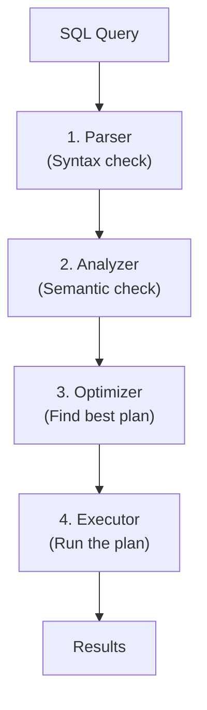
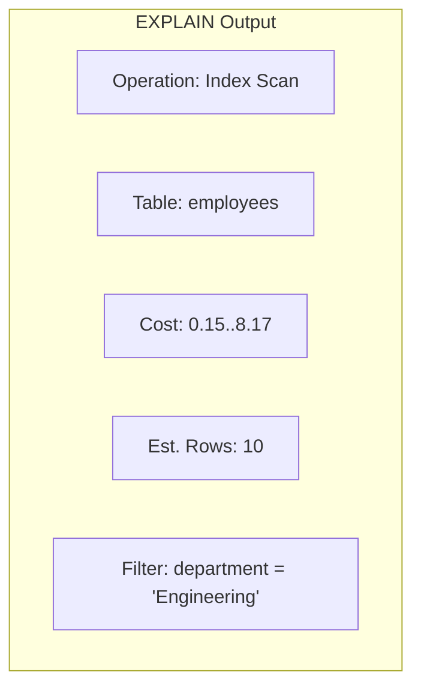
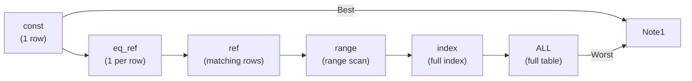
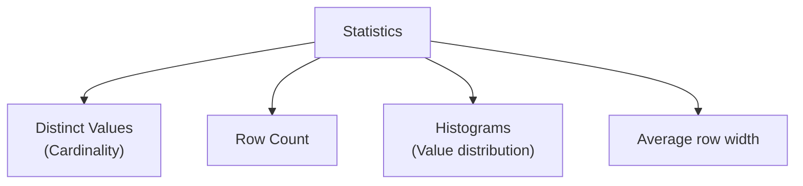
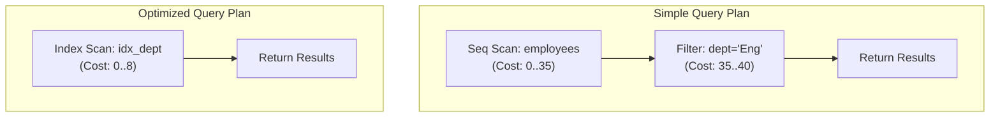

[🏠 Home](../../README.md) | [🗄️ DBMS Roadmap](./00-roadmap.md) | [⬅️ Joins](./13-joins.md) | [➡️ Scaling](./15-scaling.md)

# ⚡ Query Optimization

> How databases find the fastest way to execute your queries.

---

## 📊 Quick Reference

| Concept | Description |
|---------|-------------|
| **Query Plan** | Step-by-step execution strategy |
| **Cost-Based Optimizer** | Chooses plan with lowest estimated cost |
| **Statistics** | Data about table size, value distribution |
| **Sargable** | Queries that can use indexes |

---

## 🔄 Query Processing Pipeline



---

## 📋 EXPLAIN Plan

The most important debugging tool for query performance.

```sql
EXPLAIN SELECT * FROM employees WHERE department = 'Engineering';

-- Detailed version (PostgreSQL)
EXPLAIN ANALYZE SELECT * FROM employees WHERE department = 'Engineering';

-- MySQL
EXPLAIN FORMAT=JSON SELECT * FROM employees WHERE department = 'Engineering';
```

### Reading EXPLAIN Output



| Column | Meaning |
|--------|---------|
| **type** | Access method (ALL, index, range, ref, const) |
| **rows** | Estimated rows to examine |
| **filtered** | Percentage of rows after filter |
| **Extra** | Additional info (Using index, Using filesort) |

### Access Types (Best to Worst)



---

## 🎯 Sargable Queries

**Sargable** = **S**earch **ARG**ument **ABLE** = Can use indexes.

### ❌ Non-Sargable (No Index)

```sql
-- Function on column
SELECT * FROM users WHERE YEAR(created_at) = 2024;

-- Wildcard at start
SELECT * FROM users WHERE name LIKE '%john';

-- OR on different columns
SELECT * FROM users WHERE name = 'john' OR email = 'john@email.com';

-- NOT IN / NOT EXISTS (sometimes)
SELECT * FROM users WHERE id NOT IN (SELECT user_id FROM orders);
```

### ✅ Sargable (Uses Index)

```sql
-- Direct comparison
SELECT * FROM users WHERE created_at >= '2024-01-01' AND created_at < '2025-01-01';

-- Wildcard at end
SELECT * FROM users WHERE name LIKE 'john%';

-- IN clause
SELECT * FROM users WHERE id IN (1, 2, 3);

-- Equality
SELECT * FROM users WHERE email = 'john@email.com';
```

---

## 📊 Statistics

The optimizer uses statistics to estimate costs.



### Updating Statistics

```sql
-- PostgreSQL
ANALYZE employees;

-- MySQL
ANALYZE TABLE employees;

-- SQL Server
UPDATE STATISTICS employees;
```

**Stale statistics = bad query plans!**

---

## 🔧 Common Optimization Techniques

### 1. Index Optimization

```sql
-- Create appropriate indexes
CREATE INDEX idx_dept ON employees(department);

-- Composite index for multi-column queries
CREATE INDEX idx_dept_hire ON employees(department, hire_date);

-- Covering index
CREATE INDEX idx_covering ON employees(department, name, salary);
```

### 2. Query Rewriting

```sql
-- ❌ Correlated subquery (slow)
SELECT * FROM employees e
WHERE salary > (SELECT AVG(salary) FROM employees WHERE department = e.department);

-- ✅ JOIN (faster)
SELECT e.* FROM employees e
JOIN (SELECT department, AVG(salary) as avg_sal FROM employees GROUP BY department) a
ON e.department = a.department
WHERE e.salary > a.avg_sal;
```

### 3. Avoiding SELECT *

```sql
-- ❌ Fetches all columns
SELECT * FROM employees WHERE id = 1;

-- ✅ Fetch only needed columns
SELECT name, email FROM employees WHERE id = 1;
```

---

## 🚦 Query Hints

Override optimizer decisions (use sparingly!).

```sql
-- Force index (MySQL)
SELECT * FROM employees FORCE INDEX (idx_department) WHERE department = 'Eng';

-- PostgreSQL hints
SET enable_seqscan = off;
SELECT * FROM employees WHERE department = 'Eng';

-- SQL Server
SELECT * FROM employees WITH (INDEX(idx_department)) WHERE department = 'Eng';
```

---

## 📈 Common Anti-Patterns

| Anti-Pattern | Problem | Solution |
|--------------|---------|----------|
| SELECT * | Extra I/O, prevents covering index | Select needed columns |
| Function on WHERE column | Can't use index | Rewrite query |
| Implicit type conversion | Prevents index use | Match data types |
| N+1 queries (in app) | Many round trips | Use JOINs or batch |
| OR on multiple columns | Can't use single index | Use UNION |

---

## 📊 Execution Plan Visualization



---

## 🧠 Interview Questions

1. **Q: How do you optimize a slow query?**
   - **A:** 
     1. Run EXPLAIN ANALYZE to see actual execution
     2. Check if indexes are being used
     3. Look for full table scans
     4. Ensure statistics are up to date
     5. Check for non-sargable predicates

2. **Q: What makes a query sargable?**
   - **A:** A query where the WHERE clause can use an index. Avoid functions on columns, leading wildcards, and implicit type conversions.

3. **Q: What are query statistics and why are they important?**
   - **A:** Statistics describe data distribution (row counts, distinct values, histograms). The optimizer uses them to estimate costs and choose the best plan. Stale statistics lead to poor plans.

4. **Q: When would you use a query hint?**
   - **A:** Last resort when optimizer makes wrong choice. Common scenarios: force specific index, force join order. But hints are fragile—they don't adapt to data changes.

---
