[🏠 Home](../../README.md) | [🗄️ DBMS Roadmap](./00-roadmap.md) | [⬅️ Query Optimization](./14-query-optimization.md) | [➡️ Replication](./16-replication.md)

# 📈 Scaling Databases

> How to handle data growth beyond a single server.

---

## 📊 Quick Reference

| Strategy | Description |
|----------|-------------|
| **Vertical Scaling** | Bigger server (more CPU, RAM) |
| **Horizontal Scaling** | More servers (sharding) |
| **Partitioning** | Split data within single DB |
| **Sharding** | Split data across multiple DBs |

---

## 📐 Vertical vs Horizontal Scaling


| Aspect | Vertical | Horizontal |
|--------|----------|------------|
| Complexity | Low | High |
| Cost | Expensive (hardware) | Cheaper (commodity) |
| Limit | Hardware ceiling | Theoretically unlimited |
| Downtime | Usually required | Can add live |
| Use Case | Quick fix, small-medium | Large scale |

---

## 🗂️ Partitioning vs Sharding


| Aspect | Partitioning | Sharding |
|--------|--------------|----------|
| Storage | Single database | Multiple databases |
| Management | DB handles it | Application handles it |
| Joins | Supported | Complex (cross-shard) |
| Transactions | Supported | Distributed transactions |

---

## 📊 Partitioning Strategies

### 1. Range Partitioning


```sql
CREATE TABLE orders (
    id INT,
    order_date DATE,
    amount DECIMAL
) PARTITION BY RANGE (YEAR(order_date)) (
    PARTITION p2023 VALUES LESS THAN (2024),
    PARTITION p2024 VALUES LESS THAN (2025),
    PARTITION p2025 VALUES LESS THAN (2026)
);
```

### 2. List Partitioning

```sql
CREATE TABLE customers (
    id INT,
    name VARCHAR(100),
    country VARCHAR(50)
) PARTITION BY LIST (country) (
    PARTITION p_americas VALUES IN ('USA', 'Canada', 'Mexico'),
    PARTITION p_europe VALUES IN ('UK', 'Germany', 'France'),
    PARTITION p_asia VALUES IN ('India', 'China', 'Japan')
);
```

### 3. Hash Partitioning

```sql
CREATE TABLE users (
    id INT,
    name VARCHAR(100)
) PARTITION BY HASH (id)
PARTITIONS 4;  -- Automatically distributes to 4 partitions
```

---

## 🔪 Sharding Strategies

### 1. Key-Based (Hash) Sharding


**Pros:** Even distribution
**Cons:** Resharding is painful

### 2. Range-Based Sharding


**Pros:** Range queries on shard key efficient
**Cons:** Hot spots (new users all go to last shard)

### 3. Directory-Based Sharding

```mermaid
flowchart TB
    Query["user_id = 12345"]
    Lookup["Lookup Service"]
    Shard["Shard 2"]
    
    Query --> Lookup --> |"12345 → Shard 2"| Shard
```



**Pros:** Flexible mapping
**Cons:** Lookup service becomes bottleneck

---

## ⚠️ Sharding Challenges


### Cross-Shard Query Example

```sql
-- This is problematic in sharded DB!
SELECT o.* FROM orders o
JOIN users u ON o.user_id = u.id
WHERE u.country = 'USA';

-- If orders and users are sharded differently,
-- this requires querying ALL shards!
```

---

## 🎯 Choosing a Shard Key

| Good Shard Key | Bad Shard Key |
|----------------|---------------|
| High cardinality | Low cardinality |
| Even distribution | Skewed distribution |
| Frequently in queries | Rarely queried |
| Immutable | Frequently updated |

**Example:** `user_id` is good. `country` (only ~200 values) is bad.

---

## 🧠 Interview Questions

1. **Q: When would you choose sharding over vertical scaling?**
   - **A:** When data exceeds single server capacity, when you need geographic distribution, or when you need to avoid single point of failure. Vertical has hardware limits.

2. **Q: What is the biggest challenge with sharding?**
   - **A:** Cross-shard operations (JOINs, transactions). They require coordination across multiple databases, adding latency and complexity.

3. **Q: How do you handle resharding?**
   - **A:** Use consistent hashing to minimize data movement. Plan for 2x capacity before you need it. Some systems support live resharding (Vitess, CockroachDB).

4. **Q: Partitioning vs Sharding?**
   - **A:** Partitioning is within a single database (DB manages it). Sharding is across multiple databases (application manages it). Partitioning is simpler but has limits.

---
