[🏠 Home](../../README.md) | [🗄️ DBMS Roadmap](./00-roadmap.md) | [⬅️ Scaling](./15-scaling.md) | [➡️ NoSQL Types](./17-nosql-types.md)

# 🔄 Replication

> Keeping multiple copies of data for availability and performance.

---

## 📊 Quick Reference

| Type | Description |
|------|-------------|
| **Master-Slave** | One writer, many readers |
| **Master-Master** | Multiple writers |
| **Synchronous** | Wait for replica confirmation |
| **Asynchronous** | Don't wait (faster, less safe) |

---

## 🏗️ Why Replication?

---

## 👑 Master-Slave (Primary-Replica)

### How It Works

1. Write goes to Master
2. Master writes to log (binlog/WAL)
3. Slaves read log and apply changes
4. Reads can go to any slave

### Pros & Cons

| Pros | Cons |
|------|------|
| Simple to understand | Single write bottleneck |
| Easy read scaling | Replication lag |
| Clear failover path | Slave can serve stale data |

---

## 👥 Master-Master (Multi-Master)

### Conflict Resolution

When both masters modify the same row:

| Strategy | Description |
|----------|-------------|
| **Last Write Wins** | Use timestamps |
| **Origin Wins** | Prefer local changes |
| **Custom Merge** | Application logic |
| **Avoid Conflicts** | Partition writes by region |

---

## ⏱️ Sync vs Async Replication

### Comparison

| Aspect | Synchronous | Asynchronous |
|--------|-------------|--------------|
| **Durability** | Strong (data on replica) | Weak (may lose data) |
| **Latency** | Higher (wait for replica) | Lower (immediate return) |
| **Availability** | Lower (replica must be up) | Higher (independent) |

---

## 📊 Replication Lag

The delay between master write and replica update.

### Problems from Lag

1. **Read-your-writes:** User writes, then reads from replica, doesn't see change
2. **Monotonic reads:** User sees newer data, then older data on different replica

### Solutions

| Solution | Description |
|----------|-------------|
| **Read from master** | After write, read from master for X seconds |
| **Causal consistency** | Track "happens-before" relationships |
| **Session stickiness** | Route user to same replica |

---

## 🔄 Replication Topologies

### Chain Replication

### Tree Replication

### Ring Replication

---

## 🚨 Failover

When master fails, promote a replica.

```mermaid
flowchart TB
    Normal["Normal Operation"]
    Failure["Master Fails ❌"]
    Detection["Detection\n(Heartbeat timeout)"]
    Election["Leader Election"]
    Promotion["Promote Replica to Master"]
    Reconfigure["Reconfigure other replicas"]
    
    Normal --> Failure --> Detection --> Election --> Promotion --> Reconfigure
```

### Failover Challenges

| Challenge | Description |
|-----------|-------------|
| **Split Brain** | Two nodes think they're master |
| **Data Loss** | Async replica may be behind |
| **Election** | How to choose new master? |

---

## 🧠 Interview Questions

1. **Q: Synchronous vs Asynchronous replication?**
   - **A:** Sync: Wait for replica ACK before commit (durability guaranteed). Async: Return immediately (faster but may lose data on failure).

2. **Q: What is Replication Lag?**
   - **A:** Time delay between master write and replica receiving the change. Causes stale reads. Can be milliseconds to seconds+.

3. **Q: How do you handle Split Brain?**
   - **A:** Use quorum (majority must agree), fencing (shut down old master via STONITH), or distributed consensus (Raft, Paxos).

4. **Q: Master-Slave vs Master-Master?**
   - **A:** Master-Slave: Simple, single write point. Master-Master: Multi-region writes, but conflict resolution is complex.

---
